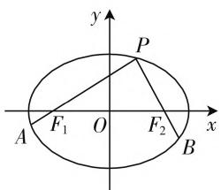

# 多解剖析,规律总结

—— 一道南京盐城一模解几题的探究

● 新疆维吾尔自治区伊犁哈萨克自治州霍尔果斯市苏港高级中学 颜廷好

圆锥曲线是平面解析几何的核心内容之一,融合性高,综合性强,是高考中的重点与热点问题之一,能充分拉开不同考生之间的“档次”差异,有效起到高考的区分与选拔的功能.特别地,对于圆锥曲线中的最值与定值问题,往往通过圆锥曲线的位置关系、参数问题等来设置,包括参数(或关系式)、代数式、数量积的最值与定值,定点、定直线及定角度等相关问题,备受命题者青睐.

# 一、问题呈现

【问题】(2020年1月江苏省盐城市、南京市高三年级第一次模拟考试·18)设椭圆 $C:\frac{x^{2}}{a^{2}}+\frac{y^{2}}{b^{2}}=1(a>$

$b > 0$ )的左焦点和右焦点分别为 $F_{1}, F_{2}$ , 离心率是 $e$ , 动点 $P(x_{0}, y_{0})$ 在椭圆 $C$ 上运动. 当 $PF_{2} \perp x$ 轴时, $x_{0} = 1, y_{0} = e$ .

text_image

y
P
A F₁ O F₂ x
B

图1

(1) 求椭圆 C 的方程;

(2) 延长 $PF_{1}, PF_{2}$ 分别

交椭圆 $C$ 于点 $A, B(A, B$ 不重合). 设 $\overrightarrow{AF_1} = \lambda \overrightarrow{F_1P}, \overrightarrow{BF_2} = \mu \overrightarrow{F_2P}$ , 求 $\lambda + \mu$ 的最小值.

此题的第一问设置较为简单,通过相关参数之间的关系,以及关系式的建立来确定相应的参数值,从而得以求解椭圆的方程;而第二问借助平面向量的线性关系来设置参数值,进而确定参数关系式的最值问题,这是本题的难点所在,也是本题的创新点与亮点,可以进行多解处理,也可以进行合理的规律总结.

# 二、问题破解

解析:(1) 当 $PF_{2} \perp x$ 轴时, $x_{0}=1$ , 可得 c=1, 将 $P(1, e)$ 代入椭圆方程可得 $\frac{1}{a^{2}} + \frac{e^{2}}{b^{2}} = 1$ , 而离心率 e =

$\frac{c}{a}=\frac{1}{a},b^{2}=a^{2}-c^{2}=a^{2}-1$ ，代入上式可得 $\frac{1}{a^{2}}+\frac{1}{a^{2}(a^{2}-1)}=1$ ，解得 $a^{2}=2$ ，故 $b^{2}=1$ ，所以椭圆C的方程为 $\frac{x^{2}}{2}+y^{2}=1$ .

(2) 方法一: (设点法)

设 $A(x_{1},y_{1})$ ，由 $\overrightarrow{AF_1} = \lambda \overrightarrow{F_1P}$ 可得 $\left\{ \begin{array}{l} - 1 - x_{1} = \lambda (x_{0} + 1),\\ -y_{1} = \lambda y_{0}, \end{array} \right.$ 故 $\left\{ \begin{array}{l}x_{1} = -\lambda x_{0} - \lambda -1,\\ y_{1} = -\lambda y_{0}, \end{array} \right.$ 代入椭圆的方程可得 $\frac{(-\lambda x_0 - \lambda - 1)^2}{2} +(-\lambda y_0)^2 = 1$ ，由 $\frac{x_0^2}{2} +y_0^2 = 1$ 可得 $y_0^2 = 1 - \frac{x_0^2}{2}$ ，代入上式可得 $(\lambda x_0 +$ $\lambda +1)^2 +2\lambda^2\left(1 - \frac{x_0^2}{2}\right) = 2$ ，化简可得 $3\lambda^2 +2\lambda -1+$ $2\lambda (\lambda +1)x_0 = 0$ ，即 $(\lambda +1)(3\lambda -1 + 2\lambda x_0) = 0$ ，显然 $\lambda +1\neq 0$ ，所以 $3\lambda -1 + 2\lambda x_0 = 0$ ，故 $\lambda = \frac{1}{3 + 2x_0}.$

同理可得 $\mu = \frac{1}{3 - 2x_0}$ ，故 $\lambda +\mu = \frac{1}{3 + 2x_0} +$ $\frac{1}{3 - 2x_0} = \frac{6}{9 - 4x_0^2}\geqslant \frac{2}{3}$ ，当且仅当 $x_0 = 0$ ，即点 $P$ 运动到短轴端点时等号成立，所以 $\lambda +\mu$ 的最小值为 $\frac{2}{3}$

方法二:(设直线法)

由于点 $A, B$ 不重合，可知直线 $PA$ 与 $x$ 轴不重合，故可设直线 $PA$ 的方程为 $x = my - 1$ ，联立方程组 $\left\{ \begin{array}{l} \frac{x^2}{2} + y^2 = 1, \\ x = my - 1, \end{array} \right.$ 消去参数 $x$ 整理可得 $(m^2 + 2)y^2 - 2my - 1 = 0$ ，设 $A(x_1, y_1)$ ，则 $y_1$ 与 $y_0$ 为以上方程的两个实根，利用根与系数的关系可得 $y_0y_1 = -\frac{1}{m^2 + 2}$ ，即

$y_{1}=-\frac{1}{(m^{2}+2)y_{0}}$ ，而点 $P(x_{0},y_{0})$ 在直线x=my-1上，可得 $x_{0}=my_{0}-1$ ，即 $m=\frac{x_{0}+1}{y_{0}}$ ，而由 $\frac{x_{0}^{2}}{2}+y_{0}^{2}=1$ ，整理可得 $y_{0}^{2}=1-\frac{x_{0}^{2}}{2}$ .

由 $\overrightarrow{AF_1} = \lambda \overrightarrow{F_1P}$ 可得 $-y_{1} = \lambda y_{0}$ ，故 $\lambda = -\frac{y_1}{y_0} = \frac{1}{(m^2 + 2)y_0^2} = \frac{1}{\left[\left(\frac{x_0 + 1}{y_0}\right)^2 + 2\right]y_0^2} = \frac{1}{(x_0 + 1)^2 + 2y_0^2}$

$$
= \frac {1}{(x _ {0} + 1) ^ {2} + 2 \left(1 - \frac {x _ {0} ^ {2}}{2}\right)} = \frac {1}{3 + 2 x _ {0}}.
$$

同理可得 $\mu=\frac{1}{3-2x_{0}}$ ，故 $\lambda+\mu=\frac{1}{3+2x_{0}}+\frac{1}{3-2x_{0}}=\frac{6}{9-4x_{0}^{2}}\geqslant\frac{2}{3}$ ，当且仅当 $x_{0}=0$ ，即点 P 运动到短轴端点时等号成立，所以 $\lambda+\mu$ 的最小值为 $\frac{2}{3}$ .

方法三:(三角参数法)

由（1）的结论可设 $P(\sqrt{2}\cos \theta ,\sin \theta),\theta \in$ $[0,2\pi)$ ，设 $A(x_{1},y_{1})$ ，由 $\overrightarrow{AF_1} = \lambda \overrightarrow{F_1P}$ 可得 $\left\{ \begin{array}{l} - 1 - x_{1} = \lambda (\sqrt{2}\cos \theta +1),\\ -y_{1} = \lambda \sin \theta . \end{array} \right.$

故 $\left\{\begin{aligned}x_{1}&=-\sqrt{2}\lambda\cos\theta-\lambda-1,\\ y_{1}&=-\lambda\sin\theta,\end{aligned}\right.$ 代入椭圆的方程可得 $\frac{(-\sqrt{2}\lambda\cos\theta-\lambda-1)^{2}}{2}+(-\lambda\sin\theta)^{2}=1$ ，整理可得 $(\lambda+1)(3\lambda-1+2\sqrt{2}\lambda\cos\theta)=0$ ，显然 $\lambda+1\neq0$ ，所以 $3\lambda-1+2\sqrt{2}\lambda\cos\theta=0$ ，故 $\lambda=\frac{1}{3+2\sqrt{2}\cos\theta}$ .

同理可得 $\mu = \frac{1}{3 - 2\sqrt{2}\cos\theta}$ ，故 $\lambda + \mu = \frac{1}{3 + 2\sqrt{2}\cos\theta} + \frac{1}{3 - 2\sqrt{2}\cos\theta} = \frac{6}{9 - 8\cos^2\theta} \geqslant \frac{2}{3}$ ，当且仅当 $\cos\theta = 0$ ，即点 $P$ 运动到短轴端点时等号成立，所以 $\lambda + \mu$ 的最小值为 $\frac{2}{3}$ .

# 三、总结规律

根据以上不同解法,回归到一般性的椭圆问题,在一般性条件下进行总结与归纳,可得到以下几个相关的结论:

【结论1】设椭圆 $C: \frac{x^2}{a^2} + \frac{y^2}{b^2} = 1 (a > b > 0)$ 的左、右焦点分别为 $F_1, F_2$ ，动点 $P$ 在椭圆 $C$ 上运动，延长 $PF_1, PF_2$ 分别交椭圆 $C$ 于点 $A, B (A, B$ 不重合). 设 $\overrightarrow{AF_1} = \lambda \overrightarrow{F_1P}, \overrightarrow{BF_2} = \mu \overrightarrow{F_2P}$ ，则 $\frac{1}{\lambda} + \frac{1}{\mu}$ 恒为定值 $\frac{4a^2 - 2b^2}{b^2}$ .

具体到以上问题, 可知 $a^{2}=2, b^{2}=1$ , 则知 $\frac{1}{\lambda}+\frac{1}{\mu}$ 恒为定值 $\frac{4a^{2}-2b^{2}}{b^{2}}=6$ .

【结论2】设椭圆 $C: \frac{x^2}{a^2} + \frac{y^2}{b^2} = 1 (a > b > 0)$ 的左、右焦点分别为 $F_1, F_2$ ，动点 $P$ 在椭圆 $C$ 上运动，延长 $PF_1, PF_2$ 分别交椭圆 $C$ 于点 $A, B (A, B$ 不重合). 设 $\overrightarrow{AF_1} = \lambda \overrightarrow{F_1P}, \overrightarrow{BF_2} = \mu \overrightarrow{F_2P}$ ，则 $\lambda + \mu$ 的最小值为 $\frac{2b^2}{2a^2 - b^2}$ .

具体到以上问题, 可知 $a^{2}=2, b^{2}=1$ , 则知 $\lambda+\mu$ 的最小值为 $\frac{2b^{2}}{2a^{2}-b^{2}}=\frac{2}{3}$ .

【结论3】设椭圆 $C: \frac{x^2}{a^2} + \frac{y^2}{b^2} = 1 (a > b > 0)$ 的左、右焦点分别为 $F_1, F_2$ ，动点 $P$ 在椭圆 $C$ 上运动，延长 $PF_1, PF_2$ 分别交椭圆 $C$ 于点 $A, B (A, B$ 不重合). 设 $\overrightarrow{AF_1} = \lambda \overrightarrow{F_1P}, \overrightarrow{BF_2} = \mu \overrightarrow{F_2P}$ ，则 $\lambda + \mu$ 的取值范围为 $\left[\frac{2b^2}{2a^2 - b^2}, \frac{4a^2 - 2b^2}{b^2}\right)$ .

根据以上问题的推理过程，得以确定 $\lambda = \frac{b^{2}}{a^{2} + c^{2} + 2cx_{0}}, \mu = \frac{b^{2}}{a^{2} + c^{2} - 2cx_{0}}$ ，进而结合关系式的分析来确定其取值范围问题即可.

其实,掌握一些基本的常见的圆锥曲线的最值或定值结论,可以有效理解与掌握圆锥曲线的相关知识,进一步融合数学不同的知识点与思想方法,通过合理转化,巧妙应用,简化过程,总结规律,提高速度,从而提升学生的逻辑推理能力与创新品质,促进思维能力和思想方法的全面提高与发展,提升数学能力,培养数学核心素养.