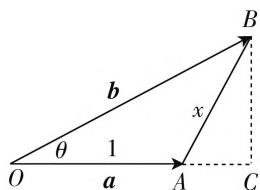
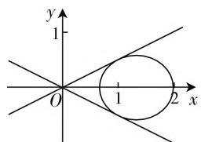

# 对一道向量题的探究学习

# 江苏省张家港市常青藤实验学校 梁付元

平面向量既有“形”的思维,又有“数”的因素,因而平面向量的破解可以从“形”的角度入手,利用几何视角,通过图形直观或几何特征等形式来处理,也可以从“数”的角度入手,利用代数视角,通过坐标表示或代数运算等形式来解决.其实,这也是破解平面向量问题中最常见的两个切入角度,有时还要加以平面向量的相关定义角度来切入,都能很好地达到破解问题的目的,各有各的好,各有各的妙.

# 一、问题呈现

【问题】(2020届福建省某市高三上期中考试·17)已知 $|a|=1$ ，向量b满足 $2|b-a|=b\cdot a$ ，设a,b的夹角为 $\theta$ ，则 $\cos\theta$ 的最小值为\_\_\_\_.

此题比较简单,巧妙地将平面向量的模、数量积及三角函数值等知识加以交汇,结合最值的求解来达到知识与能力融合的目的.破解此题的基本思维可以分为三种:抓住定义,借助平面向量的相关定义来分析——平方运算解决;正确识图,借助平面向量“形”的思维来处理——几何角度解决;合理转化,利用平面向量的“数”的运算来解决——代数角度解决.

# 二、问题破解

# 破解角度一:定义思维

方法 1: 平方法.

解析: 设 $\left|b\right|=x$ ，由 $2\left|b-a\right|=b\cdot a$ 两边平方，整理可得 $(4-\cos^{2}\theta)x^{2}-8\cos\theta\cdot x+4=0$ ，则知判别式 $\Delta=64\cos^{2}\theta-16(4-\cos^{2}\theta)=80\cos^{2}\theta-64\geqslant0$ ，解得 $\cos\theta\leqslant-\frac{2\sqrt{5}}{5}$ 或 $\cos\theta\geqslant\frac{2\sqrt{5}}{5}$ ，而 $b\cdot a=2\left|b-a\right|\geqslant0$ ，可得 $\theta\in\left[0,\frac{\pi}{2}\right)$ ，即 $\cos\theta\geqslant0$ ，则知 $\cos\theta\geqslant\frac{2\sqrt{5}}{5}$ ，所以 $\cos\theta$ 的最小值为 $\frac{2\sqrt{5}}{5}$ ，故填答案： $\frac{2\sqrt{5}}{5}$ .

点评:抓住定义,结合平面向量的数量积公式、模的公式及相关的定义,对条件中的相关关系式加以合理运算——平方处理,结合方程与判别式的运算,以及二次不等式的求解来确定相应三角函数值的最值问题.

# 破解角度二:几何思维

方法 2: 投影法.

解析:由于 $b \cdot a = 2 \mid b - a \mid \geqslant 0$ ，可得 $\theta \in \left[0, \frac{\pi}{2}\right)$ ，如图1所示，设 $\overrightarrow{OA} = a, \overrightarrow{OB} = b$ ，则 $b - a = \overrightarrow{OB} - \overrightarrow{OA} = \overrightarrow{AB}$ ，设 $2 \mid b - a \mid = b \cdot a =$ $2|\overrightarrow{AB}| = 2x$ ，过点 $B$ 作 $BC\perp OA$ ，垂足为 $C$ ，则由 $\pmb {b}\cdot$ $\pmb {a} = 2x$ ，以及数量积的定义可得 $|OC| = 2x$ ，则有 $|AC| = |2x - 1|$ ，可得 $|BC| = \sqrt{|AB|^2 - |AC|^2}$ $= \sqrt{-3x^2 + 4x - 1}$ ，那么 $\tan \theta = \frac{|BC|}{|OC|} =$ $\frac{\sqrt{-3x^2 + 4x - 1}}{2x} = \frac{1}{2}\sqrt{-3 + \frac{4}{x} - \frac{1}{x^2}} = \frac{1}{2}\cdot$ $\sqrt{-\left(\frac{1}{x} - 2\right)^2 + 1}$ ，当且仅当 $\frac{1}{x} = 2$ ，即 $x = \frac{1}{2}$ 时， $\tan \theta$ 取得最大值 $\frac{1}{2}$ ，而 $\tan \theta = \frac{\sin\theta}{\cos\theta} = \frac{1}{2}$ 结合 $\sin^2\theta +$ $\cos^2\theta = 1$ ，可得 $\cos \theta = \frac{2\sqrt{5}}{5}$ 所以 $\cos \theta$ 的最小值为 $\frac{2\sqrt{5}}{5}$ 故填答案： $\frac{2\sqrt{5}}{5}$

text_image

O
θ
1
a
b
x
A
C
B

图1

点评: 正确识图, 结合平面向量的数量积的投影本质, 利用平面向量“几何”化的表现, 借助三角形的直观图形加以合理转化, 引入对应的参数, 通过几何特征, 以及二次函数的图像与性质的转化, 并通过同角三角函数的基本关系式的应用来确定相应三角函数的最值问题.

# 破解角度三:代数思维

方法 3: 椭圆模型法.

解析：由于 $b \cdot a = 2 |b - a| \geqslant 0$ ，可得 $\theta \in \left[0, \frac{\pi}{2}\right)$ ，令 $a = (1, 0)$ ，设 $b = (x, y)$ ，由 $2 |b - a| =$ $b \cdot a$ , 可得 $2\sqrt{(x-1)^{2}+y^{2}}=x$ , 整理可得 $3x^{2}-8x+4+4y^{2}=0$ , 而由 $3x^{2}-8x+4+4y^{2}=0$ 配方可得 $\frac{\left(x-\frac{4}{3}\right)^{2}}{\frac{4}{9}}$ $+\frac{y^{2}}{\frac{1}{3}}=1$ ，即 $(x,y)$ 的轨迹方程是中心为 $\left(\frac{4}{3},0\right)$ 的椭圆，如图2所示，则知当直线y=kx与椭圆相切时，此时 $|k|=\left|\frac{y}{x}\right|$ 取得最大值，联立 $\left\{\begin{aligned}3x^{2}-8x+4+4y^{2}&=0,\\ y=kx,\end{aligned}\right.$ 消去参数y并整理可得 $(3+4k^{2})x^{2}-8x+4=0$ ，则知判别式 $\Delta=64-16(3+4k^{2})=0$ ，解得 $k=\frac{1}{2}$ （不妨直接令k>0），则知 $\tan\theta$ 取得最大值 $\frac{1}{2}$ ，而 $\tan\theta=\frac{\sin\theta}{\cos\theta}=\frac{1}{2}$ ，结合 $\sin^{2}\theta+\cos^{2}\theta=1$ ，可得 $\cos\theta=\frac{2\sqrt{5}}{5}$ ，所以 $\cos\theta$ 的最小值为 $\frac{2\sqrt{5}}{5}$ ，故填答案： $\frac{2\sqrt{5}}{5}$ .

text_image

y
1
O
1
2 x

图2

方法 4: 待定系数法.

解析：由于 $b \cdot a = 2 |b - a| \geqslant 0$ ，可得 $\theta \in \left[0, \frac{\pi}{2}\right)$ ，令 $a = (1, 0)$ ，设 $b = (x, y)$ ，由 $2 |b - a| = b \cdot a$ ，可得 $2 \sqrt{(x - 1)^{2} + y^{2}} = x$ ，整理可得 $3x^{2} - 8x + 4 + 4y^{2} = 0$ ，令 $\frac{y}{x} = k$ ，则 y = kx，代入上式并整理可得 $(3 + 4k^{2})x^{2} - 8x + 4 = 0$ ，则知判别式 $\Delta = 64 - 16(3 + 4k^{2}) \geqslant 0$ ，解得 $-\frac{1}{2} \leqslant k \leqslant \frac{1}{2}$ ，则知 $\left|\frac{y}{x}\right|_{\max} = |k|_{\max} = \frac{1}{2}$ ，即 $\tan\theta$ 取得最大值 $\frac{1}{2}$ ，而 $\tan\theta = \frac{\sin\theta}{\cos\theta} = \frac{1}{2}$ ，结合 $\sin^{2}\theta + \cos^{2}\theta = 1$ ，可得 $\cos\theta = \frac{2\sqrt{5}}{5}$ ，所以 $\cos\theta$ 的最小值为 $\frac{2\sqrt{5}}{5}$ ，故填答案： $\frac{2\sqrt{5}}{5}$ .

点评:合理转化,结合平面直角坐标系的建立,把对应的平面向量加以“代数”化,通过相应的坐标表示、坐标运算及其他相关的代数运算来处理,可以通过点的轨迹方程的几何意义或结合待定系数法等不同的角度来进行有效运算,进而达到解决相应三角函数的最值问题.

# 三、变式拓展

探究 1: 保留原来的题目条件, 改变求解的条件 “两平面向量的夹角 $\theta$ 的余弦值的最小值” 为 “正切值的最大值”, 从而得以变式.

变式 1: 已知 $\left|a\right|=1$ ，向量 b 满足 $2\left|b-a\right|=b\cdot a$ ，设 a, b 的夹角为 $\theta$ ，则 $\tan\theta$ 的最大值为 \_\_\_\_.

解析:由于 $b\cdot a=2|b-a|\geqslant0$ ,可得 $\theta\in\left[0,\frac{\pi}{2}\right)$ ，设 $\overrightarrow{OA}=a,\overrightarrow{OB}=b$ ，则 $b-a=\overrightarrow{OB}-\overrightarrow{OA}=\overrightarrow{AB}$ ，设 $2|b-a|=b\cdot a=2|\overrightarrow{AB}|=2x$ ，过点B作 $BC\perp OA$ ，垂足为C，则由 $b\cdot a=2x$ 及数量积的定义可得 $|OC|=2x$ ，则有 $|AC|=|2x-1|$ ，可得 $|BC|=\sqrt{|AB|^{2}-|AC|^{2}}=\sqrt{-3x^{2}+4x-1}$ ，那么 $\tan\theta=\frac{|BC|}{|OC|}=\frac{\sqrt{-3x^{2}+4x-1}}{2x}=\frac{1}{2}\sqrt{-3+\frac{4}{x}-\frac{1}{x^{2}}}=\frac{1}{2}\sqrt{-\left(\frac{1}{x}-2\right)^{2}+1}$ ，当且仅当 $\frac{1}{x}=2$ ，即 $x=\frac{1}{2}$ 时， $\tan\theta$ 取得最大值 $\frac{1}{2}$ ，故填答案： $\frac{1}{2}$ .

探究 2: 保留原来题目的部分条件与求解的内容, 改变条件 “2|b-a|=b·a” 为 “2|b-a|=|b+a|”, 从而得以变式.

变式2:已知 $|a|=1$ ，非零向量b满足 $2|b-a|=|b+a|$ ，设a,b的夹角为 $\theta$ ，则 $\cos\theta$ 的最小值为\_\_\_\_.

解析:由 $2|b-a|=|b+a|$ 两边平方,整理可得 $3|b|^{2}-10|b|\cos\theta+3=0$ , 那么 $\cos\theta=\frac{3}{10}\left(|b|+\frac{1}{|b|}\right)\geqslant\frac{3}{10}\times2\sqrt{|b|\times\frac{1}{|b|}}=\frac{3}{5}$ , 当且仅当 $|b|=\frac{1}{|b|}$ , 即 $|b|=1$ 时等号成立, 所以 $\cos\theta$ 的最小值为 $\frac{3}{5}$ , 故填答案: $\frac{3}{5}$ .

# 四、解后反思

其实，在平面向量中，要充分提升平面向量的定义、几何、代数等方面的知识与应用，抓住定义本质，合理识“图”用“图”，巧妙用“数”解“数”，有效从不同角度加以切入，真正从平面向量的“定义”方面、“形”的思维或“数”的因素等方面对平面向量进行“多面性”思维，达到多角度思维，多方法处理，真正体现几何与代数多层面切入，技能与素养多角度提升.