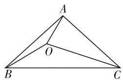
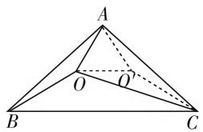
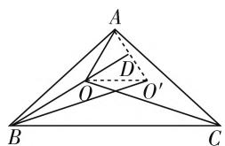
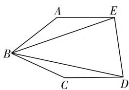
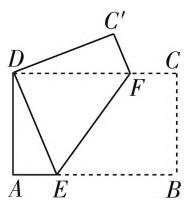
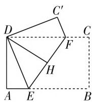
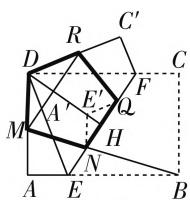

# 巧用折叠 化静为动

# ● 广州大学附属中学 杨姗

解几何题时,能否作出恰当的辅助线,构造出所需的几何关系是解题成功的关键,运用几何变换往往能达到意想不到的效果,常见的有旋转变换、对称变换等.旋转是把某个几何图形 P 绕一个定点(或直线)顺时针或逆时针旋转一定的角度得到图形 $P'$ ,因为旋转前后的图形全等,对应点到旋转中心的距离相等,使得图中相关条件产生新的联系.对称变换是将一个图形 P 沿某一直线折叠,得到另一个可以重合的图形 $P'$ ,这两个图形能够完全重合,对应点到这条直线(对称轴)的距离相等.两种几何变换法都是改变图形的位置关系而不改变图形的形状和大小,旋转变换解题的关键在于根据问题特征,需要选好旋转中心和旋转角,学生对这种方法是不熟悉的;对于对称变换,若将它看成折叠法的话,解题时更加直观,同样也可将分散的条件集中在一个图形中,那么我们尝试将一些需要用旋转变换来解的问题转化为运用折叠的方法来解决.

例 1 如图 1, $\triangle ABC$ 是等腰三角形, 点 O 位于 $\triangle ABC$ 内, 已知 $\angle CAB = 96^{\circ}, \angle ABO = 12^{\circ}, \angle OAB = 18^{\circ}, \angle AOC$ 等于多少度?

text_image

A
O
B
C

图1

text_image

A
O
O
B
C

图2

分析: 这是一道初一竞赛题, 若不添加辅助线, 根据题中的条件, 无法直接求出 $\angle AOC$ 的大小. 这道题运用旋转变换, 以点 A 为旋转中心, 将 AO 逆时针旋转 $60^{\circ}$ 得到 $AO'$ , 连接 $O'C$ (如图 2), 得到等边三角形 $AOO'$ , 通过证明 $\triangle AOB \cong \triangle AO'C$ 和 $\triangle AO'C \cong \triangle OO'C$ , 得到 $\angle O'OC = \angle O'AC = \angle OAB$ , 可求出 $\angle AOC = 78^{\circ}$ .

我们注意到 $\triangle ABC$ 是等腰三角形，沿顶点 A 所在的高将这个三角形对折，同样也可以得到等边三角形 $AOO'$ ，且通过折叠得到的 $\triangle AO'C$ 和 $\triangle AOB$ 能完全重合，即不需证明三角形全等也能求出 $\angle AOC$ 的度数.

证明: 将 $\triangle ABC$ 沿顶点 A 所在的高对折, 点 $O'$ 为点 O 的对称点, 连接 $OO', AO', BO'$ , 延长 BO 交 $AO'$ 于点 D, 如图 3.

text_image

Geometric diagram of triangle ABC with internal points D, O, O' and dashed lines indicating projections or segments

图3

由对称可知， $\angle O'AC = \angle OAB$ ，即 $\angle OAO' = 96^\circ - 2 \times 18^\circ = 60^\circ$ ，又因为 $AO = AO'$ ，所以 $\triangle AOO'$ 为等边三角形.

由三角形内角和为 $180^{\circ}$ , 得到 $\angle AOB = 150^{\circ}$ , 又因为 $\angle OAD = 60^{\circ}$ , 所以 $\angle ADO = 90^{\circ}$ , 即 $OD$ 是等边三角形 $AOO'$ 的高, 也是 $\triangle AOO'$ 的中线, 即 $D$ 是边 $AO'$ 上的中点.

在 $\triangle ABO'$ 中，点 B、O、D 在一条直线上， $BD \perp AO'$ ，且 D 是边 $AO'$ 上的中点，所以 $\triangle ABO'$ 为等腰三角形， $BA = BO'$ ， $\angle BO'A = \angle BAO' = 78^{\circ}$ .

根据对称性, $\angle AOC=\angle AO^{\prime}B$ ,即 $\angle AOC=78^{\circ}$ .

点评:本题运用旋转变换,再通过两次证明三角形全等,可求出 $\angle AOC$ 的度数,但是证明三角形全等却超出了学生的能力范围,再次观察题目,根据 $\triangle ABC$ 是等腰三角形即轴对称图形,提示了我们利用对折,也可以构造出等边三角形,且巧妙地避开了证明三角形全等,而是运用等腰三角形的性质和对称性,求出了 $\angle AOC$ 的度数.

例 2 如图 4 所示, 在各边都相等的五边形 ABCDE 中, 如果 $\angle ABC = 2\angle DBE$ , 那么 $\angle ABC$ 为多少度?

分析: 题中分别给出了各边相等和两个角之间的数量关系, 但是没有已知任何一个角的大小, 看似分散的条件, 需要通过几何变换将相等的边放入同一个三角形内，得到等边三角形，通过等边等角的条件证明三角形全等，再进一步求出 $\angle ABC$ 的度数.有了解题思路后，选择解题方法，通过将三角形 $ABE$ 顺时针旋转 $\angle ABC$ ，得到 $\triangle BDQ$ ，如图5.证明 $\triangle QBC\cong \triangle EBA$ 得到 $\triangle QCD$ 为等边三角形, 最后根据已知角的数量关系, 求出 $\angle ABC$ 的度数.

text_image

A
E
B
C
D

图4

若用对称变换，以 $BD$ 为对称轴，作 $\triangle BDE$ 的对称 $\triangle BDQ$ （如图5），接下来的证明方法与旋转变换是相同的，那么我们得到的结论是旋转变换和对称变换得到的效果是相同的，而达不到更简便、更巧妙的效果.我们再次观察这道题, $\angle ABC=2\angle DBE$ ,换一个角度思考,往五边形的内部做折叠,以BD、BE为对称轴,将 $\triangle BCD$ 、 $\triangle ABE$ 同时往五边形的内部折叠,如图6所示,根据边和角的数量关系,BP是两次折叠后的公共边,得到 $\triangle QCD$ 为等边三角形,再由已知角的数量关系,求出 $\angle ABC$ 的度数.

text_image

A
E
B
C
D
Q

图5

证明:以 BD 为对称轴,作 $\triangle BCD$ 的对称 $\triangle BPD$ ,再以 BE 为对称轴作 $\triangle ABE$ 的对称三角形,因为 BP = BC = AB,又因为 $\angle ABC = 2\angle DBE$ ,使得 $\angle ABE =$

text_image

Geometric diagram of a tetrahedron with labeled vertices A, B, C, D, E and internal point P, showing solid and dashed edges.

图6

$\angle PBE$ , 即 $\triangle ABE$ 的对称三角形为 $\triangle BPE, BP$ 为 $\triangle BPE$ 和 $\triangle BPD$ 的公共边, 如图 6 所示.

因为 $PD = CD, PE = AE$ ，所以 $PD = PE = ED$ ，即 $\triangle PED$ 为等边三角形，又因为 $BP = PE = PD$ ，所以 $\angle DPE = 2\angle DBE = 60^{\circ}$ ，因此 $\angle ABC = 2\angle DBE = 60^{\circ}$ .点评: 观察这两种证法, 用旋转变换需要证明三角形全等,相对来说,运用对称变换,则不需要证明三角形全等,使解题过程变得简捷明快.

第 7 届北京高中数学知识应用竞赛中有这样一道题：

在国际会议上，做报告的德国教授拿起一张A4(210毫米×297毫米)纸，一边折一边说：“我们按下面(图7～图9)的方法，就可以折出一个正五边形。”

  
图 7

  
图8

  
图 9

图7中B、D重合；图8中E、F重合，对折再打开，DH为折痕；图9中AE、 $C^{\prime}F$ 重合在DH上.

你知道为什么吗？

(提示:利用 A4 纸的特殊性和折叠的对称性证明)

数学解题中有通用、常用的方法，一方面，要重视这些最基本的思路方法，突出双基；另一方面，也提倡打破常规思维，运用动态的观点大胆构想。上述例题尽管题目的设计和背景都不尽相同，但均可运用几何变换的方法来解题，从折叠出发，化静为动，以动制静，便可以达到胜利。不难发现，上述题目中都出现了等腰三角形、等边三角形、正五边形等特殊的结构，为运用几何变换提供了广阔的天地。我们对于这类问题，巧用几何变换可以减少解题中的盲目性，解题时全面观察、深入思考、独特分析，力争在常规解法上提出新颖、简捷的解法。W

(上接第57页) 关系综合应用类问题的常用方法是灵活应用圆心到直线的距离、直线与圆方程联立，韦达定理构造方程等方法. 本题(Ⅲ)虽然不要求求出参数 $k$ 的取值范围，但题中已经明确了直线与圆是相交的，而韦达定理的点差法的应用，必须在直线与曲线相交的前提下才有效，所以必须也要求出参数 $k$ 的取值范围，以免产生增解.

当然,对于解析几何参数范围问题的求解方法,必须从题目的实际出发.但无论是哪种背景,一般都是最终转化为不等式问题或函数的值域问题,可见,合理转化是解决这类问题的“根本大法”.

# 参考文献：

[1] 兰志敏. 解析几何中求参数取值范围的常用方法 [J]. 中学生数理化(学习研究), 2017(8).  
[2] 欧阳尚昭, 高蓉. 解析几何中一类含参问题的基本解法 [J]. 中学生数学, 2009(11).  
[3] 姜建荣. 解析几何中一类参数的取值范围的确定方法 [J]. 数学通讯, 2007(Z2).  
[4] 孙亦器, 舒金根. 如何求解析几何中参数的取值范围 [J]. 教学月刊 (中学版), 2005(3). W