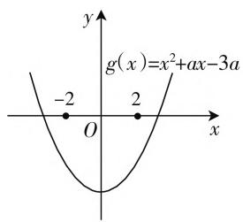
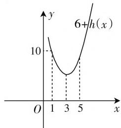
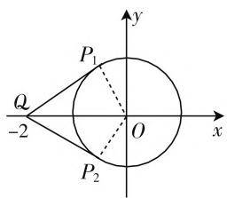
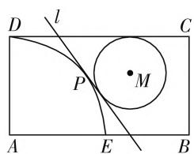

# 摭谈最值问题多视角求解

# 山东省商河县第一中学 王玉祥

最值(范围)问题是历年高考的必考问题,这类问题涉及面广综合性强,常常令许多考生“望题兴叹”.其实解决这类问题有一个较好的方法,即数形结合,“图形”能帮你摆脱困境,直捣黄龙.下文举例说明.

# 一、最值(范围)藏在平面区域的图形中

在条件不等式下求最值(范围),具有一定难度.当我们把不等式组图形化,挖掘它们表示的几何图形时,可以从图形的变化中直接找到答案.

例 1 已知集合 $A=\{(x,y)\mid|x-a|+|y-1|\leqslant1\}$ , $B=\{(x,y)\mid(x-1)^{2}+(y-1)^{2}\leqslant1\}$ ，如果集合 $A\cap B\neq\varnothing$ ，那么实数 a 的取值范围为（）.

A. $[0,2]$

B. $\left[-1-\sqrt{2},\sqrt{2}\right]$

C. $[-3,1]$

D. $[-1,3]$

解析:集合 A 与 B 都是点集,集合 A 表示正方形及其内部的点,这个正方形的中心在直线 y=1 上移动,它的边长是 $\sqrt{2}$ , 它的相邻两边所在直线的斜率是 $\pm1$ , 而集合 B 则表示圆 $(x-1)^{2}+(y-1)^{2}=1$ 和它内部的点,由于 $A\cap B\neq\varnothing$ , 因此集合 A 与 B 所表示的图形必有公共点. 于是只要将代表集合 A 的图形在直线 y=1 上移动, 就会发现当 a=-1 时正方形位于圆的左侧, 且它们仅有一个交点 $(0,1)$ , 紧接着再把正方形向右平移, 当平移到两个图形仅有交点 $(2,1)$ 时, a=3, 而继续向右平移, 它们再也无法相交了, 所以 a 的取值范围是 $[-1,3]$ . 所以选 D.

评注:本题是集合背景下的解析几何的动态图形问题,先认清两个集合的几何意义,再通过数形结合,动态分析,即可快速找到答案.

# 二、最值(范围)藏在函数图像中

函数问题的解决,往往要从函数的图像与性质入手,尤其是含参函数问题,依据函数图像可以将原问题进行等价转化,从而快速找到合理的解题途径.

例 2 如果函数 $f(x)=\lg(3a-ax-x^{2})$ 满足对任意实数，都有意义，那么实数 a 的取值范围是

解法1: 函数 $f(x)$ 有意义, 则 $3a - ax - x^{2} > 0$ , 即 $x^{2} + ax - 3a < 0$ 在 $x \in [-2, 2]$ 上总成立.

设 $g(x) = x^{2} + ax - 3a$ ，即当 $x\in [-2,2]$ 时， $g(x) < 0$ 总成立.

于是根据抛物线 $y = g(x)$ 的图形特征(图1)，则有 $\left\{ \begin{array}{l} g(-2) < 0, \\ g(2) < 0, \end{array} \right.$ 所以 $\left\{ \begin{array}{l} 4 - 5a < 0, \\ 4 - a < 0, \end{array} \right.$ 解得 $a > 4$ .

text_image

g(x)=x²+ax-3a
-2
O
2
x
y

图1

line

| x | y |
|---|---|
| 1 | 10 |
| 3 | 5 |
| 5 | 10 |
The chart is a line graph of the function 6 + h(x). The x-axis ranges from 0 to 5 and the y-axis ranges from 0 to 10. There is no label for the data series.

图2

解法2:对于不等式 $3a - ax - x^{2} > 0$ ，因为 $x \in [-2, 2]$ ，所以 $3 - x \in [1, 5]$ ，不等式可化成 $a > 3 - x + \frac{9}{3 - x} - 6$ .

所以只要 $a > h(x) = 3 - x + \frac{9}{3 - x} -6$ 的最大值即可.

设 $t=3-x, x \in [1,5]$ ，画出函数 $6+h(x)=t+\frac{9}{t}$ 的图像，如图 2 所示，从图像不难发现， $6+h(x)$ 的最大值是 10，于是 $h(x)$ 的最大值是 4，则有 a > 4.

评注: 解法1紧紧抓住了抛物线的图像特征, 列出关于实数a的不等式组, 本质上看将问题转化成了一元二次方程根的分布问题; 而解法2则采用参变量分离法, 将后边得到的函数中换元, 再利用典型函数图像, 从中直观得到最大值, 从而求得a的范围, 两种方法都体现了数形结合的思想.

# 三、最值(范围)藏在目标函数的几何意义中

有些求最值的目标函数,具有明显的几何意义,如表示两点间的距离,表示斜率等,在解题时,如果能将其转化为图形问题,那同样可以在图形中直观地找到答案.

例 3 函数 $y=\frac{\sqrt{3}\cos x}{2+\sin x}$ 的最大值为 \_\_\_\_，最小值为 \_\_\_\_.

text_image

P₁
Q
-2
O
x
y
P₂

图3

解析:联想斜率公式 $k = \frac{y_{1} - y_{2}}{x_{1} - x_{2}}$ ，将原式变形为 $\frac{y}{\sqrt{3}} =$ $\frac{\cos x - 0}{\sin x - (-2)}$ ，则求 $y$ 的最值可转化为求点 $(\sin x, \cos x), (-2, 0)$ 的连线的斜率的范围。设点 $P(\sin x, \cos x), Q(-2, 0)$ ，则 $\frac{y}{\sqrt{3}}$ 可看成单位圆上的动点 $P$ 与点 $Q$ 连线的斜率，如图3。设直线 $OP_1$ 的方程为 $y = k(x + 2)$ ，即 $kx - y + 2k = 0$ ，则圆心 $(0, 0)$ 到它的距离 $d = \frac{|2k|}{\sqrt{k^2 + 1}} = 1$ ，解得 $k_1 = -\frac{\sqrt{3}}{3}$ 或 $k_2 = \frac{\sqrt{3}}{3}$ 。

所以 $-\frac{\sqrt{3}}{3} \leqslant \frac{y}{\sqrt{3}} \leqslant \frac{\sqrt{3}}{3}$ , 即 $-1 \leqslant y \leqslant 1$ . 故 $y_{\max} = 1, y_{\min} = -1$ .

评注: 以上是利用“数形结合”的方法来求最值的, 给人的感觉是直观, 简捷. 学生不妨用纯代数的方法去解, 看看它们有什么区别.

# 四、最值(范围)藏在平面图形的性质中

对于某些几何图形中的最值问题,一般可采用建立坐标系的方法,结合平面图形的性质加以计算,那么答案会渐渐浮出水面.

例 4 如图 4 所示, 在矩形 ABCD 中, $AB = \sqrt{3}$ , BC = 1, 以 1 为半径并以 A 为圆心的圆交 AB 于点 E (圆弧 DE 是圆在矩形内的部分).

text_image

D
l
C
P
M
A
E
B

图4

（Ⅰ）试在圆弧 DE 上确定
一点 P，使经过 P 点的切线 l 将矩形 ABCD 的面积平分；

（Ⅱ）若动圆 M 与满足问题（Ⅰ）的切线 l 和边 DC 均相切，试确定点 M 的位置，使圆 M 是矩形内部面积最大的圆.

解析:本题是一道直线与圆的位置关系问题,根据解析几何的特点,必须建立恰当的直角坐标系,然后根据题意,建立方程,充分利用图形的几何关系来解答.

（Ⅰ）以点 A 为坐标原点，以 AB 所在直线作为 x 轴，建立平面直角坐标系.

设 $P(x_{0},y_{0}), B(\sqrt{3},0), D(0,1)$ ，圆弧 DE 的方程为 $x^{2}+y^{2}=1(x\geqslant0,y\geqslant0)$ ，则切线 l 的方程为 $x_{0}x+y_{0}y=1$ （可以推导，这里略）.

设 l 与 AB, CD 交于点 F, G，可求 $F\left(\frac{1}{x_{0}}, 0\right)$ ， $G\left(\frac{1 - y_{0}}{x_{0}}, 1\right)$ ，因为 l 平分矩形 ABCD 的面积，所以 $FB = GN \Rightarrow \sqrt{3} - \frac{1}{x_{0}} = \frac{1 - y_{0}}{x_{0}} \Rightarrow \sqrt{3} x_{0} + y_{0} - 2 = 0.$ ①

又 $x_0^2 + y_0^2 = 1$ ，②

解 ①、② 得 $x_0 = \frac{\sqrt{3}}{2}, y_0 = \frac{1}{2}$ , 所以 $P\left(\frac{\sqrt{3}}{2}, \frac{1}{2}\right)$ .

（Ⅱ）由（Ⅰ）可知，切线 l 的方程为 $\sqrt{3}x + y - 2 = 0$ .

当圆 M 满足题意时, 它必与边 BC 相切, 设圆 M 与 l、BC、DC 分别相切于点 R, Q, T, 于是 MR = MT = MQ = r (圆 M 的半径为 r), 故 $M(\sqrt{3} - r, 1 - r)$ .

由 $\frac{\left|\sqrt{3} (\sqrt{3} - r) + 1 - r - 2\right|}{\sqrt{\sqrt{3}^2 + 1^2}} = r \Rightarrow r = \sqrt{3} + 1$ (舍), $r = \frac{3 - \sqrt{3}}{3}$ .

所以 M 点坐标为 $\left(\frac{4\sqrt{3}-3}{3},\frac{\sqrt{3}}{3}\right)$ .

评注:本题的解答并不复杂,关键在于分析图形的几何特征:对于(Ⅰ),如何使直线l平分矩形ABCD的面积(FB=GN)?对于(Ⅱ),如何使动圆M面积最大(圆M与直线l、BC、DC分别相切)?当然,对于问题(Ⅰ),我们还可考虑直线l平分矩形ABCD的面积的另一个几何特征:直线l必过矩形ABCD的中心,利用这个特征,解答更简捷,大家不妨一试.

古人云：“春雨断桥人不渡，小舟撑出柳荫来。”华罗庚也曾说：“数缺形时少直观，形少数时难入微，数形结合百般好，隔裂分家万事休。”是啊，“形”如“一叶小舟”，不仅“撑出一片柳荫”，而且载着我们直奔“成功的彼岸”。W