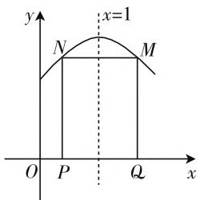
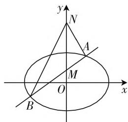

# 数学解题过程中隐含条件的挖掘

# ● 江苏省海门市四甲中学 吴潘钰

# 一、围绕图形特征,挖掘隐含条件,使问题获解

一些数学问题隐晦条件隐于图形之中,若可以牢牢把握图形特征,并善于运用好变换的观点,则可以察觉到一些含而不露的条件,从而使问题快速获解.

例 1 如图 1, 已知矩形 PQMN 中, 它的两个顶点 P, Q 均在 x 轴上, 而另外两个顶点 M, N 则在函数 $f(x) = -2x^{2} + 4x + 2 (0 \leqslant x \leqslant 2)$ 的图像上, 试求出该矩形 PQMN 的面积 S 的最大值.

text_image

y
x=1
N
M
O P Q x

图1

分析:由题目中所呈现的数据很难解答本题,然而学生经过思考不难得出本题的解题思路是建立面积函数解析式.以此进行联想,再观察图形则可挖掘出M、N和P、Q分别关于直线x=1对称这一关键性条件,这样一来,本题的激活将马到成功.

解:如图1,P与Q关于直线x=1对称,那么则可设 $P(1-t,0)$ , $Q(1+t,0)$ ,则 $|PQ|=2t(0<t\leqslant1)$ , $|PN|=f(1-t)=4-2t^{2}$ ,即 $S=|PQ||PN|=2t\cdot(4-2t^{2})=8t-4t^{3}$ , $S'=8-12t^{2}$ ,当 $S'=0$ ,可得 $t=\frac{\sqrt{6}}{3}$ .当 $0<t<\frac{\sqrt{6}}{3}$ 时, $S'>0$ ,当 $\frac{\sqrt{6}}{3}<t<1$ 时, $S'<0$ ,可得 $t=\frac{\sqrt{6}}{3}$ 时,S取到最大值 $\frac{16\sqrt{6}}{9}$ .

# 二、围绕基本概念,挖掘隐含条件,体现创新思维的要求

数学概念是构成数学知识的基本元素,是数学解题的出发点,也是数学现象的特征和本质在人脑中的充分概括和抽象反映.在解题中,围绕基本概念和定义,从题目呈现的条件和信息中剖析出其中的隐含条件,体现创新思维的要求.

例2 已知函数 $f(x) = \mathrm{e}^{x} + \frac{a}{\mathrm{e}^{x}} - a(x + 1)$ ，且点A 与点 B 位于该函数图像上, 若对于任意的 $a \leqslant -1$ , 都有直线 AB 的斜率恒大于常数 m, 试求出 m 的取值范围.

分析:首先从直线AB斜率的定义和题意出发,设 $A(x_{1},y_{1}),B(x_{2},y_{2})$ ,可得 $\frac{f(x_{2})-f(x_{1})}{x_{2}-x_{1}}>m$ 恒成立,这是隐含条件,这样本题的解法就被激活,找寻到了正确解题的思路.

解：设 $A(x_{1},y_{1}),B(x_{2},y_{2}),x_{1} < x_{2}$ .据 $k = \frac{f(x_2) - f(x_1)}{x_2 - x_1} >m$ ，可得 $f(x_{2}) - f(x_{1}) > m(x_{2}-$ $x_{1})$ ，即 $f(x_{2}) - mx_{2} > f(x_{1}) - mx_{1}$ ，则有 $g(x) =$ $f(x) - mx$ 为R上的增函数.那么，则有 $g^{\prime}(x) =$ $f^{\prime}(x) - m\geqslant 0$ ，即 $m\leqslant f^{\prime}(x)$ 恒成立.

因为 $f'(x)=\mathrm{e}^{x}+\frac{-a}{\mathrm{e}^{x}}-a\geqslant2\sqrt{-a}-a$ ，所以 $m \leqslant 2 \sqrt{-a} - a.$

又因为 $g(a) = 2\sqrt{-a} - a$ 为 $a \leqslant -1$ 上的减函数，所以 $2\sqrt{-a} - a \geqslant 3$ ，从而 $m \leqslant 3$

# 三、围绕题设的数学现象,挖掘隐含条件,关注解题思路的形成

一般数学问题的题设中都包含若干数学现象,而这些现象所映射出的是解题所需要的元素.通过深入阅读、仔细分析、深度研究,深刻体会数学现象的内涵和外延是获取隐含条件的关键所在,进而关注到解题思路的形成.

例 3 已知椭圆 $C: \frac{x^{2}}{24} + \frac{y^{2}}{16} = 1$ ，直线 $L: \frac{x}{12} + \frac{y}{8} = 1$ ，且点 P 位于直线 L 上，射线 OP 与椭圆相交于点 R，且有点 Q 位于射线 OP 上，并满足 $|OQ| \cdot |OP| = |OR|^{2}$ 。若点 P 在直线 L 上移动，试求出点 Q 的轨迹方程。

分析:本题的隐含条件的挖掘不仅仅需要丰富的知识结构,还需要观察能力.因此,若剖析题设,并关注到其中隐含的向量 $\overrightarrow{OP},\overrightarrow{OQ},\overrightarrow{OR}$ 共线,并联想到它们的模成等比数列,挖掘出以上两个条件,再通过共线向量的性质可使问题得到顺利解决.

解：设 $Q(x,y),P(x_1,y_1),R(x_2,y_2)$ 由于向量 $\overrightarrow{OP},\overrightarrow{OQ},\overrightarrow{OR}$ 共线，且有 $|OQ||OP| = |OR|^2$ ，则量 $|\overrightarrow{OQ} |,|\overrightarrow{OR} |,|\overrightarrow{OP} |$ 成等比数列．可设 $\overrightarrow{OP} = q\overrightarrow{OR},\overrightarrow{OR} = q\overrightarrow{OQ}$ ，从而 $x_{1} = qx_{2},y_{1} = qy_{2},x_{2} = qx,y_{2} = qy$ ，可得 $x_{1} = q^{2}x,y_{1} = q^{2}y.$ 据题设，点 $P$ 位于直线 $L$ 上，点 $R$ 位于椭圆 $C$ 上，可得 $\frac{q^2x}{12} +\frac{q^2y}{8} = 1,\frac{q^2x^2}{24}+\frac{q^2y^2}{16} = 1$ ，消去 $q$ 可得 $\frac{x}{12} +\frac{y}{8} = \frac{x^2}{24} +\frac{y^2}{16}.$ 整理后，可得点 $Q$ 的轨迹方程为 $\frac{2(x - 1)^2}{5} +\frac{3(y - 1)^2}{5} = 1.$

# 四、围绕题目的数量关系，挖掘隐含条件，启迪解题

分析题目中的数量关系是解题中的重要一环. 有些题目中某些数值或变量间包含了解题所需的优质条件, 深刻领会并运用好其中的关系, 启迪解题.

例4 已知 $0 < \beta < \frac{\pi}{2} < \alpha < \pi$ ，且 $\cos\left(\alpha - \frac{\beta}{2}\right) = -\frac{1}{9}, \sin\left(\frac{\alpha}{2} - \beta\right) = \frac{2}{3}$ ，试求出 $\cos\frac{\alpha + \beta}{2}$ 的值.

分析:本题中牵涉众多变量,容易扰乱学生的思路,我们可以挖掘出其隐藏的“面纱” $\frac{\alpha+\beta}{2}=\left(\alpha-\frac{\beta}{2}\right)-\left(\frac{\alpha}{2}-\beta\right)$ ,从而以此为条件拓展解题思路,使问题迎刃而解.

解: 据条件, 易得 $\cos\left(\frac{\alpha}{2}-\beta\right)=\frac{\sqrt{5}}{3}, \sin\left(\alpha-\frac{\beta}{2}\right)=\frac{4\sqrt{5}}{9}.$

$$
\begin{array}{r l} & {\text {所以} \cos \frac {\alpha + \beta}{2} = \cos \Big [ \Big (a - \frac {\beta}{2} \Big) - \Big (\frac {\alpha}{2} - \beta \Big) \Big ] =} \\ & {\cos \Big (\alpha - \frac {\beta}{2} \Big) \cos \Big (\frac {\alpha}{2} - \beta \Big)   +    \sin \Big (\alpha - \frac {\beta}{2} \Big) \sin \Big (\frac {\alpha}{2} - \beta \Big)   =  } \\ & {- \frac {1}{9} \times \frac {\sqrt {5}}{3} + \frac {4 \sqrt {5}}{9} \times \frac {2}{3} = \frac {7 \sqrt {5}}{2 7}.} \end{array}
$$

# 五、围绕问题的特殊结构，挖掘隐含条件，为问题解决提供思路

有些题目,在题设或结论的特殊结构的背后潜藏着一些促进解题的条件或者方法.因此,在解题时需采取“顺藤摸瓜”的方式,全面分析问题的特殊结构,为问题的解决供给思路,从而正确、完整求解.

例5 证明: 当 $n > m > 0$ 时, 有 $\ln n - \ln m > \frac{m}{n} - \frac{n}{m}$ .

分析: 分析这道证明题的结论, 可以将其等价于 $\ln\frac{n}{m}-\frac{m}{n}+\frac{n}{m}>0$ , 再细致观察这里的结论构造, 不难发现 $\frac{n}{m}$ 与 $\frac{m}{n}$ 互为倒数这一条件, 从而思考到可以使用换元法, 进一步构造函数, 找到问题解决的入口.

证明: 令 $f(x)=\ln x-\frac{1}{x}+x(x>1)$ ，则 $f'(x)=\frac{1}{x}+\frac{1}{x^{2}}+1=\frac{x^{2}+x+1}{x^{2}}>0$ ，那么 $f(x)$ 在区间 $(1,+\infty)$ 内单调递增。所以 $f\left(\frac{n}{m}\right)>f(1)=0$ ，即 $\ln\frac{n}{m}-\frac{m}{n}+\frac{n}{m}>0$ ，所以原命题得证。

# 六、围绕题目的结论,挖掘隐含条件,找寻解题突破口

敏锐的观察和直觉感知是发掘隐含条件的有效手段,一些题目的结论中隐含着通向解题的思路和方法,通过深入分析,可以找寻到解题突破口.

例 6 如图 2, 经过点 $M(0,1)$ 所作任意一条直线与椭圆 $\frac{x^{2}}{8} + \frac{y^{2}}{4} = 1$ 相交于 A, B 两点, 且点 $N(0,4)$ 在 y 轴上, 连接 AN 与 BN, 证明: $\angle ANM = \angle BNM$ .

text_image

y
N
A
M
O
x
B

图2

分析: 本题的结论中隐
含着 y 轴为 $\angle ANB$ 的角平分线这一隐含条件, 再将这一条件转化为 AN, BN 所在直线关于 y 轴对称, 则有 $k_{AN} = -k_{BN}$ , 即从 $k_{AN} + k_{BN} = 0$ 着手找寻解题通道.

证明:设直线 AB 的方程为 $y=kx+1$ ，即可联立
方程组 $\left\{\begin{aligned}y&=kx+1,\\ \frac{x^{2}}{8}&+\frac{y^{2}}{4}=1,\end{aligned}\right.$ 消去 y，可得 $(1+2k^{2})x^{2}+4kx-6=0$ 。设 $A(x_{1},y_{1}), B(x_{2},y_{2})$ ，则 $x_{1}+x_{2}=\frac{-4k}{1+2k^{2}}, x_{1}x_{2}=\frac{-6}{1+2k^{2}}$ ，所以 $k_{AN}+k_{BN}=\frac{y_{1}-4}{x_{1}}+\frac{y_{2}-4}{x_{2}}=\frac{kx_{1}-3}{x_{1}}+\frac{kx_{2}-3}{x_{2}}=\frac{2kx_{1}x_{2}-3(x_{1}+x_{2})}{x_{1}x_{2}}.$

所以 $k_{AN} + k_{BN} = 0$ ，即 $k_{AN} = -k_{BN}$ ，所以 $\angle ANM = \angle BNM. W$