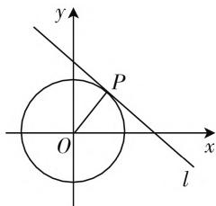

# 注重题后反思,培养学生思维能力

# ● 江苏省石庄高级中学 石鹏

数学是一门以发展学生思维为主的学科,这就需要在解题教学中强化反思的作用.文章结合多个例题,通过反思数学思想、错误根源、一题多解、一题多变等发展学生思维的深刻性、批判性、灵活性和创造性.

大量教学实践表明,对于数学解题,无论是在作业中还是考试中,多数学生都会花大量精力去解较难习题,或者留下尽可能多的时间去解那些毫无思路的难题,却容易忽视题后反思,致使学习能力不见提升.事实上,在数学学习中,题后反思的重要性不言而喻,解题后的反思和回顾不容忽视,学生则需通过不断反省和总结去锤炼自己的思维能力.因此,在课堂教学中教师需注重解题反思,并有意识地引导学生去反思解题思路、方法,回顾和认识解题活动等,让思路更加开阔,思维更为敏捷,以达到优化思维品质,提升思维能力的目的.

# 一、关注数学思想，增强深刻性思维

数学思想在解题中运用较为广泛,因此,在解决一些蕴含丰富数学思想方法的问题时,应鼓励学生从多角度、多方位去反思其中的思想方法,让思维处于积极的状态,使思维向着更宽更广处发展,向着纵深处延伸,进而达到触类旁通的效果.这样长此以往,在对问题的再认识、再创造中,将解决问题的数学思想转化为一个创造性的学习过程,进一步提升学生分析和解决问题的能力,达到优化思维,增强思维深刻性的目的.

例 1 已知 $\left|a\right|<1,\left|b\right|<1,\left|c\right|<1$ ，证明： $abc+2>a+b+c.$

证明: 令函数 $f(a)=abc+2-a-b-c=(bc-1)a+2-b-c$ ，将其视为关于 a 的一次函数，则由 $|b|<1, |c|<1$ ，可得 bc-1<0。所以一次函数 $f(a)$ 在 $(-1,1)$ 上为减函数。又因为 $f(1)=(1-b)(1-c)>0$ ，所以 $f(a)>0$ ，即 $abc+2>a+b+c$ 。

反思:本题为一道不等式问题,若通过一般解法进行解题则较为繁杂.此处完美应用函数思想,其思路巧妙毋庸置疑,既给了我们“柳暗花明”的感受,又使学生思维的灵活性得到培养,解题能力随之得以发展.为了进一步巩固该思想方法的运用,笔者又安排了以下问题:

问题 1: 设 $x, y, z \in R, \alpha + \beta + \gamma = \pi$ ，证明： $x^{2} + y^{2} + z^{2} \geqslant 2yz\cos\alpha + 2xz\cos\beta + 2xy\cos\gamma$ .

思路:首先,构造二次函数 $f(x)=x^{2}-2(z\cos\beta+y\cos\gamma)x+(y^{2}+z^{2}-2yz\cos\alpha)$ ，后计算并说明 $\Delta\leqslant0$ ，进而证明原不等式成立.

问题 2: 已知 $a, b, c \in R^{+}$ ，且 $a + b + c = 1$ ，证明： $abc+\frac{1}{abc}\geqslant27\frac{1}{27}.$

思路:构造函数 $f(x)=x+\frac{1}{x}$ ，且有 $1>x_{1}>x_{2}>0$ ，并借助函数单调性进行证明.

随着一组问题的深入反思,学生积累越来越多的“经验”,并对解决此类问题的通性通法有一个充分的认识,进而有助于更快地明确处理一些问题普遍的思想方法,达到举一反三的效果.

# 二、聚焦错误根源，增强批判性思维

批判性思维位列三大高阶思维之首,需借助学习者积极主动的思维活动而形成.那么在解题教学中,作为学习组织者的教师需引导学生多思考、善于发现,通过对题目条件、解题思路、结论的不断反思,聚焦错误根源,增强学生思维的严谨性和批判性.

例 2 已知 x 是锐角, 试求出函数 $y = \frac{a^{2}}{\cos^{2}x} + \frac{b^{2}}{\sin^{2}x} (a > b > 0)$ 的最小值.

在解题活动中,学生经过独立思考和自主探究形成了以下三种不同的解法:

生1:因为 $\cos^{2}x + \frac{a^{2}}{\cos^{2}x} \geqslant 2\sqrt{\cos^{2}x \cdot \frac{a^{2}}{\cos^{2}x}} = 2a,$ ①

$$
\sin^ {2} x + \frac {b ^ {2}}{\sin^ {2} x} \geqslant 2 \sqrt {\sin^ {2} x \cdot \frac {b ^ {2}}{\sin^ {2} x}} = 2 b, \quad ②
$$

①+②，可得 $\cos^2 x + \frac{a^2}{\cos^2 x} + \sin^2 x + \frac{b^2}{\sin^2 x} \geqslant 2a$

$$
+ 2 b, \text {即} \frac {a ^ {2}}{\cos^ {2} x} + \frac {b ^ {2}}{\sin^ {2} x} \geqslant 2 a + 2 b - 1.
$$

所以函数 $y = \frac{a^2}{\cos^2 x} + \frac{b^2}{\sin^2 x} (a > b > 0)$ 的最小值是 $2a + 2b - 1$ .

生2: 因为 $\frac{a^{2}}{\cos^{2}x}+\frac{b^{2}}{\sin^{2}x}\geqslant2\sqrt{\frac{a^{2}}{\cos^{2}x}\cdot\frac{b^{2}}{\sin^{2}x}}$ ，当且仅当 $\frac{a^{2}}{\cos^{2}x}=\frac{b^{2}}{\sin^{2}x}$ 时等号成立，从而解得 $\cos^{2}x=\frac{a^{2}}{a^{2}+b^{2}},\sin^{2}x=\frac{b^{2}}{a^{2}+b^{2}}$ ，代入上式可得 $2\cdot\sqrt{\frac{a^{2}}{\cos^{2}x}\cdot\frac{b^{2}}{\sin^{2}x}}=2(a^{2}+b^{2})$ 。所以函数 $y=\frac{a^{2}}{\cos^{2}x}+\frac{b^{2}}{\sin^{2}x}(a>b>0)$ 的最小值是 $2a+2b-1$ 。

生3:因为 $\sin^{2}x + \cos^{2}x = 1$ ，所以 $\frac{a^{2}}{\cos^{2}x} + \frac{b^{2}}{\sin^{2}x} = (\sin^{2}x + \cos^{2}x)\left(\frac{a^{2}}{\cos^{2}x} + \frac{b^{2}}{\sin^{2}x}\right) \geqslant 2\sqrt{\sin^{2}x \cdot \cos^{2}x} \cdot 2\sqrt{\frac{a^{2}}{\cos^{2}x} \cdot \frac{b^{2}}{\sin^{2}x}} = 4ab.$

所以函数 $y = \frac{a^2}{\cos^2 x} + \frac{b^2}{\sin^2 x} (a > b > 0)$ 的最小值是 $4ab$ .

师:刚才三名学生的解法中,谁的正确呢?（这一问题的提出引发了学生的数学思考,学生进入积极思考状态,有的分析,有的讨论,有的争辩,有的思辨,课堂气氛异常活跃）

师(拾级而下):我们一起来回忆一下,基本不等式等号成立的条件是什么?刚才三名学生的解法与之相符吗?若有不符的地方,那又该如何变换才能进行求解呢?通过本题,我们对解决此类问题有何思考?

......

当学生对知识认识不清时,基于错误的认识进行推理自然会得到错误的结论.教师通过问题串进行点拨和引导,鼓励学生进行“思辨”,不仅有助于学生对本题的理解,而且有利于架起反思和提炼的桥梁.通过不断的“诊断”,不断的“思辨”,不断的“批判”,学生逐步提炼出问题的注意点,形成正确的解题思路.

# 三、体验一题多解，增强灵活性思维

在解题中,教师以一道试题为例,引导学生多角度的分析和研究,寻求不同的解决方法,借此暴露学生的思维过程,充分显现思考的智慧,从而体验到学习的喜悦.在解题后,同样需引领学生多角度的观察和反思:这种方法是最简捷的方法吗?是否还存在更常规的解题思路？这些解题方法的特征是什么？它们之间存在哪些联系？通过多角度的思考，有助于解题思路的延伸，寻求到最本质的解题思路，培养分析和创新的能力，增强思维的灵活性。

例 3 已知 $x^{2} + y^{2} = 1$ ，试求出 $x + y$ 的最大值.

解法1:(不等式法)因为 $(x+y)^{2}=x^{2}+y^{2}+2xy\leqslant x^{2}+y^{2}+x^{2}+y^{2}=2(x^{2}+y^{2})=2$ ，所以 $|x+y|\leqslant\sqrt{2}$ ，所以 $x+y$ 的最大值是 $\sqrt{2}$ .

解法 2: (换元法) 因为 $x^{2} + y^{2} = 1$ ，设 $\left\{\begin{aligned}x &= \cos\theta, \\ y &= \sin\theta,\end{aligned}\right.$ ( $\theta$ 为参数) 则 $x + y = \cos\theta + \sin\theta = \sqrt{2}\sin\left(\theta + \frac{\pi}{4}\right) \leqslant \sqrt{2}$ ，所以 $x + y$ 的最大值是 $\sqrt{2}$ .

解法 3: (线性规划思想) 如图 1, 设 $l: x + y = m$ , 当且仅当 $l$ 与圆 $O$ 相切于 $P$ 点时, $x + y$ 最大. 据点到直线距离公式, 可得 $\frac{|m|}{\sqrt{2}} = 1$ , 即 $|m| = \sqrt{2}$ . 取 $m = \sqrt{2}$ , 所以 $x + y$ 的最大值是 $\sqrt{2}$ .

text_image

y
P
O
x
l

图1

解法 4: (函数思想)

变形条件为 $y = \pm \sqrt{1 - x^2}, x \in [-1, 1]$ ，则结论为求 $x \pm \sqrt{1 - x^2}$ 的最大值。而 $f(x) = x \pm \sqrt{1 - x^2}$ 不为一个函数，又因为 $-\sqrt{1 - x^2} \leqslant 0$ ，所以 $x + \sqrt{1 - x^2} \geqslant x - \sqrt{1 - x^2}$ 。所以问题转化为求函数 $f(x) = x + \sqrt{1 - x^2}$ 的最大值（详解略）。

# 四、体验一题多变，增强创造性思维

解题后,教师可对题目进行变式拓展,以增强学生对知识的系统理解,并逐步将学生引入佳境,发展创新思维.与此同时,还需进行以下反思:本题中可以实施哪些变式?从本题的条件出发可以得出其他结论吗?本题的逆问题是否同样成立?本题可以得出一般性结论吗?通过多角度的反思,找寻到解决问题的“要害”,达到提升学生学习能力和增强思维创造性的目的.

总之,题后反思对于学生解题有着十分重要的意义.有了反思才能既见树木又见森林,有了反思才能将数学过程抽象化,有了反思才有了数学思维方法的提升,有了反思才能将思维触角延伸开来.将反思活动贯穿于数学解题的全过程,让学生在反思活动中提升数学思维能力.F