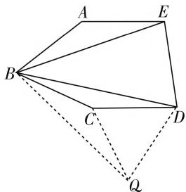
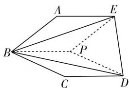
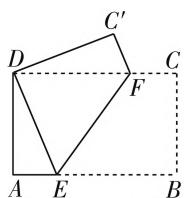
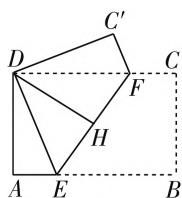

# 解析几何参数取值范围的背景研究

# 江苏省灌云高级中学 杨素来

探究参数的取值范围,是高考的热点题型,也是一类较为常见的数学探索性问题,由于这类问题具有知识的综合性与方法的灵活性的特点,所以往往令许多考生无从下手,他们不知道如何从题意出发,去建立函数关系或不等关系,并从中求出参数.基于此,本文通过一些实例,系统介绍解析几何中解决这类问题的背景和相应的解法,以期对大家有所启发.

# 背景之一:基本不等式

取值范围问题,实质上体现的是一种不等关系.而解析几何就是用代数的思维方式去解决几何问题.于是当解析几何中出现含参的代数式时,我们往往可以考虑能否将其转化为基本不等式的形式,试图利用基本不等式求出有关参数的取值范围.

例 1 已知某直线 l 经过定点 A(3,0)，设该直线的倾斜角为 $\alpha$ ，请求出 $\alpha$ 的取值范围，使得抛物线 C: y = x^{2} 没有哪条弦能被直线 l 垂直平分.

解析:容易验证,当该直线的斜率是零或斜率不存在时,均符合题意.

当该直线的斜率存在且不为零时，它的方程可设为 $y=k(x-3)$ ，被这条直线垂直平分的弦的两个端点设为 $B(t_{1},t_{1}^{2}), C(t_{2},t_{2}^{2})$ .

于是 $BC$ 的中点 $P\left(\frac{t_1 + t_2}{2}, \frac{t_1^2 + t_2^2}{2}\right) (t_1 \neq t_2)$ , $k_{BC} = t_1 + t_2$ .

$$
\begin{array}{l} \left\{ \begin{array}{l} t _ {1} + t _ {2} = - \frac {1}{k}, \\ \frac {t _ {1} ^ {2} + t _ {2} ^ {2}}{2} = k \left(\frac {t _ {1} + t _ {2}}{2} - 3\right) \end{array} \Rightarrow t _ {1} \cdot t _ {2} = \frac {1}{2} \left(\frac {1}{k ^ {2}} + 6 k + 1\right) \right. \\ <   \left(\frac {t _ {1} + t _ {2}}{2}\right) ^ {2} = \frac {1}{4 k ^ {2}} \Rightarrow k <   - \frac {1}{2}. \\ \end{array}
$$

当线段 $BC$ 被 $l$ 垂直平分时，有

所以符合题意的直线的斜率 $k \geqslant -\frac{1}{2}$ , 即 $\tan \alpha \geqslant -\frac{1}{2}$ . 所以 $\alpha \in \left[0, \frac{\pi}{2}\right] \cup \left[\pi - \arctan \frac{1}{2}, \pi\right)$ .

点评:上述解法采用了补集法,补集法可以避免分类讨论.在本例的解答中巧妙地利用了基本不等式,将等式问题转化为不等式,从而求出参数的取值范围.

# 背景之二:参数的几何意义

解答解析几何问题, 数形结合是根本. 尤其是对于某些基本量, 本身有着十分明显的几何意义和取值范围, 因此在解答时要抓住参数的几何意义, 从参数的几何意义入手.

例 2 已知椭圆 C 的一条准线与抛物线 $x^{2} = -4y$ 的准线重合，抛物线的焦点在椭圆 C 上，椭圆 C 的离心率 $e = \frac{1}{2}$ ，试求椭圆 C 的长半轴 a 的取值范围.

解析:由题意知椭圆 C 的焦点在 y 轴上,于是令它的上焦点为 $F(x,y)$ , 根据椭圆的第二定义得, $\frac{|FA|}{2} = \frac{\sqrt{x^{2} + (y+1)^{2}}}{2} = e = \frac{1}{2} \Rightarrow x^{2} + (y+1)^{2} = 1.$

所以椭圆 C 的上焦点 $F(x,y)$ 的轨迹是一个圆，圆心是 $A(0,-1)$ ，半径是 1.

因此焦点 $F(x,y)$ 到准线 y=1 的距离 p 的范围为 $1 \leqslant p \leqslant 3$ .

又 $p = \frac{a^2}{c} - c = \frac{a^2}{ae} - ae = \frac{3}{2} a$ ，所以 $1\leqslant \frac{3}{2} a\leqslant 3\Rightarrow$ $\frac{2}{3}\leqslant a\leqslant 2.$

点评:由于解析几何中的某些基本量本身具有范围,如椭圆的焦半径的取值范围是 $[a-c,a+c]$ ,抛物线的焦半径大于等于 $\frac{p}{2}$ 等,利用这些结论可以建立关于参数的不等式,从而求出参数的取值范围.

# 背景之三:变量的范围

有些解析几何问题中出现双变量(双参数),两个参数之间存在着相互制约的关系,而其中一个参数的范围已知或容易求出,这是把一个欲求范围的参数表示成另一个参数的函数关系,利用函数思想求出欲求参数的取值范围.

例 3 已知直线 $y=kx+1$ 交双曲线 $x^{2}-y^{2}=1$ 的左支于 A, B 两点，另一直线 l 经过点 $(-2,0)$ 和弦 AB 的中点，求直线 l 在纵轴上的截距 b 的取值范围.

解析：由方程组 $\left\{ \begin{array}{l} y = kx + 1, \\ x^2 - y^2 = 1, \end{array} \right.$ 消去 $y$ 得 $(1 - k^2)x^2 - 2kx - 2 = 0.$

设 $A(x_{1},y_{1}),B(x_{2},y_{2}),x_{1} < 0,x_{2} < 0,AB$ 的中点 $M(x_0,y_0)$ ，则有：

$$
\left\{ \begin{array}{l} \Delta = 4 k ^ {2} + 8 (1 - k ^ {2}) > 0, \\ x _ {1} + x _ {2} = \frac {2 k}{1 - k ^ {2}} <   0, \\ x _ {1} x _ {2} = \frac {- 2}{1 - k ^ {2}} > 0 \end{array} \Rightarrow 1 <   k <   \sqrt {2}. \right.
$$

因为 $x_0 = \frac{x_1 + x_2}{2} = \frac{k}{1 - k^2}, y_0 = kx_0 + 1 = \frac{1}{1 - k^2}$ , 即 $M\left(\frac{k}{1 - k^2}, \frac{1}{1 - k^2}\right)$ .

设直线 $l$ 的方程为 $y = m(x + b)$ ，则 $b = 2m$ ，而 $m = \frac{y_0 - 0}{x_0 + 2} = \frac{1}{k + 2 - 2k^2}$ ，则有 $\frac{1}{m} = -2k^2 + k + 2 = -2\left(k - \frac{1}{4}\right)^2 + \frac{17}{8}$ ，它在 $(1, \sqrt{2})$ 上单调递减.

因为 $\sqrt{2} - 2 < \frac{1}{m} < 1$ ，所以 $b = 2m \in (-\infty, -2 - \sqrt{2}) \cup (2, +\infty)$ .

点评:这类问题可先求出一个变量的范围,另一个变量范围就相应可求出来了.这类问题的解决本质上体现了函数思想,即把欲求的参数用某个变量的函数表示出来,再求出这个函数的值域,就是参数的取值范围.

# 背景之四:位置关系

在解析几何中, 当曲线之间的位置关系确定时, 我们往往用代数关系加以转化, 如转化为方程组有解无解问题, 在圆的问题中也可转化为弦心距与半径的大小问题, 由此转化为含有参数的不等式, 从而求出参数的取值范围.

例 4 已知圆 $C: x^{2} + y^{2} - 4x + 2y + m = 0$ 与 y 轴交于 A, B 两点，且 $\angle ACB = 90^{\circ}$ (C 为圆心)，过点 $P(0, 2)$ 且斜率为 k 的直线与圆 C 相交于 M, N 两点.

(I) 求实数 m 的值;

(Ⅱ) 若 $\left|MN\right|\geqslant4$ ，求 k 的取值范围；  
（Ⅲ）若向量 $\overrightarrow{OM} + \overrightarrow{ON}$ 与向量 $\overrightarrow{OC}$ 共线 (O 为坐标原点)，求 k 的值.

解析:(Ⅰ)由圆 $C: x^{2} + y^{2} - 4x + 2y + m = 0$ 得 $(x - 2)^{2} + (y + 1)^{2} = 5 - m$ ，所以圆心 $C(2, -1), r^{2} = 5 - m$ 。由题意知，△ABC 为等腰直角三角形。

设 AB 的中点为 D，则 $\triangle ACD$ 也为等腰直角三角形.

所以 $AC=\sqrt{2}CD=2\sqrt{2}$ ，所以 5-m=8，解得 m=-3。

（Ⅱ）设直线方程为 $y = kx + 2$ ，则圆心 $C(2, -1)$ 到直线 $y = kx + 2$ 的距离 $d = \frac{|2k + 1 + 2|}{\sqrt{1 + k^2}} = \frac{|2k + 3|}{\sqrt{1 + k^2}}$ . 由 $r = 2\sqrt{2}$ ， $|MN| \geqslant 4$ ，可得 $\frac{|2k + 3|}{\sqrt{1 + k^2}} \leqslant 2$ ，解得 $k \leqslant -\frac{5}{12}$ .

所以 $k$ 的取值范围为 $\left(-\infty, -\frac{5}{12}\right]$ .

（Ⅲ）联立直线与圆的方程 $\left\{\begin{aligned}x^{2}+y^{2}-4x+2y-3=0,\\ y=kx+2,\end{aligned}\right.$ 消去变量 y 得 $(1+k^{2})x^{2}+(6k-4)x+5=0.$

设 $M(x_{1},y_{1}),N(x_{2},y_{2})$ ，由韦达定理得 $x_{1} + x_{2}$ $= \frac{4 - 6k}{1 + k^2}$ ，且 $\Delta = (6k - 4)^2 -20(1 + k^2) > 0$ ，整理得 $4k^{2} - 12k - 1 > 0$ ，解得 $k > \frac{3 + \sqrt{10}}{2}$ 或 $k<$ $\frac{3 - \sqrt{10}}{2}$ ，而 $y_{1} + y_{2} = k(x_{1} + x_{2}) + 4 =$ $\frac{-2k^2 + 4k + 4}{1 + k^2}$ 所以 $\overrightarrow{OM} +\overrightarrow{ON} = (x_1 + x_2,y_1 + y_2)$ $= \left(\frac{4 - 6k}{1 + k^2},\frac{-2k^2 + 4k + 4}{1 + k^2}\right).$

因为 $\overrightarrow{OM} +\overrightarrow{ON}$ 与向量 $\overrightarrow{OC}$ 共线， $\overrightarrow{OC} = (2, - 1)$ 所以 $\frac{6k - 4}{1 + k^2} = 2\times \frac{-2k^2 + 4k + 4}{1 + k^2}$ ，解得 $k = 2$ 或 $k =$ $-\frac{3}{2}$ 因为 $k = 2$ 不满足 $k > \frac{3 + \sqrt{10}}{2}$ 或 $k <$ $\frac{3 - \sqrt{10}}{2}$ 所以 $k = -\frac{3}{2}$

点评:本题主要考查直线与圆位置关系的综合应用,涉及圆的方程的求解、垂径定理的应用、平面向量共线定理的应用;求解直线与圆位置 (下转第59页)

得到 $\triangle QCD$ 为等边三角形, 最后根据已知角的数量关系, 求出 $\angle ABC$ 的度数.

若用对称变换，以 $BD$ 为对称轴，作 $\triangle BDE$ 的对称 $\triangle BDQ$ （如图5)，接下来的证明方法与旋转变换是相同的，那么我们得到的结论是旋转变换和对称变换得到的效果是相同的，而达不到更简便、更巧妙的效果.我们再次观察这道题， $\angle ABC = 2\angle DBE$ ，换一个角度思考，往五边形的内部做折叠，以 $BD, BE$ 为对称轴，将 $\triangle BCD, \triangle ABE$ 同时往五边形的内部折叠，如图6所示，根据边和角的数量关系， $BP$ 是两次折叠后的公共边，得到 $\triangle QCD$ 为等边三角形，再由已知角的数量关系，求出 $\angle ABC$ 的度数.

text_image

A
E
B
C
D
Q

图5

证明:以 BD 为对称轴,作 $\triangle BCD$ 的对称 $\triangle BPD$ ,再以 BE 为对称轴作 $\triangle ABE$ 的对称三角形,因为 BP = BC = AB,又因为 $\angle ABC = 2\angle DBE$ ,使得 $\angle ABE =$

text_image

Geometric diagram of a pentagon with labeled vertices and internal points, including dashed lines indicating hidden edges.

图6

$\angle PBE$ , 即 $\triangle ABE$ 的对称三角形为 $\triangle BPE, BP$ 为 $\triangle BPE$ 和 $\triangle BPD$ 的公共边, 如图 6 所示.

因为 $PD = CD, PE = AE$ ，所以 $PD = PE = ED$ ，即 $\triangle PED$ 为等边三角形，又因为 $BP = PE = PD$ ，所以 $\angle DPE = 2\angle DBE = 60^{\circ}$ ，因此 $\angle ABC = 2\angle DBE = 60^{\circ}$ .点评: 观察这两种证法, 用旋转变换需要证明三角形全等,相对来说,运用对称变换,则不需要证明三角形全等,使解题过程变得简捷明快.

第 7 届北京高中数学知识应用竞赛中有这样一道题：

在国际会议上，做报告的德国教授拿起一张A4(210毫米×297毫米)纸，一边折一边说：“我们按下面(图7～图9)的方法，就可以折出一个正五边形。”

  
图 7

  
图8

  
图 9

图7中B、D重合；图8中E、F重合，对折再打开，DH为折痕；图9中AE、 $C^{\prime}F$ 重合在DH上.

你知道为什么吗？

(提示:利用 A4 纸的特殊性和折叠的对称性证明)

数学解题中有通用、常用的方法，一方面，要重视这些最基本的思路方法，突出双基；另一方面，也提倡打破常规思维，运用动态的观点大胆构想。上述例题尽管题目的设计和背景都不尽相同，但均可运用几何变换的方法来解题，从折叠出发，化静为动，以动制静，便可以达到胜利。不难发现，上述题目中都出现了等腰三角形、等边三角形、正五边形等特殊的结构，为运用几何变换提供了广阔的天地。我们对于这类问题，巧用几何变换可以减少解题中的盲目性，解题时全面观察、深入思考、独特分析，力争在常规解法上提出新颖、简捷的解法。W

(上接第57页) 关系综合应用类问题的常用方法是灵活应用圆心到直线的距离、直线与圆方程联立，韦达定理构造方程等方法. 本题(Ⅲ)虽然不要求求出参数 $k$ 的取值范围，但题中已经明确了直线与圆是相交的，而韦达定理的点差法的应用，必须在直线与曲线相交的前提下才有效，所以必须也要求出参数 $k$ 的取值范围，以免产生增解.

当然,对于解析几何参数范围问题的求解方法,必须从题目的实际出发.但无论是哪种背景,一般都是最终转化为不等式问题或函数的值域问题,可见,合理转化是解决这类问题的“根本大法”.

# 参考文献：

[1] 兰志敏. 解析几何中求参数取值范围的常用方法 [J]. 中学生数理化(学习研究), 2017(8).  
[2] 欧阳尚昭, 高蓉. 解析几何中一类含参问题的基本解法 [J]. 中学生数学, 2009(11).  
[3] 姜建荣. 解析几何中一类参数的取值范围的确定方法 [J]. 数学通讯, 2007(Z2).  
[4] 孙亦器, 舒金根. 如何求解析几何中参数的取值范围 [J]. 教学月刊 (中学版), 2005(3). W