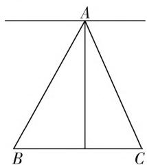
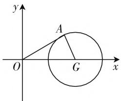
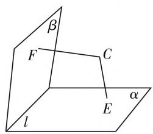
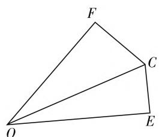

# 转化思想在高中数学解题中的应用例析

# ● 湖南省新邵县第一中学 周斌

随着高考逐步回归全国统一命题，对近几年全国卷试题的深入研究已成为一线数学教师的“必修课”。通过各种方式的研究和思考，笔者发现这些试题中，转化思想的合理运用无处不在，尤其是一些实际问题和综合问题对这一思想方法的需求度极高。事实上，除去那些极其简单的数学问题，基本上每个数学问题都或多或少地需要转化思想的运用，它是解决问题的根本思想，也是提高解题效率的有效手段。本文笔者通过例析，研究转化思想在解题中的应用，希望可以给予广大学生一些运用转化思想解决数学问题的具体方法，从而使学生体会到这一思想方法的重要性。

# 一、化陌生为熟悉

解题中,需充分利用好已有知识经验,注意将新问题向已学知识和熟悉问题转化,使问题熟悉化,以便用自己熟悉的经验、知识和方法来解题.

例 1 已知 $\triangle ABC$ 中, 有 BC = a, 顶点 A 在与 BC 平行且距离为 a 的直线上移动, 试求出 $\frac{AB}{AC}$ 的取值范围.

分析: 观察题目, 不难发现本题的表述较为陌生, 学生理解起来存在一定困难, 很难根据题意直接得出数学关系式, 此时我们可以通过作图来确定 $\triangle ABC$ 的边角关系, 然后试着循着图形往前走一走, 从而借助正弦定理和余弦定理确定 $\frac{AB}{AC}$ 的关系.解: 令 AB=kx, AC=x (k>0, x>0), 则有 $\sin B=\frac{a}{kx}$ , $\sin C=\frac{a}{x}$ .

text_image

A
B
C

图1

据正弦定理，可得 $\sin B = \frac{x}{a}\sin A$ ，所以 $a^2 = kx^2\sin B\sin C = kx^2\sin A.$

据余弦定理, 可得 $\cos A = \frac{k^{2}x^{2} + x^{2} - kx^{2}\sin A}{2kx^{2}} = \frac{1}{2}\left(k + \frac{1}{k} - \sin A\right)$ .

所以 $k + \frac{1}{k} = \sin A + 2\cos A \leqslant \sqrt{1^2 + 2^2} = \sqrt{5}$ , 即 $k^2 - \sqrt{5} k + 1 \leqslant 0$ .

所以 $\frac{\sqrt{5} - 1}{2} \leqslant k \leqslant \frac{\sqrt{5} + 1}{2}$ , 即 $\frac{AB}{AC}$ 的取值范围为 $\left[\frac{\sqrt{5} - 1}{2}, \frac{\sqrt{5} + 1}{2}\right]$ .

# 二、化繁为简

数学问题看似复杂多变,而一旦揭开这层复杂的“面纱”所透露出的是简单的动机.这就需要学生及时捕捉到浮于复杂表象背后的简单,使问题化繁为简,达到柳暗花明的效果.

例2 已知函数 $f(x) = \frac{1 + \cos 2x}{2\sin\left(\frac{\pi}{2} - x\right)} + \sin x +$ $a^2\sin \left(x + \frac{\pi}{4}\right)$ 的最大值是 $3 + \sqrt{2}$ ，试求出常数 $a$ 的值.

分析:本题是以诱导公式和二倍角公式为载体的三角函数式,如果直接求解,过程繁难也找不到出口,但如果能积极联想诱导公式、二倍角公式等,是不难得到答案的.而在解题中,笔者发现,学生的得分率并不算高,主要原因在于学生化繁为简的意识较为缺乏.而事实上,可以将原式转化为 $y=A\sin(\omega x+\varphi)+B$ ,从而化繁为简,快速找到解决问题的路径.

解: 因为 $f(x)=\frac{2\cos^{2}x}{2\cos x}+\sin x+a^{2}\sin\left(x+\frac{\pi}{4}\right)=$ $\sin x+\cos x+a^{2}\sin\left(x+\frac{\pi}{4}\right)=(\sqrt{2}+a^{2})\sin\left(x+\frac{\pi}{4}\right)$ 所以 $y_{\max}=\sqrt{2}+a^{2}=\sqrt{2}+3$ ，则 $a=\pm\sqrt{3}$ .

# 三、数与形的转化

“数”与“形”紧密相连，因此解题中，在关注“形”之直观的同时，还需辅以“数”之严谨的演绎，它是优化解题过程的重要途径.

例3 已知实数 $x, y$ 满足 $(x - 2)^2 + y^2 = 1$ ，试求出 $\frac{y}{x}$ 的最大值.

分析: 观察题目条件容易发现 $(x-2)^{2}+y^{2}=1$ 可以表示为一个圆, 如图2所示, 该圆C位于坐标平面上, 且圆心坐标为 $C(2,0)$ , 半径r=1. 而问题中 $\frac{y}{x}$ 可以转化为 $\frac{y-0}{x-0}$ , 很显然可以表示为圆 C 上的一点 $A(x, y)$ 与坐标原点连线的斜率，则本题可以转化为求直线 OA 斜率的最大值，通过图形计算不难得出 $\frac{y}{x}$ 的最大值为 $\frac{\sqrt{3}}{3}$ .

text_image

y
A
O
G
x

图2

# 四、正难则反

在解题中,需让学生掌握正面解题的一般方法,强调方法的普遍性.同时,有些问题正面解决起来难度较大,思维较易受阻,而从反面入手,思路反而易于打开,使求解过程更简捷、更顺畅,这就是“正难则反”的转化思想,通过有效转化,一方面,培养了学生创新思维意识;另一方面,让学生具有一双透过现象识本质的“慧眼”,这才是解题教学追求的长远利益.

例 4 已知以下 3 个关于 x 的方程 $x^{2}-mx+4=0, x^{2}+(m-1)x+16=0, x^{2}+2mx+3m+10=0$ 中，至少有一个方程有实根，试求出实数 m 的取值范围.

分析:本题若从正面求解,则需考虑到多种情况,需要进行分类讨论,过程繁杂且运算量也较大,使得不少学生走了弯路还得不到正确答案.本题的本质就是求3个方程至少有一个方程有实根的情况,若正面思考,直接分析多种情况;若从反面思考,则只有“3个方程都没有实根”这一种情况,所以“正难则反”思想将是不错的选择.据 $\Delta_{1}<0,\Delta_{2}<0,\Delta_{3}<0$ ,可得 $m^{2}-16<0,(m-1)^{2}-64<0,4m^{2}-4(3m+10)<0$ ,可解得-2<m<4.则以上3个方程至少有一个方程有实根的实数m的取值范围为 $(-∞,-2]∪[4,+∞)$ .

# 五、低维与高维的相互转化

例 5 如图 3, 已知点 C 为 $60^{\circ}$ 的二面角 $\alpha - l - \beta$ 内的一点, 且该点 C 到平面 $\alpha, \beta$ 的距离分别为 2 和 11. 试求出点 C 到 l 的距离.

text_image

β
F
C
E
α
l

图3

text_image

F
C
O
E

图4

分析: 解决本题的关键是从高维退回到低维, 也就是将立体问题转化为平面问题进行处理. 一般解决过程为: 作出点 C 到 l 的距离后, 将其转化为三角形问题求解.

解: 因为 $CE \perp \alpha$ 于点 E, 且有 $l \subset \alpha$ , 则 $l \perp CE$ . 又因为 $CF \perp \beta$ 于点 F, 且有 $l \subset \beta$ , 则 $l \perp CF$ . 因为 $CE \cap CF = C$ , 那么 $l \perp$ 平面 ECF, 所以平面 ECF 为 l 的垂面, 若设垂足是 O, 连接 CO, 则有 $CO \perp l$ , 如图 4, 点 C 到 l 的距离为 CO, 至此问题则可转化为平面图形求解, 求解得出点 C 到 l 的距离为 14.

# 六、类比与猜想进行转化

数学解题中,通过观察可以将原题与类似题目进行类比,猜想出可能的解题方案,从而富有创造性地进行解题.

例6 已知 $f(x)$ 是定义在 $\mathbf{R}$ 上的函数，且有 $f(x + 2)[1 - f(x)] = 1 + f(x) \cdot f(2) = 2 + \sqrt{3}$ ，试求出 $f(2006)$ 的值.

分析: 据题意进行联想, 可知正切函数 $y = \tan x$ , 由 $\tan\left(x + \frac{\pi}{4}\right) = \frac{1 + \tan x}{1 - \tan x}$ , 可得 $y = \tan x$ 的周期是 $\pi = 4 \times \frac{\pi}{4}$ , 由此猜想 $y = f(x)$ 具有类似性质: $f(x) = f(x + 4 \times 2)$ . 据条件可得 $f(x + 2) = \frac{1 + f(x)}{1 - f(x)}$ , 则

$$
f (4 + x) = f [ 2 + (2 + x) ] = \frac {1 + f (2 + x)}{1 - f (2 + x)} =
$$

$$
\frac {1 + \frac {1 + f (x)}{1 - f (x)}}{1 - \frac {1 + f (x)}{1 - f (x)}} = - \frac {1}{f (x)}.
$$

所以 $f(x + 8) = f[4 + (4 + x)] = -\frac{1}{f(4 + x)} = f(x)$ . 函数 $y = f(x)$ 为周期函数，且一个周期为8，由 $f(2) = 2 + \sqrt{3}$ ，可得 $f(8k + 2) = f(2) = 2 + \sqrt{3}$ ，可得 $f(2006) = \sqrt{3} - 2$ .

总之,数学思想是数学知识的高度抽象和概括,更是打开数学知识大门的金钥匙,也是取之不尽用之不竭的数学源泉,还是知识转化的桥梁.在解题教学中,教师需牢牢把握转化这种重要的数学思想和思维策略,通过多种转化方法,使学生躲过艰难的“暗礁”,绕过繁杂的过程,从而达到成功解题的“彼岸”,获得数学成果.这样一来,不仅有利于学生数学解题能力的自然提升,而且对学生思维品质和数学素养的培养也有着积极的意义.W