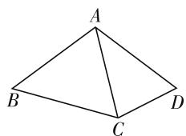
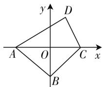
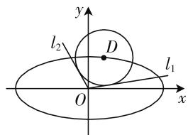
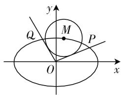

# 习题教学三部曲:巧解 多解 多变

# ● 江苏省无锡市玉祁高级中学 糜苏英

习题教学, 是数学教学中的常态课型. 习题课的教学目的是巩固知识, 提高能力. 由于新授内容学生已掌握, 他们往往对习题课不够重视, 具体表现在注意力不集中, 思维不延续, 因而导致教学效果不尽人意. 如何改变这种现状呢? 笔者以为, 习题课的学习载体既然是习题, 教师就应该在习题的选择上下功夫, 让习题的形式与解法牢牢吸引住学生的眼球, 用数学题目中闪现出的奇特现象与内在美, 提高学生的思维参与.

# 一、用“巧解”吸引学生的注意

习题课,重在培养学生的解题技巧.好的解法,尤其是巧解,往往能引发学生的兴趣.因此,习题课中的选题很重要,我们不仅要通过习题教学,培养学生脚踏实地的严谨学风,还要不断提高他们的数学思维能力,抓住数学问题的本质.越是本质的东西往往越简单.例如,在函数与导数的习题课上,笔者设置了如下两个题目:

(1) 函数 $f(x)$ 的定义域是 R, $f(0)=2$ , 对任意的 $x \in \mathbf{R}, f(x) + f'(x) > 1$ , 则不等式 $\mathrm{e}^{x} \cdot f(x) > \mathrm{e}^{x} + 1$ 的解集是 \_\_\_\_.  
(2) 已知定义在 $\mathbf{R}$ 上的可导函数 $f(x)$ 的导函数为 $f'(x)$ , 满足 $f'(x) < f(x)$ , 且 $f(x + 2)$ 为偶函数, $f(4) = 1$ , 则不等式 $f(x) < \mathrm{e}^x$ 的解集为 \_\_\_\_.

这两个题目属于高考填空压轴题,一般采用构造函数,再利用导数判断它们的单调性,最后利用函数的单调性转化为不等式问题来解,而如何构造函数是难点.如题(1)一般解法如下:

构造函数 $g(x)=\mathrm{e}^{x}(f(x)-1)$ ，求导得 $g'(x)=\mathrm{e}^{x}[f(x)-1]+f'(x)\mathrm{e}^{x}=\mathrm{e}^{x}[f(x)+f'(x)-1]$ ，由已知条件 $f(x)+f'(x)>1$ 可得 $f(x)+f'(x)-1>0$ ，所以 $g'(x)>0$ ， $g(x)$ 单调递增.

已知 $f(0)=2, g(0)=\mathrm{e}^{0}[f(0)-1]=1, \mathrm{e}^{x} \cdot f(x) > \mathrm{e}^{x}+1$ ，即 $\mathrm{e}^{x}[f(x)-1] > 1$ ，即 $g(x) > g(0)$ ，又因为 $g(x)$ 单调递增, 所以 x > 0.

对于这种常规解法,要求学生具有较强的思维能力,而对于那些思维水平一般的学生来说是“一道不可逾越的鸿沟”,因此这些学生对此类问题缺乏兴趣,具体表现在注意力不集中.那么教师如何打破这种僵局呢?教师应引导学生对这类问题“巧解”,让每位学生都能分享成功的喜悦.

题(1) 巧解: 分析已知条件, $f(x)$ 特殊化, 令 $f(x)=2$ , 满足已知条件 $f(0)=2$ 和 $f(x)+f'(x)>1$ . 则 $e^{x} \cdot f(x) > e^{x} + 1$ , 即 $2e^{x} > e^{x} + 1$ , 即 $e^{x} > 1$ , 解得 $x > 0$ .

题(2)巧解:分析已知条件,可把 $f(x)$ 特殊化,令 $f(x)=1$ ,满足已知条件 $f(4)=1,f'(x)<f(x)$ 及 $f(x+2)$ 为偶函数,则 $f(x)<\mathrm{e}^{x}$ 等价于 $1<\mathrm{e}^{x}$ ,解得x>0.

或许有人会认为,这是教师在教学生投机取巧,其实不然.这里所谓的巧解,其实是数学中的一种特殊化思想,是数学研究的一种基本方法,对于填空题,我们一贯主张小题小做,复杂问题简单化,由于简洁,这种巧法深受学生喜爱,值得推广.

# 二、用“多解”激活学生的思维

数学解题教学最忌就题论题,应从一题出发,让学生收获一片.对于某个问题,教师不仅要让学生知道基本解法,更要让他们知之甚多,知之甚广,将数学思维向深度和广度发展.通过一题多解激活学生的思维,培养数学思维的深刻性与广阔性.

例如,在解三角形的习题课上,笔者出示了如下一个问题,要求学生用多种方法探究:

题 在平面四边形 ABCD 中, AB = BC, $\angle ABC = 60^{\circ}$ , CD = 2, AD = 4, 则四边形 ABCD 的面积的最大值为 \_\_\_\_.

多解探究: 因为 AB = BC, $\angle ABC = 60^{\circ}$ , 所以 $\triangle ABC$ 是等边三角形. 为了便于分析、叙述, 先画出对应的图形,并设等边 $\triangle ABC$ 的边长为 x.

text_image

A
B
C
D

图 1

  
图 2

思路 1: 先得到四边形 ABCD 的面积 $S = S_{\triangle ABC} + S_{\triangle ACD} = \frac{\sqrt{3}}{4} x^{2} + 4 \sin D$ ，以及 $x^{2} = 20 - 16 \cos D$ ，再通过消去“ $x^{2}$ ”转化为关于角“D”的三角函数问题，于是求得四边形 ABCD 的面积的最大值为 $8 + 5\sqrt{3}$ .

思路2: 设 $\angle ACD = \theta$ ，由余弦定理得 $4^{2} = x^{2} + 2^{2} - 4x \cos D$ 和四边形 ABCD 的面积 $S = S_{\triangle ABC} + S_{\triangle ACD} = \frac{\sqrt{3}}{4} x^{2} + \frac{1}{2} \times 2x \sin D$ ，即 $4S - \sqrt{3} x^{2} = 4x \sin D$ 转化为 $(12 - x^{2})^{2} + (4S - \sqrt{3} x^{2})^{2} = 16x^{2}$ ，进而通过换元转化为二次方程，并利用判别式，故所求四边形 ABCD 的面积的最大值为 $8 + 5\sqrt{3}$ .

思路 3: 如图 2, 建立平面直角坐标系 xOy, 利用解析法建立方程, 再利用类似思路 2 的方法来解.

通过以上三种解法的探究,让学生分析它们的优势与局限.从多解探究中强化了解三角形与三角函数、不等式、解析几何,以及函数与方程等知识在解题中的灵活、综合运用,激活了学生的解题思维,优化了认知结构,从而使数学素养有了进一步提高.

# 三、用“多变”培养学生的能力

数学题千变万化,同类题、形似题层出不穷,多题一解、一题多变的“数学奇观”令人目不暇接,数学中的这些奇特现象,不仅能激发学生的思维兴奋,而且能开拓学生的视野,培养学生的能力.笔者认为,一堂数学习题课,应该注重习题的质,而不是做的越多越好.换言之,就是通过一道题,引出与之相类似的一串题,即所谓的“一题多变”,让学生在“一题多变”中掌握一类题的解法,同时激发他们对数学的热爱情感,让他们的数学能力自然生成.

例如,笔者在圆锥曲线的综合应用的习题课上,引入了“一图多用”系列问题探究,引起了学生的极大兴趣.

题 1 如图 3, 在平面直角坐标系 xOy 中, 设$D(x_{0},y_{0})$ 为椭圆 $C:\frac{x^{2}}{a^{2}}+\frac{y^{2}}{b^{2}}=1(a>b>0)$ 上的点，直线 $l_{1}:y=k_{1}x,l_{2}:y=k_{2}x$ 与圆 $D:(x-x_{0})^{2}+(y-y_{0})^{2}=r^{2}(r>0)$ 均相切.

(1) 若椭圆 C 的两条准线间的距离为 8, 焦距为 2.

① 求椭圆 C 的方程；

② 若 $r = \frac{\sqrt{6}}{2}$ , 且 $l_{1} \perp l_{2}$ , 求圆 $D$ 的方程.

(2) 若椭圆 C 的离心率为 $\frac{\sqrt{3}}{2}, r = \frac{2\sqrt{5}}{5}b$ ，求 $\left|k_{1} - k_{2}\right|$ 的最小值.

text_image

y
l₂
D
O
x
l₁

图 3

text_image

y
Q
M
P
O
x

图 4

题 2 如图 4, 在平面直角坐标系 xOy 中, 设 $M(x_{0}, y_{0})$ 是椭圆 $C: \frac{x^{2}}{4} + y^{2} = 1$ 上一点, 从原点 O 向圆 $M: (x - x_{0})^{2} + (y - y_{0})^{2} = r^{2}$ 作两条切线, 分别与椭圆 C 交于点 P, Q, 直线 OP, OQ 的斜率分别记为 $k_{1}$ , $k_{2}$ .

(1) 若圆 M 与 x 轴相切于椭圆 C 的右焦点, 求圆 M 的方程.

(2) 若 $r=\frac{2\sqrt{5}}{5}$ .

① 求证: $k_{1}k_{2}=-\frac{1}{4}$ ;

② 求 $OP \cdot OQ$ 的最大值.

从一张图出发引出 2 个圆锥曲线综合题, 涵盖了方程问题、最值问题、定值问题、探究性问题等常考不衰的综合性问题, 不得不说是中学数学的一个奇观, 它牢牢地吸引住了学生的眼球. 由于题目独特, 又耐人寻味, 才激发了学生坚持不懈的探究热情, 并从探究中收获满满, 使他们的数学能力发生了质的改变.

从以上几点的分析中不难发现,教师要上好习题课,选题很重要,选题不仅要符合教学大纲与教学目标,更要切合学生的认知水平、兴趣与爱好.两者兼顾,方能发挥习题课的作用,方能激发学生的思维,让数学习题课自始至终都充满探究味,学生的数学能力必然会自然生长.F