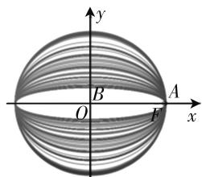
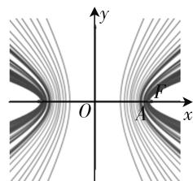

# 会作图明算理,先几何后解析\*

——谈离心率试题解答策略

河北省唐山市教育局教研室 王庆来

离心率是圆锥曲线的重要几何性质,圆锥曲线离心率的求解一直是近年高考的热点问题(见附表).这类问题大多灵活多变、难度较大、区分度较高,能够较好地体现素养导向的高考命题立意.处理此类问题的主要方法是构建基本量a,b,c之间的等量关系式,通过解方程求解.但有些情况下,这类问题条件隐晦、综合性强,学生解答起来无从下手.本文从一道简单的典型考题入手,并结合学生的解题实际,对症下药分析解题策略,以期提高学生的解题质量和速度.

附表: 近五年全国卷解析几何离心率试题汇总

<table><tr><td colspan="2">年份</td><td>题号</td><td>知识点</td></tr><tr><td>2015</td><td>卷II</td><td>理11</td><td>双曲线的离心率</td></tr><tr><td rowspan="4">2016</td><td>卷I</td><td>文5</td><td>椭圆的离心率</td></tr><tr><td>卷II</td><td>理11</td><td>双曲线的离心率</td></tr><tr><td rowspan="2">卷III</td><td>理11</td><td>椭圆的离心率</td></tr><tr><td>文12</td><td>椭圆的离心率</td></tr><tr><td rowspan="5">2017</td><td>卷I</td><td>理15</td><td>双曲线的离心率</td></tr><tr><td rowspan="2">卷II</td><td>理9</td><td>双曲线的离心率</td></tr><tr><td>文5</td><td>双曲线的离心率</td></tr><tr><td rowspan="2">卷III</td><td>理10</td><td>椭圆的离心率</td></tr><tr><td>文11</td><td>椭圆的离心率</td></tr><tr><td rowspan="4">2018</td><td>卷I</td><td>文4</td><td>椭圆的离心率</td></tr><tr><td rowspan="2">卷II</td><td>理12</td><td>椭圆的离心率</td></tr><tr><td>文11</td><td>椭圆的离心率</td></tr><tr><td>卷III</td><td>理11</td><td>双曲线的离心率</td></tr><tr><td rowspan="4">2019</td><td rowspan="2">卷I</td><td>理16</td><td>双曲线的离心率</td></tr><tr><td>文10</td><td>双曲线的离心率</td></tr><tr><td rowspan="2">卷II</td><td>理11</td><td>双曲线的离心率</td></tr><tr><td>文12</td><td>双曲线的离心率</td></tr></table>

# 一、应知应会

# 1. 基础知识

在一轮复习之后,学生必须熟知的基本知识:椭圆定义及椭圆基本量之间的关系:

$$
a ^ {2} = b ^ {2} + c ^ {2};
$$

$$
e = \frac {c}{a} = \sqrt {1 - \frac {b ^ {2}}{a ^ {2}}}, e \in (0, 1).
$$

$e \rightarrow 1$ 椭圆越扁；

$e \rightarrow 0$ 椭圆越圆,参见图1.

双曲线定义及双曲线基本量之间关系：

$$
c ^ {2} = a ^ {2} + b ^ {2};
$$

$$
e = \frac {c}{a} = \sqrt {1 + \frac {b ^ {2}}{a ^ {2}}}, e \in (1, + \infty).
$$

$e \rightarrow 1$ 双曲线开口越小；

$e \rightarrow +\infty$ 双曲线开口越大,参见图2.

text_image

y
B
O
F
A
x

图 1

text_image

y
O
x
A
F

图2

# 2. 基本技能

解析几何考题,都不提供图形,这就要求学生能根据题目给出的条件,作出符合题意的图形.对于学生来说,一次性作出规范图形是令人鼓舞的;当然即便首次作图失败,学生也应当有继续进行筛选、校正的尝试和经验,而不是望而却步或半途而废.

# 二、典例分析

高考试题蕴含着命题专家的集体智慧,在教学中具有示范性、引领性作用，“品真题、研真题”能充分挖掘高考题的教学功能，有利于活跃学生思维，提高教学实效，收到事半功倍的效果。下面结合2016年全国卷Ⅱ理科第11题，通过对此题进行研究，给出求解离心率问题的几种方法。

例 已知 $F_{1}, F_{2}$ 是双曲线 $E: \frac{x^{2}}{a^{2}} - \frac{y^{2}}{b^{2}} = 1$ 的左、右焦点，点 $M$ 在 $E$ 上， $MF_{1}$ 与 $x$ 轴垂直， $\sin \angle MF_{2}F_{1} = \frac{1}{3}$ ，则 $E$ 的离心率为（ ）.

A. $\sqrt{2}$

B. $\frac{3}{2}$

C. $\sqrt{3}$

D. 2

试题设计的直角三角形两个顶点分别是双曲线的焦点,另一个顶点在双曲线上,并给出一个锐角的正弦值,这使问题具有一定的综合性.同时解法的多样性体现了思维的灵活性,对考生运算能力亦有一定要求,为不同能力的考生提供了发挥空间.

根据题意,我们以点 M 在第二象限进行解答.

方法 1: 取 $\left|MF_{1}\right|=1$ ，在 $Rt\triangle MF_{1}F_{2}$ 中，由 $\sin\angle MF_{2}F_{1}=\frac{1}{3}$ ，得 $\left|MF_{2}\right|=3,\left|F_{1}F_{2}\right|=2\sqrt{2}$ ，于是 $2c=\left|F_{1}F_{2}\right|=2\sqrt{2}$ ，得 $c=\sqrt{2}$ ; $2a=\left|MF_{2}\right|-\left|MF_{1}\right|=2$ ，得 a=1，那么 $e=\frac{c}{a}=\sqrt{2}$ 。故选 A.

方法2：由 $\sin \angle MF_2F_1 = \frac{1}{3}$ 得 $\tan \angle MF_2F_1 = \frac{\sqrt{2}}{4}$ 而 $|F_{1}F_{2}| = 2c$ ，则 $|MF_{1}| = \frac{\sqrt{2}}{2} c$ ，令 $a = 1$ ，则 $|MF_2| = |MF_1| + 2a = \frac{\sqrt{2}}{2} c + 2$ ，由 $\sin \angle MF_2F_1 =$ $\frac{1}{3}$ 得 $\frac{|MF_1|}{|MF_2|} = \frac{\frac{\sqrt{2}}{2} c}{\frac{\sqrt{2}}{2} c + 2} = \frac{1}{3}$ 解得 $c = \sqrt{2}$ 即 $e = \sqrt{2}$ 故选A.

方法 1 与方法 2 为赋值法, 此法基于离心率是一个比值, 它仅展示圆锥曲线形状, 与曲线的大小无关. 若题目提供的条件与线段比例有关, 而与图形大小无关, 则使用赋值法, 直接按照条件给出的比例数值代入, 或直接令 a = 1 求解, 解答过程不出现或少出现基本量 a, b, c, 从而降低计算量和难度.

方法3: 把 x = -c 代入到 $\frac{x^{2}}{a^{2}} - \frac{y^{2}}{b^{2}} = 1$ ，得 $y = \pm \frac{b^{2}}{a}$ ，则 $\left|MF_{1}\right| = \frac{b^{2}}{a}$ ；根据条件 $\sin \angle MF_{2}F_{1} = \frac{1}{3}$ ，得

$\left|MF_{2}\right|=\frac{3b^{2}}{a}$ . 根据双曲线定义 $\left|MF_{2}\right|-\left|MF_{1}\right|=\frac{3b^{2}}{a}$ $-\frac{b^{2}}{a}=\frac{2b^{2}}{a}=2a$ ，即 b=a，则 $e=\frac{c}{a}=\sqrt{1+\frac{b^{2}}{a^{2}}}=\sqrt{2}$ .
故选 A.

方法4: 在思路2中可得 $\left|MF_{1}\right|=\frac{\sqrt{2}}{2}c$ ，思路3得 $\left|MF_{1}\right|=\frac{b^{2}}{a}$ ，由 $\frac{b^{2}}{a}=\frac{\sqrt{2}}{2}c$ 得 $\sqrt{2}c^{2}-ac-\sqrt{2}a^{2}=0$ ，即 $\sqrt{2}e^{2}-e-\sqrt{2}=0$ ，解得 $e=\sqrt{2}$ 或 $e=-\frac{\sqrt{2}}{2}$ （舍），所以 $e=\sqrt{2}$ 。故选A.

方法 3 与方法 4 为几何法, 此法基于圆锥曲线是几何图形, 圆锥曲线的定义及几何性质, 能为求解离心率提供广阔空间. 这种解法的特点是思考量比较大, 计算量比较小, 是“多考一点怎么想, 少考一点怎么算”的极好诠释.

以上我们通过这道简单例题体会并对比了求圆锥曲线离心率问题的几种方法,下面我们再分析学生在解决离心率问题时的错误原因.

# 三、错因剖析

剖析 1: (2018 年唐山市一模理科第 10 题) 已知 F 为双曲线 $C: \frac{x^{2}}{a^{2}} - \frac{y^{2}}{b^{2}} = 1 (a > 0, b > 0)$ 的右焦点，过点 F 向 C 的一条渐近线引垂线，垂足为 A，交另一条渐近线于点 B. 若 $|OF| = |FB|$ (O 为原点)，则 C 的离心率是（）.

A. $\frac{\sqrt{6}}{2}$

B. $\frac{2\sqrt{3}}{3}$

C. $\sqrt{2}$

D. 2

数据显示:本题难度系数是0.31,远低于预估难度系数0.65.根据学生、教师的交流反馈,了解到学生的解题困难:(1)不了解离心率对双曲线开口大小的影响,当所作图形无法对接已知条件时,随之放弃,这是大部分学生的丢分原因(由此,培养学生作图基本技能,或者说强化“过程教学”,让学生真正进行作图训练,在作图过程中体验离心率对形状的影响是非常重要的.而教学实际中,作图训练被边缘化);(2)能作出规范图形,但不会利用题目中的条件,无法构造出基本量a,b,c的关系式;(3)不会寻找与设计合理、简捷的运算途径,难以运算或运算错误导致解题进程终止.

剖析 2: (2018 年高考数学全国卷Ⅲ 卷理科第 11 题) 设 $F_{1}$ 、 $F_{2}$ 是双曲线 $C: \frac{x^{2}}{a^{2}} - \frac{y^{2}}{b^{2}} = 1 (a > 0, b > 0)$ 的左、右焦点，O 是坐标原点. 过 $F_{2}$ 作 (下转第 52 页)

$$
C. y = - g (x)
$$

$$
D. y = - g (- x)
$$

解析: 设 $P(x, y)$ 是 $y = f(x)$ 的反函数图像上的任意一点, 则 P 关于 y = x 的对称点 $P'(y, x)$ 在 $y = f(x)$ 的图像上. 又因为 $f(x)$ 的图像与 $g(x)$ 的图像关于直线 $x + y = 0$ 对称, 所以 $P'(y, x)$ 关于直线 $x + y = 0$ 的对称点 $P''(-x, -y)$ 在 $y = g(x)$ 的图像上, 那么必有 -y = g(-x), 即 $y = -g(-x)$ , 所以 $y = f(x)$ 的反函数为 $y = -g(-x)$ . 故选 D.

例 5 （2008 年黑龙江竞赛）已知 $x_{1}$ 是 $x + \lg x = 3$ 的根， $x_{2}$ 是 $x + 10^{x} = 3$ 的根，则 $x_{1} + x_{2}$ 的值为 \_\_\_\_.

解析:由题意知 $x + \lg x = 3 \Rightarrow \lg x = 3 - x, x + 10^{x} = 3 \Rightarrow 10^{x} = 3 - x$ 两边取常用对数得 $x = \lg(3 - x)$ ，换元，设 $y = 3 - x \Rightarrow \lg y = 3 - y$ ，那么 $x_{1}, x_{2}$ 是这两个方程的解，就必有 $x_{1} = 3 - x_{2} \Rightarrow x_{1} + x_{2} = 3$ .

评注: 这两个例题都很好地体现了函数思想, 难度较大. 第一题十分抽象, 要求考生具有良好的抽象思维能力, 能够对反函数图像进行抽象理解和证明. 第二题的难点在于根据方程结构联想到取常用对数, 不能够采用图像的方法来做, 用图像求交点, 只能是求得范围, 无法求得具体值, 所以也是要考虑整体计算, 思维难度较大. 同样类型的有2012年新课标卷理科第12题和2009年辽宁卷第12题基本思路甚至步骤都是如出一辙.

# 四、对称中的抽象函数对称

例 6 证明: $y = f(1 + x)$ 与 $y = f(1 - x)$ 的图像关于 y 轴对称.

证明: 令 $g(x)=f(1+x)$ ，则 $g(-x)=f(1-x)$ ，而 $g(x)$ 与 $g(-x)$ 是关于 y 轴对称的，显然 $f(1+x)$ 与 $f(1-x)$ 关于 y 轴对称.

推广结论: $y=f(b+x)$ 与 $y=f(c-x)$ 关于 x= $\frac{c-b}{2}$ 对称. 证明略.

评注:此题本身较为抽象,突破口在于利用通过要证明的结论,进行逆向思考,实质就是关于 y 轴对称的数学化表达.

纵观最近几年的高考试题,此类对称性问题都应该是属于难题行列.经常出现在高考选择题的最后一题或者填空题的最后一题,整体得分率偏低.虽说写出解答理解起来不是很难,关键知识储备要求也不算太高,但是题型灵活多变,很多时候很难想到.那么我们必须进行适当的训练,以期达到能够在做题中发现出题通性的目的.W

(上接第50页) C的一条渐近线的垂线,垂足为P. 若 $\left|PF_{1}\right|=\sqrt{6}\left|OP\right|$ ,则C的离心率为().

$$
\mathrm{A.} \sqrt {5}
$$

$$
\mathrm{B.2}
$$

$$
\mathrm{C.} \sqrt {3}
$$

$$
\mathrm{D.} \sqrt {2}
$$

试题叙述简单明确,有助于考生直观构图,试题充分考查了考生的逻辑思维推理能力、运算求解能力.学生训练反馈:(1)作图易,寻找等量关系列方程难;(2)学生用几何法的意识比较淡薄,教学训练引领不足.

剖析3:(2019年高考数学全国Ⅰ卷理科第16题)已知双曲线 $C:\frac{x^{2}}{a^{2}}-\frac{y^{2}}{b^{2}}=1(a>0,b>0)$ 的左、右焦点分别为 $F_{1}$ 、 $F_{2}$ ，过 $F_{1}$ 的直线与C的两条渐近线分别交于A，B两点.若 $\overrightarrow{F_{1}A}=\overrightarrow{AB},\overrightarrow{F_{1}B}\cdot\overrightarrow{F_{2}B}=0$ ，则C的离心率为\_\_\_\_.

试题以双曲线为载体,通过向量提供条件,对考生综合、灵活运用知识解决问题的能力进行了考查,对我们教学也兼具很好的引导作用.高考后回访学生,学生反馈的解答问题时:(1)不会利用条件,未能列a,b,c的方程;(2)写出直线AB方程,与直线OB方程联立,求交点坐标,再用垂直条件,运算烦琐,解答不正确；(3) 未考虑双曲线的几何性质(对称性)，用几何法意识比较淡薄；(4) 还有一些学生审题不细致，错把点 A 标在双曲线上，而得到错误答案 $\sqrt{5}$ ，实属遗憾！

通过典例分析与错因剖析,我们感觉到:求解圆锥曲线离心率问题的解决策略应是“会作图明算理,先几何后解析”.这就是说,我们的学生通过高考复习训练,应能理解离心率大小和椭圆圆扁、双曲线开口大小的关系,会根据题目条件作出符合题意的图形;同时结合题目条件,研究题目是否可以使用赋值法?可以,大胆使用;若不可以,优先使用几何法,从圆锥曲线的定义与几何性质出发,同时结合已经学过的平面几何知识,快速建立基本量a,b,c的方程进行解答.两个方法均行不通,再用解析法.

# 参考文献：

[1] 史宁中. 数学基本思想 18 讲 [M]. 北京: 北京师范大学出版社, 2016.  
[2] 教育部考试中心. 高考理科试题分析(语文、数学、英语分册)[M]. 北京: 高等教育出版社, 2016. W