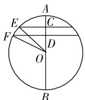
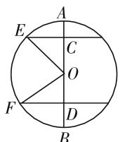
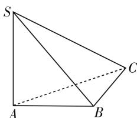
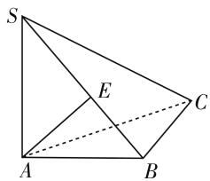
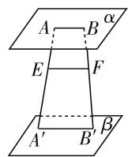
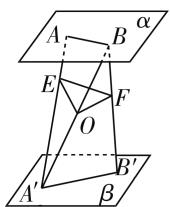
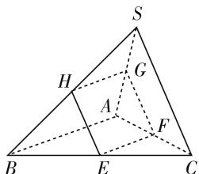

# 例谈立体几何常见的解题误区

# ● 江苏省启东中学 黄群力

立体几何一直是高中数学教学的一大难点,由于缺乏空间想象力和受平面几何思维定势的影响,学生在解题时总会犯这样或那样的错误.为了指导学生正确解题,教师有必要对学生的立体几何解题误区加以研究,基于此,笔者将学生中出现的典型误区加以归类总结,供大家参考.

# 误区一、思考片面

一些学生在初学立体几何时,考虑问题往往不够全面,缺乏分类讨论的意识,主要表现在对空间位置关系的认识不深刻,思维过于简单,忽视立体几何表现形式的多样性,因而会顾此失彼,或以偏概全.

案例 1 （1）圆柱的侧面展开图是边长为 $6\pi$ 和 $4\pi$ 的矩形，则圆柱的表面积为 \_\_\_\_。

(2) 已知半径为 10 的球的两个平行截面圆的周长分别是 $12\pi$ 和 $16\pi$ , 则这两个截面圆间的距离为 \_\_\_\_.

案例剖析: 本例两小题学生往往只考虑一种情况, 对第(1)题只认为边长为 $6\pi$ 的矩形作为底面圆的周长; 对第(2)题则误以为两个截面圆位于球心的同侧, 对而不全. 对此, 教师应引导学生加以分析:

(1) 分两种情况解答: ① 以长为 $6\pi$ 的边为高时, $4\pi$ 为圆柱底面周长, 则 $2\pi r = 4\pi, r = 2$ , 所以 $S_{\text{底}} = 4\pi$ , $S_{\text{侧}} = 6\pi \times 4\pi = 24\pi^2$ , $S_{\text{表}} = 2S_{\text{底}} + S_{\text{侧}} = 8\pi + 24\pi^2 = 8\pi (3\pi + 1)$ ; ② 以长为 $4\pi$ 的边为高时, $6\pi$ 为圆柱底面周长, 则 $2\pi r = 6\pi, r = 3$ , 所以 $S_{\text{底}} = 9\pi$ , $S_{\text{表}} = 2S_{\text{底}} + S_{\text{侧}} = 18\pi + 24\pi^2 = 6\pi (4\pi + 3)$ . 故答案: $6\pi (4\pi + 3)$ 或 $8\pi (3\pi + 1)$ .

  
图 1

  
图 2

(2) 设球心为 O, C, D 为两截面圆的圆心, AB 为经过点 C, O, D 的直径, 由题中条件可得: 两截面圆的

半径分别为 6 和 8. 当两截面在球心同侧时, 如图 1, 在 Rt△COE 中, $OC = \sqrt{10^{2} - 6^{2}} = 8$ , 在 Rt△DOF 中, $OD = \sqrt{10^{2} - 8^{2}} = 6$ . 所以 CD = OC - OD = 8 - 6 = 2. 当两截面在球心异侧时, 如图 2, $CD = OC + OD = 8 + 6 = 14$ . 综上可知, 两截面圆间的距离为 2 或 14.

点评:如何帮助学生走出思考片面的立体几何的解题误区,教师应该把立体几何当成一门实验科学,或通过教具演示,或让学生自主实践,在观察与分析中,感受立体几何各元素间位置关系的复杂性,切忌“纸上谈兵”.

# 误区二、忽视定理的关键条件

立体几何论证题主要考查学生的空间想象力和逻辑推理的核心素养. 在立体几何中的每一个定义、公理、定理及推论, 都是推理的依据, 都不可忽略, 而这些关键条件(如线面垂直的判定定理中“两条相交直线”)往往会被学生忽视, 从而导致解题不能做到完全正确.

案例 2 如图 3, 已知 S 为 $\triangle ABC$ 所在平面外一点, $SA \perp$ 平面 ABC, 平面 $SAB \perp$ 平面 SBC, 求证: $AB \perp BC$ .

案例剖析: 学生认为做这题太简单了, 三下五除二就可搞定, 他们的证明如下:

natural_image

Geometric diagram of a triangular pyramid with vertices labeled S, A, B, C (no text or symbols)

图 3

平面 $SAB \perp$ 平面 SBC，且 $BC \subset$ 平面 SBC，所以 $BC \perp$ 平面 SAB，故 $AB \perp BC$ .

这种证明正确吗？初看似乎没有问题，仔细分析会发现，这种证法对两个平面垂直的性质定理理解不透，面面垂直转化为线面垂直，必须找到其中一个平面内的一条垂直于两个平面的交线的直线，这一点往往被学生忽视，他们证明时常常“蒙混过关”。对此，教师特别要引起重视，积极引导学生找到错误原因，并加以订正。

如图 4, 过 A 点作直线 $AE \perp SB$ , 垂足为 E, 由于平面 $SAB \perp$ 平面 SBC, 且两个平面的交线为 SB, 于是 $AE \perp$ 平面 SBC，故 $BC \perp AE$ ，又因为 $SA \perp$ 平面 ABC，所以 $SA \perp BC$ ，又 $SA \cap AE = E$ ，所以 $BC \perp$ 平面 SAB，又 $AB \subset$ 平面 SAB，故 $BC \perp AB$ .

点评: 高考虽然对立体几何的考查要求不高, 但对规范

text_image

S
E
C
A
B

图 4

书写的要求却特别高,一旦缺损必要的条件,就会导致“全军覆没”. 因此,教师在教学中应着力培养学生的书写能力,培养他们思维的严谨性.

# 误区三、特殊代替一般

学习立体几何的目的,从某种角度来看,是培养思维的多样性和广阔性.因此,立体几何证明必须注意图形的多样性,作为教师,要严防学生犯特殊代替一般和以偏概全的错误.

案例 3 已知平面 $\alpha \parallel$ 平面 $\beta$ ，线段 $AA'$ 、 $BB'$ 夹在两平行面之间，若 E、F 分别是线段 $AA'$ 、 $BB'$ 的中点。求证：EF ∥ 平面 $\alpha$ ，EF ∥ 平面 $\beta$ 。

案例剖析:对于本例,学生中出现了如下错解:

如图 5, 因为平面 $\alpha$ // 平面 $\beta$ , 所以 $AB$ // $A'B'$ .

所以四边形 $AA^{\prime}B^{\prime}B$ 是梯形.

因为 EF 为梯形 $AA^{\prime}B^{\prime}B$ 的中位线, 所以 $EF \parallel AB, EF \parallel A^{\prime}B^{\prime}$ . 所以 $EF \parallel$ 平面 $\alpha, EF \parallel$ 平面 $\beta$ .

一般来讲,AB 与 $A^{\prime}B^{\prime}$ 是异面直线,于是 $AA^{\prime}$ 与 $B^{\prime}B$ 不平行,四边形 $AA^{\prime}B^{\prime}B$ 是空间图形,因此 EF 也不是梯形中位线.所以上述错解犯了以特殊代替一般的错误.

  
图5

  
图 6

那么,本题该如何证? 我们不妨引导学生证明如下:

如图 6, 连接 $AA'$ 、 $B'B$ 、 $A'B$ ，取 $A'B$ 的中点 O，连接 EO、FO.

因为 $EO$ 是 $\triangle A'AB$ 的中位线，所以 $EO \parallel AB$ . 又 $EO \not\subset \alpha, AB \subset \alpha$ ，所以 $EO \parallel$ 平面 $\alpha$ .

同理,所以 FO // 平面 $\beta$ .

又 $FO \cap EO = O, FO, EO \subset$ 平面 $EFO$ , 所以平面EFO // 平面 $\alpha$ // 平面 $\beta$ .

又因为 $EF \subset$ 平面 EFO, 所以 $EF \parallel$ 平面 $\alpha$ , $EF \parallel$ 平面 $\beta$ .

点评:学生犯特殊代替一般的错误,归根到底还是受平面几何解题的影响,因此,教师应该把教学重点放在空间想象力的培养上,让他们尽早脱离平面几何的羁绊,走向立体几何的世界.

# 误区四、表述性知识的错误

在批阅学生作业时,我们经常会发现,立体几何证明题的思路虽然比较简单,学生思路也比较清晰,但他们在书写解答过程时往往会理不清,或缺乏关键步骤,因此,教师应该引导学生书写规范,力争做到万无一失.

案例 4 如图 7, 已知在三棱锥 S-ABC 中, 平面 EFGH 分别与边 BC, CA, AS, SB 相交于 E, F, G, H, 且 SA ⊥ 平面 EFGH. SA ⊥ AB, EF ⊥ FC.

text_image

S
H
G
A
F
B
E
C

图 7

求证:(1)AB // 平面 EFGH;

(2)GH // EF.

案例剖析:对于本题,有些学生解答时出现了如下错解:

(1) 由于 $SA \perp$ 平面 $EFGH, GH \subset$ 平面 $EFGH$ , 故 $SA \perp GH$ . 又 $SA \perp AB$ , 所以 $AB \parallel GH$ .

又因为 $AB \not\subset$ 平面 EFGH, $GH \subset$ 平面 EFGH, 故 $AB \parallel$ 平面 EFGH.

(2) 由(1)可知 $AB \parallel$ 平面 EFGH, 又因为 $EF \subset$ 平面 EFGH, 所以 $AB \parallel EF$ .

又因为 $AB \parallel GH$ ，所以 $GH \parallel EF$ 。

上述错解出现两处错误:①误认为平面几何中“若两直线同时与第三条直线垂直,则它们平行”的结论在立体几何中也成立;②误以为在立体几何中“若直线 $l \parallel$ 平面 $\alpha$ ,则 $l$ 平行于 $\alpha$ 内的任何直线”.

学生中出现的这种错误, 是属于原则性错误, 在教学中教师应特别强调立体几何的有关定理与判定的应用, 必须依据课本, 不可想当然, 更不可把平面几何中的定理用到立体几何中来, 这是保证立体几何正确解题的前提. 当然, 学生在学习中犯些错误并非坏事, 只要教师正确引导, 这些错误也是极好的教学资源, 它能促使学生从失败走向成功. W