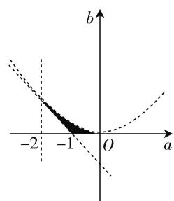

# 关注联系,突破思维瓶颈

——“主元转化思想”在解题中的应用

# ● 江苏省宿迁中学 彭清峰

数学与现实之间存在联系,数学与其他学科之间也存在联系,数学知识之间更是联系紧密,正如迈克尔·阿蒂亚所说:“数学最使我着迷之处是不同分支之间有着许许多多的相互影响,有着预想不到的联系和惊人的奇迹.”“联系”在数学中无处不在,对于数学解题教学来说,“联系”也诞生数学思想方法,数学思想方法正是在知识间的相互联系中得以体现并发挥作用.尤其是面对当前一些新的题型,所需的解题方法既巧妙又深奥,如果不关注“联系”,在教学中若直接把方法呈现给学生,学生往往很难理解与掌握,从而严重影响教学的效果.因此,在解题教学中,一有机会就要“联系”.下面笔者以一类多变量函数取值范围问题为例谈谈对此的看法.

引例 已知函数 $f(x)=x^{2}+ax+b(a,b\in\mathbf{R})$ 在区间 $(0,1)$ 内有两个零点，则 $3a+b$ 的取值范围是 \_\_\_\_.

分析:本题主要考查二次函数的图像、函数的零点、不等式及利用线性规划求范围等问题,意在考查数形结合思想、化归与转化思想及运算求解能力.

# 一、关注学生已有经验与新知之间的联系,确定教学起始点

《全国基础教育课程改革纲要》明确规定：“要加强课程内容与学生生活，以及现代社会和科技发展的联系，关注学生的学习兴趣和经验。”杜威认为“学生经验既是教育的起点也是教育的途径”，因此，教学的本质就是“对学生已有经验的不断改造或改组”。数学解题更加依赖经验，如果学生对于题目比较“熟悉”，一般就很容易找到解题思路，否则就容易遇到解题障碍。这里的“熟悉”言外之意就是“学生具备这方面的经验”。不仅如此，经验的最高层次就是直觉，“直觉”决定数学解题效率。因此，在数学解题教学中，教师首先要关注学生已经具备了怎样的经验，比如，有没做过类似的题目、一般会用哪些思想方法等,然后进一步分析要学的知识与学生已有经验的差距;再比如,题目认知上会存在怎样的困难、方法迁移上会遇到怎样的障碍等,从而给后续的解题教学的过程设计提供借鉴的依据.

学生已经掌握的对付二次函数零点分布的解题经验是从“区间端点、极值、 $\Delta$ ”三个维度把“函数图像的几何特征”用“代数形式”表示出来，即

$$
\left\{ \begin{array}{l} f (0) > 0, \\ f (1) > 0, \\ 0 <   - \frac {a}{2} <   1, \\ a ^ {2} - 4 b > 0 \end{array} \Rightarrow \left\{ \begin{array}{l} b > 0, \\ 1 + a + b > 0, \\ - 2 <   a <   0, \\ a ^ {2} - 4 b > 0. \end{array} \right. \right.
$$

由于不等式组中涉及两个参数,结论中也涉及两个参数,联系“线性规划”问题的解题经验,画出其对应的平面区域,如图1所示,易知 $3a+b\in(-5,0)$ .

题目已经解答完成,但所用的方法也有局限性,如果把目标函数改成非线性结构,比如,求 $a^{2}+2b^{2}-4b$ 的最小值,那么学生已有的解题经验不再适用,于是就引发了认知冲突.

text_image

b
-2
-1
O
a

图1

新的解题方法可以考虑转换“主元”，即把原先以参数 $a, b$ 为主元的问题转化为以“零点”为主元。首先要把参数 $a, b$ 用零点 $x_{1}, x_{2}$ 表示出来，联系学生的已有经验，韦达定理反映了系数与零点的关系，因此有 $\left\{ \begin{array}{l} x_{1} + x_{2} = -a, \\ x_{1}x_{2} = b, \end{array} \right.$ 则 $3a + b = -3x_{1} - 3x_{2} + x_{1}x_{2} = (x_{1} - 3)(x_{2} - 3) - 9$ ，因为 $x_{1}, x_{2} \in (0,1)$ ，所以 $3a + b \in (-5,0)$ 。

在解题教学中要立足学生的已有经验,降低思维门槛,这样有助于构建自然的教学过程;另一方面,通过制造认知冲突,打破学生已有经验的思维定势,促使经验自主更新与发展,从而与新知识建立起新的联系.

# 二、关注条件与结论的联系,探索知识生长点

数学解题的本质就是构建条件与结论之间联系的过程。有些数学问题的条件比较充分，指向也非常明确，那么就容易找到条件与结论之间的关联，对学生而言，这类问题就属于“简单题”。还有一些数学问题，条件指向不明或者有多种解读方式，条件与结论之间的关联就很难建立，对学生来说，这类问题就是“难题”。解题教学一般都是针对难题，因此，教学的重点应该放在探索建立条件与结论之间联系的路径上，比如，对于一些数学问题如果按照“由因导果”的顺序进行下去，可能会被其中错综复杂的关系所干扰，无法获得正确的解题思路，此时就需要运用“执果索因”的方法，从结论进行逆向分析，由欲知确定需知，求需知利用已知，逐步建立起结论与条件的关联，从而解题目标就会得到明确。

例 1 已知函数 $f(x)=x^{2}+ax+b(a,b\in\mathbf{R})$ 在区间 $[-1,1]$ 上有零点，且满足 $0\leqslant b-2a\leqslant1$ ，则 b 的取值范围是 \_\_\_\_.

解析: 分析条件“区间 $[-1,1]$ 上有零点”，如果用传统的二次函数零点分布思想来考虑的话，情况就比较复杂，需要进行分类讨论。若从结论出发 $b=x_{1}x_{2}$ ，那么只需要找到 $x_{1},x_{2}$ 的关系，然后把二元函数化为一元函数，最后再求函数最值。

由 $0 \leqslant b - 2a \leqslant 1$ 得 $0 \leqslant x_{1}x_{2} + 2(x_{1} + x_{2}) \leqslant 1, 0 \leqslant (x_{1} + 2)x_{2} + 2x_{1} \leqslant 1$ , 由于 $x_{1} \in [-1,1], x_{1} + 2 > 0$ , 所以 $\frac{-2x_{1}}{x_{1} + 2} \leqslant x_{2} \leqslant \frac{1 - 2x_{1}}{x_{1} + 2}, b$ 就转化为以 $x_{1}$ 为主元的函数, 下面对 $x_{1}$ 分类讨论: 当 $x_{1} \in (0,1]$ 时, $\frac{-2x_{1}^{2}}{x_{1} + 2} \leqslant b \leqslant \frac{x_{1} - 2x_{1}^{2}}{x_{1} + 2}$ , 令 $t = x_{1} + 2$ , 则 $\frac{-2x_{1}^{2}}{x_{1} + 2} = 8 - 2\left(t + \frac{4}{t}\right) \geqslant -\frac{2}{3}, \frac{x_{1} - 2x_{1}^{2}}{x_{1} + 2} = 9 - 2\left(t + \frac{5}{t}\right) \leqslant 9 - 4\sqrt{5}$ , 所以 $-\frac{2}{3} \leqslant b \leqslant 9 - 4\sqrt{5}$ ; 同理, 当 $x_{1} \in [-1,0]$ 时, $-3 \leqslant b \leqslant 0$ , 所以 $-3 \leqslant b \leqslant 9 - 4\sqrt{5}$ .

例 2 已知 $a, b, c \in R$ ，函数 $f(x) = ax^{2} + bx + c, g(x) = ax + b$ ，当 $x \in [-1, 1]$ 时， $|f(x)| \leqslant 1$ ，证明：当 $x \in [-1, 1], |g(x)| \leqslant 2$ .

解析：要证明结论 $\left|g(x)\right|\leqslant2$ ，只需证明 $\left|g(1)\right|=\left|a+b\right|\leqslant2,\left|g(-1)\right|=\left|a-b\right|\leqslant2$ ，条件 $\left|f(x)\right|\leqslant1$ ，跟上面两个问题不同，此题没有涉及“零点”，也就无法直接用零点 $x_{1},x_{2}$ 进行转化，需要设计问题链进行启发引导.

问题 1-1:何为零点?

$f(x)=0$ 时的解.

问题 1-2: $f(0), f(1), f(-1)$ 的值是什么？它们满足什么条件？

$$
\left\{ \begin{array}{l} f (0) = c \leqslant 1, \\ f (1) = a + b + c \leqslant 1, \\ f (- 1) = a - b + c \leqslant 1. \end{array} \right.
$$

问题 1-3: 能否用 $f(0), f(1), f(-1)$ 表示 $\left|a + b\right|, \left|a - b\right|$ ?

$$
\left\{ \begin{array}{l} c = f (0), \\ a = \frac {f (1) + f (- 1) - 2 f (0)}{2}, \\ b = \frac {f (1) - f (- 1)}{2}, \end{array} \right.
$$

$$
\text {则} \left\{ \begin{array}{l} {\mid a + b \mid = \mid f (1) - f (0) \mid \leqslant \mid f (1) \mid + \mid f (0) \mid \leqslant 2,} \\ {\mid a - b \mid = \mid f (- 1) - f (0) \mid \leqslant \mid f (- 1) \mid + \mid f (0) \mid \leqslant 2,} \end{array} \right.
$$

所以 $|g(x)| \leqslant 2$ 成立.

由此可见，本题的核心思想也是“主元”转化思想，即以特殊函数值 $f(0), f(1), f(-1)$ 为主元替换主元 $a, b$ .

条件与结论的联系有时学生不容易发现,如果教师直接抛出结论就容易出现“强行灌输”的诟病,此时,应该考虑通过步步深入、由此及彼的“问题链”来驱动思考,帮助学生自主突破思维的障碍,架起条件与结论之间的桥梁.

# 三、关注解题方法之间的联系,形成思维体系

一题往往有多解,很多教师善于把各种解题方法都挖掘出来呈现给学生,希望学生能够掌握更多的解题思想方法.但很多时候往往事与愿违,方法太多,眼花缭乱,一方面,导致学生不知道该如何选择;另一方面,即使当时记住了这些方法,可是很容易遗忘,在解题中还是想不到去运用这些方法.因此,“碎片化”解题方法的罗列是很难真正提升学生的解题水平,只有搞清楚解题方法之间的联系才能够做到举一反三.其实,从表面上看解题方法似乎很多,从横向看也就是两类:一类是从“数”的角度去考虑,另一类是从“形”

的角度去考虑. 当把解题方法的类别确定好后, 然后再加以细分, 研究每种方法之间的纵向联系, 会发现后一种方法通常是前一种方法的改进与优化, 这样解题方法就可以按照一定的主线串联起来, 环环相扣, 层层递进, 从而有助于学生对解题方法整体认知的形成与系统思维的构建.

“主元转化思想”的原理是在含有两个或两个以上参数的问题中，选择其中一个或多个参数为主要研究对象，作为“主元”，把其余的参数暂时先看作常量，通过参数之间的相互转换，从而实现解题思路的优化。分析上面3个问题的解答过程，我们可以发现二次函数问题主元的转化本质上就是“系数”与“函数特殊值”之间的转化，比如，“引例”与“例1”就是“系数”与“零点”的转化，“例2”就是“系数”与“ $f(0), f(1), f(-1)$ ”之间的转化，若把“例2”中的条件“ $x \in [-1, 1]$ ”改为“ $x \in [-2, 2]$ ”可能就需要用到“ $f(2), f(-2)$ ”进行转化了。“主元转化思想”不仅在二次函数问题上有广泛的应用，而且还可以推广到其他类型的函数。

例3 设 $a \in \mathbf{R}$ , 函数 $f(x) = \left|x^{2} + \frac{1}{x}\right| + \left|x^{2} - \frac{1}{x}\right| + ax$ , 设 $b \in \mathbf{R}$ , 若关于 $x$ 的方程 $f(x) = b - 8$ 有实数解, 求 $a^{2} + b^{2}$ 的最小值.

解析:由已知可得 $\left|x^{2}+\frac{1}{x}\right|+\left|x^{2}-\frac{1}{x}\right|+ax=b-8$ ，方程包含的参数很多，因此需要确定以什么参数为主元。根据上面两个问题的解题经验，主元一般由结论 $a^2 + b^2$ 确定，所以对方程进行变形得 $xa - b + \left|x^2 + \frac{1}{x}\right| + \left|x^2 - \frac{1}{x}\right| + 8 = 0$ ，把它看作以 $a, b$ 为主元的方程，所以它表示一条直线；根据 $a^2 + b^2$ 的几何

意义得 $\sqrt{a^2 + b^2} \geqslant \frac{\left|x^2 + \frac{1}{x}\right| + \left|x^2 - \frac{1}{x}\right| + 8}{\sqrt{x^2 + 1}}.$

令 $g(x)=\frac{\left|x^{2}+\frac{1}{x}\right|+\left|x^{2}-\frac{1}{x}\right|+8}{\sqrt{x^{2}+1}}$ ，通过分类讨论去掉绝对值：

① 当 $0 < x \leqslant 1$ 时, $g(x) = \frac{\frac{2}{x} + 8}{\sqrt{x^2 + 1}}$ , 容易判断 $g(x)$ 此时是减函数, 所以 $g(x) \geqslant g(1) = 5\sqrt{2}$ ;

② 当 $x > 1$ 时， $g(x) = \frac{2x^2 + 8}{\sqrt{x^2 + 1}} = 2\left(\sqrt{x^2 + 1} + \frac{3}{\sqrt{x^2 + 1}}\right) \geqslant g(\sqrt{2}) = 4\sqrt{3}$ .

由于 $g(x)$ 是偶函数, 所以 $g(x)$ 的最小值为 $4\sqrt{3}$ , 即 $a^{2} + b^{2}$ 的最小值为 48.

题目类型繁多,解题方法数不胜数,解题教学所花的时间再多也觉得不够用,题海战术始终难以摆脱,……这些都是一线教师的现实困境.用“联系”的观点去了解学生,去梳理解题方法,去研究教法学法才是破解之道.

(上接第58页)

text_image

3m+n+2=0
m+n=0
y=logₐ(x+4)
A
O
m
n

图3

(2) $f'(x)=6x^{2}+6mx+3(m+n),x_{1}\in(0,1)$ $x_{2}\in(1,+\infty)\Rightarrow\left\{\begin{aligned}&f'(0)>0,\\ &f'(1)<0,\end{aligned}\right.$ 故有不等式组 $\left\{\begin{aligned}&m+n>0,\\ &3m+n+2<0,\end{aligned}\right.$ 它表示的平面区域如图3所示.由于存在 $P(m,n)$ 在 $y=\log_{a}(x+4)$ 的图像上，故两直线的交点A必须在函数 $y=\log_{a}(x+4)$ 图像的下方，容易求得 $A(-1,1)$ ，故 $\left\{\begin{aligned}1&<\log_{a}3,\\ a&>1,\end{aligned}\right.$ 由此解得 $1<a<3$ 。故本题填(1,3).

点评: 数学解题, 数形结合意识十分重要, 它时常是我们解决问题的突破口. 看见二元一次不等式(组), 我们就要想到它表示的平面区域, 而看到不等式 $b-a^{2}+2a+2\geqslant0$ 也要联想到二次不等式对应的曲线区域. 虽然它不是线性约束条件, 但它也能引导我们用线性规划思想解决问题.

从以上四种类型数学问题的分析不难看出,简单的线性规划,不仅仅是一个知识点,同时也是一种极好的解决问题的思想方法,当解题过程中遇到不等式组时,这种“思想”能引导我们去认真观察,去深入研究问题的几何背景,进而从数形结合的角度快速解决问题. W