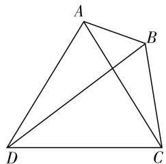

# 关注解三角形中的三类新题型

# 甘肃省古浪县第三中学 李连川

解三角形是高考必考知识点,难度中等,侧重考查利用解三角形知识分析、解决问题,而且此类问题往往与三角函数知识交汇考查.现就有关新题型加以归类解析,以便帮助同学们提升适应能力,进一步加强数形结合能力、推理论证能力及运算求解能力.

# 类型一、解三角形中的“多选题”

以“多选题”的形式考查解三角形知识,显然比“单选题”增加了难度,不便于直接运用排除法迅速获解,原因就是正确答案对应的选项不唯一,至少有2个.

例 1 （2019·福建厦门外国语学校月考）(多选题)已知 $\triangle ABC$ 的内角 A, B, C 所对的边分别为 a, b, c，则下列四个命题中正确的是()。

A. 若 $\frac{a}{\cos A} = \frac{b}{\cos B} = \frac{c}{\cos C}$ ，则 $\triangle ABC$ 一定是等边三角形  
B. 若 $a \cos A = b \cos B$ ，则 $\triangle ABC$ 一定是等腰三角形  
C. 若 $b \cos C + c \cos B = b$ ，则 $\triangle ABC$ 一定是等腰三角形  
D. 若 $a^{2}+b^{2}-c^{2}>0$ ，则 $\triangle ABC$ 一定是锐角三角形

解析:由 $\frac{a}{\cos A}=\frac{b}{\cos B}=\frac{c}{\cos C}$ ，利用正弦定理可得 $\frac{\sin A}{\cos A}=\frac{\sin B}{\cos B}=\frac{\sin C}{\cos C}$ ，即 $\tan A=\tan B=\tan C,A=B=C$ ，所以 $\triangle ABC$ 是等边三角形，所以选项A正确；

由 $a\cos A = b\cos B$ 及正弦定理可得 $\sin A\cos A = \sin B\cos B \Rightarrow \sin 2A = \sin 2B$ ，所以 2A = 2B 或 $2A + 2B = \pi$ ，所以 $\triangle ABC$ 是等腰或直角三角形，所以选项 B 不正确；

由 $b\cos C + c\cos B = b$ 及正弦定理可得 $\sin B\cos C + \sin C\cos B = \sin B$ ，即 $\sin(B + C) = \sin B, \sin A = \sin B$ ，则 A = B， $\triangle ABC$ 等腰三角形，所以选项 C 正确；

由 $a^2 + b^2 - c^2 > 0$ 及余弦定理可得 $\cos C =$ $\frac{a^{2}+b^{2}-c^{2}}{2ab}>0$ , 角 C 为锐角, 角 A, B 不一定是锐角, 所以选项 D 不正确.

综上所述,本题应选 AC.

评注:本题侧重考查利用正弦定理、余弦定理及三角恒等变换知识,判断三角形的现状,有利于较好地培养学生在数学运算与逻辑推理方面的核心素养.

# 类型二、解三角形中的“多填题”

以“多填题”的形式考查解三角形知识,第二问求解时往往需要灵活运用第一问的结论,试题这样设计的目的就是适当降低难度,给予考生合理设置可以继续向上爬的“阶梯”.

例2（2019·浙江温州中学高三月考）如图1，四边形ABCD中， $AC = AD = CD = 7$ $\angle ABC = 120^{\circ},\sin \angle BAC =$ $\frac{5\sqrt{3}}{14}$ ，则 $\triangle ABC$ 的面积为\_\_\_\_， $BD =$ \_\_\_\_.

text_image

A
B
D
C

图 1

解析: 在 $\triangle ABC$ 中, 因为

$AC = 7, \angle ABC = 120^{\circ}, \sin \angle BAC = \frac{5\sqrt{3}}{14}$ , 所以由正弦定理得 $\frac{7}{\sin120^{\circ}}=\frac{BC}{\frac{5\sqrt{3}}{14}}$ ，解得 $BC=\frac{7\times\frac{5\sqrt{3}}{14}}{\frac{\sqrt{3}}{2}}=5.$

又因为 $\cos\angle ABC = \cos120^{\circ} = -\frac{1}{2}$ ，所以在 $\triangle ABC$ 中，由余弦定理得 $49 = AB^{2} + 25 - 10 \cdot AB \cdot \left(-\frac{1}{2}\right)$ ，解得 AB = 3.

故 $S_{\triangle ABC}=\frac{1}{2}\times AB\times AC\times\sin\angle BAC=\frac{1}{2}\times3\times7\times\frac{5\sqrt{3}}{14}=\frac{15\sqrt{3}}{4}.$

$$
\begin{array}{l} = \sqrt {1 - \left(\frac {5 \sqrt {3}}{1 4}\right) ^ {2}} = \frac {1 1}{1 4}, \text {所以} \sin \angle B C A = \sin (\angle B A C + \\ \angle A B C) = \sin \angle B A C \cdot \cos \angle A B C + \sin \angle A B C \cdot \\ \cos \angle B A C = \frac {5 \sqrt {3}}{1 4} \times \left(- \frac {1}{2}\right) + \frac {\sqrt {3}}{2} \times \frac {1 1}{1 4} = \frac {3 \sqrt {3}}{1 4}, \text {所以} \\ \cos \angle B C A = \sqrt {1 - \left(\frac {3 \sqrt {3}}{1 4}\right) ^ {2}} = \frac {1 3}{1 4}. \\ \end{array}
$$

因为 $\angle ABC = 120^{\circ},\sin \angle BAC = \frac{5\sqrt{3}}{14},\cos \angle BAC$

又易知 $\angle DCA = 60^{\circ}$ ，所以 $\cos \angle DCB =$ $\cos (\angle DCA + \angle BCA) = \cos \angle DCA\cdot \cos \angle BCA -$

$$
\sin \angle D C A \cdot \sin \angle B C A = \frac {1}{2} \times \frac {1 3}{1 4} - \frac {\sqrt {3}}{2} \times \frac {3 \sqrt {3}}{1 4} = \frac {1}{7}.
$$

于是，在 $\triangle DBC$ 中，由余弦定理可知 $BD^{2}=49+25-2\times7\times5\times\frac{1}{7}=64$ ，所以 BD=8.

综上,本题应填写: $\frac{15\sqrt{3}}{4}$ ,8.

评注:处理以“平面图形”为载体的解三角形问题时,需要关注两点:一是利用正、余弦定理求边角,要充分挖掘三角形中已知的边角组合类型;二是遇到很多三角形交织在一起,要特别注意公共边、公共角,它们往往在各个三角形之间起纽带作用.

# 类型三、解三角形中的“开放性”试题

处理解三角形中“开放性”试题,对学生解题能力的要求较高,其关键在于需要将解三角形中的正弦定理、余弦定理、面积公式与相关三角函数知识加以灵活、综合运用.

例3 ① $2a\cos B = 2c - b$ ，② $(\sin A + \sin B)(a - b)$ $+b\sin C = c\sin C$ ，③ $b^{2} + c^{2} - a^{2} = \frac{2\sqrt{3}}{3} bc\sin (B + C),$

在这三个条件中任选一个补充到下面问题中,若问题中的 C 存在,求 C 的值;若 C 不存在,请说明理由.

设 $\triangle ABC$ 的内角 A, B, C 的对边分别为 a, b, c，
是否存在 C，使得 $\sqrt{3}\sin C - \cos\left(B + \frac{\pi}{3}\right) = 1?$

解析:选①,问题中的 C 不存在,理由如下.

因为 $2a\cos B = 2c - b$ ，所以由正弦定理知 $2\sin A\cos B = 2\sin C - \sin B$ .

又 $\sin C = \sin(A + B)$ ，所以 $2\sin A \cos B = 2\sin(A + B) - \sin B$ ，即 $2\cos A \sin B = \sin B$ 。又 $\sin B > 0$ ，所以 $\cos A = \frac{1}{2}$ 。又因为 $0 < A < \pi$ ，所以 $A = \frac{\pi}{3}$ 。

于是， $B + \frac{\pi}{3} = B + A = \pi -C.$ 从而， $\sqrt{3}\sin C-$ $\cos \left(B + \frac{\pi}{3}\right) = \sqrt{3}\sin C - \cos (\pi -C) = \sqrt{3}\sin C + \cos C$ $= 2\sin \left(C + \frac{\pi}{6}\right).$

又 $C \in \left(0, \frac{2\pi}{3}\right)$ , 所以 $C + \frac{\pi}{6} \in \left(\frac{\pi}{6}, \frac{5\pi}{6}\right)$ , 所以 $\sin \left(C + \frac{\pi}{6}\right) > \frac{1}{2}$ . 于是 $\sqrt{3} \sin C - \cos \left(B + \frac{\pi}{3}\right) = 2 \sin \left(C + \frac{\pi}{6}\right) > 2 \times \frac{1}{2} = 1$ . 故不存在 $C$ , 使得 $\sqrt{3} \sin C - \cos \left(B + \frac{\pi}{3}\right) = 1$ .

或者解析写成:选②,问题中的C不存在,理由如下.

由 $(\sin A+\sin B)(a-b)+b\sin C=c\sin C$ 及正弦定理可得 $a^{2}-b^{2}+bc=c^{2}$ ，所以由余弦定理得 $\cos A=\frac{b^{2}+c^{2}-a^{2}}{2bc}=\frac{1}{2}$ ，又0<A< $\pi$ ，所以 $A=\frac{\pi}{3}$ .以下与选①过程相同，略.

或者解析写成:选③,问题中的C不存在,理由如下:

因为 $A + B + C = \pi$ ，所以 $\sin (B + C) = \sin A$ ，由 $b^{2} + c^{2} - a^{2} = \frac{2\sqrt{3}}{3} bc\sin (B + C)$ ，可得 $b^{2} + c^{2} - a^{2} =$ $\frac{2\sqrt{3}}{3} bc\sin A$ ，所以 $\frac{b^2 + c^2 - a^2}{2bc} = \frac{\sqrt{3}}{3}\sin A$ ，由余弦定理得 $\cos A = \frac{\sqrt{3}}{3}\sin A$ ，所以 $\tan A = \sqrt{3}$ .又 $0 < A < \pi$ ，所以 $A = \frac{\pi}{3}$ .以下与选 $①$ 过程相同，略.

评注:本题求解关键是先根据所选条件,分析获得 $A=\frac{\pi}{3}$ ;再综合运用三角恒等变换及正弦函数的图像与性质加以求解.对比可知:若选①,则必须考虑解三角形中的正弦定理与三角恒等变换的灵活运用;若选②,则必须考虑解三角形中正弦定理、余弦定理的综合运用;若选③,则必须考虑诱导公式与余弦定理的灵活运用.

综上,解三角形中的以上三类新题型符合新高考命题导向,不仅能够较好地考查学生对试题创新的适应能力,而且能够有效培养学生的探索、创新精神,进一步提升学生的数学核心素养,故必须引起重视. F