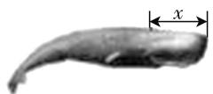
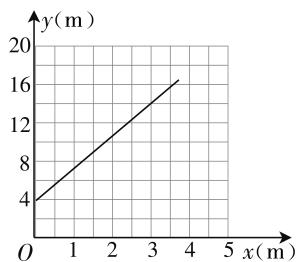

# 分析“数学建模”方式 在高中数学解题教学中的应用

山东省枣庄市第三中学 高琴

数学建模是指应用数学思维及方法创建模型,目的是解决数学问题,提升高中生学习数学的趣味性.在高中数学中,数学建模已纳入教学课程中,明确要求老师必须指导学生完成建模,从而提升学生的创新能力.其实,在日常生活中,到处可见数学建模的运用,这是因为创建的数学模型包含了数学知识及数学规律,最终依照数学规律进行推理和验证,以此获取的解题思路.本文主要对“数学建模”方式在高中数学解题教学中的应用展开研究和分析.

# 一、应用数学建模的重要性

# 1. 有助于高中生完善自主探究学习形式

对于数学建模而言, 其运用对象大多为烦琐、应用性较强的数学问题. 其中, 数学老师起着指导作用, 指导学生如何解决所遇到的数学问题, 学生则为建模的主体, 需要收集、挖掘建模信息, 不断创新思维, 尤其是创建模型的假设, 需要一步步进行推理和验证, 进而用来解决实际问题. 由于数学建模的过程复杂, 流程多, 为进一步培养高中生的自主学习能力与探究能力, 需要在建模训练过程中搭建“假设——建模——验证”的学习形式.

# 2. 有助于培养学生的创新性思维及创造力

在过去的教学模式中,学生承担受教者的角色,难以充分发挥其思维能力.长时间下去,学生的创新意识逐渐消失.众所周知,高中生的创造力强,在此期间,老师应想方设法为学生搭建提升创新能力的平台.而数学建模就具备该种特性,在建模过程中,学生首先应创建数学模型,此时,就需要学生激发创造力,提高数学思维.由此表明,数学建模有助于学生提高创造力.

# 二、数学建模在高中数学解题教学中的应用

# 1. 积极引导学生探究,努力培养学生建模思维

大多数高中生因受到传统数学教学的影响,也就是“老师讲 — 学生听”的模式,致使学生思维和行为难以对接数学建模的步伐. 因而,就需要老师在引导学生建模前,进行自主探究,并指引学生进行深入探究,在该过程中,让学生快速养成自主探究的行为习惯,同时锻炼学生解决问题的能力,让学生学会自主建模.

比如，在“函数模型与应用”章节中，就是将培养学生建模思维及指引学生进行自主探究作为出发点。首先，数学老师应解释为什么将数学建模应用于数学解题教学中，所谓数学建模主要是用抽象的数学语言来概括实际问题，故应先了解和日常生活有着密切联系的问题，之后提出问题，“大气温度 $y$ （摄氏度）随着离地面的距离 $x$ （千米）加大而降低，等上升到10千米以后，大概上升1千米，气温下降5摄氏度，等上升到一定高度的高空时，温度没有发生任何变化（假设地面温度为21摄氏度），求：(1) $y$ 和 $x$ 的函数关系式；(2) $x = 4$ 千米或者是 $x = 12$ 千米处的温度”。数学老师继续问学生问题，“该道题采用的是什么数学语言，并将其进行抽象概括”，部分学生提出“分段函数”，老师继续进行引导，“该函数的自变量？该模型还可以运用于哪些问题中”，让学生做到举一反三，当然，还可以应用于测量山体高度或者爬山温度等。在老师的引导下，可以在一定程度上培养学生的建模思维，从而为建模过程做好准备。

# 2. 全面分析、处理问题，创设建模假想

由于数学建模问题和日常生活有着相关联系,使得学生更易于掌握题目的框架,尽管如此,老师也应时时提醒学生不要觉得面熟,而将题目简单化,当学生处理建模问题时,应发散思维,全面分析问题,哪怕是同一个问题,老师也可引导学生创设多个假想,并选取一个最优的假想,在择优过程中,可以有效提高学生解决数学问题的能力,进而达到事半功倍的目的.

比如，在必修五的十二章《数列》中，老师可以提前设置建模问题，并和学生进行探究，“父母想改变目前的居住条件，6年前在某银行开设4年零存整取账户，每个月坚持存入1500元，一直没有间断，刚好今年到期，而父母刚好想购买一套25万元的房子，想从银行取出存的钱，剩下部分打算向银行申请10年贷款14万元，而银行只允许贷款10万元，这是为什么？”老师提问“为什么银行减少贷款额，综合考虑哪些因素？”之后，学生提出建模假设，父母按揭贷款14万元，10年贷款月利率千分之四点六五，依照复利计算，从贷款第一天开始，每个月需要还贷款，且归还的金额一样，10年后还清。假设每个月还款额为 $x$ ，每期还款后的金额为 $a_{i}(i = 1,2,3,4,\dots ,120)$ ，贷款额为 $p = 14$ 万，利率 $r = 4.65 / 1000,a_{1} = p(1 + r) - x,a_{2} = a_{1}(1+$ $r) - x = p(1 + r) - x(1 + r)^{2} - x$ ，以此类推， $a_{120}$ $= p(1 + r)^{120} - x(1 + r)^{119} - x(1 + r)^{118} - \dots -x(1+$ $r) - x$ ，第120个月，所有贷款还完，故 $a_{120} = 0,x[1 + (1 + r) + \dots +(1 + r)^{119}] = p(1 + r)^{120}$ ，将 $p =$ 140000, $r = 4.65 / 1000$ 代入上式，可得出结论，银行认为贷款14万的风险大。通过分析可知，学生创设假想，有利于完善数学模型，提升学生的感悟力。

# 3. 开拓学生思维, 解决建模难题

应用数学建模不光可以用来解决数学难题,还能帮助学生开拓思维,梳理思路.当然,建模过程并非一帆风顺,相反,在此过程中会面临诸多问题.所以,就需要排除干扰因素,找到有利因素,才能顺利建模.这要求老师在引导学生建模时,应加深学生对数学知识的理解,进而让学生合理将数学知识运用于数学建模.

例 1 科学家测 7 条成熟雄性鲸的全长 y 与吻尖到喷水孔的长度 x（如图 1）的数据如表 1（单位：m）. 请问: 是否可以用一次函数刻画变量 x 与 y 的关系? 假设可以, 请求出该函数的解析式.

  
图1

表1

<table><tr><td>吻尖到喷水孔的长度x(m)</td><td>1.60</td><td>1.82</td><td>2.12</td><td>2.08</td><td>2.64</td><td>2.78</td><td>3.01</td></tr><tr><td>鲸的全长y(m)</td><td>10.24</td><td>10.36</td><td>10.84</td><td>11.58</td><td>12.40</td><td>13.14</td><td>13.86</td></tr></table>

教材给出分析,首先画出平面直角坐标系,描出点,所描的点类似一条直线(如图2),选取两个点,分别为(1.80,10.15)、(2.48,12.40),创建一个一次函数模型.

之后还有学生提出其他问题，“鲸鱼有这么

line

| x (m) | y (m) |
|---|---|
| 0 | 4 |
| 4 | 16 |

图2

长？吻尖到喷水孔的长度会一直升高吗？”针对学生提出的问题，老师引导学生发散思维，处理建模过程中的问题.

# 三、结束语

综上所述,高中生应用数学建模除需要培养学生的建模思想以外,还应深入探究问题,并在此基础上进行分析,目的是开拓学生的数学思维.与此同时,还应合理将数学建模运用于高中数学解题教学中,以此提高数学课堂教学质量及学生解决问题的能力.

# 参考文献：

[1] 林玉花. “数学建模” 在高中数学解题中的应用 [J]. 中学数学(上), 2019(5).  
[2] 黄英芬, 颜宝平, 龙红兰. 从应用题到建模问题的回译——一种开发数学建模素材的新思路 [J]. 数学通报, 2019(9).  
[3] 王志俊, 韩苗, 邵虎. 高中数学建模能力训练——案例教学中提升数学素养 [J]. 数学通报, 2019(9).  
[4] 陆娟. 基于数学模型构建与应用基础上的数学核心素养的培养 [J]. 中学数学 (上), 2019(9). F