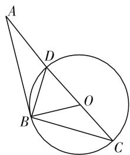
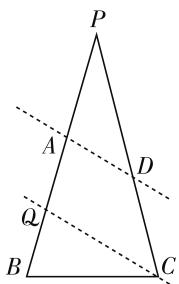
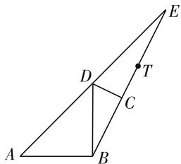

# 动中探定量 动中生精彩

——例析动态三角形中的取值范围问题求解策略

# ● 福建省莆田第二中学 蔡海涛

纵观近几年高考解三角形试题,动态三角形问题频频出现,这类问题呈现形式丰富多彩,图形特征因点的运动变化精彩纷呈,因“运动”而精彩,在动中探求定量的过程中彰显数学之美,令人赏心悦目.这类问题具有一定的综合性、交汇性,解题入口比较宽、方法多样,有一定的趣味性.

# 一、谋“定”后“动”

在“动”的条件中去探究最值这个“定”的结果,先探究动点运动变化的规律,从中得到“定”的规律,即得到动点运动变化的轨迹,进而求变量的取值范围.这种谋“定”后“动”的解题策略,一般可以通过数形结合,得到取得最值的位置,求解过程简洁明了.学生在观察图形的运动变化中、数与形的巧妙结合中领略数学的魅力,体会数学的和谐美.

例 1 在 $\triangle ABC$ 中, 角 A, B, C 的对边分别为 a, b, c, 若 $B = 60^{\circ}, b = 2$ , 则 $\triangle ABC$ 面积的最大值为 \_\_\_\_.

解析:由正弦定理得 $\triangle ABC$ 外接圆的直径 $2R = \frac{b}{\sin B} = \frac{4\sqrt{3}}{3}$ 为定值. 设该外接圆的圆心为 O, 当 $BO \perp AC$ 时, $\triangle ABC$ 面积取得最大值. 此时, $\triangle ABC$ 为正三角形, 易求得最大值为 $\sqrt{3}$ .

评析:在本题中,AC 边定,由于它的对角 B 也定,所以 $\triangle ABC$ 的外接圆的大小确定.一般地,在 $\triangle ABC$ 中,当一条边和它的对角确定时,这个三角形的外接圆大小确定,根据这个性质,可以使解三角形问题简化.

例 2 $\triangle ABC$ 的内角 A, B, C 的对边分别为 a, b, c，若 $b = 2, a = \sqrt{2}c$ ，求 $\triangle ABC$ 面积的最大值.

解析:以直线 AC 为 x 轴, AC 的中点 O 为原点建立平面直角坐标系, 易得点 B 的轨迹方程为 $(x - 3)^{2} + y^{2} = 8 (y \neq 0)$ .

故点 B 的轨迹为以 $M(3,0)$ 为圆心， $2\sqrt{2}$ 为半径的圆(除去与 x 轴的交点)，则当 $BM \perp AC$ 时， $S_{\triangle ABC}$ 取得最大值. 此时， $B(3,2\sqrt{2})$ ， $(S_{\triangle ABC})_{\max}=2\sqrt{2}$ .

评析: $\triangle ABC$ 的几何特征是AC边确定,故只需求出动点B到AC边的距离最值即可,而由 $|BC|=\sqrt{2}|BA|$ 可得动点B的轨迹是阿波罗尼斯圆,从而本题获解.以阿波罗尼斯圆为背景的试题在高考中多次出现.

例 3 $\triangle ABC$ 的内角 A, B, C 的对边分别为 a, b, c，若 $a = 2, b + c = 4$ ，求 $\triangle ABC$ 面积的最大值.

解析:以直线 BC 为 x 轴, BC 的中点 O 为原点建立平面直角坐标系, 由已知易得动点 A 的轨迹方程为 $\frac{x^{2}}{4} + \frac{y^{2}}{3} = 1 (y \neq 0)$ , 当 A 在椭圆短轴顶点时, $\triangle ABC$ 的面积取得最大, 易求得 $(S_{\triangle ABC})_{\max} = \sqrt{3}$ .

评析:由 a=2 得 $\triangle ABC$ 的 BC 边确定,由动点 A 到定点 B、C 距离之和为定值得到动点 A 的轨迹为椭圆,从而问题得以解决.

例 4 已知在 $\triangle ABC$ 中, D 在边 AC 上, AC = 3BD, 且 $BC \perp BD$ , 求角 A 的最大值.

解析:由 $BC \perp BD$ 可知 B, C, D 三点在以 CD 为直径的圆上, 设该圆的圆心为 O, 显然当 AB 与该圆相切时, 角 A 取得最大值. 如图 1, 设圆 O 的半径为 r, BD = m, 由 $\triangle ABO \sim \triangle CBD$ 得 $\frac{AO}{CD} = \frac{BO}{BD}$ , 则 $\frac{3m - r}{2r} = \frac{r}{m}$ , 解得 r = m, 则易求得 $A = 30^{\circ}$ .

text_image

Geometric diagram showing a circle with points A, B, C, D, and center O, including chords and triangles.

图1

评析:本题以 $BC \perp BD$ 条件为突破口,得到动点 B,C,D 三点的相对运动轨迹,进而考虑点 A 取得最值的位置,从而求得角 A 的最大值.

在以上的题组中,解题策略是引导学生先从“动”的现象中发现“定”的本质,先求出动点的轨迹图形,再从“定”的本质中探索“动”的规律.

# 二、移“动”为“定”

动态问题可以化归为静态问题来解决,动点在移动的过程中,先注意观察动点的特殊位置或特殊情形,再结合动点的变化规律,得到所求取值范围的端点值.动点在移动的过程中,因平移变换不改变图形的形状和大小,所以可以把一个复杂的图形,化归到简单的位置来处理.利用特殊化思想对动点进行探路,可把动点移动到临界位置,使得问题简化,彰显数学的简洁美.

例 5 （2015 年高考新课标全国卷 I · 理 16）在平面四边形 ABCD 中， $\angle A = \angle B = \angle C = 75^{\circ}, BC = 2$ ，则 AB 的取值范围是 \_\_\_\_。

解析: 如图 2, 作出 $\triangle PBC$ , 使 $\angle B = \angle C = 75^{\circ}$ , BC = 2, 作出直线 AD 分别交线段 PB、PC 于 A、D 两点 (不与端点重合), 且使 $\angle BAD = 75^{\circ}$ , 则四边形 ABCD 就是符合题意的四边形, 过 C 作 AD 的平行线交 PB 于点 Q, 在 $\triangle PBC$ 中, 可求得 $BP = \sqrt{6} + \sqrt{2}$ , 在 $\triangle QBC$ 中, 可求得$BQ=\sqrt{6}-\sqrt{2}$ ，所以 AB 的取值范围为 $(\sqrt{6}-\sqrt{2},\sqrt{6}+\sqrt{2})$ .

text_image

P
A
D
Q
B
C

图2

评析:在平面四边形 ABCD 中,BC 边先确定,先作出 $\triangle PBC$ 及符合题意的四边形 ABCD,在这个四边形中,AD 边动,在移动中,寻找极限的位置得到 AB 的取值范围.

例 6 如图 3, 在平面四边形 ABCD 中, $\angle A = 45^{\circ}$ , $\angle B = 120^{\circ}$ , $AB = \sqrt{2}$ , AD = 2, 设 CD = t, 则 t 的取值范围是 \_\_\_\_.

text_image

Geometric diagram with labeled points A, B, C, D, E, and T, showing triangles and line segments

图3

解析: 在 $\triangle ABD$ 中, 易得 $BD=\sqrt{2}$ ，则 $\triangle ABD$ 为等腰直角三角形， $\angle ABD=90^{\circ}$ ， $\angle DBC=30^{\circ}$ ，所以点 C 在射线 BT 上运动（如图4），当 $DC\perp BT$ 时，CD 最短，为 $\frac{\sqrt{2}}{2}$ ;

当 $A, D, E$ 共线时，由正弦定理可得 $\frac{AE}{\sin 120^\circ} = \frac{AB}{\sin 15^\circ}$ ，解得 $AE = 1 + \sqrt{3}$ ，则 $t$ 的取值范围为 $\left[\frac{\sqrt{2}}{2}, \sqrt{3} + 1\right)$ .

评析:在平行四边形 ABCD 中, $\triangle ABD$ 确定,由点 C 在射线 BT 上运动来确定取得最值的极限位置，从而求得 CD 的取值范围.

# 三、“动”中觅“定”

动态三角形中的最值问题,即动点在运动变化中存在最值,从函数的观点理解,这其中必然存在某个函数关系,解题关键是如何选择合适参数作为自变量,建立目标函数.对于比较复杂的图形,要注意分析联系多个三角形的边、角关系进行转化,转化为两个变量之间的函数关系,进而求函数的最值,渗透了数学的抽象之美.

例 7 （2018 年高考江苏卷·13）在 $\triangle ABC$ 中，角 A, B, C 所对的边分别为 a, b, c, $\angle ABC = 120^{\circ}$ , $\angle ABC$ 的平分线交 AC 于点 D，且 BD = 1，则 $4a + c$ 的最小值为 \_\_\_\_.

解析: 由面积相等得 $\frac{1}{2}ac\sin120^{\circ}=\frac{1}{2}a\sin60^{\circ}+\frac{1}{2}c\sin60^{\circ}$ ，化简得 $a+c=ac$ ，则 $c=\frac{a}{a-1}(a>1)$ ，4a + c = 4a + $\frac{1}{a-1}$ + 1 = 4(a - 1) + $\frac{1}{a-1}$ + 5 ≥ 2 $\sqrt{4(a-1)\cdot\frac{1}{a-1}}$ + 5 = 9，当且仅当 $a=\frac{3}{2}$ ，c = 3 时等号成立.

评析:根据面积相等得到a,c之间的关系,从而对目标函数进行消元转化,化为只含有a的式子,再利用基本不等式求得最小值.

# 四、写在最后

动态三角形问题直接求解往往比较困难,一般转化为定的轨迹或位置或函数.总之,就是化“动”为“定”,这其中蕴含了化归与转化的数学思想.

数学教学需要灵韵生动、意趣悠长. 动态三角形问题的教学, 教师应以“定”和“动”为主线, 让学生多参与, 在“变”和“不变”中积累数学活动经验, 从而激发学生思维的灵动, 从轨迹思想、极限思想、函数方程思想等方向思考解决问题的方法, 在求解过程去探索动定结合, 动中有定的数学美, 让学生真正爱上数学.

# 参考文献：

[1] 范世祥. 微专题三 解三角形 [J]. 中学数学教学参考 (上), 2018(1-2): 89-92.  
[2] 沈顺良. 例析 2016 年浙江数学高考试题解答中的化动为定 [J]. 教育月刊 (中学版), 2017(2): 82-84.