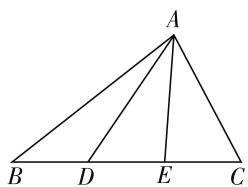
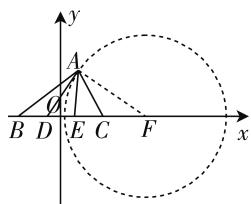
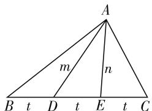

# 多思维切入,妙方法破解

—— 一道江苏向量题的探究

● 江苏省启东市吕四中学 彭剑平

平面向量一直是历年高考的一个重要知识点,是高考的热点问题之一,内涵丰富,难度中等,方式新颖,背景创新,变化多端,常考常新,是数学中知识交汇与能力融合的理想场所,是考试中充分体现能力齐全、方法多样、思维各异的主战场,具有很好的选拔性与区分度,倍受各方关注.

# 一、问题呈现

【问题】(2020届江苏省苏北四市(徐州、宿迁、淮安、连云港)高三上学期第一次质量检测(期末)数学试题·13)如图1，在 $\triangle ABC$ 中，D,E是BC 上的两个三等分点, $\overrightarrow{AB} \cdot \overrightarrow{AD} = 2\overrightarrow{AC} \cdot \overrightarrow{AE}$ , 则 $\cos \angle ADE$ 的最小值为 \_\_\_\_.

text_image

A
B D E C

图1

此题以三角形为载体, 结合三角形中的三等分点, 以及平面向量的数量积的关系式, 来确定相应的角的余弦值的最值问题, 巧妙地把三角形的相关性质、平面向量的数量积、解三角形等知识加以交汇与融合. 处理此类平面向量问题, 基底思维、坐标思维、几何思维是破解问题的最常见“三招”. 从而确定解决此类问题可以借助基底的选择加以线性运算, 可以通过坐标系的建立加以坐标的“数”的运算, 也可以通过几何图形加以“形”的转化, 都可以达到目的.

# 二、问题破解

# 思维视角一:基底思维

方法 1:(基底法 1——以 $\overrightarrow{DA},\overrightarrow{DE}$ 为一组基底)

解析:由于 D, E 是 BC 上的两个三等分点, 则有 $\overrightarrow{BD} = \overrightarrow{DE} = \overrightarrow{EC}$ , 结合图形可得 $\overrightarrow{AB} = \overrightarrow{DB} - \overrightarrow{DA} = -\overrightarrow{DE} - \overrightarrow{DA}, \overrightarrow{AC} = \overrightarrow{DC} - \overrightarrow{DA} = 2\overrightarrow{DE} - \overrightarrow{DA}, \overrightarrow{AE} = \overrightarrow{DE} - \overrightarrow{DA}$ , 结合 $\overrightarrow{AB} \cdot \overrightarrow{AD} = 2\overrightarrow{AC} \cdot \overrightarrow{AE}$ , 可得 $(-\overrightarrow{DE} - \overrightarrow{DA}) \cdot (-\overrightarrow{DA}) = 2(2\overrightarrow{DE} - \overrightarrow{DA}) \cdot (\overrightarrow{DE} - \overrightarrow{DA})$ , 整理可得 $7\overrightarrow{DA} \cdot \overrightarrow{DE} = \overrightarrow{DA}^{2} + 4\overrightarrow{DE}^{2}$ , 所以 $\cos\angle ADE = \cos\langle\overrightarrow{DA}, \overrightarrow{DE}\rangle = \frac{\overrightarrow{DA} \cdot \overrightarrow{DE}}{|\overrightarrow{DA}| |\overrightarrow{DE}|} = \frac{|\overrightarrow{DA}|^{2} + 4|\overrightarrow{DE}|^{2}}{7|\overrightarrow{DA}| |\overrightarrow{DE}|}$

$\geqslant\frac{2\sqrt{|\overrightarrow{DA}|^{2}\times4|\overrightarrow{DE}|^{2}}}{7|\overrightarrow{DA}||\overrightarrow{DE}|}=\frac{4}{7}$ ，当且仅当 $|\overrightarrow{DA}|^{2}=4|\overrightarrow{DE}|^{2}$ ，即 $|\overrightarrow{DA}|=2|\overrightarrow{DE}|$ 时等号成立，故填答案： $\frac{4}{7}$ .

点评:根据题目条件,选择两个不共线的平面向量作为平面的一组基底,线性表示出其他相关的平面向量,再利用平面向量的夹角公式表示出对应角的余弦值,结合关系式的转化与变形,利用基本不等式来确定最小值.基底的选择各有侧重,没有统一标准,不同基底选择决定不同的数学运算量,这是破解此类问题的常规方法.

# 思维视角二:坐标思维

方法 2: (直线与圆的位置关系法)

解析:以 BC 的中点 O 为坐标原点, BC 所在直线为 x 轴建立平面直角坐标系, 如图 2 所示, 不失一般性, 设 $\left|BC\right|=6$ , 则 $B(-3,0)$ , $C(3,0)$ , $D(-1,0)$ , $E(1,0)$ , 设 $A(x,y)$ , 结合 $\overrightarrow{AB} \cdot \overrightarrow{AD}=$ $2\overrightarrow{AC}\cdot\overrightarrow{AE}$ ，整理可得 $x^{2}+y^{2}-12x+3=0(y\neq0)$ ，配方有 $(x-6)^{2}+y^{2}=33(y\neq0)$ ，则知点A在以 $F(6,0)$ 为圆心，半径为 $\sqrt{33}$ 的圆上（不包括x轴上的点），结合图形可知当DA与圆F相切时， $\angle ADE$ 取得最大值，此时 $\cos\angle ADE$ 取得最小值，此时 $\angle DAF=90^{\circ}$ ， $|DF|=7,\quad|AF|=\sqrt{33}$ ，可得 $|AD|=4$ ，则有 $\cos\angle ADE=\frac{4}{7}$ ，所以 $\cos\angle ADE$ 的最小值为 $\frac{4}{7}$ ，故填答案： $\frac{4}{7}$ .

text_image

y
A
O
B D E C F x

图 2

方法 3: (代数法)

解析: 同以上方法部分, 可得 $(x-6)^{2}+y^{2}=33(y \neq 0)$ , 而 $\overrightarrow{DA}=(x+1,y),\overrightarrow{DE}=(2,0)$ , 可得:

$$
\begin{array}{l} \cos \angle A D E = \cos \langle \overrightarrow {D A}, \overrightarrow {D E} \rangle = \frac {\overrightarrow {D A} \cdot \overrightarrow {D E}}{| \overrightarrow {D A} | | \overrightarrow {D E} |} \\ = \frac {2 x + 2}{2 \sqrt {(x + 1) ^ {2} + y ^ {2}}} = \frac {x + 1}{\sqrt {1 4 x - 2}} \\ = \frac {7 x - 1 + 8}{7 \sqrt {2} \cdot \sqrt {7 x - 1}} = \frac {\sqrt {7 x - 1}}{7 \sqrt {2}} + \frac {8}{7 \sqrt {2} \cdot \sqrt {7 x - 1}} \\ \end{array}
$$

$\geqslant2\sqrt{\frac{\sqrt{7x-1}}{7\sqrt{2}}}\times\frac{8}{7\sqrt{2}\cdot\sqrt{7x-1}}=\frac{4}{7}$ ，当且仅当 $\frac{\sqrt{7x-1}}{7\sqrt{2}}=\frac{8}{7\sqrt{2}\cdot\sqrt{7x-1}}$ ，即 $x=\frac{9}{7}$ 时等号成立，故填答案： $\frac{4}{7}$ .

点评:根据题目条件建立适当的平面直角坐标系,从坐标角度切入,利用已知的数量积的关系式确定点A的轨迹方程为一个定圆,进而可以借助直线与圆的位置关系法来数形结合直观确定相应角的余弦值的最小值;也可以借助平面向量的夹角公式,通过坐标转化利用基本不等式来确定相应角的余弦值的最小值.坐标思维处理是破解平面向量问题中的一大利器,借助平面直角坐标系的建立,通过坐标运算来转化.

# 思维视角三:几何思维

方法 4: (几何法)

解析：如图3所示，设 $|AD|=m,\quad|AE|=n,$ $|BD|=|DE|=|EC|=t$ ，在 $\triangle ABE$ 中，AD为BE边的中线，结合三角形的中线长定理，可得 $c^{2}+n^{2}=2m^{2}+2t^{2}$ 即 $c^{2}=2m^{2}+2t^{2}-n^{2}$ ，同理可得 $b^{2}=2n^{2}+2t^{2}-m^{2}$ ，结合 $\overrightarrow{AB}\cdot\overrightarrow{AD}=2\overrightarrow{AC}\cdot\overrightarrow{AE}$ 及余弦定理，可得 $cm\cdot\frac{c^{2}+m^{2}-t^{2}}{2cm}=2bn\cdot\frac{b^{2}+n^{2}-t^{2}}{2bn}$ ，整理有 $c^{2}+m^{2}=2b^{2}+2n^{2}-t^{2}$ ，将 $c^{2}=2m^{2}+2t^{2}-n^{2}$ 和 $b^{2}=2n^{2}+2t^{2}-m^{2}$ 代入上式，整理可得 $5m^{2}=7n^{2}+t^{2}$ ，在 $\triangle ADE$ 中，结合余弦定理，可得 $\cos\angle ADE=\frac{m^{2}+t^{2}-n^{2}}{2mt}=\frac{m^{2}+t^{2}-\frac{5m^{2}-t^{2}}{7}}{2mt}=\frac{m^{2}+4t^{2}}{7mt}\geqslant\frac{2\sqrt{m^{2}\times4t^{2}}}{7mt}=\frac{4}{7}$ ，当且仅当 $m^{2}=4t^{2}$ ，即 m=2t 时等号成立，故填答案： $\frac{4}{7}$ .

text_image

A
m
n
B t D t E t C

图 3

点评:根据题目条件中的图形特征,结合三角形中的中线长定理建立相应的关系式,借助题目中的平面向量的数量积的关系式,利用数量积定义与余弦定

理来建立关系式, 进而得到相关参数之间的等量关系, 最后利用余弦定理来确定对应的余弦值, 并借助基本不等式来确定最小值. 根据平面几何的特征, 通过平面几何的相关定理与解三角形知识来综合处理, 也是一种破解此类问题的不错的选择.

# 三、变式拓展

探究 1:保留原来题目的所有条件,对于相应的角的余弦值的最值的求解中改变相应的角的名称,从而得以变式与拓展.

【变式 1】如图 3, 在 $\triangle ABC$ 中, D, E 是 BC 上的两个三等分点, $\overrightarrow{AB} \cdot \overrightarrow{AD} = 2\overrightarrow{AC} \cdot \overrightarrow{AE}$ , 则 $\cos B$ 的最小值为 \_\_\_\_.

解析: 由于 D, E 是 BC 上的两个三等分点, 则有 $\overrightarrow{AD} = \frac{2}{3}\overrightarrow{AB} + \frac{1}{3}\overrightarrow{AC}, \overrightarrow{AE} = \frac{1}{3}\overrightarrow{AB} + \frac{2}{3}\overrightarrow{AC}$ , 结合 $\overrightarrow{AB} \cdot \overrightarrow{AD} = 2\overrightarrow{AC} \cdot \overrightarrow{AE}$ , 可得 $\overrightarrow{AB} \cdot \left(\frac{2}{3}\overrightarrow{AB} + \frac{1}{3}\overrightarrow{AC}\right) = 2\overrightarrow{AC} \cdot \left(\frac{1}{3}\overrightarrow{AB} + \frac{2}{3}\overrightarrow{AC}\right)$ , 整理可得 $2\overrightarrow{AB^{2}} = \overrightarrow{AB} \cdot \overrightarrow{AC} + 4\overrightarrow{AC^{2}}$ , 结合余弦定理可得 $2c^{2} = bc \cdot \frac{b^{2} + c^{2} - a^{2}}{2bc} + 4b^{2}$ , 整理有 $9b^{2} = a^{2} + 3c^{2}$ , 在 $\triangle ABC$ 中, 结合余弦定理, 可得 $\cos B = \frac{a^{2} + c^{2} - b^{2}}{2ac} = \frac{a^{2} + c^{2} - \frac{a^{2} + 3c^{2}}{9}}{2ac} = \frac{4a^{2} + 3c^{2}}{9ac} \geqslant \frac{2\sqrt{4a^{2} \times 3c^{2}}}{9ac} = \frac{4\sqrt{3}}{9}$ , 当且仅当 $4a^{2} = 3c^{2}$ , 即 $a = \frac{\sqrt{3}}{2}c$ 时等号成立, 故填答案: $\frac{4\sqrt{3}}{9}$ .

# 四、解后反思

其实,涉及平面向量问题,我们要深入理解与熟练掌握以上三种破解此类问题的常用方法与常见技巧.在破解平面向量问题时,基底法是破解的重点,需要通过平面向量的线性关系的转化来理清;而涉及直角或相关问题时要通过坐标法,利用平面直角坐标系的坐标来进行代数运算处理;而涉及一些基本几何图形问题时可以通过几何法借助几何图形加以数形直观处理,综合平面几何的相关性质来处理与解决.因而,涉及平面向量的问题,能有效达到命题的多知识融合,思维的多角度切入,破解的多方法处理,探究的多方向拓展,是考查数学知识、数学能力、核心素养的好阵地.F