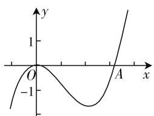
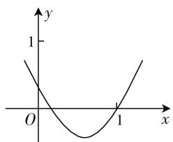
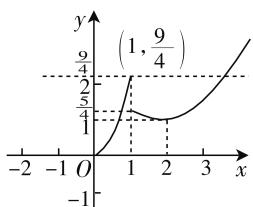

# 巧妙互化,和谐统一

—— 函数与方程

# ● 江苏省海安市南莫中学 孙桂兰

函数与方程,两者密切相关,唇齿相依,休戚与共.在解决一些相关的数学问题时,经常对函数问题方程化处理,或方程问题函数化处理,演绎出精彩绝伦、引人入胜、波澜起伏、惊心动魄的一出出“好戏”.

# 一、函数问题方程化

# 1. 零点求解问题

例 1 （2014年高考数学湖北卷文科第9题）已知 $f(x)$ 是定义在 R 上的奇函数，当 $x \geqslant 0$ 时， $f(x) = x^{2} - 3x$ ，则函数 $g(x) = f(x) - x + 3$ 的零点的集合为（）.

A. $\{1,3\}$

B. $\{-3,-1,1,3\}$

C. $\{2-\sqrt{7},1,3\}$

D. $\{-2-\sqrt{7},1,3\}$

分析:先结合函数的基本性质确定对应的函数解析式,函数问题方程化,通过分类讨论,分别在自变量不同取值范围内求解相应的方程,进而确定相应的零点即可.

解: 设 x<0，则 -x>0，所以 $f(x)=-f(-x)=-\left[(-x)^{2}-3(-x)\right]=-x^{2}-3x$ ，那么函数 $g(x)=f(x)-x+3$ 的零点等价于方程 $f(x)=-3+x$ 的解.

当 $x \geqslant 0$ 时，由方程 $x^{2} - 3x = -3 + x$ ，解得 $x_{1} = 3, x_{2} = 1$ ;

当 x<0 时，由方程 $-x^{2}-3x=-3+x$ ，解得 $x_{3}=-2-\sqrt{7}$ .

故选择答案:D.

点评:解决此类函数零点的求解问题时,往往综合函数的奇偶性、单调性等,综合函数的解析式的变化与应用,转化为相应的方程,利用方程的求解来达到目的,经常涉及数形结合思想、化归与转化思想等.

# 2. 零点个数问题

例 2 （2019 年高考数学全国卷 Ⅲ 文科第 5 题）函数 $f(x)=2\sin x-\sin 2x$ 在 $[0,2\pi]$ 上的零点个数为（）.

A. 2

B. 3

C. 4

D. 5

分析:借助二倍角公式,结合因式分解,把对应的函数问题方程化,利用在确定条件下方程的求解及方程的根的情况,得以准确确定函数的零点个数.

解:由于函数 $f(x)=2\sin x-\sin 2x=2\sin x-2\sin x\cos x=2\sin x(1-\cos x)$ ，令 $f(x)=0$ ，解方程得 $\sin x=0$ 或 $1-\cos x=0$ ，可得 $\sin x=0$ 或 $\cos x=1$ ，由于 $x\in[0,2\pi]$ ，解得 $x=0,\pi,2\pi$ ，即函数 $f(x)=2\sin x-\sin 2x$ 在 $[0,2\pi]$ 上的零点个数有 3 个.

故选择答案:B.

点评:在正确判断对应函数的零点个数问题时,经常借助函数问题方程化,通过求解对应的方程,来达到解决函数的零点个数问题的目的.有时也会结合函数的解析式进行合理转化,利用两个基本函数图像的交点个数来直观分析与判定.

# 3. 参数取值问题

例 3 （2019 年高考数学浙江卷第 9 题）已知 $a, b \in R$ ，函数 $f(x) = \begin{cases} x (x < 0), \\ \frac{1}{3} x^{3} - \frac{1}{2} (a + 1) x^{2} + ax (x \geqslant 0), \end{cases}$ 若
函数 $y = f(x) - ax - b$ 恰有三个零点，则（）.

A. a < -1, b < 0

B. $a < -1, b > 0$

C. a > -1, b < 0

D. $a > -1, b > 0$

分析: 分别结合分段函数的条件, 在 x<0 与 $x \geqslant 0$ 条件下, 利用函数 $y = f(x) - ax - b$ 恰有三个零点的条件, 结合对应函数转化为相应的方程, 分离参数, 结合函数的图像与性质加以确定参数的取值范围问题.

解: 当 x<0 时, 结合 $y=f(x)-ax-b=0$ , 可得 $x-ax-b=0$ , 即 $x=\frac{b}{1-a}$ , 则其最多一个零点, 当 $x=\frac{b}{1-a}<0$ 时才有一个零点;

line

| x    | y     |
| ---- | ----- |
| 0    | 0     |
| -1   | -1    |
| 1    | 1     |

图 1

当 $x \geqslant 0$ 时，结合 $y = f(x) - ax - b = 0$ ，可得 $\frac{1}{3} x^3 - \frac{1}{2}(a + 1)x^2 + ax - ax - b = 0$ ，即 $b = \frac{1}{3} x^3 - \frac{1}{2}(a + 1)x^2 = \frac{1}{3} x^2\left[x - \frac{3}{2}(a + 1)\right] = g(x)$ ，如图1所示，结合三次函数 $g(x)$ 的图像知，当 $x = \frac{3}{2}(a + 1) > 0$ 时才有可能满足条件，解得 $a > -1$ ，要使得此时函数 $y = b$ 与 $y = g(x)$ 至少有两个交点，则 $b < 0$

故选择答案:C.

点评:通过函数问题的零点情况加以方程化.涉及函数的零点个数情况来确定相关参数的取值范围问题,往往结合相应已知函数的图像,利用数形结合思维,通过零点个数进行数形结合来确定参数的取值范围.

# 二、方程问题函数化

# 1. 零点区间判定

例 4 已知函数 $f(x)=x^{2}-bx+a$ 的图像如图 2 所示，则方程 $\ln x+f'(x)=0$ 的根所在的区间是().

A. $\left(\frac{1}{4},\frac{1}{2}\right)$

B. $\left(\frac{1}{2},1\right)$

C. $(1,2)$

D. $(2,3)$

line

| x | y |
|---|---|
| 0 | 1 |
| 1 | 0 |

图2

分析:求解方程的根所在的区间,可以把方程问题函数化,转化为确定函数 $g(x)=\ln x+2x-b$ 的零点所在的区间,利用函数值的正负取值情况加以判断即可.

解:依题目的函数图像,可知 $f(x)$ 的对称轴为 $x=\frac{b}{2}\in\left(\frac{1}{2},1\right)$ ，则 1<b<2，设函数 $g(x)=\ln x+2x-b$ ，则 $g\left(\frac{1}{4}\right)=-2\ln2+\frac{1}{2}-b<0$ ， $g\left(\frac{1}{2}\right)=-\ln2+1-b<0$ ， $g(1)=2-b>0$ ，故函数 $g(x)=\ln x+2x-b$ 的零点所在的区间是 $\left(\frac{1}{2},1\right)$ ，即方程 $\ln x+f'(x)=0$ 的根所在的区间是 $\left(\frac{1}{2},1\right)$ .

故选择答案:B.

点评:方程的根与函数的零点之间往往可以合理转化,特别在处理一些抽象方程或含有参数的方程的根的问题时,经常可以方程问题函数化,转化为相应的函数问题,利用函数的解析式、图像、基本性质等加以合理转化,巧妙应用.

# 2. 参数取值问题

例 5 （2019 年高考数学天津卷文科第 8 题）已知
函数 $f(x)=\left\{\begin{aligned}&2\sqrt{x}(0\leqslant x\leqslant1),\\ &\frac{1}{x}(x>1)\end{aligned}\right.$ 若关于 x 的方程 $f(x)=-\frac{1}{4}x+a(a\in\mathbf{R})$ 恰有两个互异的实数解，则a的取值范围为().

A. $\left[\frac{5}{4},\frac{9}{4}\right]$

B. $\left(\frac{5}{4},\frac{9}{4}\right]$

C. $\left(\frac{5}{4},\frac{9}{4}\right]\cup\{1\}$

D. $\left[\frac{5}{4},\frac{9}{4}\right]\cup \{1\}$

分析:通过对应方程的转化得到新的分段函数,结合分类讨论,根据函数的单调性作出函数的图像,判断函数 $a=f(x)$ 的交点情况,结合根的个数来确定参数a的取值范围.

解: 因为关于 x 的方程 $f(x) = -\frac{1}{4}x + a$ 恰有两个互异的实数解, 即方程 $f(x) + \frac{1}{4}x = a$ 恰有两个互异的实数解.

line

| x | y |
|---|---|
| 0 | -1 |
| 1 | 9/4 |
| 2 | 5/4 |
| 3 | 9/4 |

图3

则 $f(x) + \frac{1}{4} x =$ $\left\{ \begin{array}{l}2\sqrt{x} +\frac{x}{4} (0\leqslant x\leqslant 1),\\ \frac{1}{x} +\frac{x}{4} (x > 1). \end{array} \right.$

① 当 $0 \leqslant x \leqslant 1$ 时，令 $t = \sqrt{x} (0 \leqslant t \leqslant 1)$ ，则 $2\sqrt{x} + \frac{x}{4} = 2t + \frac{t^2}{4} = \frac{1}{4}(t^2 + 8t) = \frac{1}{4}(t + 4)^2 - 4$ ，当 $0 \leqslant t \leqslant 1$ 时，此函数为增函数；  
② 当 x > 1 时， $\frac{1}{x} + \frac{x}{4} = \frac{1}{4}\left(x + \frac{4}{x}\right)$ ，在 $(1,2)$ 上单调递减，在 $(2,+\infty)$ 上单调递增；则 x = 2 时，取得最小值为 $\frac{1}{2} + \frac{2}{4} = 1$ .

根据图像,直观分析得,当a=1时,有两个互异的实数解;当 $\frac{5}{4}\leqslant a\leqslant\frac{9}{4}$ 时,有两个互异的实数解.

故选择答案:D.

点评:此类涉及分段函数背景的函数与方程的交汇问题,利用方程问题函数化,进而通过分类讨论,结合函数的单调性、图像等来综合分析,可以用来综合解决一些相关的问题.这也是方程问题函数化的一大常见题型,一直是高考的热点之一,备受命题者青睐,是历年高考常考常新、百考不厌的题型.