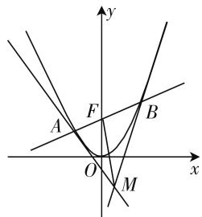
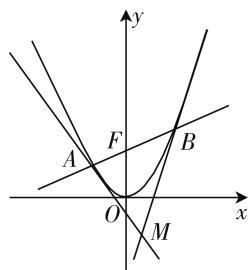
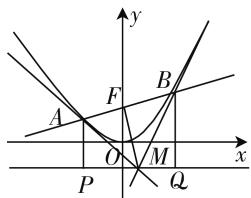

# 感知·感悟 探究·素养

—— 一道高考试题的多视角剖析

# ● 福建省厦门大学附属科技中学 胡学贵

随着每年高考帷幕的落下,一些精品试题便成为广大数学教师研究的重点对象,成为课堂探究的热门话题.探究高考真题是高三复习中不可或缺的精神食粮,对学生基础知识的巩固、解题能力的提升及数学思维的启迪有着举足轻重的作用.通过全国和部分省市高考试题这座丰厚的“精神宝库”为学生的解题“高屋建瓴”,让数学课堂更具“动感”,同时展现教师精湛的专业素养.

在高考复习时,笔者选中这道“陈年”高考试题,起初不以为然,但随着形式化的探究产生了感性基础,生成了理性的升华,深化了数学本质.现将对本题的探究过程整理成文,与各位同仁分享.

# 一、呈现问题: 感知常规

题目 已知 F 为抛物线 $x^{2}=4y$ 的焦点，且 A, B 为抛物线上的两个动点，有 $\overrightarrow{AF}=\lambda\overrightarrow{FB}(\lambda>0)$ ，分别过点 A, B 作抛物线的切线，若设交点为 M.

(1) 证明: $\overrightarrow{FM} \cdot \overrightarrow{AB}$ 是定值.   
(2) 若 $\triangle ABM$ 的面积为 S，试写出 $S = f(\lambda)$ 的表达式，并求出 S 的最小值.

本题为一道综合题,融不等式、向量、函数、导数等主干知识为一体,旨在考查学生的融会贯通和迁移应用,题目一目了然,给人感觉也是简单而熟悉.本题一经抛出,学生解决起来也是得心应手,第(1)问不难证得 $\overrightarrow{FM}\cdot\overrightarrow{AB}=0$ ,即可得出 $FM\perp AB$ .继而解决第(2)问也较为顺利.如果探究就此收场,那么此题的探究价值就极其有限了.

# 二、聚焦问题:集思广益

# 1. 从特殊到一般

为了让本题的探究更富有价值,笔者决定陪伴学生一同细致探究,于是提出:本题中的结论具有一般性吗?若变题目中的抛物线 $x^{2}=4y$ 为 $x^{2}=2py(p>0)$ ,结论(1)是否还能成立?

学生经过思考,很快得出以下命题:

命题 1: 已知 F 为抛物线 $x^{2}=2py(p>0)$ 的焦点, 且 A, B 为抛物线上的两个动点, 有 $\overrightarrow{AF}=\lambda\overrightarrow{FB}(\lambda)$

$>0)$ , 分别以 A, B 为切点作抛物线的切线, 并设交点为 M.

证明: $\overrightarrow{FM}\cdot\overrightarrow{AB}$ 是定值.

证明：如图1，据 $\overrightarrow{AF} = \lambda \overrightarrow{FB} (\lambda >0)$ ，可得直线 $AB$ 过抛物线 $x^{2} = 2py$ 的焦点 $F\left(0,\frac{p}{2}\right).$

text_image

y
A F B
O M
x

图1

设 $A(x_{1},y_{1}),B(x_{2},y_{2})$ ，则有 $\overrightarrow{FA} =$ $\left(x_1,y_1 - \frac{p}{2}\right),\overrightarrow{FB} = \left(x_2,y_2 - \frac{p}{2}\right)$ .又有 $\overrightarrow{FA} / / \overrightarrow{FB}$ 可得 $x_{1}\left(y_{2} - \frac{p}{2}\right) - x_{2}\left(y_{1} - \frac{p}{2}\right) = 0$ ，且 $x_{1}\neq x_{2}$ ，化简可得 $x_{1}x_{2} = -p^{2}$ .由 $x^{2} = 2px$ ，可得 $y = \frac{x^2}{2p}$ ，两侧同时对 $x$ 求导，可得 $y^\prime = \frac{x}{p}$ 则抛物线 $x^{2} = 2px$ 在点 $A(x_{1},y_{1})$ 的切线斜率为 $\frac{x_1}{p}$ ，切线AM的方程为 $y-$ $\frac{x_1^2}{2p} = \frac{x_1}{p}(x - x_1)$ ，即 $y = \frac{x_1}{p} x - \frac{x_1^2}{2p}$ ①，同理可得切线BM的方程为 $y = \frac{x_2}{p} x - \frac{x_2^2}{2p}$ ②，①-②可得 $\frac{1}{p} (x_1-$ $x_{2})x - \frac{1}{2p}(x_{1}^{2} - x_{2}^{2}) = 0,x_{1}\neq x_{2}$ ，化简可得 $x=$ $\frac{x_1 + x_2}{2}$ ，可得点 $M$ 的坐标为 $\left(\frac{x_1 + x_2}{2}, - \frac{p}{2}\right)$ 所以 $\overrightarrow{FM} = \left(\frac{x_1 + x_2}{2}, - p\right)$ .又 $\overrightarrow{AB} = (x_1 - x_2,y_1-$ $y_{2})$ ，所以 $\overrightarrow{AB}\cdot \overrightarrow{PM} = \frac{x_1^2 - x_2^2}{2} = p(y_1 - y_2) =$ $\frac{2py_1 - 2py_2}{2} -p(y_1 - y_2) = 0.$

评析:可见,从特殊到一般是一种具有普遍性的思维方法,这样的解题思路对新结论和新成果的产生往往容易奏效,通常也是高考命题的惯用手法.

# 2. 新结论的探索

正待探究即将收场之际,一名学生举手提问:“老师,这里以 A,B 为切点的切线相交于点 M,那么当点 A,B 运动时,动点 M 的轨迹又是怎么样的呢?”该生提出的问题具有一定的探究价值,于是,课堂又进入了火热的探究,学生经过一番思考和讨论得出以下结论:

命题 2: 已知 F 为抛物线 $x^{2}=2py(p>0)$ 的焦点, 且 A, B 为抛物线上的两个动点, 有 $\overrightarrow{AF}=\lambda\overrightarrow{FB}(\lambda>0)$ , 分别以 A, B 为切点作抛物线的切线, 并设交点为 M.

证明:动点 M 的轨迹为一条定直线.

证明:如图2,据命题1的证明过程,由① $\times x_{2}-②\times x_{1}$ ，可得 $(x_{2}-x_{1})y=\frac{x_{1}x_{2}}{2p}(x_{2}-x_{1})=-\frac{p}{2}(x_{2}-$

text_image

y
A
F
B
O
x
M

图 2

$x_{1}$ ). 又因为 $x_{1} \neq x_{2}$ ，则有 $y = -\frac{p}{2}$ ，所以动点 M 的轨迹为一条定直线，且为抛物线的准线 $y = -\frac{p}{2}$ .

评析:事实上,对于这样的轨迹问题学生并不陌生,这一问题也是解析几何的基本问题和重点问题.通过深入研究和发散思维,学生从对原题的探究中跨越到一个更高层次的研究领域,今后应用此种方法求证会更加得心应手.

# 3. 数形结合

问题已然解决,但笔者意犹未尽,适时继续引导:从上述两个命题和图形中,大家是否有什么新发现呢?在笔者的启发下,学生的思维闸门打开了,学生陆续得出 $AM \perp BM$ 这一结论,命题3应运而生.

命题 3: 已知 F 为抛物线 $x^{2}=2py(p>0)$ 的焦点, 且 A, B 为抛物线上的两个动点, 有 $\overrightarrow{AF}=\lambda\overrightarrow{FB}(\lambda>0)$ , 分别以 A, B 为切点作抛物线的切线, 并设交点为 M.

证明: $AM \perp BM.$

学生快速行动起来,很快就有学生通过平面几何法给出完整证明思路:

证明1:如图3,设抛物线 $x^{2}=2py(p>0)$ 的准线为 $l:y=-\frac{p}{2}$ .过点A作 $AP\perp l$ 于点P.据命题2可得 $\overrightarrow{FM}\cdot\overrightarrow{AB}=0$ ,则有 $FM\perp AB$ .据抛物线定义,可得 $|AP|=|FA|$ ,于是有 $Rt\triangle APM\cong Rt\triangle AFM$ ,则$\angle AMP = \angle AMF.$ 过点 B 作 $BQ \perp l$ 于点 Q，同理证得 $\angle BMQ = \angle BMF$ ，所以 $\angle AMB = \frac{\pi}{2}$ ，从而 $AM \perp BM.$

text_image

y
F
B
A
O
M
x
P
Q

图 3

此时有学生在小声嘀咕,这一题代数方法更为简捷,于是又得出以下代数证明法:

证明2:据命题1可得 $x_{1}x_{2}=-p^{2}$ .切线AM的斜率为 $k_{AM}=\frac{x_{1}}{p}$ ，切线BM的斜率为 $k_{BM}=\frac{x_{2}}{p}$ ，则有 $k_{AM}\cdot k_{BM}=\frac{x_{1}x_{2}}{p^{2}}=-1$ ，即有 $AM\perp BM$ .

评析:以上证法中,证明1以直观明了的平面几何法直击主题,使人一目了然;证明2则以简捷明快的代数方法自然呈现,通过数形结合的方法将数学魅力完美展现.

# 4. 类比催生新知

类比是数学发现和数学创造的又一途径. 众所周知, 圆锥曲线间存在诸多共同点, 是否可以将抛物线的相关结论迁移运用到圆锥曲线中呢? 由于下课将近, 笔者将后续的探究任务留给学生课后完成, 学生在课后的探究中获得多番结论.

# 三、统一认识:用好试题生成高效课堂

高考试题有着深厚的背景、新颖的问题情境、灵活的解题思路和较强的知识容量, 它可以帮助学生打开思维的闸门, 点燃灵感的火花, 拓宽思维的空间.

首先,教师需基于学生认知水平和教学目标精选习题,对基本题型有一定的了解,让所选习题承载更多方法价值,真正起到范例引领的作用,从而让学生从特定的数学问题解决中学会思考,有所领悟;其次,在探究中需给予学生足够的主动权,给予学生充足的时间去思考,让学生在思考后充分表达其思路,提升试题的利用价值;再次,解后反思和总结是解题教学的核心任务,让学生通过反思知识背景、能力要求、思想方法、思维视角等获取更多、更广的解题经验,助力学生的数学思考;最后,需对试题进行再加工和再创造,并留给学生课后反刍的思考空间,让试题生成“千锤万凿出深山”的优美姿态.因此,教师可以通过良好的教学设计,让学生经历方法获得的过程,积累解决问题经验,促进学生思维的发展,提升学生的数学素养.

总之,教师需从多方位、多角度入手,带领学生做好高考试题的研究,在提升自身专业素养的同时,提升学生的学习效率,提高高考的质量,让学生以饱满的热情跨入数学课堂,以充足的信心走进高考. F