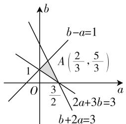
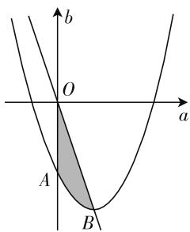
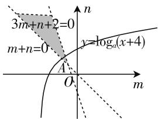

# 摭谈线性规划思想在解题中的应用

# 江苏省清浦中学 周海东

《简单的线性规划》是新课标教材的新增内容,该内容主要用于解决现实生活中的线性约束条件下的最优化问题,本文从思想方法的角度,谈谈线性规划作为一个特殊的数学工具在解题中的应用,供大家参考.

# 一、线性规划思想与解析几何

线性规划思想,其实质是数形结合思想.解析几何既有代数的运算特征,又有几何的逻辑推理特征,它是代数与几何的结合体.将线性规划思想应用于解析几何问题的解答中,顺理成章,别有一番风景.

例1 把不等式 $\frac{x^2}{a^2} +\frac{y^2}{b^2}\leqslant 1(a > b > 0)$ 所表示的平面区域记为 $D_{1}$ ，把不等式组 $\left\{\begin{aligned}&bx-cy+bc\geqslant0,\\ &bx-cy-bc\leqslant0,\\ &bx+cy-bc\leqslant0,\\ &bx+cy+bc\geqslant0\end{aligned}\right.$ 所表示的平面区域记为 $D_{2}$ ，其中 a, b, c 满足 $a^{2}=b^{2}+c^{2}(c>0)$ ，再把 $D_{1}$ 与 $D_{2}$ 的公共区域部分记为 D，且已知 D 的面积 S 是 $2\sqrt{3}$ ，圆 $x^{2}+y^{2}=\frac{3}{4}$ 与区域 D 内切于边界，那么椭圆 $C:\frac{x^{2}}{a^{2}}+\frac{y^{2}}{b^{2}}=1(a>b>0)$ 的离心率是 \_\_\_\_。

解析: 区域 $D_{1}$ 表示椭圆 $\frac{x^{2}}{a^{2}} + \frac{y^{2}}{b^{2}} \leqslant 1 (a > b > 0)$ 的内部及边界的点, 题目中的已知不等式组可化为$\left\{ \begin{array}{l} \frac{x}{-c} + \frac{y}{b} \leqslant 1, \\ \frac{x}{c} + \frac{y}{-b} \leqslant 1, \\ \frac{x}{c} + \frac{y}{b} \leqslant 1, \\ \frac{x}{-c} + \frac{y}{-b} \leqslant 1, \end{array} \right.$ 它表示对角线的长分别是 $2a$ 和 $2b$

的菱形及其内部的点,由于 a > b, a > c, 故平面区域 D 表示的平面图形是以 2b, 2c 为对角线长的菱形及菱形的内部, 它的面积 $S=\frac{1}{2}\times2b\times2c=2bc=2\sqrt{3}$ , 所以 $bc=\sqrt{3}$ . 又因为圆 $x^{2}+y^{2}=\frac{3}{4}$ 与平面区域 D 内切于边界, 所以 $\frac{bc}{\sqrt{b^{2}+c^{2}}}=\frac{\sqrt{3}}{2}$ , 解得 a=2, 又 $a^{2}=b^{2}+c^{2}$ , $bc=\sqrt{3}$ , 所以 $b=1$ , $c=\sqrt{3}$ 或 $b=\sqrt{3}$ , c=1, 故离心率 $e=\frac{c}{a}=\frac{1}{2}$ 或 $e=\frac{\sqrt{3}}{2}$ .

点评:本题看似条件复杂,较难解答,但只需抓住不等式组所表示的平面区域的特征,就给人以“波澜不惊”感觉,即刻将难题变成人人可得分的中档题.本题借助于线性规划的应用考查了数形结合的数学思想.

# 二、线性规划思想与几何概型

线性规划中的二元不等式组,可以用来表示直角坐标系中的平面几何图形,而几何概型中有一类问题的测度是面积.于是面积型几何概型与线性规划“一拍即合”,正合高考命题“一题多考”的原则.

例 2 关于 x, y 的不等式组 $\left\{\begin{aligned}x &\leqslant 4,\\ y &\geqslant 2,\\ x &-y + 2 &\geqslant 0\end{aligned}\right.$ 所表示的平面区域记为 M，不等式 $(x - 4)^{2} + (y - 3)^{2} \leqslant 1$ 所表示的平面区域记为 N，若在 M 内随机取一点，则该点取自 N 的概率为（）.

解析:关于实数 x, y 的不等式组 $\left\{\begin{aligned}x &\leqslant 4,\\ y &\geqslant 2,\\ x &-y + 2 &\geqslant 0\end{aligned}\right.$ 所表示的平面区域记为 M，面积为 $\frac{1}{2} \times 4 \times 4 = 8$ ，不等式 $(x - 4)^{2} + (y - 3)^{2} \leqslant 1$ 所表示的区域记为 N，且满足不等式组 $\left\{\begin{aligned}x &\leqslant 4,\\ y &\geqslant 2,\\ x &-y + 2 &\geqslant 0,\end{aligned}\right.$ 其面积为 $\frac{\pi}{2}$ ，所以在

M 内随机取一点,该点取自 N 的概率为 $\frac{\frac{\pi}{2}}{8} = \frac{\pi}{16}$ .

点评:求解线性规划背景下的几何概型问题,关键是找到表示基本事件的不等式组和构成事件A的发生的不等式组,并将不等式组图形化,分别计算出它们的面积 $\Omega$ 与 $\Omega_{1}$ ,于是所求概率 $P(A)=\frac{\Omega_{1}}{\Omega}$ .

# 三、线性规划思想与函数问题

与函数有关的最值或取值范围问题的答案,一般都与自变量的取值范围有关.有些函数问题别出心裁,自变量的取值范围以二元不等式(组)的形式直接给出,或隐含在解题过程中,这时问题的解决必须依赖线性规划思想的指导,否则寸步难行.

例 3 已知函数 $f(x)=(3x-1)a-2x+b$ .

(1) 若 $f\left(\frac{2}{3}\right)=\frac{20}{3}$ ，且 a>0, b>0，求 ab 的最大值；  
(2) 若当 $x \in [0,1]$ 时，不等式 $f(x) \leqslant 1$ 恒成立，其中 a, b 还满足 $2a + 3b \geqslant 3$ ，试求 $z = \frac{a + b + 2}{a + 1}$ 的取值范围.

解析:(1) 因为 $f\left(\frac{2}{3}\right)=\frac{20}{3}$ ，所以 $a+b=8$ ，于是 $ab \leqslant \left(\frac{a+b}{2}\right)^{2}=4^{2}=16$ ，当 a=b=4 时取等号，所以 ab 的最大值为 16.

(2) 当 $x \in [0,1]$ 时，不等式 $f(x) \leqslant 1$ 恒成立，它等价于不等式组 $\left\{\begin{aligned}&b-a\leqslant1,\\ &b+2a\leqslant3,\end{aligned}\right.$ 于是把 a,b 分 $2a+3b\geqslant3,$

text_image

b
b-a=1
A(2/3, 5/3)
1
O
3/2
2a+3b=3
b+2a=3
a

图1

别看成 $x, y$ ，作出如图1所示的可行域,那么求 $z=\frac{a+b+2}{a+1}=\frac{b+1}{a+1}+1$ 的取值范围,就是求可行域中的点 $(a,b)$ 与 $(-1,-1)$ 的连线的斜率与 1 的和的取值范围,不难算得连线的斜率的范围是 $\left[\frac{2}{5},2\right]$ ,故本题的结果是 $\left[\frac{7}{5},3\right]$ .

点评:本题第(2)问的目标函数是 $z=\frac{a+b+2}{a+1}$ ，将其变成 $z=\frac{a+b+2}{a+1}=\frac{b+1}{a+1}+1$ 的形式，它的几何

意义就昭然若揭. 从本题可以看出, 运用线性规划思想求解函数问题, 需特别关注表达式的几何意义, 只有这样才能使数形结合思想在解题中真正发挥作用.

# 四、线性规划思想与导数的应用

导数的主要作用是研究函数的性状,从而揭示出函数的图像性质,在导数的应用中有时会出现一些不等式组,这些不等式组可能是二元一次的,也可能是其他形式,但只要我们能抓住这些不等式组所表示的平面区域,问题便可迎刃而解.

例 4 （1）已知三次函数 $f(x)=ax^{3}+bx^{2}+x(a>0)$ ，且它的导数 $f'(x)$ 在区间 $(-∞,1]$ 内是减函数，又知 a, $b∈R$ ，且满足 $b-a^{2}+2a+2≥0$ ，那么 $\frac{b-3}{a-2}$ 的取值范围是（）.

text_image

b
O
a
A
B

图 2

(2) 已知 $x_{1}, x_{2}$ 是三次函数 $f(x)=2x^{3}+3mx^{2}+3(m+n)x+1$ 的两个不同的极值点，且 $x_{1}\in(0,1),x_{2}\in(1,+\infty)$ ，如果有一点 $P(m,n)$ 在函数 $y=\log_{a}(x+4)(a>1)$ 的图像上，那么实数 a 的取值范围为 \_\_\_\_.

解析:(1)因为 $f(x)=ax^{3}+bx^{2}+x$ ，故 $f'(x)=3ax^{2}+2bx+1$ ，又因为a>0，故根据 $f'(x)$ 在区间 $(-∞,1]$ 内是减函数，得 $-\frac{b}{3a}\geqslant1$ ，所以 $3a+b\leqslant0$ ，又由于实数a,b满足 $b-a^{2}+2a+2\geqslant0$ ，于是有不等式组 $\left\{\begin{aligned}&3a+b\leqslant0,\\&b-a^{2}+2a+2\geqslant0,\\&a>0,\end{aligned}\right.$ 在直角坐标系aOb中画出这个不等式组表示的平面区域，如图2中阴影部分所示， $\frac{b-3}{a-2}$ 的几何意义是表示平面区域内的动点 $Q(a,b)$ 与定点 $P(2,3)$ 连线的斜率，由数形结合易知 $k_{PB}$ 的值最大， $k_{PO}$ 的值最小，解方程组 $\left\{\begin{aligned}&3a+b=0,\\&b-a^{2}+2a+2=0\end{aligned}\right.\Rightarrow B(1,-3)$ ，所以 $k_{PB}=\frac{-3-3}{1-2}=6,k_{PO}=\frac{-3}{-2}=\frac{3}{2}.$

故得 $\frac{b-3}{a-2}$ 的取值范围为 $\left(\frac{3}{2},6\right]$ .

(下转第61页)

的角度去考虑. 当把解题方法的类别确定好后, 然后再加以细分, 研究每种方法之间的纵向联系, 会发现后一种方法通常是前一种方法的改进与优化, 这样解题方法就可以按照一定的主线串联起来, 环环相扣, 层层递进, 从而有助于学生对解题方法整体认知的形成与系统思维的构建.

“主元转化思想”的原理是在含有两个或两个以上参数的问题中，选择其中一个或多个参数为主要研究对象，作为“主元”，把其余的参数暂时先看作常量，通过参数之间的相互转换，从而实现解题思路的优化。分析上面3个问题的解答过程，我们可以发现二次函数问题主元的转化本质上就是“系数”与“函数特殊值”之间的转化，比如，“引例”与“例1”就是“系数”与“零点”的转化，“例2”就是“系数”与“ $f(0), f(1), f(-1)$ ”之间的转化，若把“例2”中的条件“ $x \in [-1, 1]$ ”改为“ $x \in [-2, 2]$ ”可能就需要用到“ $f(2), f(-2)$ ”进行转化了。“主元转化思想”不仅在二次函数问题上有广泛的应用，而且还可以推广到其他类型的函数。

例3 设 $a \in \mathbf{R}$ , 函数 $f(x) = \left|x^{2} + \frac{1}{x}\right| + \left|x^{2} - \frac{1}{x}\right| + ax$ , 设 $b \in \mathbf{R}$ , 若关于 $x$ 的方程 $f(x) = b - 8$ 有实数解, 求 $a^{2} + b^{2}$ 的最小值.

解析:由已知可得 $\left|x^{2}+\frac{1}{x}\right|+\left|x^{2}-\frac{1}{x}\right|+ax=b-8$ ，方程包含的参数很多，因此需要确定以什么参数为主元。根据上面两个问题的解题经验，主元一般由结论 $a^2 + b^2$ 确定，所以对方程进行变形得 $xa - b + \left|x^2 + \frac{1}{x}\right| + \left|x^2 - \frac{1}{x}\right| + 8 = 0$ ，把它看作以 $a, b$ 为主元的方程，所以它表示一条直线；根据 $a^2 + b^2$ 的几何

意义得 $\sqrt{a^2 + b^2} \geqslant \frac{\left|x^2 + \frac{1}{x}\right| + \left|x^2 - \frac{1}{x}\right| + 8}{\sqrt{x^2 + 1}}.$

令 $g(x)=\frac{\left|x^{2}+\frac{1}{x}\right|+\left|x^{2}-\frac{1}{x}\right|+8}{\sqrt{x^{2}+1}}$ ，通过分类讨论去掉绝对值：

① 当 $0 < x \leqslant 1$ 时, $g(x) = \frac{\frac{2}{x} + 8}{\sqrt{x^2 + 1}}$ , 容易判断 $g(x)$ 此时是减函数, 所以 $g(x) \geqslant g(1) = 5\sqrt{2}$ ;

② 当 $x > 1$ 时， $g(x) = \frac{2x^2 + 8}{\sqrt{x^2 + 1}} = 2\left(\sqrt{x^2 + 1} + \frac{3}{\sqrt{x^2 + 1}}\right) \geqslant g(\sqrt{2}) = 4\sqrt{3}$ .

由于 $g(x)$ 是偶函数, 所以 $g(x)$ 的最小值为 $4\sqrt{3}$ , 即 $a^{2} + b^{2}$ 的最小值为 48.

题目类型繁多,解题方法数不胜数,解题教学所花的时间再多也觉得不够用,题海战术始终难以摆脱,……这些都是一线教师的现实困境.用“联系”的观点去了解学生,去梳理解题方法,去研究教法学法才是破解之道.

(上接第58页)

text_image

3m+n+2=0
m+n=0
y=logₐ(x+4)
A
O
m
n

图3

(2) $f'(x)=6x^{2}+6mx+3(m+n),x_{1}\in(0,1)$ ， $x_{2}\in(1,+\infty)\Rightarrow\left\{\begin{aligned}&f'(0)>0,\\ &f'(1)<0,\end{aligned}\right.$ 故有不等式组 $\left\{\begin{aligned}&m+n>0,\\ &3m+n+2<0,\end{aligned}\right.$ 它表示的平面区域如图3所示.由于存在 $P(m,n)$ 在 $y=\log_{a}(x+4)$ 的图像上，故两直线的交点A必须在函数 $y=\log_{a}(x+4)$ 图像的下方，容易求得 $A(-1,1)$ ，故 $\left\{\begin{aligned}1&<\log_{a}3,\\ a&>1,\end{aligned}\right.$ 由此解得 $1<a<3$ 。故本题填(1,3).

点评: 数学解题, 数形结合意识十分重要, 它时常是我们解决问题的突破口. 看见二元一次不等式(组), 我们就要想到它表示的平面区域, 而看到不等式 $b-a^{2}+2a+2\geqslant0$ 也要联想到二次不等式对应的曲线区域. 虽然它不是线性约束条件, 但它也能引导我们用线性规划思想解决问题.

从以上四种类型数学问题的分析不难看出,简单的线性规划,不仅仅是一个知识点,同时也是一种极好的解决问题的思想方法,当解题过程中遇到不等式组时,这种“思想”能引导我们去认真观察,去深入研究问题的几何背景,进而从数形结合的角度快速解决问题. W