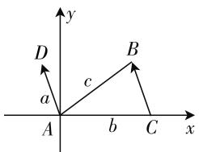

# 数学教学设计:不可忽视数学之美\*

——以正余弦定理教学为例

湖北省大冶一中 陈志刚

数学之美无处不在,用欣赏的眼光看数学,可以发现许多数学的内在美.数论大师赛尔伯格最喜欢的数学公式是 $\frac{\pi}{4}=1-\frac{1}{3}+\frac{1}{5}-\cdots$ .这个公式真叫人叹为观止,一串奇数和相间的加减号能造就出 $\pi$ 来,简直不可思议,但它的的确确存在.数学不仅要求我们有深刻的思维力,还要求我们有敏锐的观察力.当一双明察秋毫的“慧眼”与“美丽”数学邂逅后,数学就变得美轮美奂让人终生难忘.翻开模块5新课标教材,对正弦定理和余弦定理的证明分别用了向量法,那么能否“合而治之”,即用一种证法同时证明正弦定理和余弦定理呢?能否用正弦定理和余弦定理解决同一个问题呢?数学处处有“和谐”,回答是肯定的.对此,笔者设计了探究正余弦定理的课例,供大家参考.

# 一、课例设计

# (一) 一石二鸟, 妙证正余弦定理

师:书本上用向量法分别证明了正余弦定理,那么有没有哪种方法可以一石二鸟,同时得到正弦定理与余弦定理呢?

探究 1: 能否用一种证法同时证明正弦定理和余弦定理?

教师引导学生解决问题：

在图 1 的一个三角形 ABC 中, a, b, c 分别是三个内角 A, B, C 所对的边. 现在以 A 作为原点, AC 所在的直线作为 x 轴, 建立平面直角坐标系,则 $C(b,0)$ , 又由三角函数的定义可算得 B 点坐标为 $(c\cos A, c\sin A)$ .

所以 $\overrightarrow{CB}=(c\cos A-b,c\sin A)$ .

text_image

y
D
a
c
B
A
b
C
x

图1

现在又把向量 $\overrightarrow{CB}$ 平移到起点是原点 $A$ ，终点为点 $D$ 处，于是 $\overrightarrow{AD} = \overrightarrow{CB}$ 而且 $|\overrightarrow{AD}| = |\overrightarrow{CB}| = a$ $\angle DAC = \pi -\angle BCA = \pi -C$ ，再次依据三角函数的定义，可以推知 $D$ 点坐标为 $(a\cos (\pi -C),a\sin (\pi -C))$ 化简得 $D(-a\cos C,a\sin C)$ ，所以 $\overrightarrow{AD} = (-a\cos C,$ $a\sin C)$ ，而 $\overrightarrow{AD} = \overrightarrow{CB}$ ，所以 $(-a\cos C,a\sin C) = (c\cos A$ $-b,c\sin A)$ ，所以 $\left\{ \begin{array}{ll}a\sin C = c\sin A & ①,\\ -a\cos C = c\cos A - b & ②. \end{array} \right.$

由 ① 得 $\frac{a}{\sin A} = \frac{c}{\sin C}$ . 同理可证 $\frac{a}{\sin A} = \frac{b}{\sin B}$ .

所以 $\frac{a}{\sin A}=\frac{b}{\sin B}=\frac{c}{\sin C}$ ③.于是正弦定理获证.

由 ② 得 $a\cos C = b - c\cos A$ ，两边平方得 $a^2\cos^2 C = b^2 - 2bc\cos A + c^2\cos^2 A$ ，即 $a^2 - a^2\sin^2 C = b^2 - 2bc\cos A + c^2 - c^2\sin^2 A$ .

而由 ③ 可得 $a^{2}\sin^{2}C=c^{2}\sin^{2}A$ ，所以 $a^{2}=b^{2}+c^{2}-2bc\cos A$ .

同理可证 $b^{2}=a^{2}+c^{2}-2ac\cos B, c^{2}=a^{2}+b^{2}-2ab\cos C.$

到此正弦定理和余弦定理证明完毕.

师:从以上的证明过程中,我们可以看出,正弦定理与余弦定理其实是一对休戚相关的“孪生兄弟”,它们有着不可分割的内在联系;同时,我们也再次感受到了向量法的使用价值和数学意义,被数学的这种内在美所折服.

# （二）从正弦定理到余弦定理，再感数学美

师:在以往的数学学习中,许多定理或公式是可以互相推证的,如两角和差的正弦公式可直接由两角和差的余弦公式推证,那么我们能否用正弦定理来推证余弦定理呢?

探究 2:能否用正弦定理推证余弦定理?

教师引导学生解决问题：

为了解决这个问题,我们先证明如下等式:

$$
\sin^ {2} A + \sin^ {2} B - \sin^ {2} C = 2 \sin A \sin B \cos C. \tag {①}
$$

证明: $\sin^{2}A + \sin^{2}B - \sin^{2}C = \frac{1 - \cos 2A}{2} + \frac{1 - \cos 2B}{2} - \frac{1 - \cos 2C}{2} = -\frac{1}{2} (\cos 2A + \cos 2B) + \frac{1 + \cos 2C}{2} = -\cos (A + B)\cos (A - B) + \cos^{2}C = \cos C[\cos (A - B) - \cos (A + B)] = 2\sin A\sin B\cos C.$

故 ① 式成立，再由正弦定理变形，得 $\left\{\begin{aligned}a&=2R\sin A,\\ b&=2R\sin B,\quad②\\ c&=2R\sin C.\end{aligned}\right.$

结合 ①、②有 $a^2 + b^2 - c^2 = 4R^2 (\sin^2 A + \sin^2 B - \sin^2 C) = 4R^2 \cdot 2\sin A \sin B \cos C = 2ab \cos C$ .

即 $c^{2}=a^{2}+b^{2}-2ab\cos C.$

同理可证 $a^{2}=b^{2}+c^{2}-2bc\cos A; b^{2}=c^{2}+a^{2}-2ca\cos B.$

师:此证法独具匠心,出奇制胜,既揭示了两个定理之间的联系,又把它们与三角融于一体,有助于知识的连贯性、系统性,真是美不胜收.

# （三）运用数学美解决问题，提升数学素养

师：“一题多解”是数学世界里最亮丽的一道风景。“殊途同归”，本身就体现了数学内在的一种美，那么，有些问题是否既能用正弦定理来解，又能用余弦定理来解呢？

探究 3: 能否让正弦定理和余弦定理“各显神通”?

教师给出如下问题,由学生自行解答.

问题 1: 在 $\triangle ABC$ 中, 三内角 A, B, C 所对的边分别是 a, b, c, 且满足 $a = 2b \cos C$ , 求证: $\triangle ABC$ 是等腰三角形.

学生解答：

证法1:(用正弦定理)要证 $\triangle ABC$ 是等腰三角形, 即证其中有两内角相等, 于是在已知条件中化边为角, 只保留三角函数. 依据正弦定理 $a = \frac{b\sin A}{\sin B}$ , 于是 $2b\cos C = \frac{b\sin A}{\sin B}$ , 即 $2\cos C \cdot \sin B = \sin A = \sin (B + C) = \sin B\cos C + \sin C\cos B$ , 所以 $\sin B\cos C - \cos B\sin C = 0$ , 即 $\sin (B - C) = 0$ , 所以 $B - C = n\pi (n \in \mathbf{Z})$ .

因为 B, C 是三角形的内角，所以 B = C，即 $\triangle ABC$ 是等腰三角形.

证法 2: (用余弦定理): 因为 $\cos C = \frac{a^{2} + b^{2} - c^{2}}{2ba}$ 及 $\cos C = \frac{a}{2b}$ ，所以 $\frac{a^{2} + b^{2} - c^{2}}{2ab} = \frac{a}{2b}$ ，化简后得 $b^{2} = c^{2}$ ，所以 b = c，所以 $\triangle ABC$ 是等腰三角形.

问题 2: 在 $\triangle ABC$ 中, 三内角 A, B, C 所对的边分别是 a, b, c, 且满足 $b\cos A = a\cos B$ , 试判断三角形的形状.

学生解答：

思路 1: 利用余弦定理将角化为边.

因为 $b\cos A = a\cos B$ ，所以 $b \cdot \frac{b^{2} + c^{2} - a^{2}}{2bc} = a \cdot \frac{a^{2} + c^{2} - b^{2}}{2ac}$ ，所以 $b^{2} + c^{2} - a^{2} = a^{2} + c^{2} - b^{2}$ ，所以 $a^{2} = b^{2}$ ，所以 a = b，故此三角形是等腰三角形.

思路 2: 利用正弦定理将边转化为角.

因为 $b\cos A = a\cos B$ ，又 $b = 2R\sin B, a = 2R\sin A$ ，所以 $2R\sin B\cos A = 2R\sin A\cos B$ ，所以 $\sin B\cos A - \sin A\cos B = 0$ ，所以 $\sin(A - B) = 0$ 。

因为 0 < A, B < $\pi$ , 所以 $-\pi < A - B < \pi$ , 所以 A - B = 0, 即 A = B.

故此三角形是等腰三角形.

师:同学们,这节课上到这里,你是否觉得数学真的很美,那么,就让我们在平时的学习中勤思考、多探索,去发现和创造这种美吧!

# 二、一点感悟

数学是一种文化,是一种充满着智慧与美感的文化,数学教学应该让这种美发挥出来,让数学之美熏陶学生,吸引学生.但由于长期受应试教育的干扰,高考考什么,教师就教什么,已经成为广大教师的定势思维,以应试为目的的教学很难让学生感受到数学之美,这样的教学很难吸引学生,于是,学习数学成了他们无法推脱的沉重的负担.如何让学生走出困境,还数学教育的本来面目?笔者认为教师应该挖掘教材,探寻数学之美,设计探究数学之美的课例,让学生感悟数学内在的联系与和谐,学会用联系的观点分析问题,以此来提升他们的数学素养.试想,如果学生的综合能力提高了,数学素养提升了,那么他们的应试能力会下降吗?所以说,追求数学之美应该成为数学教学的一种时尚与习惯.F