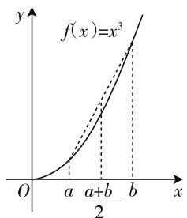

# 数学解题思路发现的几个维度\*

——以一个优美不等式证明的教学为例

● 内江师范学院数学与信息科学学院 樊红玉  
● 内江师范学院数学与信息科学学院 赵思林

重视思路发现的教与学是数学解题教学的核心任务.本文以一个优美不等式证明的教学为例,说明数学解题的思路发现的几个维度.

# 一、问题呈现

设 a, b 为正实数, 求证: $\frac{a^{3}+b^{3}}{2} \geqslant \left(\frac{a+b}{2}\right)^{3}$ .

评注:该题形式简单,结构对称,蕴含数学之美,可以培养学生发现美、鉴赏美和创造美的眼光.此题对思维层次要求较高,具有一定的难度与区分度.该问题解法多样,立意深刻,能够激活发散思维,提高学生的创新能力,引发研究性学习.不难看出,以此题结论为基础,极易解决2017年高考数学全国卷Ⅱ第23题:

已知 $a > 0, b > 0, a^3 + b^3 = 2$ ，证明：

(1) $(a + b)(a^5 + b^5) \geqslant 4$ ;   
(2) $a+b\leqslant2.$

也可以认为,这道高考数学试题是以此题为背景命制的.

下面以这个优美不等式证明的教学为例,总结了数学解题的思路发现的几个维度:(1) 数学基础知识、基本方法的维度;(2) 数学思想的维度;(3) 经验的维度;(4) 数学审美的维度.并对这个不等式做了推广.

# 二、解题思路发现的几个维度

布鲁纳的“发现教学”理论启示大家,数学解题教学的过程应成为思路发现的过程,要让数学解题变成思路发现的载体,让学生想发现,会发现,能发现.思路发现对于激发学生学习动机和培养创新能力都有重要作用.

# 1. 数学基础知识、基本方法的维度

思路发现 1: 作差法

证明不等式最常用的是“作差法”. 观察不等式两边都为整式, 满足作差法的条件. 对该不等式进行移项、作差、变形, 可得:

$$
\begin{array}{l} \frac {a ^ {3} + b ^ {3}}{2} - \left(\frac {a + b}{2}\right) ^ {3} = \frac {3}{8} \left(a ^ {3} - a ^ {2} b - a b ^ {2} + b ^ {3}\right) \\ = \frac {3}{8} (a + b) (a - b) ^ {2} \geqslant 0, \\ \end{array}
$$

当且仅当 a=b 时, 等号成立.

$$
\text {故} \frac {a ^ {3} + b ^ {3}}{2} \geqslant \left(\frac {a + b}{2}\right) ^ {3}.
$$

评注:“作差法”是证明不等式的基本方法,方法简单易懂,思路清晰,注重考查学生的数学运算能力.

思路发现 2: 分析法

要证明不等式,考虑运用“分析法”,从结论出发,执果索因,寻找使结论成立的充分条件.

欲证 $\frac{a^3 + b^3}{2} \geqslant \left(\frac{a + b}{2}\right)^3,$

需证 $\frac{a^3 + b^3}{2} \geqslant \frac{a^3 + 3a^2b + 3ab^2 + b^3}{8}$ ,

需证 $4a^{3} + 4b^{3}\geqslant a^{3} + 3a^{2}b + 3ab^{2} + b^{3},$

需证 $a^3 - a^2 b - ab^2 + b^3 \geqslant 0$

需证 $(a - b)^2 (a + b)\geqslant 0$

由于 a, b 为正实数, $(a - b)^{2}(a + b) \geqslant 0$ 显然成立.

故原不等式 $\frac{a^3 + b^3}{2} \geqslant \left(\frac{a + b}{2}\right)^3$ 成立.

评注:“分析法”对学生有一定难度,教材提及较少,学生缺乏一定的经验.学生的常见错误是忽视“需证”的书写.若不写“需证”二字,则将结论当成了条件.

# 思路发现 3: 综合法

借助思路发现2的经验,考虑运用“综合法”,并利用不等式 $a^{3}+b^{3}\geqslant a^{2}b+ab^{2}$ .因不等式左边比较简单,考虑从左边入手.

$$
\begin{array}{l} \frac {a ^ {3} + b ^ {3}}{2} = \frac {a ^ {3} + 3 (a ^ {3} + b ^ {3}) + b ^ {3}}{8} \\ \geqslant \frac {a ^ {3} + 3 \left(a ^ {2} b + a b ^ {2}\right) + b ^ {3}}{8} = \left(\frac {a + b}{2}\right) ^ {3}, \\ \end{array}
$$

当且仅当 a=b 时, 等号成立.

故不等式 $\frac{a^3 + b^3}{2} \geqslant \left(\frac{a + b}{2}\right)^3$ 成立.

评注:该解法利用基本不等式为载体进行变换,利用 $a^{2}+b^{2}\geqslant2ab$ ,两边同时乘以 $a+b$ ,得到 $a^{3}+b^{3}\geqslant a^{2}b+ab^{2}$ .同样也可从不等式右边入手,求证不等式.

# 思路发现 4: 利用伯努利不等式

考虑利用伯努利不等式 $x^{3} \geqslant 3x - 2$ 进行证明. 因不等式右边较为复杂, 考虑从左边入手. 事实上, 注意到 $a > 0, b > 0$ , 令 $\theta = \frac{a + b}{2}$ , 则有 $\theta > 0$ , 从而有:

$$
\begin{array}{c} \frac {a ^ {3} + b ^ {3}}{2} \geqslant \left(\frac {a + b}{2}\right) ^ {3} \Leftrightarrow \frac {a ^ {3} + b ^ {3}}{2} \geqslant \theta^ {3} \Leftrightarrow \left(\frac {a}{\theta}\right) ^ {3} + \\ \left(\frac {b}{\theta}\right) ^ {3} \geqslant 2. \end{array}
$$

又因为 $\left(\frac{a}{\theta}\right)^{3}+\left(\frac{b}{\theta}\right)^{3}\geqslant3\cdot\frac{a}{\theta}-2+3\frac{b}{\theta}-2=$ $3 \cdot \frac{a + b}{\theta} - 4 = 2$ ，当且仅当 $a = b = \theta$ 时，等号成立.

故不等式 $\frac{a^3 + b^3}{2} \geqslant \left(\frac{a + b}{2}\right)^3$ 成立.

评注:数学问题解决的本质是化归与转化,通过化多元为一元,变非齐次为齐次,降低问题难度,凸显方法的简单美.该方法具有普适性,当次数变为k次,或未知数个数变为n时,都可利用该方法快速证明.

# 2. 数学思想的维度

# 思路发现 5: 化归与转化思想

观察到不等式两边最高次数都为3，考虑进行降次.由 $a > 0,b > 0$ ，可得 $a + b > 0.$ 不等式两端同时除以 $a + b$ ，变3次为2次，可得 $\frac{a^2 - ab + b^2}{2}\geqslant$ $\frac{(a + b)^2}{8}$ ，则将问题转化为求证该二次不等式成立.

$$
\frac {a ^ {2} - a b + b ^ {2}}{2} \geqslant \frac {(a + b) ^ {2}}{8} \Leftrightarrow 4 a ^ {2} - 4 a b + 4 b ^ {2} \geqslant a ^ {2}
$$

$$
+ 2 a b + b ^ {2}, \Leftrightarrow 3 a ^ {2} - 4 a b + 3 b ^ {2} \geqslant 2 a b, \Leftrightarrow a ^ {2} + b ^ {2} \geqslant 2 a b.
$$

最后这个不等式显然成立,故原不等式获证.

评注:化归与转化思想是高中数学中的重要思想,也是证明高次不等式成立的常用思想.对不等式进行降次,变高次为低次,可以降低证明难度.

# 思路发现 6: 函数思想

考虑从结论着手,将该不等式看作函数,利用函数的性质进行证明.

令 $f(a)=\frac{a^{3}+b^{3}}{2}-\left(\frac{a+b}{2}\right)^{3}$ ，可得 $f'(a)=\frac{9a^{2}-6ab-3b^{2}}{8}$ .

令 $f'(a)=\frac{9a^{2}-6ab-3b^{2}}{8}=0$ ，有 $9a^{2}-6ab-3b^{2}=0$ .

易知，当 $0 < a < b$ 时， $f'(a) < 0$ ，函数 $f(a)$ 单调递减；当 $a > b > 0$ 时， $f'(a) > 0$ ，函数 $f(a)$ 单调递增.

故当 a=b 时, 函数 $f(a)$ 取得最小值为 0.

从而 $f(a) = \frac{a^3 + b^3}{2} -\left(\frac{a + b}{2}\right)^3\geqslant 0.$

故不等式 $\frac{a^3 + b^3}{2} \geqslant \left(\frac{a + b}{2}\right)^3$ 成立.

评注: 将不等式问题转化为函数问题, 利用导数法对函数的单调性进行分析, 是处理函数极值和最值的有效方法之一. 将不等式问题与函数、导数知识相结合, 有利于帮助学生形成知识网络, 寻找各知识板块之间的联系.

# 思路发现 7: 参数思想

考虑从结论入手,运用“参数法”.

令 $a = x + t, b = x - t$ ，其中 $x > t$ ，从而有 $\frac{(x + t)^3 + (x - t)^3}{2} \geqslant x^3$ . 将问题转化为求证 $(x + t)^3 + (x - t)^3 \geqslant 2x^3$ .

因为不等式左边 $(x+t)^{3}+(x-t)^{3}=2x^{3}+6xt^{2}\geqslant2x^{3}$ .

因此，原不等式 $\frac{a^3 + b^3}{2} \geqslant \left(\frac{a + b}{2}\right)^3$ 得证.

评注: 利用参数 t 可简化不等式, 同时又可将含参数 t 的奇次项抵消, 极大地减小了计算量. 该方法的难点在于如何巧设参数, 对不等式进行化简, 可提升学生的直觉思维能力, 提高数学核心素养.

# 思路发现 8: 数形结合思想

考虑从结论着手,发现 $\frac{a^{3}+b^{3}}{2}$ 、 $\left(\frac{a+b}{2}\right)^{3}$ 与函数 $f(x)=x^{3}(x>0)$ 相关,根据“图像法”(数形结合思想), 利用函数的凸性进行证明.

如图1所示,因为函数 $f(x)=x^{3}$ 是一个下凸函数,由下凸函数的性质 $\frac{f(x_{1})+f(x_{2})}{2}\geqslant f\left(\frac{x_{1}+x_{2}}{2}\right)$ ，得 $\frac{f(a)+f(b)}{2}\geqslant f\left(\frac{a+b}{2}\right)$ ，即 $\frac{a^{3}+b^{3}}{2}\geqslant\left(\frac{a+b}{2}\right)^{3}$ .

text_image

f(x)=x^3
O
a
a+b/2
b
x
y

图1

故原不等式成立.

评注: 观察不等式特征, 构造相应的函数进行证明. 将数形结合思想运用其中, 可直观得出结论, 减少了大量运算.

# 3. 经验的维度

思路发现 9: 消元的经验

借助消元的经验,考虑对不等式进行消元.事实上,有a>0,b>0,令 $\frac{a}{b}=x$ ,则x>0.发现左右两边次数相同,不等式两边同时除以 $b^{3}$ 并进行整体代换,将二元问题转化为一元问题,从而有:

$$
\begin{array}{c} \frac {a ^ {3} + b ^ {3}}{2} \geqslant \left(\frac {a + b}{2}\right) ^ {3} \Leftrightarrow \frac {\left(\frac {a}{b}\right) ^ {3} + 1}{2} \geqslant \left(\frac {\frac {a}{b} + 1}{2}\right) ^ {3} \Leftrightarrow \\ \frac {x ^ {3} + 1}{2} \geqslant \left(\frac {x + 1}{2}\right) ^ {3}. \end{array}
$$

化简得到 $\frac{x^{3}+3x^{2}+3x+1}{8}\leqslant\frac{x^{3}+1}{2}.$

因此，需证 $x^{3} + 3x^{2} + 3x + 1\leqslant 4x^{3} + 4.$

需证 $x^{3} - x^{2} - x + 1\geqslant 0.$

需证 $(x-1)^{2}(x+1)\geqslant0.$

最后这个不等式显然成立,故原不等式获证.

评注:该方法主要是将二元化为一元,减少未知量个数,降低难度.同时,该方法具有普适性,可用于证明推广不等式 $\frac{a^{n}+b^{n}}{2}\geqslant\left(\frac{a+b}{2}\right)^{n}$ .

思路发现 10: 联想一般情形的经验 —— 以琴生不等式为突破口

由琴生不等式 $\frac{f(x_{1})+f(x_{2})+\cdots+f(x_{n})}{n}\geqslant$ $f\left(\frac{x_{1}+x_{2}+\cdots+x_{n}}{n}\right)$ 可知，原不等式为琴生不等式的特殊化.令 $f(x)=x^{3}$ ，取n=2即可得到原不等式.
同时，利用一般化的思想有利于发现新的结论，对问题的推广和创新意识的提高都有很大帮助.

# 4. 审美的维度

思路发现 11: 利用对称美

考虑从不等式“=”成立的条件“a=b”入手，发现解题思路. 令 a=b=t，将问题转化为求证 $a^{3}+b^{3}\geqslant2t^{3}$ .

利用三元均值不等式,可得:

$$
a ^ {3} + t ^ {3} + t ^ {3} \geqslant 3 a t ^ {2},
$$

且 $b^{3} + t^{3} + t^{3}\geqslant 3bt^{2},$

从而有 $a^3 + b^3 + 4t^3 \geqslant 3(a + b)t^2$ .

取 $t = \frac{a + b}{2}$ , 可得 $a^3 + b^3 \geqslant \frac{(a + b)^3}{4}$ ,

因此 $\frac{a^3 + b^3}{2} \geqslant \left(\frac{a + b}{2}\right)^3$ .

评注: 利用不等式的取等条件转化问题, 将不等式蕴含的对称美、形式美发挥到极致. 同时, 该方法着眼点新颖, 设计巧妙, 对提高学生数学审美的眼光及利用审美眼光解决问题都有显著作用.

# 三、问题的推广

推广是数学研究的重要方法之一, 是发现问题的重要途径, 可加深学生对知识的理解, 激发发散思维.

推广1:设a,b为正实数, $n\in Q^{+}$ ,求证: $\frac{a^{n}+b^{n}}{2}\geqslant\left(\frac{a+b}{2}\right)^{n}$ .

推广 1 可用思路发现 4 中的伯努利不等式 $x^{k} \geqslant kx - (k - 1)(k \in \mathbf{N}_{+})$ 、思路发现 7 中的函数思想及思路发现 10 中的消元经验进行证明.

推广2:设a,b为正实数, $n\in R$ ,求证: $\frac{a^{n}+b^{n}}{2}\geqslant\left(\frac{a+b}{2}\right)^{n}$ .

推广 2 可利用思路发现 6 的方法证明.

推广3:设a,b为正实数,求证: $\frac{a_{1}^{3}+a_{2}^{3}+\cdots+a_{n}^{3}}{n}\geqslant\left(\frac{a_{1}+a_{2}+\cdots+a_{n}}{n}\right)^{3}.$

推广 3 可用思路发现 4 中的伯努利不等式证明.

推广4:设a,b为正实数,求证: $\frac{a_{1}^{k}+a_{2}^{k}+\cdots+a_{n}^{k}}{n}$ $\geqslant\left(\frac{a_{1}+a_{2}+\cdots+a_{n}}{n}\right)^{k}.$

推广 4 可用思路发现 4 中的伯努利不等式证明.

F