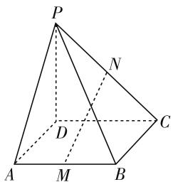
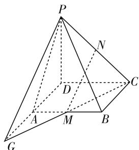
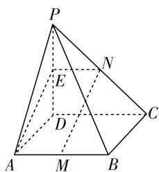
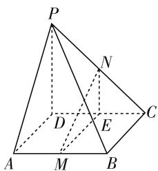
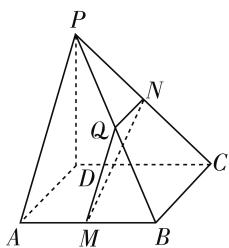

# 核心素养下的高三数学二轮复习

# 甘肃省白银市第一中学 胡贵平

高三数学一轮复习的重点是基础知识、基本方法、基本技能，二轮复习是对第一轮复习的巩固提高。优化解题策略，凸显数学思想方法，将知识点形成知识链，提高学生的分析问题、解决问题的数学素养。

# 一、发展思维，揭示本质

精选典型例题,解题分析过程要体现基本思路,解题方法选择要强调通法,为什么这么做,你是怎么想到的,通过对核心知识点本质的理解,解法的探寻,提高一类问题的可辨别性和稳定性,培养数学思维,促进自主探究解决问题和举一反三的能力.

例 1 如图1, 在四棱锥 P-ABCD 中, 四边形 ABCD 是平行四边形, M、N 分别是 AB、PC 的中点. 求证: MN // 平面 PAD.

这是一道典型的直线与平面平行判定的题,考查空间想象能力及逻辑推理能力.证明线面平行有哪些方法？需要什么条件？有几种实现途径？

text_image

P
N
D
A M B C

图 1

text_image

P
N
D
C
A
M
B
G

图 2

text_image

P
E
N
D
C
A
M
B

图 3

证明线面平行的基本思路有线面关系法和面面关系法,线面关系法就是利用线面平行的判定定理,关键是在平面内找一条直线与已知直线平行,通常有两种方法,一种是利用中位线找平行线,如图2所示;一种是构造平行四边形找平行线,如图3所示. 面面关

text_image

P
N
D
E
C
A
M
B

图 4

text_image

P
Q
D
A
M
B
C
N

图 5

系法就是利用“如果两个平面平行，则其中一个平面内的直线必平行于另一个平面”，这个性质是线面平行判定的补充，证明线面平行，往往可以转化为证面面平行。如图4、图5所示。通过一道题掌握证明线面平行的一般套路，除此之外还可以用向量关系法，由共面向量定理推论知：要证 $AB \parallel$ 平面 $\alpha$ ，只需要在平面 $\alpha$ 内找一组不共线的向量 $\overrightarrow{OC}, \overrightarrow{OD}$ ，使得 $\overrightarrow{AB} = x\overrightarrow{OC} + y\overrightarrow{OD}(x, y$ 是唯一存在的实数），且说明 $\overrightarrow{AB}$ 所在的直线 $AB$ 不在 $OC$ 与 $OD$ 所确定的平面 $\alpha$ 内。具体应用时，经常由三角形法则或平行四边形法则直接推出 $x$ 、 $y$ 的唯一值。向量关系法关键是当直线不在平面内时，直线的方向向量可以用平面内的两个不共线向量来表示。证明： $\overrightarrow{MN} = \overrightarrow{MA} + \overrightarrow{AP} + \overrightarrow{PN} = -\frac{1}{2}\overrightarrow{DC} + \overrightarrow{AP} + \frac{1}{2}\overrightarrow{PC} = -\frac{1}{2}\overrightarrow{DC} + \overrightarrow{AP} + \frac{1}{2} (\overrightarrow{PD} + \overrightarrow{DC}) = \overrightarrow{AP} + \frac{1}{2}\overrightarrow{PD}$ ，由共面向量定理可得 $\overrightarrow{MN}, \overrightarrow{AP}, \overrightarrow{PD}$ 是共面向量，且 $MN$ 不在 $AP, PD$ 确定的平面内，因此， $MN \parallel$ 平面 $PAD$ 。

# 二、内联外引，探究视角

不只就题讲题,要跳出题目讲联系,讲拓展,探究一些典型例题的过程就是探究性学习,不但能理解典型例题的深刻内涵,而且应用一些结论能使复杂问题获得简单化解法,多个视角分析问题,培养了学生探究问题的能力.

例 2 $F_{1}$ 、 $F_{2}$ 是椭圆 $\frac{x^{2}}{4} + \frac{y^{2}}{3} = 1$ 的左、右焦点，点

P 在椭圆上运动, 则 $\overrightarrow{PF_{1}} \cdot \overrightarrow{PF_{2}}$ 的最大值是 \_\_\_\_.

解法一:在椭圆 $\frac{x^{2}}{4}+\frac{y^{2}}{3}=1$ 中， $a=2,b=\sqrt{3}$ ，所以c=1，所以焦点 $F_{1}(-1,0)$ ， $F_{2}(1,0)$ ，设P满足 $\left\{\begin{aligned}x=2\cos\theta,\\ y=\sin\theta,\end{aligned}\right.$ $\theta\in[0,2\pi)$ ，所以 $\overrightarrow{PF_{1}}\cdot\overrightarrow{PF_{2}}=(2\cos\theta+1,\sin\theta)\cdot(2\cos\theta-1,\sin\theta)=(2\cos\theta+1)(2\cos\theta-1)+\sin^{2}\theta=4\cos^{2}\theta-1+\sin^{2}\theta=3\cos^{2}\theta\leqslant3$ ，当 $\theta=0$ 或 $\theta=\pi$ 时，取得等号，故答案为3.

解法二:设点 $P(x,y)$ ，在椭圆 $\frac{x^{2}}{4}+\frac{y^{2}}{3}=1$ 中，a=2, $b=\sqrt{3}$ ，所以 c=1，所以焦点 $F_{1}(-1,0)$ , $F_{2}(1,0)$ ，所以 $\overrightarrow{PF_{1}}\cdot\overrightarrow{PF_{2}}=(x+1,y)\cdot(x-1,y)=(x+1)(x-1)+y^{2}=x^{2}+y^{2}-1=\frac{3}{4}x^{2}\leqslant3$ ，当 x=2 或 x=-2 时，取得等号，故答案为 3.

解法三:(向量极化恒等式) $\overrightarrow{PF_{1}}\cdot\overrightarrow{PF_{2}}=\left|\overrightarrow{PO}\right|^{2}-\frac{1}{4}\left|\overrightarrow{F_{1}F_{2}}\right|^{2}=\left|\overrightarrow{PO}\right|^{2}-c^{2}$ ，又 $\left|\overrightarrow{PO}\right|\in[b,a]$ ，所以 $(\overrightarrow{PF_{1}}\cdot\overrightarrow{PF_{2}})_{\max}=a^{2}-c^{2}=b^{2}=3.$

向量极化恒等式 $\boldsymbol{a} \cdot \boldsymbol{b} = \frac{1}{4} \left[ (\boldsymbol{a} + \boldsymbol{b})^{2} - (\boldsymbol{a} - \boldsymbol{b})^{2} \right]$ ，几何意义是向量的数量积可以表示为以这组向量为邻边的平行四边形的“和对角线”与“差对角线”平方差的 $\frac{1}{4}$ .

拓展: 设 $F_{1}$ 、 $F_{2}$ 是椭圆 $\frac{x^{2}}{a^{2}} + \frac{y^{2}}{b^{2}} = 1$ 的左、右焦点, P 是椭圆上一个动点, 则 $\overrightarrow{PF_{1}} \cdot \overrightarrow{PF_{2}}$ 的取值范围是 \_\_\_\_.

方法一: $2\overrightarrow{PF_{1}}\cdot\overrightarrow{PF_{2}}=|\overrightarrow{PF_{1}}|^{2}+|\overrightarrow{PF_{2}}|^{2}-(\overrightarrow{PF_{1}}-\overrightarrow{PF_{2}})^{2}=|\overrightarrow{PF_{1}}|^{2}+(2a-|\overrightarrow{PF_{1}}|)^{2}-\overrightarrow{F_{1}F_{2}}^{2}=2(|\overrightarrow{PF_{1}}|-a)^{2}-2a^{2}+4b^{2}$ ，即 $\overrightarrow{PF_{1}}\cdot\overrightarrow{PF_{2}}=(|\overrightarrow{PF_{1}}|-a)^{2}-a^{2}+2b^{2}$ ，因为 $|\overrightarrow{PF_{1}}|\in[a-c,a+c]$ ，所以 $\overrightarrow{PF_{1}}\cdot\overrightarrow{PF_{2}}\in[b^{2}-c,b^{2}]=[2b^{2}-a^{2},b^{2}]$ .

方法二：设点 $P(x,y), x \in [-a,a]$ ，则 $\overrightarrow{PF_{1}} \cdot \overrightarrow{PF_{2}} = (-c - x, -y) \cdot (c - x, -y) = x^{2} + y^{2} - c^{2} = x^{2} + b^{2} - \frac{b^{2}}{a^{2}} x^{2} - c^{2} = \frac{c^{2}}{a^{2}} x^{2} + b^{2} - c^{2} \in [b^{2} - c^{2}, b^{2}] = [2b^{2} - a^{2}, b^{2}]$ .

# 三、洞查错误，纠错觅源

有些知识点是学生经常出错的,错误的原因很多,有的隐藏较深,需深究,有的与教师的主观判断大相径庭,必须挖掘错误背后的“知识漏洞”和“思维缺陷”,洞查出错的真实原因,纠错觅源,真正理解知识点,建构良好的认知结构.

例3 已知双曲线 $x^{2} - \frac{y^{2}}{2} = 1$ ，是否存在直线 $l$ ，使得 $P(1,1)$ 为直线 $l$ 被双曲线所截弦 $AB$ 的中点？若存在，求出直线 $l$ 的方程；若不存在，请说明理由.

解决圆锥曲线中点弦的问题,常采用“点差法”来求解.

错解: 显然直线 l 的斜率存在, 且不为 0, 设直线与双曲线的两个交点坐标为 $A(x_{1}, y_{1}), B(x_{2}, y_{2})$ , 则 $x_{1} \neq x_{2}$ , 因为点是线段 AB 的中点, 所以 $x_{1} + x_{2} = 2$ ,

$y_{1}+y_{2}=2$ 且 $\left\{\begin{aligned}x_{1}^{2}-\frac{y_{1}^{2}}{2}&=1\quad(1),\\ x_{2}^{2}-\frac{y_{2}^{2}}{2}&=1\quad(2),\end{aligned}\right.$ (1)-(2)，得 $(x_{1}$

$-x_{2})(x_{1}+x_{2})-\frac{(y_{1}-y_{2})(y_{1}+y_{2})}{2}=0$ ，整理得 $\frac{y_{1}-y_{2}}{x_{1}-x_{2}}=2$ ，即 $k_{AB}=2$ ，所以直线 l 存在，其方程为 2x-y-1=0.

如果将直线 l 的方程 y=2x-1 代入双曲线 $x^{2}-\frac{y^{2}}{2}=1$ ，可得 $2x^{2}-4x+3=0$ ，而这个方程没有实数解，也就是说这条直线与双曲线是没有交点的，又怎么会出现弦呢。我们知道应用“点差法”的前提是直线与圆锥曲线必须要有两个不同的交点，验证增解的常见方法是检验中点弦所在的直线与圆锥曲线是否有两个不同的交点，即判断 $\Delta>0$ 是否成立，但是往往因为这样做太麻烦，而省略了非常必要的一步检验。

利用 $\left\{\begin{aligned}x_{1}^{2}-\frac{y_{1}^{2}}{2}&=\lambda\quad(1),\\ x_{2}^{2}-\frac{y_{2}^{2}}{2}&=\lambda\quad(2),\end{aligned}\right.$ (1)-(2)，也可以得出

$k_{AB}=2$ , 所以错误解法中两式相减不是同解变形, 得到了必要不充分条件, 2x-y-1=0 适用于有共同渐近线的双曲线 $x^{2}-\frac{y^{2}}{2}=\lambda(\lambda\neq0)$ 中点弦情形. F