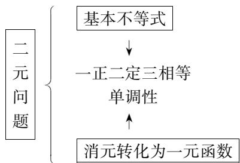
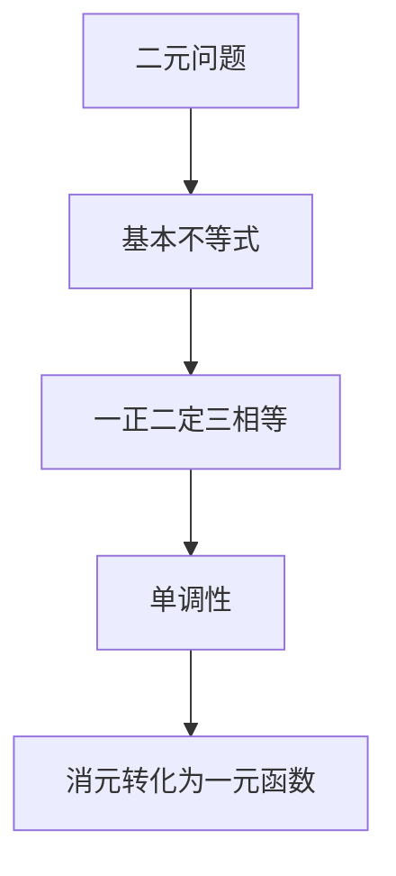
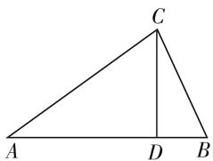
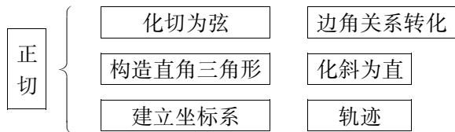
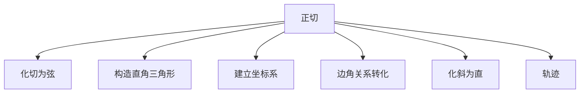

# 重激活 善转换 勤反思\*

—— 高三二轮复习课的实践与思考

● 江苏省锡东高级中学 叶琳

高三一轮复习,主要是帮助学生梳理基础知识、训练基本技能、拓展解题思路和方法,深化认识蕴含的数学思想,是基于基础、拾级而上的教学活动.那么如何定位二轮复习的方向、目标?尽管利用微专题进行二轮复习已成为广大教师的共识,也是主要的教学形式.但是微专题教学应用不当,也容易产生轻视概念、就题论题、一言堂、缺少总结的教学问题,事实上,这样的状况屡见不鲜.

如何提高二轮复习的有效性,寻找科学而又艺术的教学方式?笔者认为二轮复习的定位是:巩固一轮复习成果,完善知识网络,进一步融合数学思想方法体系,提高解决问题的综合性和灵活性.也就是说,二轮复习应重视活动经验的激活与重组,促进有效联想,提高表征问题与转换的能力,勤于反思,从不同的角度认识问题,理解问题本质,提高分析问题和解决问题的能力.本文结合笔者执教的一节研讨课,谈谈自己的思考,不当之处,敬请批评指正.

# 一、激活活动经验——促进联想

学习是经验积累的过程. 学生在学习过程中, 自主获得了主观性体验和感悟, 包括在数学学习的过程中积累起来的数学概念、公式、定理、经验性知识和处理数学问题的常用思想和方法等, 把经验转化为直觉的判断, 并建立起自己的认知结构, 这是学生进一步学习和解决问题的基础.

遇到一个陌生问题,学生通常的做法是:联想起已经解决的类似的问题,包括题目所涉及教材中的概念、定理、公式、相似问题的解法.这个过程就是激活学生已有的知识经验,促进有效联想.即将新问题的特征与旧问题的特征进行比较,抓住新旧问题的共同特征,将已有的知识和经验与当前问题情境建立联系,利用处理过的类似的旧问题的知识和经验,处理新问题,或把新问题转化为一个已解决了的熟悉问题,从而为新问题的解决做好铺垫. 这就像波利亚所说过的:“货源充足和组织良好的知识仓库是一个解题者的重要资本.”而高考题的命制往往又是通过改编教材中的例题、习题等生成,因此重视课本上典型例题和习题,熟悉这些问题的解法,了解它们的变式或延伸,或者解决问题中所蕴含的数学方法,对高考复习也是很有效的.

# 【教学片断 1】(串讲激活)

例 1 锐角 $\triangle ABC$ 中, 已知 $\sin C = 4\cos A \cos B$ , 则 $\tan A \tan B$ 的最大值为 \_\_\_\_.

变式: 锐角 $\triangle ABC$ 中, 已知 $\sin C = 4\cos A\cos B$ , 则 $\tan A \cdot \tan B \cdot \tan C$ 的最大值为 \_\_\_\_.

学生完成例 1 和变式后, 教师抛出下列问题:

问题 1: 在上述条件下, 怎么求 $\frac{1}{\tan A} + \frac{1}{\tan B} + \frac{1}{\tan C}, \frac{\tan C}{\tan A} + \frac{\tan C}{\tan B}$ 的最小值和 $\sin^{2}A + \sin^{2}B$ 的最大值呢?

设计意图:三角形有着丰富的内涵,其中以正切为背景的三角形最值问题是高考的热点,对学生来说也是难点.利用正余弦定理将题设条件“ $\sin C = 4\cos A\cos B$ ”化成 $\tan A + \tan B = 4$ ,例1和变式的目标表达式从 $\tan A\tan B$ 变式到 $\tan A\cdot\tan B\cdot\tan C$ ,二元变量到三元变量,对含有 $\tan A,\tan B,\tan C$ 的式子通过加减乘除等运算进行变形,得到新的目标表达式,不仅可以解决与正切有关的,还可以求与弦有关的目标表达式的最值.学生感悟题目来源,经历变化过程,深化对函数最值求法的认识,为下一步的探究做铺垫.

问题 2: 求目标表达式的最值问题一般有哪些方法? (悟一悟)

师生小结：

flowchart

解决例 1 之后, 学生学习热情高涨, 教师顺势给出例 2:

【教学片断 2】(变式探究)

问题 3: 我们还可以从什么角度提出问题?

生齐答:图形.

例 2 在锐角 $\triangle ABC$ 中, $CD \perp AB$ , 垂足为 D, 且 AD : DB = 3 : 1. 在这样的条件下, 你能求出 $\frac{1}{\tan A} + \frac{1}{\tan B} + \frac{1}{\tan C}, \frac{\tan C}{\tan A} + \frac{\tan C}{\tan B}, \sin^{2}A + \sin^{2}B$ 的最值吗?

追问:对形怎么转化呢?

学生活动: 学生根据条件 AD:DB=3:1 转化为 $3\tan A=\tan B$ ，考虑到教学时间有限，仅分析目标表达式的解题方法和思路，不呈现解题过程和结果.

text_image

C
A D B

图 1

问题 4: 刚才我们的已知与目标都是关于角的表达式, 那么三角形中研究的对象除了角, 还可以研究什么?

学生活动:学生交流,可以研究三角形的边长,面积,周长,中线长等.

设计意图:例1从数的角度给出了“ $\tan A + \tan B = 4$ ”的关系,例2从形出发,学生通过图形分析挖掘出 $3\tan A = \tan B$ .学生不仅可以从代数式结构上进行模式识别,而且建立了几何图形的直观认知.这个环节的重点是让学生感悟不同的表征形式应该如何转换和化简,将新问题转化为熟悉的问题求解.问题2旨在拓宽学生的解题思路,培养学生的发散思维能力.

【教学片断 3】(举一反三)

例 3 $\triangle ABC$ 中, 已知 $\tan B = 3\tan A$ , 且 AC = 1, 求 $\triangle ABC$ 面积的最大值.

问题 5:你准备从哪些角度切入解决上述问题?

学生活动:学生独立思考,给出解题思路.

生1: 过 C 点作 $CD \perp AB$ ，设 CD = h, BD = x，由 $\tan B = 3\tan A$ 得 AD = 3BD。所以 $S_{\triangle ABC} = 2x \cdot \sqrt{1 - 9x^{2}}$ ，利用换元法转化为二次函数或者基本不等式求出最大值 $\frac{1}{3}$ 。

师:很好,从形的角度通过引高,构造直角三角形表示正切,转化为边长的关系,建立面积关于边长的表达式求解.

生 2: 因为 $\tan B = 3 \tan A$ 所以 $\frac{\sin B}{\cos B} = 3 \frac{\sin A}{\cos A}$ ，利用正余弦定理得 $2a^{2} + c^{2} = 2b^{2}$ .

因为 $S = \frac{1}{2} ab\sin C = \frac{1}{2} a\sqrt{1 - \cos^2C},\cos C =$ $\frac{a^2 - c^2 - 1}{2a}$ ，所以 $S = \frac{1}{2} a\sqrt{1 - \frac{(a^2 - c^2 + 1)^2}{4a^2}} =$ $\frac{1}{2}\sqrt{\frac{4a^2 - (3a^2 - 1)^2}{4}}$ 转化为二次函数值域求解.

师:从数的角度,通过切化弦,和面积公式转化为关于边长的函数.

生3:由 $\tan B=3\tan A$ 得 AD=3BD，所以 $S_{\triangle ABC}=\frac{4}{3}S_{\triangle ADC}$ . 过 C 点作 $CD \perp AB, AC=1$ ，所以 D 的轨迹是以 AC 为直径的圆，以 AC 的中点为原点，AC 所在直线为 x 轴建立直角坐标系，D 轨迹方程为 $x^{2}+y^{2}=\frac{1}{4}$ ，所以 $(S_{\triangle ADC})_{\max}=\frac{1}{4}$ ，所以 $(S_{\triangle ABC})_{\max}=\frac{1}{3}$ .

师:很好,还可以利用轨迹思想求面积最值.同一个数学问题,从不同的角度去审视,可能会有不同的解题途径,数学不仅要学会,还要会学、善思.只有善思,数学学习才可能达到乐学的境界.

问题 6: “正切” 这样的条件一般有哪些转化途径? (想一想)

学生活动:学生小结,同伴补充,共同完成.

flowchart

设计意图:本环节从数、形和轨迹三个角度对条件 $\tan B = 3\tan A$ 表征转换,通过同类题的对比联系,不同解法的比较分析,变式、拓展、引申,着力培养学生的发散思维、巩固学生对知识的深入理解.把题中所蕴含的思想、方法串成线,形成链,形成知识表征系统充实学生认知结构,积累解题经验、理解数学思想方法,发展理性思维.

# 二、培养表征与变换能力——善于转换

学生对数学对象进行表示和转换的能力,是深刻理解数学知识的关键,也是解题能力的关键.很多学生有这样的苦恼:老师一讲就会,自己一考就懵.遇到不能解决的问题,老师讲解后或者同伴交流后恍然大悟,自己就是某一步没想到,那层窗户纸自己不会捅破.虽然经过一轮复习,但是学生对基本知识没有完全掌握,对知识间的联系不能形成网络结构,遇到新问题时不能灵活结合问题的结构特征,转换到有用的形式,缺乏对问题进行多元表征的意识和能力.

如何帮助学生走出困境？笔者认为解决问题的关键是要转换问题的表征形式，并结合不同的表征形式进行思考。教师要根据学情设置问题，启发学生思考，学会寻找解题思路，有意识培养学生多元表征的意识。遇到新问题首先弄清楚它是什么（意思）？如何表示？它有什么性质？根据题设条件能够推出什么？还能推出什么？它们有什么关系？中途结论之间有什么联系？它们可以怎么利用？它是否与某个解过的题有联系？能否利用这个联系？……

教学中引导学生在不同的表征形式之间进行转换,结合不同的表征形式,寻求解决问题的突破口.学生对知识进行不同表征的过程中,体会不同表征形式的特点和它们之间的联系,全方位、多角度地理解知识.在对知识的探究与发散的过程中,认识知识的来龙去脉,培养学生转换与结合不同表征形式的能力.

# 【教学片断 4】(返璞归真)

问题 7: $\triangle ABC$ 中, 已知“ $\tan B = 3\tan A$ ”, 你能否将已知条件“换一种表达方式”?

学生活动:学生独立思考,相互交流后,分别得到以下表达方式:

(1) 在 $\triangle ABC$ 中, $CD \perp AB$ , 垂足为 D, AD:DB = 3:1;  
(2) $2a^{2}+c^{2}=2b^{2}$ ;   
(3) $2\sin^{2}A + \sin^{2}C = 2\sin^{2}B;$   
(4) 利用 $a^{2}=b^{2}+c^{2}-2bc\cos A$ ，代入 $2a^{2}+c^{2}=2b^{2}$ 得 $3c=4b\cos A$ ;  
(5) 从 $\sin B\cos A = 3\sin A\cos B$ 入手, 则 $\sin C = 4\sin A\cos B$ .

问题 8: 能否类比刚才的研究方法, 将目标表达式 $\frac{\tan C}{\tan A} + \frac{\tan C}{\tan B}$ 也“化个妆”?

学生活动(略)

问题 9: 你能根据你探究的条件和结论构造不同的命题吗?

学生活动:经过交流,得到如下命题:

(1) $\triangle ABC$ 中,已知 $c=4a\cos B$ ,求 $\frac{\tan C}{\tan A}+\frac{\tan C}{\tan B}$ 的最值;  
(2) $\triangle ABC$ 中,已知 $2\sin^{2}A+\sin^{2}C=2\sin^{2}B$ ,求 $\tan A\tan B\tan C$ 的最值;  
(3) $\triangle ABC$ 中，已知 $2a^{2}+c^{2}=2b^{2}$ ，求 $\frac{1}{\tan A}+\frac{1}{\tan B}+\frac{1}{\tan C}$ 的最值；

(4) $\triangle ABC$ 中,已知 $\tan B=3\tan A$ ,三角形面积等于 $\frac{1}{3}$ ,求边b的范围;  
(5) $\triangle ABC$ 中,已知 $S_{\triangle ABC}=\sqrt{2}+1,\frac{4}{\tan A}+\frac{3}{\tan B}=1$ ,则边AC的最小值为\_\_\_\_.

设计意图:把握数学的本质是提升解题能力的根本要求,因此二轮复习应该强化学生对数学本质的认识,而通过启发学生对问题进行变式,是促进学生认识数学本质的有效途径.当然,这条途径还可以培养学生的创新思维能力.其实,这一做法,也适应了高考重基础性、综合性、应用性、创新性的要求.在本环节中让学生对条件“ $\tan B=3\tan A$ ”进行多元表征,学生积极思考、充分讨论,认识不同,思路不同,得到多种变式.在表征形式的转换与结合的过程中,获得对问题“ $\tan B=3\tan A$ ”深刻而全面的认识.

教学中,教师注重引导学生学会多角度看问题,有意识地为学生创造表征和转换同一数学对象的机会,提升学生表征和转换能力,帮助学生沟通不同知识的联系,形成系统思维模式.只有对问题本质进行深层理解,才能产生有意义的联想,才能挖掘隐藏的条件,才有可能实现有效的转化或化归,从而把握解题方向.本节课教师让学生扮演命题者的角色,与模考题、高考题进行对比,发现就是题目的“改头换面”或者“移花接木”,激发学习的兴趣,培养学生逻辑推理和创新能力.

# 三、注重解题回顾——勤于反思

我们都知道，“学而不思则罔，死而不学则殆”，不思则无，深思则远，远思则宽。解题反思应贯穿于解题活动之中，本节课在三个活动节点处引导学生反思：解题思路的生成，解题方法的探寻；反思解题所用的知识点，寻找知识之间的“交汇点”，理清由知识点形成的“知识链”；反芽数学对象的不同表现形式，加深对数学知识间的关系和联系的理解，纵向和横向形成知识网络，形成牢固而又可拓展的知识结构和有效的思考模式。

# 【教学片断 5】(登高望远)

对比反思:对比你编制的题目和模考题,谈谈你的感受(比一比).

(1)(2019南京二模14) $\triangle ABC$ 中,已知 $\sin C=2\cos A\cos B$ ,则 $\cos^{2}A+\cos^{2}B$ 的最大值为\_\_\_\_.  
(2)(2019 无锡期末 14) 锐角 $\triangle ABC$ 中, 已知 $2\sin^{2}A + \sin^{2}B = 2\sin^{2}C$ , 则 $\frac{1}{\tan A} + \frac{1}{\tan B} + \frac{1}{\tan C}$ 的最大值为 \_\_\_\_.  
(3)(2020 常州期中 13) $\triangle ABC$ 中, 已知 $3\tan A + \tan B = 0$ , 则角 C 的最大值为 \_\_\_\_. (下转第 19 页)

$= b = \frac{1}{2}$ 时等号成立.

变式2:试求出 $y=\frac{1}{a}+\frac{1}{1-a}(0<a<1)$ 的最小值.

解: 因为 $a+(1-a)=1$ ，所以 $y=\left(\frac{1}{a}+\frac{1}{1-a}\right)\cdot\left[a+(1-a)\right]=2+\frac{1-a}{a}+\frac{a}{1-a}$ 。因为 $\frac{1-a}{a}>0$ ， $\frac{a}{1-a}>0$ , 所以 $y \geqslant 2 + 2\sqrt{\frac{1-a}{a} \cdot \frac{a}{1-a}} = 4$ , 当且仅当 $\frac{1-a}{a} = \frac{a}{1-a}$ ，即 $a = \frac{1}{2}$ 时等号成立.

变式 3: 已知 $0 < x < \frac{\pi}{2}, t > 0$ ，若 $f(x) = \frac{1}{\sin x} + \frac{t}{1 - \sin x}$ 的最小值是 9，则 t = \_\_\_\_.（解略）

这样的变式训练,其立意就是学生思维能力的培养.学生完成每一道变式,应该说让学生的解题能力得到充分的提升,让学生在“过程”中有效地夯实基础、获取技能、发展思维、形成能力.总之,教材是几代人智慧的凝聚,具有较强的指导性和权威性.只要我们从基础知识、解题方法和心理因素等方面出发,引导学生回归课本,充分发挥教材的引领作用,有效夯实基础知识,注重课本例习题的挖掘,探索问题的引申、推广、变通和拓展,才能让学生从真正意义上跳出“题海”,有效复习,在高考中取得满意的成绩.

# 参考文献：

[1] 钱从新. 运用推广与引申的方法培养学生的创新能力 [J]. 数学教育学报, 2003(1).  
[2] 陶飞. 高三二轮复习关注“五个梯度”——记一节高三数学二轮复习课对二轮复习的思考 [J]. 中学数学 (上), 2016(11).  
[3] 汤连峰. 挖掘试题价值, 提升复习水平——基于试题研究的高三复习策略谈 [J]. 中学数学 (上), 2018(12).  
[4] 蒋敏. 专题引领 提升素养 打造数学复习课新常态——高三微专题复习课“用导数研究切线问题”[J]. 中学数学(上), 2019(5).  
[5] 刘敏. 以问题促专题, 提高高三数学二轮复习效率——以《向量表示有关问题的解法》专题复习为例 [J]. 中学数学(上), 2013(11).  
[6] 李宽珍. 理清主线, 变式推进, 注重反思——从复习课《数列求和》的几个片段谈高三复习 [J]. 中学数学 (上), 2014(3). F

# (上接第 16 页)

(4)(2020 苏州期初 14) $\triangle ABC$ 中, 已知 $\frac{\tan A}{\tan B} + \frac{\tan A}{\tan C} = 3$ , 则 $\sin A$ 的最大值为 \_\_\_\_.

生:我发现模考题和我们编的题目差不多,就是把条件与结论换个位置,或者将条件通过一定的运算变形,换种方式表达,本质是一样的,这节课条件变来变去就是 $\tan B = \lambda \tan A$ 或者 $\tan B + \tan A = \lambda$ 两种类型,以后遇到这类问题我再也不怕了.

设计意图:法国启蒙思想家卢梭说过:“问题不在于告诉学生一个真理,而在于教他怎样去发现真理.”本环节将学生自己命制的题目和模考题联系、对比、分析,感受到原来考题就是这样命制的,学生体验到跳一步“就能摘到桃子”的喜悦感,增强了他们锲而不舍追求真理的精神.遇到新问题会解构“题根”,抓住题“源”.

本节课教学活动中让学生回顾反思:①求目标表达式最值的一般方法;②“正切”条件的转化途径;③编制题目的感悟,让学生反思建构基本知识,体验问题的引申、推广、拓展、变通,思考解决这类问题的一般方法,感悟基本方法和思想之间的联系,整体考虑所学内容,融会贯通,站在一个高度去审视问题,努力达到“会当凌绝顶,一览众山小”的高度.

数学教育的根本在于立德树人,高三数学的二轮复习也应以生为本,不断地优化教学举措,突出学生的主体地位,突出数学本质,突出高考的指向,从“大观念、大主题、大单元”的角度组织教学内容,不断地提升学生的核心素养.

# 参考文献：

[1] 叶琳. 细审题 多积累 巧转换 勤反思——提高中档题解题能力的策略 [J]. 新高考, 2013(5).  
[2] 范方兵. 转换与结合——多元表征视角下解题的关键 [J]. 中国数学教育 (高中), 2018(10).  
[3] 石志群. 数学教学如何突出数学本质 [J]. 数学通报, 2019(6).  
[4] 罗建宇. 整合教材典型问题 发展学生数学学力 [J]. 江苏教育, 2019(10).  
[5] 王弟成. 把握本质 精心设计 [J]. 数学通报, 2019(6).  
[6] 陈炳泉. 从课本题目到高考试题的变式研究 [J]. 数学通报, 2019(11). F