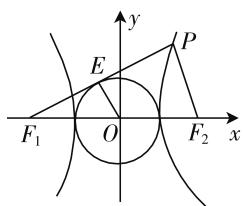
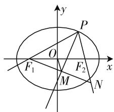
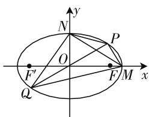

# 重视几何思路求解圆锥曲线问题

# 广东省深圳市翠园中学 丁书明

在求解圆锥曲线有关求值、求取值范围问题时，有一类问题的题意是以几何图形的形式给出的，解题的关键就在于是否能充分发现几何条件，并转化为相应的等式或不等式，从而解决圆锥曲线的相应问题，这里蕴含着“从几何中来再到几何中去”的思维过程。本文意在分析研究近几年高考题及各地模拟题的基础上，重点说明如何利用几何关系解答圆锥曲线的综合问题，特别是最值（范围）问题。

# 一、发现图形中的几何条件

例 1 设 $F_{1}, F_{2}$ 分别是双曲线 $\frac{x^{2}}{a^{2}} - \frac{y^{2}}{b^{2}} = 1$ 的左、右焦点，O 为坐标原点，过左焦点 $F_{1}$ 作直线 $F_{1}P$ 与圆 $x^{2} + y^{2} = a^{2}$ 切于点 E，与双曲线右支交于点 P，且满足 $\overrightarrow{OE} = \frac{1}{2} (\overrightarrow{OF_{1}} + \overrightarrow{OP})$ ， $|OE| = \sqrt{3}$ ，则双曲线的方程为（）.

A. $\frac{x^{2}}{6}-\frac{y^{2}}{12}=1$

B. $\frac{x^{2}}{6}-\frac{y^{2}}{9}=1$

C. $\frac{x^{2}}{3}-\frac{y^{2}}{6}=1$

D. $\frac{x^{2}}{3}-\frac{y^{2}}{12}=1$

分析: 首先结合题意画图, 如图 1 所示, 然后尽可能地发现题目中的几何条件:

本题的几何条件非常丰富：

text_image

y
E
P
F₁ O F₂ x

图1

① 因为 $F_{1}P$ 与圆 O 相切，
则 $OE \perp F_{1}P$ ;  
② 因为 $\overrightarrow{OE}=\frac{1}{2}(\overrightarrow{OF_{1}}+\overrightarrow{OP})$ ，则 E 为线段 $F_{1}P$ 的中点；  
③ 因为 OE 是线段 $F_{1}P$ 的中垂线，所以 $\left|OF_{1}\right|=$ $\left|OP\right|=c$ ;  
④ 圆 O 的半径为 a，又因为 $\left|OE\right|=\sqrt{3}$ ，故 $a=\sqrt{3}$ ;  
⑤ 又 O 是 $F_{1}F_{2}$ 的中点, 所以 OE 是 $\triangle F_{1}PF_{2}$ 的

中位线,所以 $OE \parallel PF_{2}$ ;

⑥ 由 $\angle F_{1}PF_{2}=90^{\circ}, |PF_{2}|=2|OE|=2\sqrt{3}$ , 再由勾股定理求出半焦距 $c$ 和短半轴 $b$ , 以下略.

答案:D.

方法规律:本题为应用几何条件解题的典型例题,揭示解题过程如下:

(1) 结合审题将数学语言转化为图形语言, 然后画出准确的图形.  
(2) 尽可能地发现图形中的几何条件, 如本题中的 E 为线段 $PF_{1}$ 的中点、 $OE \perp PF_{1}$ 、 $OE \parallel PF_{2}$ ，还有 $Rt\triangle OEF_{1}, Rt\triangle F_{2}PF_{1}, Rt\triangle OEF_{1} \sim Rt\triangle F_{2}PF_{1}$ 等.  
(3) 找到图形中与待定系数的关系: 如圆 O 的半径 $r = OE = a = \sqrt{3}$ , $F_{1}F_{2} = 2c$ , $PF_{2} = 2OE = 2\sqrt{3}$ , $PF_{1}^{2} + PF_{2}^{2} = F_{1}F_{2}^{2} = 4c^{2}$ .  
(4) 将等量关系转化为 a, b, c 的方程或不等式进行求解.

# 二、等量线段转移

例 2 已知 P 是椭圆 $\frac{x^{2}}{16} + \frac{y^{2}}{8} = 1$ 上非顶点的动点， $F_{1}$ 、 $F_{2}$ 分别是椭圆的左、右焦点，O 为坐标原点，若 M 为 $\angle F_{1}PF_{2}$ 的平分线上一点，且 $\overrightarrow{F_{1}M} \cdot \overrightarrow{MP} = 0$ ，则 $|\overrightarrow{OM}|$ 的取值范围为（）.

A. $(0,3]$ B. $(0,2\sqrt{2} ]$ C. $(0,3)$ D. $(0,2\sqrt{2})$

分析: 如图 2 所示, 不妨设 P 点在第一象限.

① 由题意可知点 M 在 $\angle F_{1}PF_{2}$ 的平分线上，由 $\overrightarrow{F_{1}M} \cdot \overrightarrow{MP} = 0$ 可知 $PM \perp F_{1}M$ ，这就是本题最核心的几何条件；  
②那么延长 $F_{1}M$ 交直线

$PF_{2}$ 于 N，再观察又可以发现 PM 为线段 $F_{1}N$ 的垂直平分线，于是 $\triangle PF_{1}N$ 为等腰三角形，故 $\left|PF_{1}\right|=$

text_image

y
P
O
F₁
M
F₂
x
N

图2

$|PN|$ ;

③ 又可以发现 OM 为 $\triangle F_{1}F_{2}N$ 的中位线，故 $|OM|=\frac{1}{2}|F_{2}N|$ . 这样线段 OM 的长就转化为线段 $F_{2}N$ 的长，实现第一次线段等量转移；  
④ 再由 $\left|PF_{1}\right|=\left|PN\right|$ ， $\left|F_{2}N\right|=\left|PN\right|-\left|PF_{2}\right|=\left|PF_{1}\right|-\left|PF_{2}\right|$ ，实现线段第二次等量转移.

设点 $P(x_0, y_0)$ ，由焦半径公式得， $|PF_1| - |PF_2| = (a + ex_0) - (a - ex_0) = 2ex_0$ ，故 $|\overrightarrow{OM}| = ex_0$ ，因为 $a = 4, c = 2\sqrt{2}$ ，所以 $e = \frac{\sqrt{2}}{2}, x_0 \in (0, 4)$ ，所以 $|\overrightarrow{OM}| = 3x_0 \in (0, 2\sqrt{2})$ 。

答案:D.

方法规律:本题通过等腰三角形实现了线段的等量转移,与此类似的线段等量转移还有:

(1) 利用对称轴等量转移线段；  
(2) 同圆的两个半径相等;  
(3) 抛物线上的点到焦点和到准线的距离相等;  
(4) 运用椭圆的定义、双曲线的定义等.

# 三、等量面积的转移

例 3 已知 $A(1,0)$ ，动点 C 在 $\odot B:(x+1)^{2}+y^{2}=8$ 上运动。线段 AC 的中垂线与 BC 交于 D。

(1) 求 D 点的轨迹 E 的方程;  
(2) 曲线 E 与 x 轴正半轴、y 轴正半轴分别交于点 M, N, 直线 l 过原点交曲线 E 于点 P, Q (P 在第一象限), 求四边形 PMQN 面积的最大值.

分析:(1)E 的方程为 $\frac{x^{2}}{2}+y^{2}=1$ .(过程略)

(2) 首选四边形的面积可化为两个三角形面积之和, 即 $S_{四边形PMQN} = S_{\triangle PMQ} + S_{PNQ}$ , 因为 O 为线段 PQ 的中点, $S_{\triangle PMQ} = 2S_{\triangle PMO}, S_{\triangle PNQ} = 2S_{\triangle PNO}$ , 所以 $S_{四边形PMQN} = 2S_{\triangle PMO} + 2S_{\triangle PNO} = 2S_{PMON}$ .

text_image

y
N
P
O
F'
Q
F M x

图3

因为 $S_{PMON}=S_{\triangle MON}+S_{\triangle MPN}, S_{四边形PMQN}=2S_{\triangle MON}$ $+2S_{\triangle MPN}$ ，其中 $S_{\triangle MON}=\frac{1}{2}\cdot OM\cdot ON=\frac{1}{2}\times\sqrt{2}\times1=\frac{\sqrt{2}}{2}$ ，所以 $S_{四边形PMQN}=\sqrt{2}+2S_{\triangle MPN}$ ，故只要求 $\triangle MPN$

面积的最大值即可.

这一段非常精彩:首先把四边形 PMQN 的面积转化为两个三角形面积之和,由于 O 是线段 PQ 的中点,NO 是 $\triangle PQN$ 的中线,MO 是 $\triangle PMQ$ 的中线这个几何条件,所以原四边形的面积转化为四边形 PMON 面积的两倍.这一过程充分体现了解题过程中要挖掘出等量面积的思路;将四边形 PMQN 的面积的最大值一步步地转化最终为求 $\triangle MPN$ 面积的最大值.

精彩继续:求 $S_{\triangle PMN}$ 的最大值,由于边长 MN 为定值,故只要求点 P 到直线 MN 距离的最大值,用什么方法呢?

代数法思路: 可以考虑三角换元再求点到直线的距离的最大值.

几何法思路: 将直线 MN 向上方平移, 平移到与椭圆相切时, 切点到直线 MN 的距离最大. 以下略解:

设直线 m 的方程为 $y = -\frac{\sqrt{2}}{2}x + t$ ，联立方程组 $\left\{\begin{aligned}\frac{x^{2}}{2}+y^{2}=1,\quad&消元得 x^{2}-\sqrt{2}tx+t^{2}-1=0\quad①,\\ y=-\frac{\sqrt{2}}{2}x+t,\end{aligned}\right.$

令 $\Delta = 2t^2 -4(t^2 -1) = 0$ ，得 $t = \sqrt{2}$ 或 $t = -\sqrt{2}$ （舍去）.

把 $t=\sqrt{2}$ 代入①得 x=1，故点 $P\left(1,\frac{\sqrt{2}}{2}\right)$ . 此时三角形 MPN 的面积最大. 以下略.

从以上例子可以看出,平面几何的条件对求解解析几何问题至关重要,如果能充分发掘几何条件,可以使问题变得巧妙简洁,特别是有关等量转移及有关最值与范围问题,特别要养成“从几何中来,到几何中去”的思考习惯.

# 参考文献：

[1] 谢丽萍, 贺平. 平面几何知识在解析几何问题求解中的运用 [J]. 福建中学数学, 2013(9).  
[2] 杨丽萍. 解析几何最值求解方略 [J]. 中学数学 (上), 2013(2).  
[3] 高鹤. 挖掘几何条件 突破运算难关 [J]. 中国数学教育, 2019(3). F