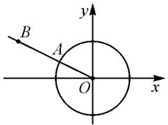
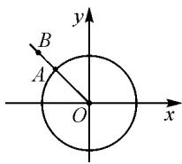

# 一类三角函数问题的多种解法

# ●山东省淄博实验中学 李象林 许修花 崔娟

# 1 例题呈现

例 1 设当 $x=\theta$ 时，函数 $f(x)=\sin x-2\cos x$ 取得最大值，则 $\cos\theta=$ \_\_\_\_.

解法1：利用辅助角公式 $a\sin x + b\cos x = \sqrt{a^2 + b^2}\sin (x + \varphi)(ab\neq 0)$ ，其中 $\tan \varphi = \frac{b}{a}$ ，可得

$$
\begin{array}{l} f (x) = \sin x - 2 \cos x \\ = \sqrt {5} \left(\frac {\sqrt {5}}{5} \sin x - \frac {2 \sqrt {5}}{5} \cos x\right) \\ = \sqrt {5} \sin (x - \varphi), \\ \end{array}
$$

其中 $\sin\varphi=\frac{2\sqrt{5}}{5},\cos\varphi=\frac{\sqrt{5}}{5},f(x)$ 的最大值为 $\sqrt{5}$ ，此时 $x=\theta$ ，于是 $\sin(\theta-\varphi)=1$ ，因此 $\theta-\varphi=\frac{\pi}{2}+2k\pi, k\in Z.$

所以 $\theta = \varphi +\frac{\pi}{2} +2k\pi ,k\in \mathbf{Z}.$

故 $\cos \theta = \cos (\varphi +\frac{\pi}{2} +2k\pi) = -\sin \varphi = -\frac{2\sqrt{5}}{5}.$

解法 2: 向量法.

令 $\vec{m} = (\cos x, \sin x), \vec{n} = (-2, 1)$ ，于是 $f(x) = \vec{m} \cdot \vec{n} = |\vec{m}| |\vec{n}| \cos \langle \vec{m}, \vec{n} \rangle \leqslant |\vec{m}| |\vec{n}|$ ，当且仅当 $\cos \langle \vec{m}, \vec{n} \rangle = 1$ 时等号成立，此时向量 $\vec{m}, \vec{n}$ 共线且同向.而点 $A(\cos x,\sin x)$ 为单位圆 $x^{2} + y^{2} = 1$ 上一点， $B(-2,1)$ 为平面内一定点.如图1，此时， $A$ 为射线 $OB$ 与单位圆 $x^{2} + y^{2} = 1$ 的交点.

text_image

B
A
O
x
y

图 1

因此，若当 $x = \theta$ 时， $f(x)$ 最大，由三角函数的定义可知， $\cos \theta = \frac{-2}{\sqrt{(-2)^2 + 1^2}} = -\frac{2\sqrt{5}}{5}$ .

解法 3: 导数法.

当 $x=\theta$ 时，函数 $f(x)=\sin x-2\cos x$ 取得最大值，最大值为 $\sqrt{5}$ ，所以， $x=\theta$ 为 $f(x)=\sin x-2\cos x$ $(x\in\mathbf{R})$ 的极大值点，因此 $f'(\theta)=0$ ，即

$$
\cos \theta + 2 \sin \theta = 0. \tag {①}
$$

又因为

$$
\sin \theta - 2 \cos \theta = \sqrt {5}, \tag {②}
$$

所以，由①-②×2，可得 $\cos\theta=-\frac{2\sqrt{5}}{5}$ .

例 2 若 $\sin \alpha - \cos \alpha = \sqrt{2}, \alpha \in (0, \pi)$ ，则 $\tan \alpha = (\quad)$ .

A.-1 B. $-\frac{\sqrt{2}}{2}$ C. $\frac{\sqrt{2}}{2}$ D.1

解法 1: 利用辅助角公式, 可得

$$
\begin{array}{l} \sin \alpha - \cos \alpha = \sqrt {2} \left(\frac {\sqrt {2}}{2} \sin \alpha - \frac {\sqrt {2}}{2} \cos \alpha\right) \\ = \sqrt {2} \sin \left(\alpha - \frac {\pi}{4}\right). \\ \end{array}
$$

若 $\sin \alpha - \cos \alpha = \sqrt{2}, \alpha \in (0, \pi)$ , 则 $\sin \left(\alpha - \frac{\pi}{4}\right) = 1$ .

由 $\alpha \in (0, \pi)$ , 可知 $\alpha - \frac{\pi}{4} \in \left(-\frac{\pi}{4}, \frac{3\pi}{4}\right)$ .

于是 $\alpha - \frac{\pi}{4} = \frac{\pi}{2}$ ，则 $\alpha = \frac{3\pi}{4}$ .

故 $\tan \alpha = -1$ .

解法 2: 向量法.

令 $\vec{m} = (\cos \alpha, \sin \alpha), \vec{n} = (-1, 1)$ ，于是 $\vec{m} \cdot \vec{n} = |\vec{m}| |\vec{n}| \cdot \cos \langle \vec{m}, \vec{n} \rangle \leqslant |\vec{m}| |\vec{n}|$ ，当且仅当 $\cos \langle \vec{m}, \vec{n} \rangle = 1$ 时，等号成立，此时向量 $\vec{m}, \vec{n}$ 共线且同向。又因为点$A(\cos x, \sin x)$ 为单位圆 $x^{2} + y^{2} = 1$ 上一点， $B(-1, 1)$ 为平面内一定点，如图 2，所以 A 为射线 OB 与单位圆 $x^{2} + y^{2} = 1$ 的交点.

text_image

y
B
A
O
x

图2

因此，当 $\sin \alpha -\cos \alpha = \sqrt{2},\alpha \in (0,\pi)$ 时，由三角

函数的定义知 $\tan \alpha = -1$ .

解法 3: 导数法.

$$
f (x) = \sin x - \cos x, x \in (0, \pi).
$$

若当 $x = \alpha$ 时，函数 $f(x) = \sin x - \cos x$ 取得最大值 $\sqrt{2}$ ，此时 $\alpha \in (0, \pi)$ ，于是 $x = \alpha$ 为 $f(x) = \sin x - \cos x, x \in (0, \pi)$ 的极大值点，因此 $f'(\alpha) = 0$ ，即

$$
\cos \alpha + \sin \alpha = 0.
$$

因此，可得 $\tan \alpha = -1$ .

# 2 总结提升

对于方程 $a \sin x + b \cos x = \sqrt{a^{2} + b^{2}}$ :

(1) 由于 $y = a \sin x + b \cos x = \sqrt{a^2 + b^2} \cdot \left( \frac{a}{\sqrt{a^2 + b^2}} \sin x + \frac{b}{\sqrt{a^2 + b^2}} \cos x \right) = \sqrt{a^2 + b^2} \sin (x + \varphi)$ ,

其中 $\sin\varphi=\frac{b}{\sqrt{a^{2}+b^{2}}},\cos\varphi=\frac{a}{\sqrt{a^{2}+b^{2}}}$ ，因此，当 $a\sin x+b\cos x=\sqrt{a^{2}+b^{2}}$ 时， $\sin(x+\varphi)=1$ ，于是 $x+\varphi=\frac{\pi}{2}+2k\pi,k\in\mathbf{Z},x=-\varphi+\frac{\pi}{2}+2k\pi$ ，此时

$$
\sin x = \sin (- \varphi + \frac {\pi}{2} + 2 k \pi) = \cos \varphi ,
$$

$$
\cos x = \cos (- \varphi + \frac {\pi}{2} + 2 k \pi) = \sin \varphi .
$$

(2) 令 $\vec{m} = (\cos x, \sin x), \vec{n} = (b, a)$ ，于是 $f(x) = \vec{m} \cdot \vec{n} = |\vec{m}| |\vec{n}| \cos \langle \vec{m}, \vec{n} \rangle \leqslant |\vec{m}| |\vec{n}|$ ，当且仅当 $\cos \langle \vec{m}, \vec{n} \rangle = 1$ 时等号成立，此时向量 $\vec{m}, \vec{n}$ 共线且同向，而点 $A(\cos x, \sin x)$ 为单位圆 $x^2 + y^2 = 1$ 上一点， $B(b, a)$ 为平面内一定点。如图1，此时， $A$ 为射线 $OB$ 与单位圆 $x^2 + y^2 = 1$ 的交点。

因此，若当 $x=\theta$ 时， $f(x)$ 最大，由三角函数的定义可知， $\cos\theta=\frac{b}{\sqrt{a^{2}+b^{2}}}$ ， $\sin\theta=\frac{a}{\sqrt{a^{2}+b^{2}}}$ .

(3)对于方程 $a\sin x + b\cos x = \sqrt{a^2 + b^2}$ ，即函数 $f(x) = a\sin x + b\cos x$ 在 $x = \theta$ 处达到了最大值，由于 $x \in \mathbf{R}$ ，因此 $x = \theta$ 是 $f(x) = a\sin x + b\cos x$ 的极大值点，故 $f'(\theta) = 0$ ，再结合 $a\sin \theta + b\cos \theta = \sqrt{a^2 + b^2}$ ，即可解出 $\sin \theta, \cos \theta$ 。如果题目求 $\tan \theta$ ，由 $f'(\theta) = 0$ 即可快速求出，非常方便。

同理,对于方程 $a \sin x + b \cos x = -\sqrt{a^{2} + b^{2}}$ 也可用上述三种方法来解决.

# 3 练习巩固

为了让学生灵活掌握上述几种方法,可以提供以下练习.

(1)(2020·北京卷)若函数 $f(x)=\sin(x+\varphi)+\cos x$ 的最大值为 2，则常数 $\varphi$ 的一个取值为 \_\_\_\_.

(2)(2008·浙江卷理)若 $\cos\alpha+2\sin\alpha=-\sqrt{5}$ ，则 $\tan\alpha=(\quad)$ .

A. $\frac{1}{2}$

B.2

C. $-\frac{1}{2}$

D.-2

(3)(2007年全国高中数学联赛河南预赛题)若 $7\sin\alpha+24\cos\alpha=25$ ，求 $\tan\alpha$ 的值.

# 4 练习的提示及参考答案

(1)根据两角和的正弦公式,可得

$$
f (x) = \cos \varphi \sin x + (\sin \varphi + 1) \cos x.
$$

由于 $\sin x, \cos x$ 的系数为参数, $f(x)$ 的最大值是确定的值 2, 因此可以采取辅助角快速解决:

由 $f(x)=\sqrt{\cos^{2}\varphi+(\sin\varphi+1)^{2}}\sin(x+\theta)$ ，可得 $\sqrt{\cos^{2}\varphi+(\sin\varphi+1)^{2}}=2.$

所以，解得 $\sin \varphi = 1$ ，故可取 $\varphi = \frac{\pi}{2}$

故答案为： $\frac{\pi}{2}(2k\pi+\frac{\pi}{2},k\in\mathbf{Z}$ 均可).

(2)由于 $\sqrt{1^{2}+2^{2}}=5$ ，因此 $\cos\alpha+2\sin\alpha=-\sqrt{5}$ 可以看作函数 $f(x)=\cos x+2\sin x$ 在 $x=\alpha$ 处达到了最小值 $-\sqrt{5}$ ，故可以用导数法快速解决：

$f'(x) = -\sin x + 2\cos x, f'(\alpha) = -\sin \alpha + 2\cos \alpha = 0$ ，因此 $\tan \alpha = 2$ 。故选：B.

(3)由于 $\sqrt{7^{2}+24^{2}}=25$ ，因此 $7\sin\alpha+24\cos\alpha=25$ 可以看作函数 $f(x)=7\sin x+24\cos x$ 在 $x=\alpha$ 处达到了最大值 25，故可以用向量法或导数法快速解决。不妨采取向量法：

令 $\vec{m} = (\cos \alpha, \sin \alpha), \vec{n} = (24, 7)$ ，则 $y = \vec{m} \cdot \vec{n} = |\vec{m}| |\vec{n}| \cos \langle \vec{m}, \vec{n} \rangle = 25\cos \langle \vec{m}, \vec{n} \rangle = 25$ ，于是 $\cos \langle \vec{m}, \vec{n} \rangle = 1$ ，此时 $\vec{m}, \vec{n}$ 共线同向，故 $\tan \alpha = \frac{7}{24}$ .