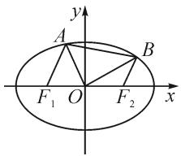
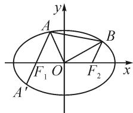

# 一道圆锥曲线题的三种解题动机

——以 2022 年新课标 I 卷第 21 题第(1)问为例

●华中师范大学第一附属中学 付靖宜

摘要: 圆锥曲线问题是高中数学教学的重点及难点. 本研究重点探究了 2022 年新课标 I 卷第 21 题第(1)问的多种解法. 解法一是基于教材例题的解法, 直接求出题目中点的坐标; 解法二是利用韦达定理将限制条件整体表示出来; 解法三是借助常用结论解题. 同时, 将这三种解题动机应用到补充例题中, 加强对这三种方法的解析说明.

关键词: 圆锥曲线题; 点的坐标; 韦达定理; 常用结论

# 1 真题呈现

(2022年新课标卷第21题)已知点A(2,1)在双曲线 $C:\frac{x^{2}}{a^{2}}-\frac{y^{2}}{a^{2}-1}=1(a>1)$ 上，直线l交C于P,Q两点，直线AP,AQ的斜率之和为0.

(1) 求 $l$ 的斜率；  
(2) 若 $\tan\angle PAQ=2\sqrt{2}$ ，求 $\triangle PAQ$ 的面积。（此问解答略。）

# 2 三种动机解题

此题第(1)问涉及到的直线较多,且图形条件较抽象,在处理时容易产生混乱.首先我们可以想到,由于P,Q两点均在直线l上,若求得P,Q两点的坐标,则直线l的斜率自然可得.同时,P,Q两点地位相同,利用直线AP,AQ的斜率之和为0求得点P的坐标后,点Q的坐标同理可得.解答过程如下.

解法一: 求出各点坐标.

(1)由点 $A(2,1)$ 在双曲线 $C: \frac{x^2}{a^2} - \frac{y^2}{a^2 - 1} = 1 (a > 1)$ 上，将点的坐标代入方程，得 $a^2 = 2$ ，则双曲线 $C$ 的方程为 $\frac{x^2}{2} - y^2 = 1$ .

由题意可知,直线 AP 的斜率存在,设为 k.

联立 $\left\{\begin{aligned}y-1&=k(x-2),\\ \frac{x^{2}}{2}-y^{2}&=1,\end{aligned}\right.$ 可得

$$
(1 - 2 k ^ {2}) x ^ {2} + (8 k ^ {2} - 4 k) x - 8 k ^ {2} + 8 k - 4 = 0.
$$

由韦达定理, 可知 $x_{A}x_{P}=\frac{8k^{2}-8k+4}{2k^{2}-1}$ .

由 $x_{A}=2$ ，可得 $x_{P}=\frac{4k^{2}-4k+2}{2k^{2}-1}$ .

所以点 $P$ 的坐标为

$$
P \left(\frac {4 k ^ {2} - 4 k + 2}{2 k ^ {2} - 1}, \frac {- 2 k ^ {2} + 4 k - 1}{2 k ^ {2} - 1}\right).
$$

由于直线 AP, AQ 的斜率之和为 0, 则将 k 替换成 -k, 可得点 Q 的坐标为

$$
Q \left(\frac {4 k ^ {2} + 4 k + 2}{2 k ^ {2} - 1}, \frac {- 2 k ^ {2} - 4 k - 1}{2 k ^ {2} - 1}\right).
$$

所以，直线 l 的斜率为

$$
k _ {l} = \frac {y _ {Q} - y _ {P}}{x _ {Q} - x _ {P}} = \frac {\frac {- 2 k ^ {2} - 4 k - 1}{2 k ^ {2} - 1} - \frac {- 2 k ^ {2} + 4 k - 1}{2 k ^ {2} - 1}}{\frac {4 k ^ {2} + 4 k + 2}{2 k ^ {2} - 1} - \frac {4 k ^ {2} - 4 k + 2}{2 k ^ {2} - 1}} = - 1.
$$

上述解法基于直线 $AP$ 交双曲线于 $A, P$ 两点，而点 $A$ 坐标已知，只要设出直线 $AP$ 的斜率，点 $P$ 的坐标就可求。点 $Q$ 的坐标同理可得。这是解决圆锥曲线问题的通性通法之一：若点的坐标可求，那么所有问题均可迎刃而解。这其实也是新版、旧版教材中此类例题都选择的方法。此方法对思维水平的要求不高，但是对计算能力的要求较高。而基于直线 $l$ 交 $C$ 于 $P, Q$ 两点，也可从直线 $PQ$ 入手。“直线 $AP, AQ$ 的斜率之和为0”这一条件相当于限制了直线 $PQ$ 的斜率，则可利用韦达定理将此限制条件整体表示出，而略过对点的坐标的求解。

解法二: 利用韦达定理整体表示出限制条件.

(1)由点 $A(2,1)$ 在双曲线 $C: \frac{x^2}{a^2} - \frac{y^2}{a^2 - 1} = 1 (a > 1)$ 上，将点的坐标代入方程，可得 $a^2 = 2$ ，则双曲线 $C$ 的方程为 $\frac{x^2}{2} - y^2 = 1$ .

由题意可知,直线 l 的斜率存在,设为 k.

设直线 $l: y = kx + m, P(x_{1}, y_{1}), Q(x_{2}, y_{2})$ .

联立 $\left\{\begin{aligned}y=kx+m,\\ \frac{x^{2}}{2}-y^{2}=1,\end{aligned}\right.$ 可得

$$
(2 k ^ {2} - 1) x ^ {2} + 4 k m x + 2 m ^ {2} + 2 = 0.
$$

由韦达定理, 可知

$$
x _ {1} + x _ {2} = - \frac {4 k m}{2 k ^ {2} - 1}, x _ {1} x _ {2} = \frac {2 m ^ {2} + 2}{2 k ^ {2} - 1}.
$$

由 $k_{AP} + k_{AQ} = \frac{y_1 - 1}{x_1 - 2} +\frac{y_2 - 1}{x_2 - 2} = \frac{kx_1 + m - 1}{x_1 - 2} +$ $\frac{kx_2 + m - 1}{x_2 - 2} = 0$ ，化简，可得

$$
2 k x _ {1} x _ {2} + (m - 1 - 2 k) \left(x _ {1} + x _ {2}\right) - 4 (m - 1) = 0.
$$

即 $2k \cdot \frac{2m^2 + 2}{2k^2 - 1} + (m - 1 - 2k)(-\frac{4km}{2k^2 - 1}) - 4(m - 1) = 0.$

整理,可得 $(k+1)(m+2k-1)=0$ .

又直线 l 不过点 A，则有 k = -1。

此解法是解决圆锥曲线问题的基本方法: 在不求点的坐标的前提下, 利用韦达定理翻译得到限制条件对参数的约束. 而由于 A, P, Q 三点均在此双曲线上, 且约束条件涉及到斜率, 此题也可以利用二次曲线的 “点差法” 得到的常用结论, 进而对图形作另一种解析.

解法三: 利用常用结论.

(1)由点 $A(2,1)$ 在双曲线 $C:\frac{x^{2}}{a^{2}}-\frac{y^{2}}{a^{2}-1}=1(a>1)$ 上，将点的坐标代入方程，可得 $a^{2}=2$ ，则双曲线 C 的方程 $\frac{x^{2}}{2}-y^{2}=1$ .

设 $P(x_{1},y_{1}), Q(x_{2},y_{2})$ . 由 A, P 两点均在双曲线 C 上, 得

$$
\left\{ \begin{array}{l l} \frac {x _ {1} ^ {2}}{2} - y _ {1} ^ {2} = 1, & \\ \frac {2 ^ {2}}{2} - 1 ^ {2} = 1. & \end{array} \right. \tag {①}
$$

①②式相减，可得 $\frac{y_{1}-1}{x_{1}-2}=\frac{x_{1}+2}{2(y_{1}+1)}$ .

同理可得

$$
\frac {y _ {2} - 1}{x _ {2} - 2} = \frac {x _ {2} + 2}{2 (y _ {2} + 1)}, \frac {y _ {1} - y _ {2}}{x _ {1} - x _ {2}} = \frac {x _ {1} + x _ {2}}{2 (y _ {1} + y _ {2})}.
$$

又直线 AP, AQ 的斜率之和为 0, 则有

$$
k _ {A P} + k _ {A Q} = \frac {y _ {1} - 1}{x _ {1} - 2} + \frac {y _ {2} - 1}{x _ {2} - 2} = 0, \tag {③}
$$

$$
\frac {x _ {1} + 2}{2 (y _ {1} + 1)} + \frac {x _ {2} + 2}{2 (y _ {2} + 1)} = 0. \tag {④}
$$

化简③④式,可得

$$
\left\{ \begin{array}{l} x _ {1} y _ {2} + x _ {2} y _ {1} - (x _ {1} + x _ {2}) - 2 (y _ {1} + y _ {2}) + 4 = 0, \\ x _ {1} y _ {2} + x _ {2} y _ {1} + (x _ {1} + x _ {2}) + 2 (y _ {1} + y _ {2}) + 4 = 0. \end{array} \right.
$$

两式作差,可得 $(x_{1}+x_{2})+2(y_{1}+y_{2})=0.$

故 $k_{PQ} = \frac{y_1 - y_2}{x_1 - x_2} = \frac{x_1 + x_2}{2(y_1 + y_2)} = -1.$

# 3 解法推广应用

现将求出各点坐标、利用韦达定理整体表示出限制条件以及利用常用结论这三种圆锥曲线的解题动机运用至其他圆锥曲线题目中，下面举例说明.

补充例题 如图 1, 过椭圆 $C: \frac{x^{2}}{a^{2}} + \frac{y^{2}}{b^{2}} = 1 (a > b > 0)$ 的左、右焦点 $F_{1}, F_{2}$ 分别作斜率为 $2\sqrt{2}$ 的直线交椭圆 C 上半部分于 A, B 两点, 若 $S_{\triangle AOF_{1}} : S_{\triangle BOF_{2}} = 7:5$ , 求椭圆 C 的离心率.

text_image

y
A
B
F₁ O F₂ x

图1

解法一: 求出各点坐标.

设 $A(x_{1},y_{1}), B(x_{2},y_{2})$ ，依题意得 $\frac{y_{1}}{y_{2}}=\frac{7}{5}$ .

设 $F_{1}(-c,0)$ ，则将 $l_{AF_1}:x = \frac{\sqrt{2}}{4} y - c$ 与椭圆 $C$ 的方程联立，可得 $\left(\frac{1}{8} b^2 +a^2\right)y^2 -\frac{\sqrt{2}}{2} b^2 cy - b^4 = 0.$

又 $y_{1} > 0$ ，可解得 $y_{1} = \frac{\frac{\sqrt{2}}{2}b^{2}c + \frac{3\sqrt{2}}{2}ab^{2}}{2\left(\frac{1}{8}b^{2} + a^{2}\right)}.$

同理， $y_{2}=\frac{-\frac{\sqrt{2}}{2}b^{2}c+\frac{3\sqrt{2}}{2}ab^{2}}{2\left(\frac{1}{8}b^{2}+a^{2}\right)}$ .

所以 $\frac{y_1}{y_2} = \frac{\frac{\sqrt{2}}{2}b^2c + \frac{3\sqrt{2}}{2}ab^2}{-\frac{\sqrt{2}}{2}b^2c + \frac{3\sqrt{2}}{2}ab^2} = \frac{7}{5}.$

整理化简,可得 2c=a.

故椭圆 C 的离心率 $e=\frac{c}{a}=\frac{1}{2}$ .

解法二:韦达定理整体表示出限制条件.

如图 2, 设直线 $AF_{1}$ 的方程为 $x=\frac{\sqrt{2}}{4}y-c$ .

由图可知, 直线 $AF_{1}$ 与椭圆的另一交点为点 B 关于原点的对称点, 记为点 $A'$ .

text_image

y
A
B
F₁ O F₂ x
A′

图2

设 $A(x_{1},y_{1}), A'(x_{2},y_{2})$ ，联立 $\left\{\begin{aligned} x &= \frac{\sqrt{2}}{4} y - c, \\ \frac{x^{2}}{a^{2}} + \frac{y^{2}}{b^{2}} &= 1, \end{aligned}\right.$ 可

得 $\left(\frac{1}{8} b^2 + a^2\right)y^2 - \frac{\sqrt{2}}{2} cb^2y - b^4 = 0.$ （下转第60页）

由正切函数 $y = \tan x$ 在 $\left(0, \frac{\pi}{2}\right)$ 上单调递增，可得 $\tan \frac{1}{3} < \tan \frac{1}{2}$ .

又 $\tan \frac{1}{2} < \tan \frac{\pi}{6} = \frac{\sqrt{3}}{3}, \cos \frac{1}{2} > \cos \frac{\pi}{6} = \frac{\sqrt{3}}{2}$ , 所以 $\cos \frac{1}{2} > \tan \frac{1}{2} > \tan \frac{1}{3} > \frac{1}{3} > \sin \frac{1}{3}$ , 即 $c > d > a > b$ . 故选项 B 正确.

# 6 教学启示

# 6.1 策略归纳,方法阐述

高考中涉及函数值或参数的大小比较问题,经常以指数式、对数式、根式、分式或三角函数式等形式创设,渗透基本初等函数(以幂函数、指数函数、对数函数、三角函数等为主),综合数学运算与恒等变形,或直接利用对应函数的图象与性质来分析与处理,或借助函数的构建与导数的应用来转化,或利用一些特殊的性质(如以上问题中的三角函数线的性质、重要切线不等式性质等)来解决,都是解决大小比较问题的常用技巧方法.

# 6.2 热点考查,能力体现

函数值或参数的大小比较问题,是近年新高考数学试卷中一类比较常见的题型,热度高,题型多变,有时以单项选择题的形式出现,有时以多项选择题的形式出现,难度往往比较高,经常出现在压轴题的位置.此类问题合理渗入函数与方程、函数与导数等相关知识,同时巧妙融入数学抽象、数学运算、直观想象等核心素养,融合“函数”与“图象”加以数形结合,结合“函数”与“性质”进行逻辑推理,是数学能力的全面综合体现.Z

# (上接第53页)

由韦达定理,可得

$$
y _ {1} + y _ {2} = \frac {\frac {\sqrt {2}}{2} c b ^ {2}}{\frac {1}{8} b ^ {2} + a ^ {2}}, \tag {⑤}
$$

$$
y _ {1} y _ {2} = \frac {- b ^ {4}}{\frac {1}{8} b ^ {2} + a ^ {2}}. \tag {6}
$$

又由 $S_{\triangle AOF_{1}}:S_{\triangle BOF_{2}}=7:5$ , 可知 $\frac{y_{1}}{y_{2}}=-\frac{7}{5}$ .

所以 $\frac{(y_1 + y_2)^2}{y_1y_2} = \frac{y_1}{y_2} +\frac{y_2}{y_1} +2 = -\frac{4}{35}.$

将⑤⑥式代入上式，得 $\frac{\frac{1}{2}c^{2}}{\frac{1}{8}b^{2}+a^{2}}=\frac{4}{35}.$

整理,可得 $\frac{c}{a}=\frac{1}{2}$ .故离心率为 $\frac{1}{2}$ .

解法三: 利用常用结论.

设直线 $AF_{1}$ 的倾斜角为 $\alpha$ ，则 $\tan \alpha = 2\sqrt{2}$ 。记椭圆的“焦准距”为 p。

如图 3, 过点 A, $A'$ 分别作左准线的垂线, 垂足为 $A_{1}$ , $A_{1}'$ . 由椭圆的第二定义, 得

text_image

A₁
A
α
F₁O
F₂
A′
A′
B
x
y

图3

$$
\left| A F _ {1} \right| = e \left| A A _ {1} \right| = e (p + \left| A F _ {1} \right| \cdot \cos \alpha),
$$

$$
\left| A ^ {\prime} F _ {1} \right| = \left| B F _ {2} \right| = e (p - \left| B F _ {2} \right| \cdot \cos \alpha).
$$

所以 $\left|AF_{1}\right|=\frac{ep}{1-e\cos\alpha},\left|A^{\prime}F_{1}\right|=\frac{ep}{1+e\cos\alpha}.$

又由 $S_{\triangle AOF_{1}} : S_{\triangle BOF_{2}} = 7 : 5$ ，得

$$
\frac {\left| A F _ {1} \right|}{\left| A ^ {\prime} F _ {1} \right|} = \frac {\left| A F _ {1} \right|}{\left| B F _ {2} \right|} = \frac {7}{5}.
$$

所以 $\frac{1 + e\cos\alpha}{1 - e\cos\alpha} = \frac{7}{5}.$

由 $\tan \alpha = 2\sqrt{2}$ ，得 $\cos \alpha = \frac{1}{3}$ ，代入上式，得 $e = \frac{1}{2}$

此补充例题还可以选择“点差法”进行解答,计算量也较小,读者可以自行尝试.

# 4 评价反思

综上所述,本文借助解析2022年新课标Ⅰ卷第21题第(1)问时所述的三种动机为解决圆锥曲线问题提供不同的思路.动机一是选择直接将题目中的各个点的坐标求出,方法直接,应用范围极广,但是某些题目的运算可能较复杂;动机二是采用韦达定理整体表示出限制条件是最常用的通性通法,此方法要注意若对限制条件进行适当变形或可使计算更加简便;动机三是利用常用结论,是最节省时间的方法,尤其在解答选填题时可以发挥大作用,这要求学生能够有意识地积累圆锥曲线的一些二级结论,培养敏感度.三种解题动机各有利弊,在具体问题具体分析的前提下可为读者提供解决圆锥曲线问题的三大方向.Z