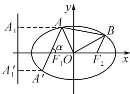

# 三角背景创设,大小关系判定

——2022年高考数学全国甲卷(理)第12题

# ●江苏省苏州市相城中学 徐仁杰

摘要: 函数值或参数的大小比较问题, 吻合“在知识的交汇点处命题”的高考命题精神, 具有很好的综合性、创新性与交汇性. 通过一道高考真题中的三角函数式的大小比较问题, 合理展开思维剖析, 展示方法技巧, 链接高考真题, 探究拓展提升, 凸显数学本质, 归纳方法技巧, 引领并指导解题研究.

关键词: 大小比较; 三角函数; 函数; 导数; 放缩

# 1 真题呈现

高考真题 [2022年高考数学全国甲卷(理)·12]已知 $a = \frac{31}{32}, b = \cos \frac{1}{4}, c = 4\sin \frac{1}{4}$ , 则（ ）.

A. $c > b > a$

B. $b > a > c$

C. $a > b > c$

D. $a > c > b$

# 2 真题剖析

此题与历年高考一些真题中大小比较问题有比较大的差别,这里以三角函数式为问题背景,回避以往常见的指数式、对数式、分式以及相互间的复合关系等形式的代数式,创新变化.

结合三角函数代数式之间的结构特征进行比较分析,常规思维是寻找以 $\frac{1}{4}$ 为变元所构建的函数式之间的规律,通过作差比较法(或作商比较法),合理构造复合型函数,利用求导处理,并利用函数的单调性来分析与处理;也可以回归三角函数式的本质特征,结合三角函数线来转化与应用,更加直接有效;还可以利用高等数学中的泰勒公式展开来转化与放缩,达到比较大小关系的判定等.

# 3 真题破解

# 3.1 函数与导数思维

方法 1: 导数法.

解析: 设函数 $f(x)=\cos x+\frac{1}{2}x^{2}-1(0<x<1)$ ，求导可得 $f'(x)=x-\sin x$ .

设函数 $g(x)=x-\sin x(0<x<1)$ ，求导可得

$$
g ^ {\prime} (x) = 1 - \cos x > 0.
$$

所以，函数 $g(x)$ 在 $(0,1)$ 上单调递增，则 $g(x) > g(0) = 0$ .

因此 $f'(x)>0$ ，可知函数 $f(x)$ 在 $(0,1)$ 上单调递增，则有 $f\left(\frac{1}{4}\right)>f(0)=0$ 。

所以 $\cos\frac{1}{4}>1-\frac{1}{2}\times\left(\frac{1}{4}\right)^{2}=\frac{31}{32}$ ，即 b>a.

而 $c - b = 4\sin \frac{1}{4} -\cos \frac{1}{4} = 4\left(\sin \frac{1}{4} -\frac{1}{4}\cos \frac{1}{4}\right)$ 设函数 $h(x) = \sin x - x\cos x(0 <   x <   1)$ ，则求导可得 $h^{\prime}(x) = x\sin x > 0.$

故函数 $h(x)$ 在 $(0,1)$ 上单调递增，则 $h\left(\frac{1}{4}\right) > h(0) = 0$ ，即 $\sin \frac{1}{4} - \frac{1}{4} \cos \frac{1}{4} > 0$ .

所以 $c - b > 0$ ，即 $c > b$

综上分析,可得 c>b>a. 故选项 A 正确.

解后反思:根据两两代数式之间的作差比较法合理构建对应的函数,通过求导处理,结合函数的单调性的判断与应用,合理确定对应代数式的大小关系.作差比较法构建函数,利用函数与导数的应用,是解决大小比较问题中比较常用的技巧方法之一.合理构建对应的函数是解决问题的关键,经常通过作差比较法、作商比较法等来构建函数.

# 3.2 三角函数思维

方法 2: 三角函数法(1).

解析：由于 $a - b = \frac{31}{32} -\cos \frac{1}{4} = \frac{31}{32} -\left(1-\right.$ $2\sin^2{\frac{1}{8}}\bigg) = 2\sin^2{\frac{1}{8}} - \frac{1}{32} = 2\left(\sin {\frac{1}{8}} +\frac{1}{8}\right)\left(\sin {\frac{1}{8}} -\frac{1}{8}\right),$ 利用三角函数线可知，当 $x \in \left(0, \frac{\pi}{2}\right)$ 时， $\sin x < x$ ，则有 $0 < \sin \frac{1}{8} < \frac{1}{8}$ ，因此 $a - b < 0$ ，即 $a < b$ 。

又 $c - b = 4\sin \frac{1}{4} -\cos \frac{1}{4} = \sqrt{17}\sin (\frac{1}{4} -\varphi)$ ，其中 $\tan \varphi = \frac{1}{4},\varphi \in \left(0,\frac{\pi}{2}\right).$

利用三角函数线可知，当 $x \in \left(0, \frac{\pi}{2}\right)$ 时， $x < \tan x$ ，则有 $\varphi < \tan \varphi = \frac{1}{4}$ ，可得 $\frac{1}{4} - \varphi \in \left(0, \frac{1}{4}\right)$ . 所以 $c - b > 0$ ，即 $c > b$ .

综上分析,可得 c>b>a. 故选项 A 正确.

解后反思:根据当 $x \in \left(0, \frac{\pi}{2}\right)$ 时,有 $\sin x < x < \tan x$ ,通过代数式的作差比较以及对应的三角恒等变换公式,分类讨论来合理确定对应代数式的大小关系.抓住三角代数式之间的关系,结合三角函数线的性质以及三角恒等变换公式的应用,综合三角函数的图象与性质来分析与解决.

方法 3: 三角函数法(2).

解析: 同方法 2 可得 a-b<0, 即 a<b.

由三角函数线可知，当 $x \in \left(0, \frac{\pi}{2}\right)$ 时，有 $x < \tan x$ 则 $\tan \frac{1}{4} > \frac{1}{4}$ ，即 $\frac{\sin \frac{1}{4}}{\cos \frac{1}{4}} > \frac{1}{4}$ ，亦即 $4\sin \frac{1}{4} > \cos \frac{1}{4}$ ，故 $c > b$ .

综上分析,可得 c>b>a. 故选项 A 正确.

解后反思:与方法2中三角函数法进行比较,这里在判断b与c的大小关系时,直接利用三角函数线的性质,巧妙地判断相应代数式的大小关系.这样处理起来更加直接简单,关键是抓住三角函数代数式的恒等变形与转化.

# 3.3 高等数学思维

方法 4: 泰勒公式法.

解析：根据泰勒公式 $\cos x = 1 - \frac{1}{2!} x^{2} + \frac{1}{4!} x^{4} - \cdots$ ，可得 $b = \cos \frac{1}{4} > 1 - \frac{1}{2} \times \left( \frac{1}{4} \right)^{2} = \frac{31}{32} = a$ ，所以 b > a。

又根据泰勒公式,得

$$
\sin x = x - \frac {1}{3 !} x ^ {3} + \frac {1}{5 !} x ^ {5} - \dots > x - \frac {1}{3 !} x ^ {3},
$$

$$
\cos x = 1 - \frac {1}{2 !} x ^ {2} + \frac {1}{4 !} x ^ {4} - \dots <   1 - \frac {1}{2 !} x ^ {2} + \frac {1}{4 !} x ^ {4}.
$$

结合放缩法, 得 $4\sin x - \cos x > 4\left(x - \frac{1}{3!}x^{3}\right) - \left(1 - \frac{1}{2!}x^{2} + \frac{1}{4!}x^{4}\right)$ .

设 $f(x) = 4\left(x - \frac{1}{6} x^3\right) - \left(1 - \frac{1}{2} x^2 +\frac{1}{24} x^4\right)$ ，可知 $f\left(\frac{1}{4}\right) > 0$ ，即 $4\sin \frac{1}{4} >\cos \frac{1}{4}.$ 所以 $c > b$

综上分析,可得 c>b>a. 故选项 A 正确.

解后反思:根据高等数学中的泰勒公式,结合三角函数的对应展开式以及关系式的运算,综合不等式的性质以及放缩法进行大小比较.应用高等数学知识毫无疑问会对高中数学知识形成降维打击,但这应该不是命题者本身的用意,也不是高中数学教学和学习的主要方向,只是作为高中数学知识的拓展与课外提升部分,给竞赛或学有余力的同学一些学习空间.

# 4链接高考

近年高考试卷中几乎每年都有此类大小比较的综合应用问题,形式各样,变化多端.2022年高考数学新高考卷中,也有大小比较的“影子”,从另一个层面来阐述大小比较的综合与应用问题.

高考真题（2022年高考数学新高考Ⅰ卷·7）设 $a=0.1e^{0.1},b=\frac{1}{9},c=-\ln0.9$ ，则（ ）.

$$
\mathrm{A}. a <   b <   c
$$

$$
\mathrm{B.} c <   b <   a
$$

$$
\mathrm{C.} c <   a <   b
$$

$$
\mathrm{D}. a <   c <   b
$$

参考答案:C.

# 5 变式拓展

结合大小比较问题的类型与综合应用,以上述原高考真题的三角函数背景为基础,可以进一步加以变式与拓展.

变式 已知 $a = \frac{1}{3}, b = \sin \frac{1}{3}, c = \cos \frac{1}{2}, d = \tan \frac{1}{2}$ , 则（ ）.

$$
\mathrm{A.} c > d > b > a
$$

$$
\mathrm{B}. c > d > a > b
$$

$$
\mathrm{C}. b > c > b > a
$$

$$
\mathrm{D}. d > c > a > b
$$

解析: 利用三角函数线的性质可知, 当 $x \in \left(0, \frac{\pi}{2}\right)$ 时, 有 $\sin x < x < \tan x$ , 所以 $\sin \frac{1}{3} < \frac{1}{3} < \tan \frac{1}{3}$ .

由正切函数 $y = \tan x$ 在 $\left(0, \frac{\pi}{2}\right)$ 上单调递增，可得 $\tan \frac{1}{3} < \tan \frac{1}{2}$ .

又 $\tan \frac{1}{2} < \tan \frac{\pi}{6} = \frac{\sqrt{3}}{3}, \cos \frac{1}{2} > \cos \frac{\pi}{6} = \frac{\sqrt{3}}{2}$ , 所以 $\cos \frac{1}{2} > \tan \frac{1}{2} > \tan \frac{1}{3} > \frac{1}{3} > \sin \frac{1}{3}$ , 即 $c > d > a > b$ . 故选项 B 正确.

# 6 教学启示

# 6.1 策略归纳,方法阐述

高考中涉及函数值或参数的大小比较问题,经常以指数式、对数式、根式、分式或三角函数式等形式创设,渗透基本初等函数(以幂函数、指数函数、对数函数、三角函数等为主),综合数学运算与恒等变形,或直接利用对应函数的图象与性质来分析与处理,或借助函数的构建与导数的应用来转化,或利用一些特殊的性质(如以上问题中的三角函数线的性质、重要切线不等式性质等)来解决,都是解决大小比较问题的常用技巧方法.

# 6.2 热点考查,能力体现

函数值或参数的大小比较问题,是近年新高考数学试卷中一类比较常见的题型,热度高,题型多变,有时以单项选择题的形式出现,有时以多项选择题的形式出现,难度往往比较高,经常出现在压轴题的位置.此类问题合理渗入函数与方程、函数与导数等相关知识,同时巧妙融入数学抽象、数学运算、直观想象等核心素养,融合“函数”与“图象”加以数形结合,结合“函数”与“性质”进行逻辑推理,是数学能力的全面综合体现.Z

# (上接第53页)

由韦达定理,可得

$$
y _ {1} + y _ {2} = \frac {\frac {\sqrt {2}}{2} c b ^ {2}}{\frac {1}{8} b ^ {2} + a ^ {2}}, \tag {⑤}
$$

$$
y _ {1} y _ {2} = \frac {- b ^ {4}}{\frac {1}{8} b ^ {2} + a ^ {2}}. \tag {6}
$$

又由 $S_{\triangle AOF_{1}} : S_{\triangle BOF_{2}} = 7 : 5$ ，可知 $\frac{y_{1}}{y_{2}} = -\frac{7}{5}$ .

所以 $\frac{(y_1 + y_2)^2}{y_1y_2} = \frac{y_1}{y_2} +\frac{y_2}{y_1} +2 = -\frac{4}{35}.$

将⑤⑥式代入上式，得 $\frac{\frac{1}{2}c^{2}}{\frac{1}{8}b^{2}+a^{2}}=\frac{4}{35}.$

整理,可得 $\frac{c}{a}=\frac{1}{2}$ .故离心率为 $\frac{1}{2}$ .

解法三: 利用常用结论.

设直线 $AF_{1}$ 的倾斜角为 $\alpha$ ，则 $\tan \alpha = 2\sqrt{2}$ 。记椭圆的“焦准距”为 p。

如图 3, 过点 A, $A'$ 分别作左准线的垂线, 垂足为 $A_{1}$ , $A_{1}'$ . 由椭圆的第二定义, 得

text_image

A₁
A
α
F₁O
F₂
A′
A′
B
x
y

图3

$$
\left| A F _ {1} \right| = e \left| A A _ {1} \right| = e (p + \left| A F _ {1} \right| \cdot \cos \alpha),
$$

$$
\left| A ^ {\prime} F _ {1} \right| = \left| B F _ {2} \right| = e (p - \left| B F _ {2} \right| \cdot \cos \alpha).
$$

所以 $\left|AF_{1}\right|=\frac{ep}{1-e\cos\alpha},\left|A^{\prime}F_{1}\right|=\frac{ep}{1+e\cos\alpha}.$

又由 $S_{\triangle AOF_1}: S_{\triangle BOF_2} = 7:5$ ，得

$$
\frac {\left| A F _ {1} \right|}{\left| A ^ {\prime} F _ {1} \right|} = \frac {\left| A F _ {1} \right|}{\left| B F _ {2} \right|} = \frac {7}{5}.
$$

所以 $\frac{1 + e\cos\alpha}{1 - e\cos\alpha} = \frac{7}{5}.$

由 $\tan \alpha = 2\sqrt{2}$ ，得 $\cos \alpha = \frac{1}{3}$ ，代入上式，得 $e = \frac{1}{2}$

此补充例题还可以选择“点差法”进行解答,计算量也较小,读者可以自行尝试.

# 4 评价反思

综上所述,本文借助解析2022年新课标Ⅰ卷第21题第(1)问时所述的三种动机为解决圆锥曲线问题提供不同的思路.动机一是选择直接将题目中的各个点的坐标求出,方法直接,应用范围极广,但是某些题目的运算可能较复杂;动机二是采用韦达定理整体表示出限制条件是最常用的通性通法,此方法要注意若对限制条件进行适当变形或可使计算更加简便;动机三是利用常用结论,是最节省时间的方法,尤其在解答选填题时可以发挥大作用,这要求学生能够有意识地积累圆锥曲线的一些二级结论,培养敏感度.三种解题动机各有利弊,在具体问题具体分析的前提下可为读者提供解决圆锥曲线问题的三大方向.Z