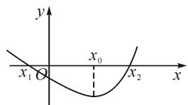
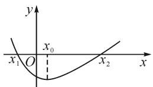
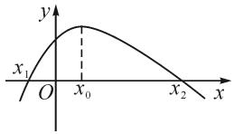
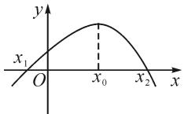
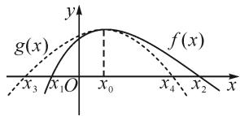
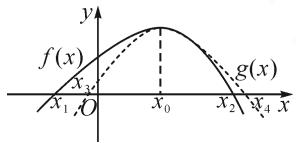
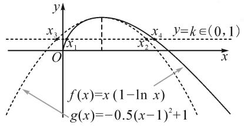
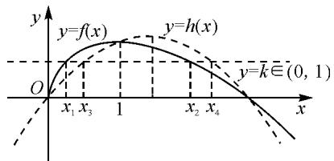
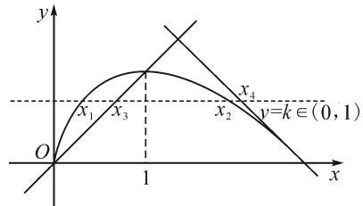

# 从一道高考试题谈图象的建构

●江苏省淮阴中学 胡桂东 陈伏香  
●江苏省清浦中学 吴洪生

摘要:从2020年开始,新高考数学试卷关注数学本质,重视学生的数学思维,试题既有创新,又秉承传统.2021年高考数学新高考Ⅰ卷第22题将一道传统的极值点偏移问题重新搬上舞台,形式具有一定的创新,本质上巧妙地运用同构思想将数学问题进行化归.高中教学中,教师在处理极值点偏移问题时,会有意识地去引导学生用常规套路解法.本研究旨在结合这道高考题帮助学生在解题时另辟蹊径,利用图象形成针对该类题型的解题思路,提升学生的几何直观素养.

关键词: 解法优化; 几何直观; 教学反思

# 1 考题呈现

(2021年新高考I卷数学第22题)已知函数 $f(x)=x(1-\ln x)$ .

(1) 讨论 $f(x)$ 的单调性；  
(2) 设 $a, b$ 为两个不相等的正数，且 $b \ln a - a \ln b = a - b$ ，证明： $2 < \frac{1}{a} + \frac{1}{b} < e$ .

通过观察,该题第(2)问条件和后面所要证明的结论并没有直接联系.单从条件来看,我们发现可以通过适当的变换从而达到形式上的统一,即 $\frac{1}{a}\left(1-\ln\frac{1}{a}\right)=\frac{1}{b}\left(1-\ln\frac{1}{b}\right)$ ,这时便可以在同构后根据这种形式抽象出 $\frac{1}{a}$ 和 $\frac{1}{b}$ 的本质,即为第(1)问中函数 $f(x)=k$ 的两根,其中 $k\in(0,1)$ .因此,便可以从研究函数 $f(x)$ 单调性的角度研究证明后面的不等式,通过求导后观察函数 $f(x)$ 的图象可以发现,该图象的极值点发生了偏移.因此需要采取处理极值点偏移的方法来进行证明.

# 2 解法综述

# 2.1 常用通法

处理极值点偏移问题的方法众多,较为常规的解法 $^{[1]}$ 有以下三种.

法1:首先,构建对称差函数 $^{[2]}$ $F(x)=f(x)-f(2x_{0}-x)$ 或是 $F(x)=f(x_{0}+x)-f(x_{0}-x)$ .其次,对差函数 $F(x)$ 求导,判断其单调性.再次,结合 $F(0)=0$ ,判断 $F(x)$ 的符号,从而确定 $f(x_{0}+x)$ 与 $f(x_{0}-x)$ 的大小关系;可以根据 $f(x_{1})=f(x_{2})=$

$f[x_{0}-(x_{0}-x_{2})]$ 的大小关系, 得到 $f(x_{1})=f(x_{2})=f[x_{0}-(x_{0}-x_{2})]$ 与 $f[x_{0}+(x_{0}-x_{2})]=f(2x_{0}-x_{2})$ 的大小关系, 进一步得到 $f(x_{1})$ 与 $f(2x_{0}-x_{2})$ 的关系. 最后, 结合 $f(x)$ 单调性得到 $x_{1}$ 与 $2x_{0}-x_{2}$ 的关系, 进而得到 $\frac{x_{1}+x_{2}}{2}$ 与 $x_{0}$ 的关系.

法 2: 借助对数平均不等式 $^{[3]}$ . 已知 b > a > 0，则有 $\sqrt{ab} < \frac{b - a}{\ln b - \ln a} < \frac{a + b}{2}$ (其中 $\frac{b - a}{\ln b - \ln a}$ 叫对数平均数). 该方法的本质是，在算术平均数和几何平均数中，又插入了一个中间变量 $\frac{b - a}{\ln b - \ln a}$ . 该不等式需用导数进行证明，具体证明过程略.  
法 3: 齐次消元 $^{[4]}$ . 令 $t=\frac{x_{2}}{x_{1}}$ , 其本质在于一般的极值点偏移问题都是两个零点同时出现的, 通过思索这两个零点之间的倍数关系, 齐次化应运而生.

# 2.2 解法本质

定理 1 如图 1,2 所示, 已知函数 $f(x)$ 在 $(a,b)$ 内只有一个极值点 $x_{0}$ , 当 $x \in (a,x_{0})$ 时, $f'(x) < 0$ , 当 $x \in (x_{0},b)$ 时, $f'(x) > 0$ . 若任意 $x \in (a,b)$ , $f'''(x) > 0 (< 0)$ 恒成立, 即 $\frac{x_{1} + x_{2}}{2} < x_{0}\left(\frac{x_{1} + x_{2}}{2} > x_{0}\right)$ , 则 $f(x)$ 在 $(a,b)$ 上极值点 $x_{0}$ 右偏 (左偏).

text_image

y
x₁ O x₀ x₂ x

图1

text_image

y
x₁ O x₀ x₂ x

图2

定理 2 如图 3,4 所示, 已知函数 $f(x)$ 在 $(a,b)$ 内只有一个极值点 $x_{0}$ , 当 $x \in (a, x_{0})$ 时, $f'(x) > 0$ , 当 $x \in (x_{0}, b)$ 时, $f'(x) < 0$ . 若任意 $x \in (a, b)$ , $f'''(x) > 0 (< 0)$ 恒成立, 即 $\frac{x_{1} + x_{2}}{2} > x_{0} \left( \frac{x_{1} + x_{2}}{2} < x_{0} \right)$ , 则 $f(x)$ 在 $(a, b)$ 上极值点 $x_{0}$ 左偏 (右偏).

text_image

y
x₁ O x₀ x₂ x

图3

  
图4

函数极值点偏移问题是在高考中考查导数的一种常见题型,一般解题思路往往是利用单调性构造辅助函数进行研究.学生对该类问题的训练过于机械,无法有效地提升其自身解题能力;教师在教学中对此类问题的解法传授仍过于传统,不利于激发学生的思维.在处理函数与导数问题时,要让“数”的问题,通过“形”析让问题更加灵活生动.

# 2.3 以形驱数

(1)直观理解

text_image

g(x)
f(x)
x₃ x₁O x₀ x₄ x₂
y

图5

text_image

f(x)
x₃
x₁ O
x₀
x₂
x₄
y
g(x)

图6

由图 5,6 可知, 若证函数 $f(x)$ 的零点 $x_{1}, x_{2}$ 满足 $x_{1} + x_{2} > (\text{或} < )2x_{0}$ , 可以构造以直线 $x = x_{0}$ 为对称轴的函数 $g(x)$ , 且函数 $g(x)$ 的极值为 $f(x_{0})$ , 使得函数 $g(x)$ 的零点 $x_{3}, x_{4}$ 满足 $x_{3} < x_{1} < x_{4} < x_{2}$ (或 $x_{1} < x_{3} < x_{2} < x_{4}$ ), 则可证得 $x_{1} + x_{2} > x_{3} + x_{4} = 2x_{0}$ (或 $x_{1} + x_{2} < x_{3} + x_{4} = 2x_{0}$ ).

# (2)构建函数

如何构造函数 $g(x)$ 呢？需要满足下列条件.

条件1:以直线 $x=x_{0}$ 为对称轴的函数有很多,不妨以二次函数为例,设 $g(x)=a(x-x_{0})^{2}+f(x_{0})$ .

条件2: 当 $x < x_{0}$ 时, $g(x) > (\text{或} <)f(x)$ ; 当 $x > x_{0}$ 时, $g(x) < (\text{或} >)f(x)$ .

如何求 $g(x) = a(x - x_0)^2 + f(x_0)$ 呢？

令 $F(x) = f(x) - g(x) = f(x) - f(x_0) - a(x - x_0)^2$ .

要满足当 $x < x_{0}$ 时， $F(x) < (\text{或} >)F(x_{0}) = 0$ ，即 $f(x) < (\text{或} >)g(x)$ .

当 $x > x_{0}$ 时， $F(x) > (\text{或} <)F(x_{0}) = 0$ ，即 $f(x) > (\text{或} <)g(x)$ .

只要使得 $F(x)$ 单调递增(或单调递减), 寻求导函数 $F'(x) \geqslant 0$ (或 $\leqslant 0$ ) 的必要条件, 进而可求出参数 a 的值.

# 3 应用求解

3.1 先证: $2 < \frac{1}{a} + \frac{1}{b}$

由 $b\ln a - a\ln b = a - b$ ，得

$$
\frac {1}{a} \left(1 - \ln \frac {1}{a}\right) = \frac {1}{b} \left(1 - \ln \frac {1}{b}\right).
$$

令 $x_{1} = \frac{1}{a}, x_{2} = \frac{1}{b}$ , 则 $x_{1}, x_{2}$ 为 $f(x) = k$ 的两根, 其中 $k \in (0,1)$ .

由第(1)问函数 $f(x)=x(1-\ln x)$ 的单调性, 不妨令 $x_{1}\in(0,1), x_{2}\in(1,e)$ .

步骤 1: 构造一个以 $(1,1)$ 为顶点, 开口向下的二次函数. 设 $g(x)=k_{1}(x-1)^{2}+1, k_{1}<0$ .

步骤 2: 求 $k_{1}$ 的值.

令 $F(x)=\left[f(x)-k\right]-\left[g(x)-k\right]=x(1-\ln x)-k_{1}(x-1)^{2}-1,x>0.$

欲当 0 < x < 1 时， $f(x) < g(x)$ ; 当 1 < x < e 时， $f(x) > g(x)$ .

如图7所示构建,可使 $F(x)=[f(x)-k]-[g(x)-k]$ 在 $(0,+\infty)$ 上单调递增.

text_image

y
x₃
x₁
x₂
x₄
y=k∈(0,1)
O
x
f(x)=x (1-ln x)
g(x)=-0.5(x-1)²+1

图 7

$F(x)$ 的导函数 $F'(x) = -\ln x - 2k_{1}(x - 1)$ .

若对任意实数 $x \in (0, +\infty)$ , 恒有 $F'(x) \geqslant 0$ .

记 $G(x)=\ln x+2k_{1}(x-1),x>0.$

由 $G(x) \leqslant 0, G(1) = 0$ ，且 $G'(1) = 0$ ，则 $k_{1} = -\frac{1}{2}$ .

步骤3:验证结论 $x_{1}+x_{2}=\frac{1}{a}+\frac{1}{b}>2.$

$F(x)=x(1-\ln x)+\frac{1}{2}(x-1)^{2}-1$ ，则 $F'(x)=-\ln x+x-1\geqslant0.$

所以 $F(x)=x(1-\ln x)+\frac{1}{2}(x-1)^{2}-1$ 在 $(0,+\infty)$ 上单调递增.

又 $F(1) = 0$ ，则当 $0 < x < 1$ 时， $x(1 - \ln x) - k < -\frac{1}{2}(x - 1)^2 + 1 - k$ ；当 $x > 1$ 时， $x(1 - \ln x) - k >$

$$
- \frac {1}{2} (x - 1) ^ {2} + 1 - k.
$$

令 $x_{3}, x_{4}$ 为 $g(x)=k$ 的两根，其中 $k \in (0,1)$ .

由此可知 $g(x_{3})-k=f(x_{1})-k<g(x_{1})-k$ ，所以 $x_{3}<x_{1}<1$ ，且 $g(x_{4})-k=f(x_{2})-k>g(x_{2})-k$ 。

所以 $e > x_{2} > x_{4} > 1$ .

故 $x_{1} + x_{2} > x_{3} + x_{4} = 2$ 得证.

# 3.2 再证: $\frac{1}{a} + \frac{1}{b} < e$

步骤 1: 构造以 $x=\frac{e}{2}$ 为对称轴, 开口向下的二次函数.

设 $h(x)=k_{2}x(x-\mathrm{e}), x\in(0,\mathrm{e})(k_{2}<0)$ .

令 $h(1)=f(1)=1$ ，则 $k_{2}=-\frac{1}{e-1}$ .

所以构造 $h(x)=-\frac{1}{e-1}x(x-e),\in(0,e)$ .

步骤 2: 命题等价转化.

令 $M(x)=[f(x)-k]-[h(x)-k]=x(1-\ln x)+\frac{1}{\mathrm{e}-1}x(x-\mathrm{e}),x\in(0,\mathrm{e}).$

即 $M(x)=x\left[(1-\ln x)+\frac{1}{\mathrm{e}-1}(x-\mathrm{e})\right],x\in(0,\mathrm{e}).$

令 $P(x)=(1-\ln x)+\frac{1}{\mathrm{e}-1}(x-\mathrm{e}),x\in(0,\mathrm{e})$ .

欲当 0 < x < 1 时， $f(x) > h(x)$ ，当 1 < x < e 时， $f(x) < h(x)$ .

(如下图图 8 所示构建.)

text_image

y
y=f(x)
y=h(x)
y=k∈(0,1)
O
x₁ x₃ 1 x₂ x₄
x

图8

即证 $0 < x < 1$ 时， $P(x) > 0$ ；当 $1 < x < \mathrm{e}$ 时， $P(x) < 0$ .

步骤 3: 验证结论 $x_{1} + x_{2} = \frac{1}{a} + \frac{1}{b} < e.$

记 $P(x)=1-\ln x+\frac{1}{\mathrm{e}-1}(x-\mathrm{e}), x\in(0,\mathrm{e})$ .

由 $P'(x)=\frac{x-(e-1)}{(e-1)x}$ 可得，当 0<x<e-1 时， $P'(x)<0$ ; 当 e-1<x<e 时, $P'(x)>0$ .

所以 $P(x)$ 在 $(0, e-1)$ 上单调递减， $(e-1, e)$ 上单调递增.

又 $P(1)=0, P(e)=0$ ，则 0<x<1 时， $P(x)>0$ ；

当 1<x<e 时, $P(x)<0$ .

所以，当 $0 < x < 1$ 时， $x(1 - \ln x) - k > -\frac{1}{\mathrm{e} - 1} x \cdot (x - \mathrm{e}) - k$ ；当 $1 < x < \mathrm{e}$ 时， $x(1 - \ln x) - k < -\frac{1}{\mathrm{e} - 1} x \cdot (x - \mathrm{e}) - k.$

令 $x_{3}, x_{4}$ 为 $h(x)=k$ 的两根，其中 $k \in (0,1)$ .

由此可知 $h(x_{3}) - k = f(x_{1}) - k > h(x_{1}) - k$ ，则 $x_{1} <   x_{3} <   1$

同时， $h(x_{4})-k=f(x_{2})-k<h(x_{2})-k$ ，则 $1<x_{2}<x_{4}<e.$

故 $x_{1} + x_{2} <   x_{3} + x_{4} = \mathrm{e}$ 得证.

评析：“数无形时少直观，形无数时难入微”，在教学中要将形的直观用到实处，在培养学生探究问题能力的过程中，不能局限在惯性思维与表达上，要引导学生利用基本知识，创造性地去设计、优化解决问题的方案，此问还可以继续探究下去。

# 3.3 探究优化

在上述证明 $\frac{1}{a}+\frac{1}{b}<e$ 的过程中,构建对称函数 $h(x)=k_{2}\left(x-\frac{e}{2}\right)^{2}+t,x\in(0,e)(k_{2}<0)$ 过于复杂,即使从图象上能直观理解,但求解过程也不易操作,可以构造对称的“V型函数”来优化.

由第(1)问函数 $f(x)=x(1-\ln x)$ 的单调性可知， $x_{1},x_{2}$ 为 $f(x)=k$ 的两根，其中 $k\in(0,1)$ .

令 $x_{1}\in(0,1)$ , $x_{2}\in(1,e)$ .

当 0 < x < 1 时，函数 $f(x) = x(1 - \ln x)$ 的图象明显在直线 y = x 的上方；当 1 < x < e 时，函数 $f(x) = x(1 - \ln x)$ 的图象是否在直线 $y = -x + e$ 的下方呢？

如果成立,则构建以直线 $x=\frac{e}{2}$ 为对称轴的分段

函数 $t(x)=\left\{\begin{aligned}x, &0<x<\frac{\mathrm{e}}{2},\\ -x+\mathrm{e}, &\frac{\mathrm{e}}{2}<x<\mathrm{e}.\end{aligned}\right.$

如图 9 所示建构.

text_image

y
x₁ x₃ x₂ x₄
O
1
y=k∈(0,1)
x

图9

现在验证结论 $x_{1}+x_{2}=\frac{1}{a}+\frac{1}{b}<e.$

记 $t(x)=\left\{\begin{aligned}x, &0<x<\frac{e}{2},\\ -x+e,\frac{e}{2}<x<e.\end{aligned}\right.$

当 0 < x < 1 时， $f(x) = x(1 - \ln x) > x$ .

当 1<x<e 时，欲证 $f(x)=x(1-\ln x)<-x+$ e, 即证 $1 - \ln x < -1 + \frac{e}{x}$ .

又 $y = \ln x + \frac{\mathrm{e}}{x}$ 在 $(1, \mathrm{e})$ 上单调递减，则 $\ln x + \frac{\mathrm{e}}{x} > 2$ ，即 $1 - \ln x < -1 + \frac{\mathrm{e}}{x}$ .

令 $x_{3}, x_{4}$ 为 $t(x)=k$ 的两根，其中 $k \in (0,1)$ .

由此可知 $t(x_{3})-k=f(x_{1})-k>t(x_{1})-k$ ，故 $0<x_{1}<x_{3}<1$ ，且 $t(x_{4})-k=f(x_{2})-k<t(x_{2})-k$ 。

所以 $1 < x_{2} < x_{4} < e.$

故 $x_{1} + x_{2} <   x_{3} + x_{4} = \mathrm{e}$ 得证.

# 4 解后思考

# (1)重视思维生成,图象带动思考

作为新课标中六大核心素养之一的几何直观,有利于将繁杂的数学问题直观地展现出来,尤其涉及到函数类的问题,因为函数题目的思考往往离不开图象.结合笔者在教学中的经验,若是单单从代数角度去理解涉及到的函数的相关问题,则会使得题目过于抽象,学生难以从本质上理解,无法达到会一道题、通一类题的程度.而图象由于其直观性可以有效地引导学生产生思维,起到对该类题型降维打击的作用.

# (2)重视问题本质,知识提升能力

以关键的知识提升学生的关键能力,如作图、识图与用图的能力,数据运算能力,选择题的推理能力,逻辑表达能力,情境阅读与抽象的能力,基础与规范的细节处理能力,思想转化与题理溯源的探究能力,等等.Z

# (上接第23页)

$\frac{a}{2R},\sin B=\frac{b}{2R},\sin C=\frac{c}{2R}$ 代入，“化角为边”也可得到ac=2b.

师:两位同学都说得很好! 第二个条件我们利用化角为边的思路找到了边 a, b, c 的关系. 边 a, b, c 还满足其他等量关系吗?

生 5: 求出 $B=\frac{2}{3}\pi$ 后, 可以利用角 B 对应的余弦定理构建方程得到 $a^{2}+c^{2}-b^{2}=-ac$ , 消去 b 得到 $a^{2}+c^{2}=\frac{(ac)^{2}}{4}-ac$ , 再由基本不等式 $a^{2}+c^{2}\geqslant2ac$ , 得 $ac\geqslant12$ .

# 3 教学反思

# (1)避免注入式教学 $^{[3]}$

传统的注入式教学是把学生当作容器死灌硬填，直接告诉学生结论，然后进行单一的重复训练。传统的教学方式没有体现知识的来龙去脉，只注重计算的熟练度、死记硬背结论以及结论的简单运用；而以核心素养为导向的数学教学，充分以学生已有的知识和经验作为生长点去生成知识。事实上，学生只有既能熟练地计算和逻辑推理，又能理解知识的“来龙去脉”，才是真正理解数学,进而比较自如地应用数学知识解决问题.在教学过程中,学生的思维火花被点燃,学生的积极思维就会显得和谐、自然,从而引发学生的积极思考.

# (2)深度发展学生数学思维

逻辑推理素养作为数学核心素养之一,是学生需要掌握的重要学习能力.在本堂课的教学过程中,教师引导学生分析问题并不断探究解决问题的思路,让学生充分体悟转化与化归思想的重要性.本节课主线突出,以学生为本,通过探究体验,学生获得了发现新事物的快乐,增强了学习数学的信心,培养了自主学习的能力!

# 参考文献：

[1]中华人民共和国教育部.普通高中数学课程标准(2017年版2020年修订)[S].北京:人民教育出版社,2020.

[2]人民教育出版社,课程教材研究所,中学数学课程教材研究开发中心.普通高中教科书教师教学用书·数学·必修第二册[M].北京:人民教育出版社,2019.

[3]樊彦朝,熊志权.基于知识发生过程的数学深度学习教学策略——以“正弦函数的单调性”教学为例[J].数学教学,2022(1):10-14.Z