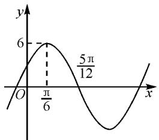
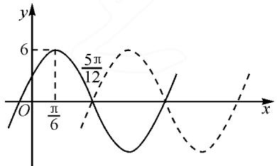
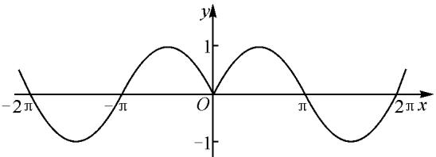
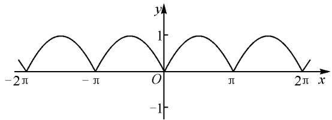

# 以数铸“形”，以形表“数”

——以高中数学“三角函数”的教学为例

●江苏省淮阴中学 聂然

数学素养的关键因素是数形结合思想,应在高中学习阶段引起足够的重视.本文中将依据新课标中对数形结合的相关要求,以高中数学“三角函数”为例,进行相关应用研究.以数铸“形”,渐进渗透非言语信息的价值.以形表“数”,重点关注学习中多元理解的过程,搭建数学支架,加强思维训练,进一步提高创新力,发散学生的思维.

数学是一门研究空间形式和数量关系的学科,因此,“数”和“形”并不是相互独立的,它们之间存在着一定的关联.著名数学大师华罗庚曾说过:数缺形时少直观,形少数时难入微;数形结合百般好,隔家分离万事休.在此之前,有很多学者进行过此方面的研究.比如,黄朝斌在《高中数学“数形结合”在解题中的应用》中分别对“数形结合”思想在集合、三角函数、方程与不等式等方面的渗透进行了探讨.黄继荣在《多媒体技术与“数形结合”教学》中提出了利用启发—探究式教学表现数学教学中的数形结合.实际上,“形”与“数”从根本上来讲属于两个不同的方向,在一定的条件下二者能实现相互转化,可以让我们全方位地认识事物的本质,解决生活中的数学问题.

# 1 数形结合的概述

数学中的数形结合思想,对问题既进行了代数抽象的揭示,又进行了几何直观的呈现,二者相辅相成.由此可见,不能简单地认为代数问题用代数办法解决,几何问题用几何办法解决,只有将二者有机结合才是数形结合的最终目的.

# 2 数形结合在高中数学中的作用

高中阶段数学学习的主要目标是加强直观想象学科核心素养的渗透,并不是初中阶段简单的空间想象和几何直观的组合,而是以此为基础进行提高和拓展.因此,这对数形结合思想的运用有了更加精确的要求.高中是学生思维发展的黄金时代,是实现从形象思维转化成抽象思维的过渡时期.因此,教师要在教学中构建知识体系,创造合理的教学实际,启发学生的思维,提高创新意识.

# 2.1 简化问题

几何解题方法和代数解题方法都有各自的优缺点.学生在解题的过程中,有时只从单一角度考虑问题,可能会找不到突破口.这时需要教师的适当指导,引导学生从不同角度看待问题的本质,找到“形”的直观表达和“数”的符号化语言,结合实际使问题更加清晰,降低解题难度.但要注意学生的实际情况,根据不同基础的学生掌握的程度指导学生,循序渐进地教会学生数形结合的方法.

比如,在学习“三角函数”时,以学生初中阶段接触的锐角三角函数为基础进行抛砖引玉.这样做有优点也有缺点.优点是三角函数对于学生来讲是十分熟悉的,利于迁移知识.缺点在于定性思维,将现实思维转化成抽象思维是十分困难的.因此,教师可以从实际问题入手,构建学生熟悉的生活情境,让学生更加直观地感觉到“周而复始”的运动现象,将点的运动轨迹和单位圆进行抽象处理.再通过指导性的提问,指引学生构建直角坐标系,并画出相应的点.将函数的对应关系作为基础,从特殊到一般,让学生更加清楚角的终边与单位圆的交点坐标是圆心角的函数,进一步得出三角函数的定义.

# 2.2 增强创新力

培根曾经说过“数学是思维的体操”。具体来讲，数学思维就是以形和数以及结构关系作为思维对象，符号和数学语言作为思维载体，并以认识数学规律为目的的一种思维。题海战术忽略了思维训练的重要性，单纯为了提高解题速度，偏离了学习数学的目的。学生学习数学不但要提高解题能力，还要增强在实际中探索问题、解决问题的能力。在开展实际教学的过程中，培养学生创新能力的核心途径就是将非逻辑思维能力和逻辑思维能力有机结合。因此，数形结合在这里起到了至关重要的作用，在这种思想下，学生的形象思维有了较大的提高。学生通过联想能认知到问题的本质；通过变式训练，能妥善解决类似问题，完善认知结构，提高创新能力。

# 3 数形结合的实际应用

# 3.1 以数铸“形”

在实际教学中,大部分教师更注重于言语信息教学,忽略了画图和板书的重要性,表面看起来尚可,但实际缺忽略了言语的价值.因此,教师要把数学和现实生活相互融合,用现实问题“抛砖引玉”,增强学生对教学内容的理解,充分发挥数形结合的优势.

例 1 已知函数 $f(x)=A\cos(\omega x+\varphi)$ 的图象如图 1 所示, $A>0, \omega>0, \varphi\in(-\pi,\pi)$ , 则 $f(x)$ 的解析式为 \_\_\_\_.

这是一道典型的求解正余弦类函数解析式的题目,旨在考查通过观察求解参数的方法,利用数形结合思想排除常见解题陷阱.根据已知条件结合图象算出 A=6, $\omega=2$ ,再将其中一个点的坐标代入函数解析式就能求出 $\varphi$ 的值.此题的核心在于取点代数,点的选取是任意的还是最高点、最低点或者零点,这是值得推敲的问题.教师应引导学生将每个已知点都代入比对结果,让学生通过计算发现.结果如表1,学生会对不同情况产生疑惑,因此教师可数形结合,引导学生通过观察图象进行思考.从函数的对称性和周期性入手分析,最终发现代入零点会出现如图2的不确定情况,因此最终求得答案为 $y=6\cos\left(2x-\frac{\pi}{3}\right)$ .

line

| x | y |
|---|---|
| 0 | 0 |
| π/6 | 5 |
| 5π/12 | 6 |

图1

表 1 不同点代入对应的 $\varphi$ 

<table><tr><td>最高点</td><td> $-\frac{\pi}{3}$ </td></tr><tr><td>零点</td><td> $-\frac{\pi}{3}$ 和 $\frac{2\pi}{3}$ </td></tr></table>

通过这些常见的数学陷阱,达到了以数铸“形”的目的;促使学生逐渐认识到要谨慎选点,把零点代入到函数解析式中会出现多种不同的情况,但是代入最高点或最低点就能确定函数解析式.在这个过程中渗透数形结合思想,以图象的方式让学生更加清晰地学会了知识,减轻了学生的认知负担,提高了学生的理解能力,进而更加重视非语言信息的价值.

line

| x       | y (solid) | y (dashed) |
| ------- | --------- | ---------- |
| 0       | 0         | 0          |
| π/6     | 5π/12     | 0          |
| >π/6    | <5        | >5         |

图2

# 3.2 以形表“数”

学习数学的思想方法,关键在于“悟”,这需要一

个过程,需要学生循序渐进、将抽象化为具象.教师在讲授三角函数的过程中,以形表“数”,用画图的方式将抽象化为具象,通过观察图象对比函数的对称性、单调性、周期性等,推导出函数的解析式.以形表“数”,以不同的特性解决问题,为学习打好基础.

例如，在学习带绝对值的正弦类函数时，首先要教会学生画 $y = \sin x$ 的图象，再考虑绝对值的情况，分别为 $y = \sin |x|$ ， $y = |\sin x|$ 。其中， $y = \sin |x|$ 为偶函数，如图3所示。

text_image

-2π
-π
O
π
2π x
y
1
-1

图 3

教师可让学生尝试用以形表“数”，推算出 $y = \sin |x|$ 的函数性质。通过观察图象可知， $y = \sin |x|$ 在 $[-\pi, \pi]$ 区间上有两部分位于 $x$ 轴上方，在其他区间则是处于一上一下的状态，综上所述函数不具备周期性。再观察其对称性，该函数并没有对称中心，只有 $y$ 轴这一条对称轴。教师可以运用同样的方法引领学生探究 $y = \cos |x|$ ， $y = \tan |x|$ ，并得出规律：当变量加上绝对值后，原函数为偶函数时，其图象不会受到影响，原函数为奇函数的其图象会发生改变。

对于 $y = |\sin x|$ ，如图4，将函数 $y = \sin x$ 处于 x 轴下方的图象翻折到 x 轴上方。此图看起来十分顺畅，因为其具备优良的对称性和周期性。由图象可知，当函数 $\sin x$ 的解析式整体加上了绝对值，函数的周期变成了 $\pi$ ，对称轴增多了，为 $x = \frac{k\pi}{2}, k \in Z$ 。在以形表“数”的过程中，数形结合思想的重要性逐渐体现了出来，通过对三角函数加绝对值，探究函数变化前后的异同点，分析出函数的性质，领悟数形结合思想的核心。

text_image

-2π
-π
O
π
2π
x
y
1
-1

图4

数形结合思想对高中数学知识的学习十分重要. 利用数形结合思想可以将复杂的问题简单化, 将几何和代数结合在一起, 符合新课标的相关要求; 将解题方法上升到了数学层次, 有利于学生形成解题思路体系. Z