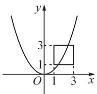

# 反例在中学数学解题中的应用

# ●西华师范大学 潘叶秋

摘要: 反例教学是指教师根据教学内容和目标,采用概念和例题的典型错误认识或错误解法组织学生探讨错误的原因,从而达到真正掌握数学概念和性质的一种教学方法.本文中通过论述反例在数学解题教学中的作用,探索如何恰当运用反例,引导学生从反面视角看待问题,提高数学课堂效率和教学质量,从而提升学生的逻辑思维能力与数学核心素养.

关键词: 中学数学; 反例; 解题

判断一个数学命题的正确性,需要严密的证明,而有时候,往往一个精妙的反例就能确定一个命题是否正确.在数学解题中运用反例,就是对数学猜想进行推翻和反驳的过程,教师若能引导学生使用恰当的反例,就可以化繁为简.在教学实践中,反例的学习还能培养学生的数学逻辑思维与数学知识的建构能力.教师应重视反例教学,运用合理的反例技巧,培养学生的解题能力和思维能力 $^{[1]}$ .

# 1 利用反例取特殊值

选择题是数学考试中的必考题型,由于这种题型的特殊性,很多时候能够利用反例来检验所给选项的真伪,进而进行筛选判断.在时间有限的考试中,特殊值法不失为一种好方法.

例 1 如图 1, 正方形四个顶点的坐标依次为 (1, 1), (3, 1), (3, 3), (1, 3). 若抛物线 $y = ax^{2}$ 的图象与正方形有公共点, 则实数 a 的取值范围是().

A. $\frac{1}{9}\leqslant a\leqslant3$   
B. $\frac{1}{9}\leqslant a\leqslant1$   
C. $\frac{1}{3}\leqslant a\leqslant3$   
D. $\frac{1}{3}\leqslant a\leqslant1$

解: 观察四个选项, A 与 B 选项中都有 $\frac{1}{9}$ , C 与 D 选项中都不含有 $\frac{1}{9}$ , 利用特殊值法, 当 $a = \frac{1}{9}$ 时, 抛物线 $y = \frac{1}{9} x^{2}$ 与正方形有公共点 (3,1), 可排除 C, D 选项. 观察 A, B 选项, 此时可考虑 a = 3 时的情况. 当 a = 3 时, 抛物线 $y = 3 x^{2}$ 与正方形有公共点 (1,3), 成立, 由此排除选项 B. 故选项 A 正确.

  
图1

# 2 利用反例否定结论

要证明一个命题为真命题，也就是说要证明这个命题的所有情况都为真，就必须在一般情形下进行论证；而要否定一个命题的真实性，不需要进行严格的论证，只需要举出反例即可，只要有一个条件不符合，那么此命题即为假命题 $^{[2]}$ .如何寻求适当的反例来否定结论，需要学生具有较高的思维能力.在教师的指导下，学生若能掌握运用反例思考问题的方法，不仅能帮助学生解题，还有利于拓展学生的思路.

例 2 已知函数 $f(x)=x^{2}+\frac{a}{x}(x\neq0,a\in\mathbf{R})$ ，试判断函数 $f(x)$ 的奇偶性，并说明理由.

解:根据 a 的取值情况进行分类讨论.

(1) 当 $a = 0$ 时, $f(x) = x^2 (x \neq 0)$ , 则 $f(-x) = (-x)^2 = x^2 = f(x)$ , 所以由定义可知 $f(x)$ 为偶函数. (2) 当 $a \neq 0$ 时, $f(x) = x^2 + \frac{a}{x}$ , 取特殊值, 令 $x = 1$ , 则 $f(1) = 1 + a$ , $f(-1) = 1 - a$ , 从而 $f(1) \neq f(-1)$ , 且 $-f(1) \neq f(-1)$ , 所以 $f(x)$ 既不是偶函数也不是奇函数.

综上所述，当 $a = 0$ 时， $f(x)$ 为偶函数；当 $a \neq 0$ 且 $a \in \mathbf{R}$ 时， $f(x)$ 既不是偶函数也不是奇函数。

点评: 奇偶性是函数的一个重要性质. 本题分别对 a=0 与 $a \neq 0$ 分情况展开讨论. 当 a=0 时, 依据偶函数的定义来证明; 当 $a \neq 0$ 时, 采用举反例的方法进行说明.

# 3 利用反例完善解答

探求一个命题在什么条件下成立时,我们往往通过直接论证的方式来解答,但得到的答案不一定准确,它可能包含了不满足的条件,此时,我们可以借助反例这一有用的工具,将不满足的情况剔除,使解答更加完善与准确.

例 3 设函数 $f(x)=\sqrt{x^{2}+1}-ax$ ，其中 a>0。试求 a 的取值范围，使函数 $f(x)$ 在区间 $[0,+\infty)$ 上是单调函数。

解: 在区间 $[0, +\infty)$ 上任取 $x_{1}, x_{2}$ ，使 $x_{1} < x_{2}$ ，则

$$
\begin{array}{l} f (x _ {1}) - f (x _ {2}) \\ = \sqrt {x _ {1} ^ {2} + 1} - \sqrt {x _ {2} ^ {2} + 1} - a (x _ {1} - x _ {2}) \\ = \frac {x _ {1} ^ {2} - x _ {2} ^ {2}}{\sqrt {x _ {1} ^ {2} + 1} + \sqrt {x _ {2} ^ {2} + 1}} - a \left(x _ {1} - x _ {2}\right) \\ = \left(x _ {1} - x _ {2}\right) \left(\frac {x _ {1} + x _ {2}}{\sqrt {x _ {1} ^ {2} + 1} + \sqrt {x _ {2} ^ {2} + 1}} - a\right). \\ \end{array}
$$

当 $a \geqslant 1$ 时，由 $\frac{x_1 + x_2}{\sqrt{x_1^2 + 1} + \sqrt{x_2^2 + 1}} < 1$ ，可得

$$
\frac {x _ {1} + x _ {2}}{\sqrt {x _ {1} ^ {2} + 1} + \sqrt {x _ {2} ^ {2} + 1}} - a <   0.
$$

又 $x_{1} - x_{2} < 0$ ，则 $f(x_{1}) - f(x_{2}) > 0$ ，即 $f(x_{1}) > f(x_{2})$

所以，当 $a \geqslant 1$ 时，函数 $f(x)$ 在区间 $[0, +\infty)$ 上是单调递减函数.

当 $0 < a < 1$ 时，在区间 $[0, +\infty)$ 上存在两个数 $x_{1} = 0, x_{2} = \frac{2a}{1 - a^{2}}$ ，满足 $f(x_{1}) = 1, f(x_{2}) = 1$ ，即 $f(x_{1}) = f(x_{2})$ ，所以函数 $f(x)$ 在区间 $[0, +\infty)$ 上不是单调函数。

综上所述，当且仅当 $a \geqslant 1$ 时，函数 $f(x)$ 在区间 $[0, +\infty)$ 上是单调函数，且是单调递减函数.

点评:学生往往在得出了函数的某一单调区间后,便认为问题已经解答完毕,容易忽略说明在余下区间上的不单调.这时就可借助反例这一工具,来完善解答.

# 4 利用反例寻找解题思路

有些问题从正面思考可能较困难,这时候可以引导学生举出反例,寻找解题思路.运用反例来思考问题,可以使思维更加严谨,进而提高分析、解决问题的能力.反例的提出不是凭空胡乱捏造,而是要随着问题的思考,对所得的结论进行不断地质疑、改进.这有利于促进学生思维能力的发展.

例 4 设 $\{a_{n}\}$ 是由正数组成的等比数列， $S_{n}$ 是其前 n 次的和。试问是否存在常数 c > 0，使得 $\frac{\lg(S_{n}-c)+\lg(S_{n+2}-c)}{2} = \lg(S_{n+1}-c)$ 成立？并证明你的结论。

分析: 将 $a_{n}=1$ 代入上式, 由计算结果得到此时 c 不存在, 猜想“常数 c 可能不存在”, 即思考能否找到矛盾, 证明 c 不存在. 故用反证法解答后续问题.

解: 假设结论成立, 即假设存在常数 c > 0, 使得 $\frac{\lg(S_{n}-c) + \lg(S_{n+2}-c)}{2} = \lg(S_{n+1}-c)$ 成立, 则

$$
\left\{ \begin{array}{l l} S _ {n} - c > 0, & \text {①} \\ S _ {n + 1} - c > 0, & \text {②} \\ S _ {n + 2} - c > 0, & \text {③} \\ (S _ {n} - c) (S _ {n + 2} - c) = (S _ {n + 1} - c) ^ {2}. & \text {④} \end{array} \right.
$$

由④式，得

$$
S _ {n} S _ {n + 2} - S _ {n + 1} ^ {2} = c (S _ {n} + S _ {n + 2} - 2 S _ {n + 1}). \tag {⑤}
$$

由均值不等式以及①②③④式联立,得

$$
\begin{array}{l} S _ {n} + S _ {n + 2} - 2 S _ {n + 1} \\ = (S _ {n} - c) + (S _ {n + 2} - c) - 2 (S _ {n + 1} - c) \\ \geqslant 2 \sqrt {\left(S _ {n} - c\right) \left(S _ {n + 2} - c\right)} - 2 \left(S _ {n + 1} - c\right) \\ = 0. \\ \end{array}
$$

因为 $c > 0$ ，所以 $c(S_{n} + S_{n + 2} - 2S_{n + 1})\geqslant 0$ ，而由已知易证 $S_{n}S_{n + 2} - S_{n + 1}^{2} <   0$ ，所以⑤式不成立，矛盾.

故不存在常数 $c > 0$ ，使得

$$
\frac {\lg \left(S _ {n} - c\right) + \lg \left(S _ {n + 2} - c\right)}{2} = \lg \left(S _ {n + 1} - c\right).
$$

点评:本题是一个探索性问题,对学生来说难度偏高.解决这类问题时,举反例虽然不能直接证明结论是否成立而达到解题目的,但通过举反例,能让学生找到解决问题的灵感,从而为问题的解决指明一个方向.

在利用反例解题的过程中,教师要引导学生变换思路,不直接证明命题的真假性,而是去思考在什么情况下这个命题是假的,如何去找到这个巧妙的反例.在运用举反例进行条件充分性的判断时,一定要注意题干中隐藏的已知条件,注意选用的反例是否恰当以及是否循序渐进地引入.认清反例在解题中的主次.在解题的过程中,反例并不是解答问题的核心,它只是解题的一个辅助性手段.反例有助于学生形成批判意识,学会对命题进行质疑,让学生在“证明”与“反例”这二者的相互比较、不断优化中,全面掌握知识,并不断优化结论,最终解决数学问题 $^{[3]}$ .

# 参考文献：

[1] 王太广. 巧用反例益处多——初中数学教学中反例的有效运用研讨 [J]. 数理化解题研究, 2021(26): 20-21.  
[2] 张庆大.“反例法”在中学数学解题中的应用 [J]. 中学教学参考, 2020(17): 14-15.  
[3]曾春燕,姚静.反例作用的实验研究——以高一数学教学为例[J].数学教育学报,2015(1):77-81.Z