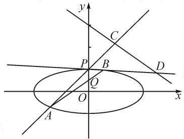
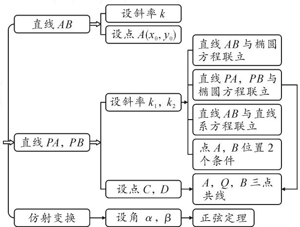
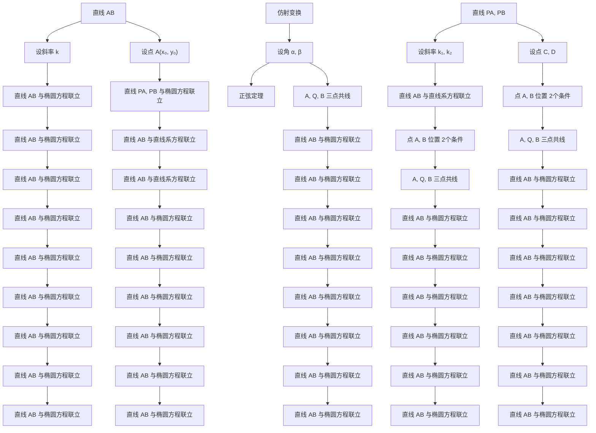
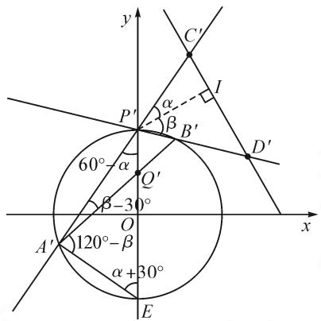

讲题比赛特等奖获奖论文之十七：

# 图形视角下一道椭圆题的解法探究

——探析 2022 年高考浙江卷第 21 题

# ●杭州第七中学 方心怡

摘要:时隔一年,高考浙江卷的解析几何题再次考查圆锥曲线中的距离最值问题.此类问题知识应用性强,可从多角度进行探究,是解析几何中追根溯源、巧妙思维、多维拓展的良好载体.本文中针对2022年一道高考题,围绕图形给出多种解法,从动点动直线和仿射变换等多角度切入,选择合适的参数进行求解,同时利用韦达定理、换元、整体运算、分离常数等方法简化运算.所展现的解题思路,有助于学生在解决同类问题时形成从多维探究的良好数学品质,提升数学核心素养.

关键词: 椭圆; 最值; 韦达定理; 计算的对称性; 消元

# 1 试题呈现

(2022 浙江高考卷第 21 题) 如图, 已知椭圆 $\frac{x^{2}}{12} + y^{2} = 1$ . 设 A, B 是椭圆上异于 P(0,1) 的两点, 且点 $Q\left(0, \frac{1}{2}\right)$ 在线段 AB上, 直线 PA, PB 分别交直线 $y = -\frac{1}{2}x + 3$ 于 C, D 两点.

text_image

y
C
P
B
D
O
x
A

图1

(1)求点 P 到椭圆上点的距离的最大值；  
(2) 求 $\left| CD \right|$ 的最小值.

# 2 试题分析与思维导图

根据题目条件,分析题中所给信息后,先明确本题求解的思路是设合适的参数,表示出所求目标,再利用函数或者不等式求得最值.接下来,我们围绕图形,从不同角度切入来解决这道题.

第(1)小题,求动点到定点距离的最大值.设动点坐标,直接用两点间的距离公式,为了避免根式,则可先表示出距离的平方.因为动点在椭圆上,所以其坐标满足椭圆方程,可通过消元,将问题转化成求函数最值问题.另外,对于椭圆上的动点,在设点的坐标时,也可利用三角换元从而直接得到函数式,省去消元的过程.

第(2)小题,求线段 CD 的最小值.我们从图 1 的动点、动直线等从不同角度切入,并结合思维导图(如图 2)进行求解.

flowchart

图2

当直线 AB 的斜率变化时，A, B 两点随之而变，引起直线 PA, PB 的变化，从而线段 CD 也在变。所以，设直线 AB 的斜率为参数，利用直线过定点写出直线方程，再与椭圆方程联立。为了减少运算，不用求出 A, B 两点的坐标，而是设出两点坐标，用韦达定理表示出两横坐标间的关系。再利用 A, P 两点的坐标写出直线 PA 的方程，与定直线方程联立，可求交点 C 的横坐标，接着利用计算的对称性直接写出点 D 的横坐标。由两点间距离公式，即可用 A, B 两点的横坐标表示 $\left|CD\right|$ ，再代入韦达定理进行消元，得到一个关于直线 AB 斜率的函数式。最后，通过换元法求得 $\left|CD\right|$ 的最小值。

直线 AB 的变化, 也可看作是点 A 的变化, 导致点 B 发生变化, 从而引起 C, D 两点变化, 所以也可设点 A 坐标来表示 $\left|CD\right|$ . 利用 A, Q 两点的坐标写出直线 AB 的方程, 与椭圆方程联立, 求解时可利用整体运算和韦达定理来简化运算, 求出点 B 的横坐标, 再代入直线 AB 的方程得到点 B 的纵坐标. 再写出直线 PA 的方程, 与定直线方程联立, 求出点 C 的横坐标. 同样, 由计算的对称性利用点 B 的坐标直接写出点 D的横坐标,这样就可以用点 A 的坐标表示出 $\left|CD\right|$ . 接着先化简,利用点 A 在椭圆上进行消元约分. 最后,为了求 $\left|CD\right|$ 的最小值,再用三角换元化单参,则可利用三角函数的有界性求得范围. 另外,化简后的式子其实也能继续化简成与椭圆上的动点到定点斜率相关的结构,那么,就可以设直线的斜率写出直线方程,与椭圆方程联立,利用 $\Delta$ 大于等于 0,得到斜率的范围,从而求得 $\left|CD\right|$ 的范围.

都说解析几何巧在“设”，难在“算”。为了减少部分运算，也可以设两个参数表示出 $|CD|$ ，再找到两个参数之间的等量关系，从而求得最值。回到图形，点A，B在动，也可以看成是由直线PA，PB的斜率发生变化导致的。所以，可设直线PA，PB的斜率，写出直线PA，PB的方程，分别与定直线方程进行联立，可求得C，D两点的横坐标，从而表示 $|CD|$ 。接下来，有四种方法去寻找两直线斜率之间的等量关系。

方法一:设直线 AB 的斜率并写出直线方程,由斜率定义,可以把直线 PA,PB 的斜率转化成 A,B 两点的横坐标.再把直线 AB 的方程与椭圆方程联立,利用韦达定理消元化双参为单参,同解法 1,直接得到 $\left|CD\right|$ 的函数表达式.

方法二:为了避免引入新的参数,把点 A 看成是直线 PA 与椭圆的交点,将直线 PA 的方程与椭圆方程进行联立.因为点 P 的坐标也是它的解,易求得点 A 的横坐标,再代入直线方程求得点 A 的纵坐标.同样,利用计算的对称性直接写出点 B 的坐标.再利用 A,Q,B 三点共线的向量公式,整理可得直线 PA,PB 斜率之积为定值.

方法三:还可把 A, B 两点看作是直线 AB 与过点 P 的直线系的交点. 把直线 PA, PB 的方程统一写成直线系的形式, 与定直线方程联立, 得到交点 A, B 坐标的一般式. 再利用交点在椭圆上, 将坐标代入椭圆方程. 最后, 利用韦达定理, 可得直线 PA, PB 斜率之间的等量关系.

以上三个方法都是利用 A, B 两点是线线交点的位置关系, 两两联立方程都得到直线 PA, PB 的斜率之积为定值, 这也是一个基本事实. 如果能提前知道这个结论, 那么, 求解时方向可以更明确, 由此想到方法四.

方法四:设 A, B 两点的坐标, 利用 A, Q, B 三点共线, 由向量公式引入新的参数, 可以得到两个关于坐标的等式; 再利用 A, B 两点在椭圆上, 坐标满足椭圆方程, 又得到两个等式. 利用这四个等式及其变式, 再将直线 PA, PB 的斜率之积进行化简.

有了直线 $PA, PB$ 斜率之积为定值，要求 $|CD|$ 的最小值，可消元化单参，整理后可结合基本不等式，或者利用权方和不等式，求得最小值。另外，也可不消元，由 $|CD|$ 的表达式，利用斜率之积为常数，则可把斜率之和作为一个整体来表示 $|CD|$ ，再结合柯西不等式，也可得到 $|CD|$ 的范围。

以上分析都是由已知进行推导,其实也要注意所求目标.直线 PA,PB 的变化也可看作是 C,D 两点在定直线上运动引起的,所以可引入两个参数表示出两点坐标,再找关于两参数的等式.由 P,C 两点坐标写出直线 PA 的方程,与椭圆方程联立,可求出点 A 的坐标,再由计算的对称性可直接写出点 B 的坐标.由 A,Q,B 三点共线即可得到仅关于两个参数的等式,最后,对所求目标 $\left|CD\right|$ 进行消元化简,利用基本不等式,可求得 $\left|CD\right|$ 的最小值.

由于圆的性质已知得更多,还可以通过仿射变换把椭圆变成圆再求解.在变换后的图形中,利用点 $P'$ 到定直线的距离是定值,如图3,作辅助线,设两个角为参数,即可表示 $|C'D'|$ .根据已知条件,利用对顶

text_image

y
C'
α
β
P'
B'
I
D'
60°-α
Q'
β-30°
O
A'
120°-β
α+30°
E
x

图3

角和圆周角等角的性质，用所设角表示出图中各角，就会发现，由于 $Q^{\prime}P^{\prime}$ 和 $Q^{\prime}E$ 的长度已知，利用正弦定理，可得到两个等式，再消去 $A^{\prime}Q^{\prime}$ ，即可得仅关于所设角的等式。再由两角之和为 $90^{\circ}$ ，可利用诱导公式化同角，从而得两角正切之积为定值。最后，利用两角和差的正切公式进行整理，为了书写简洁，也可换元，再结合基本不等式，即可求得 $|C^{\prime}D^{\prime}|$ 的最小值，从而得到 $|CD|$ 的最小值。

# 3 解答

第(1)小题,求椭圆上的动点到定点距离的最大值的两种解法如下.

解法 1: 设动点 $A(x, y)$ ，则 $\frac{x^{2}}{12} + y^{2} = 1$ 。记点 $P(0, 1)$ 到点 A 的距离为 d，则

$$
d ^ {2} = x ^ {2} + (y - 1) ^ {2} = - 1 1 y ^ {2} - 2 y + 1 3, y \in [ - 1, 1 ].
$$

所以，当 $y=-\frac{1}{11}$ 时， $d_{\max}=\frac{12\sqrt{11}}{11}$ .

解法 2: 设动点 $A(2\sqrt{3}\cos\theta,\sin\theta)$ ，记点 $P(0,1)$ 到点 A 的距离为 d，则

$$
\begin{array}{c} d ^ {2} = (2 \sqrt {3} \cos \theta) ^ {2} + (\sin \theta - 1) ^ {2} = 1 2 (1 - \sin^ {2} \theta) + \\ (\sin \theta - 1) ^ {2} = - 1 1 \sin^ {2} \theta - 2 \sin \theta + 1 3, \theta \in [ - \pi , \pi ]. \end{array}
$$

所以，当 $\sin\theta=-\frac{1}{11}$ 时， $d_{\max}=\frac{12\sqrt{11}}{11}$ .

第(2)小题,求 $|CD|$ 的最小值的五种解法如下.

解法 1: 设直线 AB 的方程为 $y = kx + \frac{1}{2}$ , $A(x_{1}, y_{1})$ , $B(x_{2}, y_{2})$ .

由 $\left\{\begin{aligned}y&=kx+\frac{1}{2},\\ \frac{x^{2}}{12}&+y^{2}=1,\end{aligned}\right.$ 得 $(12k^{2}+1)x^{2}+12kx-9=0.$

易知 $\Delta > 0$ ，且有

$$
x _ {1} + x _ {2} = - \frac {1 2 k}{1 2 k ^ {2} + 1}, x _ {1} x _ {2} = - \frac {9}{1 2 k ^ {2} + 1},
$$

从而得

$$
\mid x _ {1} - x _ {2} \mid = \frac {6 \sqrt {1 6 k ^ {2} + 1}}{1 2 k ^ {2} + 1}.
$$

由直线 $PA:y = \frac{y_1 - 1}{x_1} x + 1$ 与直线 $y = -\frac{1}{2} x+$ 3联立，可得 $x_{C} = \frac{4x_{1}}{(2k + 1)x_{1} - 1}$

同理, 可得 $x_{D}=\frac{4x_{2}}{(2k+1)x_{2}-1}$ .

故 $|CD| = \sqrt{1 + \frac{1}{4}} |x_C - x_D|$

$$
= \frac {\sqrt {5}}{2} \left| \frac {4 (x _ {1} - x _ {2})}{(2 k + 1) ^ {2} x _ {1} x _ {2} - (2 k + 1) (x _ {1} + x _ {2}) + 1} \right|
$$

$$
= \frac {3 \sqrt {5}}{2} \cdot \frac {\sqrt {1 6 k ^ {2} + 1}}{| 3 k + 1 |}.
$$

令 $t = 3k + 1\in \mathbf{R}$ ，则

$$
\begin{array}{l} \mid C D \mid = \frac {3 \sqrt {5}}{2} \cdot \frac {\sqrt {\frac {1 6}{9} (t - 1) ^ {2} + 1}}{\mid t \mid} \\ = \frac {\sqrt {5}}{2} \sqrt {\left(\frac {5}{t} - \frac {1 6}{5}\right) ^ {2} + \frac {1 4 4}{2 5}} \geqslant \frac {6}{5} \sqrt {5}, \\ \end{array}
$$

当 $t=3k+1=\frac{25}{16}$ ，即 $k=\frac{3}{16}$ 时，上式等号成立.

解法 2: 设 $A(x_{0}, y_{0})$ ，则直线 PA 的方程为 $y = \frac{y_{0} - 1}{x_{0}} x + 1$ .

联立 $\left\{\begin{aligned}y&=\frac{y_{0}-1}{x_{0}}x+1,\\ y&=-\frac{1}{2}x+3,\end{aligned}\right.$ 可得 $x_{c}=\frac{4x_{0}}{x_{0}+2y_{0}-2}.$

将直线 $AB:y = \frac{y_0 - \frac{1}{2}}{x_0} x + \frac{1}{2}$ 代入 $\frac{x^2}{12} + y^2 = 1$ ，可得 $x^{2} + 12\left(\frac{y_{0} - \frac{1}{2}}{x_{0}} x + \frac{1}{2}\right)^{2} = 12$ （易知 $\Delta >0$ ）.

即 $\left[1 + 12\frac{\left(y_0 - \frac{1}{2}\right)^2}{x_0^2}\right]x^2 + 12\frac{y_0 - \frac{1}{2}}{x_0} x - 9 = 0.$

故 $x_0x_B = \frac{-9x_0^2}{x_0^2 + 12\left(y_0 - \frac{1}{2}\right)^2}.$

所以 $x_{B} = \frac{3x_{0}}{4y_{0} - 5}$

由直线 $AB:y = \frac{y_0 - \frac{1}{2}}{x_0} x + \frac{1}{2}$ ，得 $B\left(\frac{3x_0}{4y_0 - 5},\right.$

$$
\left. \frac {5 y _ {0} - 4}{4 y _ {0} - 5}\right).
$$

由计算的对称性, 可得 $x_{D}=\frac{12x_{0}}{3x_{0}+2y_{0}+2}$ .

故 $|CD|$

$$
= \frac {\sqrt {5}}{2} \left| x _ {C} - x _ {D} \right|
$$

$$
= \frac {\sqrt {5}}{2} \left| \frac {4 x _ {0} (4 y _ {0} - 8)}{3 x _ {0} ^ {2} + x _ {0} (8 y _ {0} - 4) + 4 (y _ {0} ^ {2} - 1)} \right|
$$

$$
= \frac {\sqrt {5}}{2} \left| \frac {4 (y _ {0} - 2)}{\frac {2}{3} x _ {0} + 2 y _ {0} - 1} \right|.
$$

接下来,有两个方法去求 $|CD|$ 的最小值.

方法1:令 $\left\{\begin{aligned}x_{0}&=2\sqrt{3}\cos\theta,\\ y_{0}&=\sin\theta,\end{aligned}\right.$ 则

$$
\mid C D \mid = \frac {\sqrt {5}}{2} \left| \frac {4 (\sin \theta - 2)}{\frac {2}{3} \times 2 \sqrt {3} \cos \theta + 2 \sin \theta - 1} \right|.
$$

记 $t = \frac{4(\sin\theta - 2)}{\frac{2}{3} \times 2\sqrt{3}\cos\theta + 2\sin\theta - 1}$ , 则有

$$
(2 t - 4) \sin \theta + \frac {4}{\sqrt {3}} t \cdot \cos \theta = t - 8,
$$

$$
\sqrt {(2 t - 4) ^ {2} + \frac {1 6}{3} t ^ {2}} \sin (\theta + \varphi) = t - 8,
$$

$$
\sin (\theta + \varphi) = \frac {t - 8}{\sqrt {\frac {2 8}{3} t ^ {2} - 1 6 t + 1 6}}.
$$

因此，由 $\left|\frac{t-8}{\sqrt{\frac{28}{3}t^{2}-16t+16}}\right|\leqslant1$ ，得 $\frac{144}{25}\leqslant t^{2}$ ，从而 $\left|CD\right|=\frac{\sqrt{5}}{2}\left|t\right|\geqslant\frac{6\sqrt{5}}{5}$ .

方法 2: $\left|CD\right|=\frac{\sqrt{5}}{2}\left|\frac{4(y_{0}-2)}{\frac{2}{3}x_{0}+2y_{0}-1}\right|$

$$
= \frac {\sqrt {5}}{2} \left| \frac {4}{\frac {2}{3} \cdot \frac {x _ {0} + \frac {9}{2}}{y _ {0} - 2} + 2} \right|.
$$

设过点 $A(x_0, y_0)$ 和点 $M\left(-\frac{9}{2}, 2\right)$ 的直线斜率为 $a$ ，则直线 $AM: y = a \left(x + \frac{9}{2}\right) + 2$ ，将其与方程 $\frac{x^2}{12} + y^2 = 1$ 联立.

由 $\Delta \geqslant 0$ ，得 $11a^{2} + 24a + 4\leqslant 0$ ，即 $-2\leqslant a\leqslant -\frac{2}{11}$

所以 $0 \leqslant \left|\frac{2}{3} \cdot \frac{1}{a} + 2\right| \leqslant \frac{5}{3}$ , 由此可得 $|CD| =$

$$
\frac {\sqrt {5}}{2} \left| \frac {4}{\frac {2}{3} \cdot \frac {1}{a} + 2} \right| \geqslant \frac {6 \sqrt {5}}{5}.
$$

解法 3: 设直线 PA 的方程为 $y = k_{1}x + 1$ ，直线 PB 的方程为 $y = k_{2}x + 1$ .

联立 $\left\{\begin{aligned}y&=k_{1}x+1,\\ y&=-\frac{1}{2}x+3,\end{aligned}\right.$ 可得 $x_{c}=\frac{4}{2k_{1}+1}.$

同理, 可得 $x_{D}=\frac{4}{2k_{2}+1}$ ,

所以，可得 $|CD| = \sqrt{1 + \frac{1}{4}} |x_C - x_D| = \frac{\sqrt{5}}{2}\left|\frac{2}{k_1 + \frac{1}{2}} -\frac{2}{k_2 + \frac{1}{2}}\right| = 4\sqrt{5}\left|\frac{k_1 - k_2}{4k_1k_2 + 2(k_1 + k_2) + 1}\right|$

接下来,有四种方法求 $k_{1}k_{2}$ 的值.

方法1:设直线AB的方程为 $y=kx+\frac{1}{2}$ ， $A(x_{1},y_{1}),B(x_{2},y_{2})$ .由解法1，可得

$$
x _ {1} + x _ {2} = - \frac {1 2 k}{1 2 k ^ {2} + 1}, x _ {1} x _ {2} = - \frac {9}{1 2 k ^ {2} + 1}.
$$

故 $k_{1} + k_{2} = \frac{y_{1} - 1}{x_{1}} +\frac{y_{2} - 1}{x_{2}} = \frac{kx_{1} - \frac{1}{2}}{x_{1}} +\frac{kx_{2} - \frac{1}{2}}{x_{2}} =$

$$
\frac {2 k x _ {1} x _ {2} - \frac {1}{2} \left(x _ {1} + x _ {2}\right)}{x _ {1} x _ {2}} = \frac {4 k}{3},
$$

$$
k _ {1} k _ {2} = \frac {y _ {1} - 1}{x _ {1}} \cdot \frac {y _ {2} - 1}{x _ {2}} = \frac {k ^ {2} x _ {1} x _ {2} - \frac {k}{2} \left(x _ {1} + x _ {2}\right) + \frac {1}{4}}{x _ {1} x _ {2}} =
$$

$$
- \frac {1}{3 6},
$$

$$
\mid k _ {1} - k _ {2} \mid = \sqrt {(k _ {1} + k _ {2}) ^ {2} - 4 k _ {1} k _ {2}} = \frac {1}{3} \sqrt {1 6 k ^ {2} + 1}.
$$

于是 $|CD| = 4\sqrt{5}\times \frac{\frac{1}{3}\sqrt{16k^2 + 1}}{\left| - \frac{1}{9} + \frac{8k}{3} + 1\right|} = \frac{3\sqrt{5}}{2}\times$

$\frac{\sqrt{16k^{2}+1}}{|3k+1|}$ ，下同解法1的部分.

方法2：由 $\left\{ \begin{array}{l} y = k_{1}x + 1, \\ \frac{x^{2}}{12} + y^{2} = 1, \end{array} \right.$ 得 $(12k_{1}^{2} + 1)x^{2} + 24k_{1}x = 0,$

解得 x=0，或 $x=-\frac{24k_{1}}{12k_{1}^{2}+1}$ .

由直线 PA 的方程 $y=k_{1}x+1$ ，可得

$$
A \left(- \frac {2 4 k _ {1}}{1 2 k _ {1} ^ {2} + 1}, \frac {1 - 1 2 k _ {1} ^ {2}}{1 2 k _ {1} ^ {2} + 1}\right).
$$

同理，可得 $B\left(-\frac{24k_2}{12k_2^2 + 1}, \frac{1 - 12k_2^2}{12k_2^2 + 1}\right)$ .

由 A, Q, B 三点共线, 得

$$
\frac {\frac {1 - 1 2 k _ {1} ^ {2}}{1 2 k _ {1} ^ {2} + 1} - \frac {1}{2}}{- \frac {2 4 k _ {1}}{1 2 k _ {1} ^ {2} + 1}} = \frac {\frac {1 - 1 2 k _ {2} ^ {2}}{1 2 k _ {2} ^ {2} + 1} - \frac {1}{2}}{- \frac {2 4 k _ {2}}{1 2 k _ {2} ^ {2} + 1}}.
$$

整理，得 $(k_{1} - k_{2})(36k_{1}k_{2} + 1) = 0.$ 显然 $k_{1}\neq k_{2}$ 所以 $k_{1}k_{2} = -\frac{1}{36}$

方法 3: 设直线 AB 的方程为 $y = kx + \frac{1}{2}$ ，过点 P 的直线系方程为 $y = tx + 1$ .

由 $\left\{\begin{aligned}y&=tx+1,\\ y&=kx+\frac{1}{2},\end{aligned}\right.$ 得 $x=\frac{1}{2(k-t)},y=\frac{2k-t}{2(k-t)}.$

由于交点在椭圆上，因此坐标 $(x, y)$ 满足椭圆方程，则 $\frac{1}{4(k - t)^2} + 12 \times \frac{(2k - t)^2}{4(k - t)^2} - 12 = 0.$

即 $t^2 - \frac{4k}{3} t - \frac{1}{36} = 0\left(\Delta = \frac{1}{9}(16k^2 + 1) > 0\right)$ .

设 $k_{1}, k_{2}$ 是此方程的解，则 $\left\{ \begin{array}{l} k_{1} + k_{2} = \frac{4k}{3}, \\ k_{1}k_{2} = -\frac{1}{36}. \end{array} \right.$

方法 4: 由 A, Q, B 三点共线, 可设 $\overrightarrow{AQ} = \lambda \overrightarrow{QB}$ , 则 $\left(-x_{1}, \frac{1}{2} - y_{1}\right) = \lambda \left(x_{2}, y_{2} - \frac{1}{2}\right)$ , 即

$$
\left\{ \begin{array}{l l} x _ {1} + \lambda x _ {2} = 0, & ① \\ y _ {1} + \lambda y _ {2} = \frac {1}{2} (1 + \lambda). & ② \end{array} \right.
$$

将 A, B 两点坐标分别代入椭圆方程, 整理得

$$
\left\{ \begin{array}{l} \frac {x _ {1} ^ {2}}{1 2} + y _ {1} ^ {2} = 1, \\ \frac {\lambda^ {2} x _ {2} ^ {2}}{1 2} + \lambda^ {2} y _ {2} ^ {2} = \lambda^ {2}. \end{array} \right. \tag {③}
$$

③—④，结合①，得

$$
(y _ {1} + \lambda y _ {2}) (y _ {1} - \lambda y _ {2}) = 1 - \lambda^ {2}. \tag {⑤}
$$

联立式②⑤, 解得 $\left\{\begin{aligned}y_{1}&=\frac{5-3\lambda}{4},\\ y_{2}&=\frac{5\lambda-3}{4\lambda}.\end{aligned}\right.$

故 $k_{1} \cdot k_{2} = \frac{y_{1} - 1}{x_{1}} \cdot \frac{y_{2} - 1}{x_{2}} = \frac{(y_{1} - 1)(y_{2} - 1)}{-\lambda x_{2}^{2}} =$

$$
\frac {y _ {1} - 1}{1 2 \lambda \left(y _ {2} + 1\right)} = \frac {\frac {5 - 3 \lambda}{4} - 1}{1 2 \lambda \left(\frac {5 \lambda - 3}{4 \lambda} + 1\right)} = - \frac {1}{3 6}.
$$

接下来,利用 $k_{1}k_{2}=-\frac{1}{36}$ , 求 $\left|CD\right|$ 的最值,有以下三个方法.

方法 1: $\left|CD\right|=2\sqrt{5}\left|\frac{1}{2k_{1}+1}-\frac{1}{2k_{2}+1}\right|$

$$
= 2 \sqrt {5} \left| \frac {1}{2 k _ {1} + 1} - \frac {- 1 8 k _ {1}}{- 1 8 k _ {1} + 1} \right|
$$

$$
= 2 \sqrt {5} \left| \frac {9}{1 8 k _ {1} + 9} + \frac {1}{- 1 8 k _ {1} + 1} - 1 \right|.
$$

由 $\frac{9}{18k_1 + 9} +\frac{1}{-18k_1 + 1} = \frac{1}{10}\left(\frac{9}{18k_1 + 9} +\right.$

$$
\left. \frac {1}{- 1 8 k _ {1} + 1}\right) \cdot \left[ (1 8 k _ {1} + 9) + (- 1 8 k _ {1} + 1) \right] =
$$

$$
\frac {1}{1 0} \left(\frac {9 (- 1 8 k _ {1} + 1)}{1 8 k _ {1} + 9} + \frac {1 8 k _ {1} + 9}{- 1 8 k _ {1} + 1}\right) + 1 \geqslant \frac {3}{5} + 1 =
$$

$\frac{8}{5}$ , 得 $|CD| \geqslant 2\sqrt{5} \times \left|\frac{8}{5} - 1\right| = \frac{6\sqrt{5}}{5}$ , 当且仅当 $k_{1} = \frac{1}{3}, k_{2} = -\frac{1}{12}$ 时, 等号成立.

方法2: 同上消元整理后, 直接利用权方和不等式, 可得 $\left|CD\right|=2\sqrt{5}\left|\frac{9}{18k_{1}+9}+\frac{1}{-18k_{1}+1}-1\right|\geqslant2\sqrt{5}\left|\frac{(3+1)^{2}}{18k_{1}+9-18k_{1}+1}-1\right|\geqslant\frac{6\sqrt{5}}{5}$ , 当且仅当 $k_{1}=\frac{1}{3}, k_{2}=-\frac{1}{12}$ 时, 上式等号成立.

方法3：由解法3，结合 $k_{1}k_{2} = -\frac{1}{36}$ ，可得 $\mid CD\mid =$

$$
2 \sqrt {5} \frac {\left| k _ {2} - k _ {1} \right|}{\left| k _ {1} + k _ {2} + \frac {4}{9} \right|} = 2 \sqrt {5} \frac {\sqrt {(k _ {1} + k _ {2}) ^ {2} + \frac {1}{9}}}{\left| k _ {1} + k _ {2} + \frac {4}{9} \right|}.
$$

由柯西不等式，可得 $\left[(k_1 + k_2)^2 +\left(\frac{1}{3}\right)^2\right]$

$\left[1^{2} + \left(\frac{4}{3}\right)^{2}\right] \geqslant \left(k_{1} + k_{2} + \frac{4}{9}\right)^{2}$ , 则有

$$
\mid C D \mid = 2 \sqrt {5} \frac {\sqrt {(k _ {1} + k _ {2}) ^ {2} + \frac {1}{9}}}{\mid k _ {1} + k _ {2} + \frac {4}{9} \mid} \geqslant \frac {6 \sqrt {5}}{5},
$$

当且仅当 $k_{1} = \frac{1}{3}, k_{2} = -\frac{1}{12}$ 时，上式等号成立.

解法 4: 设 $C(2c, 3 - c)$ , $D(2d, 3 - d)$ ，则 $\left|CD\right| = \sqrt{5}\left|c - d\right|$ ，直线 PA 的方程为 $y = \frac{2 - c}{2c}x + 1$ .

联立 $\left\{\begin{aligned}y&=\frac{2-c}{2c}x+1,\\ \frac{x^{2}}{12}&+y^{2}=1,\end{aligned}\right.$ 求解交点坐标，可得

$$
A \left(\frac {3 c ^ {2} - 6 c}{c ^ {2} - 3 c + 3}, \frac {- \frac {c ^ {2}}{2} + 3 c - 3}{c ^ {2} - 3 c + 3}\right).
$$

同理, 可得 $B\left(\frac{3d^{2}-6d}{d^{2}-3d+3}, \frac{-\frac{d^{2}}{2}+3d-3}{d^{2}-3d+3}\right)$ .

由 A, Q, B 三点共线, 可得

$$
\frac {- d ^ {2} + \frac {9}{2} d - \frac {9}{2}}{d ^ {2} - 2 d} = \frac {- c ^ {2} + \frac {9}{2} c - \frac {9}{2}}{c ^ {2} - 2 c}.
$$

整理，得 $5cd-9(c+d)+18=0$ ，即 $d=\frac{9c-18}{5c-9}$ .

故 $|c - d| = \left|\left(c - \frac{9}{5}\right) + \frac{9}{5} \times \frac{1}{5c - 9}\right| \geqslant \frac{6}{5}$ , 当且仅当 $\left|c - \frac{9}{5}\right| = \frac{3}{5}$ 时, 等号成立.

解法 5: 令 $\left\{\begin{aligned}x^{\prime}=x,\\ y^{\prime}=2\sqrt{3}y,\end{aligned}\right.$ 得圆 $x^{\prime2}+y^{\prime2}=12$ ，则定直线方程为 $y^{\prime}=-\sqrt{3}x^{\prime}+6\sqrt{3},P^{\prime}(0,2\sqrt{3}),Q^{\prime}(0,\sqrt{3})$ .

如图3，过点 $P^{\prime}$ 作 $C^{\prime}D^{\prime}$ 的垂线，垂足为 $I$ ，易得 $|P^{\prime}I| = 2\sqrt{3}$ .设 $\angle C^{\prime}P^{\prime}I = \alpha ,\angle D^{\prime}P^{\prime}I = \beta$ ，则

$$
\angle A ^ {\prime} P ^ {\prime} Q ^ {\prime} = 6 0 ^ {\circ} - \alpha , \angle A ^ {\prime} E Q ^ {\prime} = \alpha + 3 0 ^ {\circ}, \angle E A ^ {\prime} Q ^ {\prime} = 1 2 0 ^ {\circ} - \beta , \angle P ^ {\prime} A ^ {\prime} Q ^ {\prime} = \beta - 3 0 ^ {\circ}.
$$

在 $\triangle A^{\prime}Q^{\prime}P^{\prime}$ 和 $\triangle A^{\prime}Q^{\prime}E$ 中，由正弦定理，得

$$
A ^ {\prime} Q ^ {\prime} = \frac {\sqrt {3} \sin (6 0 ^ {\circ} - \alpha)}{\sin (\beta - 3 0 ^ {\circ})}, A ^ {\prime} Q ^ {\prime} = \frac {3 \sqrt {3} \sin (\alpha + 3 0 ^ {\circ})}{\sin (1 2 0 ^ {\circ} - \beta)},
$$

所以 $\frac{\sqrt{3}\sin(60^{\circ}-\alpha)}{\sin(\beta-30^{\circ})}=\frac{3\sqrt{3}\sin(\alpha+30^{\circ})}{\sin(120^{\circ}-\beta)}$

$$
\frac {\sin (6 0 ^ {\circ} - \alpha)}{\sin (\beta - 3 0 ^ {\circ})} \frac {\sin (1 2 0 ^ {\circ} - \beta)}{\sin (\alpha + 3 0 ^ {\circ})} = 3,
$$

$$
\frac {\sin (6 0 ^ {\circ} - \alpha)}{\cos (1 2 0 ^ {\circ} - \beta)} \frac {\sin (1 2 0 ^ {\circ} - \beta)}{\cos (6 0 ^ {\circ} - \alpha)} = 3.
$$

即 $\tan(60^{\circ}-\alpha)\tan(120^{\circ}-\beta)=3$ ，整理得

$$
6 + 2 \sqrt {3} \tan \alpha - 2 \sqrt {3} \tan \beta - 1 0 \tan \alpha \tan \beta = 0.
$$

令 $\tan\alpha=m,\tan\beta=n$ , 则 $6+2\sqrt{3}m-2\sqrt{3}n-$

10mn=0，得 $n=\frac{6+2\sqrt{3}m}{10m+2\sqrt{3}}=\frac{\sqrt{3}}{5}+\frac{\frac{24}{5}}{10m+2\sqrt{3}}$ .

又 $|C'D'| = |C'I| + |D'I| = 3\sqrt{3}\tan \alpha + 2\sqrt{3}\tan \beta$ ，则

$$
\left| C ^ {\prime} D ^ {\prime} \right| = 2 \sqrt {3} (m + n) = 2 \sqrt {3} \left(m + \frac {\sqrt {3}}{5} + \right.
$$

$$
\left. \frac {\frac {2 4}{5}}{1 0 m + 2 \sqrt {3}}\right) = 2 \sqrt {3} \left[ \frac {1}{1 0} (1 0 m + 2 \sqrt {3}) + \frac {\frac {2 4}{5}}{1 0 m + 2 \sqrt {3}} \right] \geqslant \frac {2 4}{5}.
$$

故 $|CD| = \frac{\sqrt{5}}{4} |C'D'| \geqslant \frac{6\sqrt{5}}{5}$ .

# 4 试题研究小结

圆锥曲线中与动点、动直线有关的最值问题是常考的题型,本题涉及的方法也都很典型,可简洁地总结为“最值问题需设参,设点设线来实现;韦达定理搭桥是关键,换元消参助化简”.Z