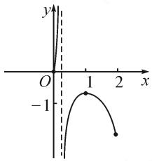
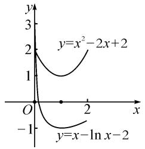
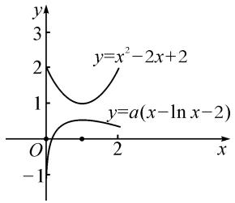
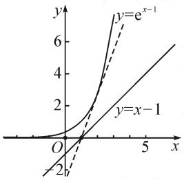
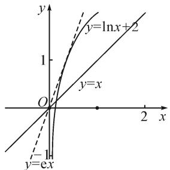
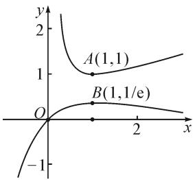

# 数形结合解决含参零点问题\*

——以近两年浙江各地市模拟题为例

●浙江省宁波市慈湖中学 郑敏鸽  
●浙江省宁波市第四中学 蒋亚军

摘要: 导数大题通常作为高考的压轴题, 含参的零点(极值点)问题是考试的热点、学生的难点. 本研究以一道模考题为例, 通过比较, 发现直接法和变量分离法分类多且计算复杂, 因此可利用半分离数形结合法巧解参数的范围(值).

关键词: 含参零点; 半分离法; 数形结合

导数大题通常作为高考的压轴题,含参的导数题是考试的热点、学生的难点.对于含参零点(极值点)问题,学生通常会用求导、极值、零点、分类讨论、变量分离等方法求解,但随之而来的往往是分类多和计算复杂问题,如何在直接和间接、函数和方程之间进行合理选择与转化,实现复杂问题简单化、陌生问题熟悉化就显得很重要.本文中以一道模考题为例,通过对通性通法和变量分离法进行优化,利用半分离法结合两部分函数图象,运用数形结合思想求解参数的范围(值).

# 1 典例分析

例 1 （2022 年衢丽湖三地市教学质量检测 • 22）已知函数 $f(x)=x^{2}+a\ln x(a<2)$ .

(I) 若 a = -2，求函数 $f(x)$ 的极小值点；  
（Ⅱ）当 $x \in (0,2]$ 时，讨论函数 $f(x)$ 的图象与函数 $y = (a + 2)x - 2a - 2$ 的图象公共点的个数，并证明你的结论.

第(Ⅰ)问简单,解答略.下面是第(Ⅱ)问的解法.

解法 1: (直接法) 记 $g(x)=x^{2}+a\ln x-(a+2)x+2a+2(x\in(0,2])$ ，则 $g'(x)=2x+\frac{a}{x}-(a+2)=\frac{(2x-a)(x-1)}{x}, x\in(0,2]$ .

(1) 当 $\frac{a}{2} \leqslant 0$ 即 $a \leqslant 0$ 时, $g(x)_{\min} = g(1) = a + 1$ .

①若 $g(1)>0$ ，则 $g(x)$ 在 $(0,2]$ 上没有零点；  
②若 $g(1)=0$ ，则 $g(x)$ 在 $(0,2]$ 上有一个零点；

③若 $g(1) < 0, g\left(\frac{1}{\mathrm{e}^2}\right) = \left(\frac{1}{\mathrm{e}^2} - 1\right)^2 + 1 - \frac{a}{\mathrm{e}^2} > 0$ 则 $g(x)$ 在 $(0,1]$ 上有一个零点. 若 $g(2) < 0$ ，则函数 $g(x)$ 在 $(1,2]$ 上没有零点；若 $g(2) \geqslant 0$ ，则 $g(x)$ 在 $(1,2]$ 上有一个零点.

(2) 当 $\frac{a}{2} > 0$ ，即 a > 0 时 $g(x)$ 的极小值 $g(1) = a + 1 > 0$ ，所以 $g(x)$ 在 $\left[\frac{a}{2}, 2\right]$ 上没有零点。因为 $g\left(\frac{a}{2}\right) > g(1) > 0$ ， $g\left(\mathrm{e}^{-\frac{2a+2}{a}}\right) = \mathrm{e}^{-\frac{2a+2}{a}}\left[\mathrm{e}^{-\frac{2a+2}{a}} - (a+2)\right] + \left(a \ln \mathrm{e}^{-\frac{2a+2}{a}} + 2a + 2\right) = \mathrm{e}^{-\frac{2a+2}{a}}\left[\mathrm{e}^{-\frac{2a+2}{a}} - (a+2)\right] < 0$ ，所以函数 $g(x)$ 在 $(0, \frac{a}{2}]$ 上有且只有一个零点。

综上所述,两函数图象公共点的个数情况如下:

当 $-1<a\leqslant0$ 时，没有交点；

当 $a < -\frac{2}{\ln 2}$ 或 a = -1 或 0 < a < 2 时，只有一个交点；

当 $-\frac{2}{\ln 2}\leqslant a<-1$ 时，有两个交点.

评注:通性通法为直接法,即先构造差函数,通过讨论差函数的单调性得到交点个数.但分类情况较多以及特殊点函数值 $g\left(\mathrm{e}^{-\frac{2a+2}{a}}\right)<0$ 都是学生容易出错且不易想到的地方,选择符合预期符号的特殊点,可以从与极值点有明确的大小关系和特殊点的函数值较易计算这两个角度出发.基于降低思维难度和减少运算的考量,下面介绍变量分离数形结合和半分离数形结合两种解法.

解法 2: (变量分离数形结合法) 由 $x^{2} + a \ln x = (a + 2)x - 2a - 2$ ，得 $a = \frac{-x^{2} + 2x - 2}{\ln x - x + 2}, x \in (0, x_{0}) \cup (x_{0}, 2]$ ，其中 $x_{0}$ 为 $\ln x - x + 2 = 0$ 的解且 $x_{0} \in (0, 1)$ 。记 $g(x) = \frac{-x^{2} + 2x - 2}{\ln x - x + 2}, x \in (0, x_{0}) \cup (x_{0}, 2]$ ，则$g'(x) = \frac{(1-x)(2\ln x - x + 2 + \frac{2}{x})}{(\ln x - x + 2)^2}$ . 记 $h(x) = 2\ln x - x + 2 + \frac{2}{x}$ ，因为 $h'(x) < 0, h(2) > 0$ ，所以当 $x \in (0,2]$ 时， $h(x) > 0$ . 故 $g(x)$ 在 $(0,x_0)$ 和 $(x_0,1)$ 上单调递增，在 $(1,2]$ 上单调递减.

结合 $g(x)$ 的大致图象(图1)，利用数形结合思想，观察 $g(x)$ 的图象与直线 y=a 的交点情况。易得，当 $-1<a\leqslant0$ 时，没有交点；当 $a<-\frac{2}{\ln2}$ ，或 a=-1，或 0<a<2时，只有一个交点；当 $-\frac{2}{\ln 2}\leqslant a<$ -1 时，有两个交点.

line

| x | y |
|---|---|
| 0 | -1 |
| 1 | 0 |
| 2 | -1 |

图 1

解法 3: (半分离数形结合法) 由 $x^{2} + a \ln x = (a + 2)x - 2a - 2$ ，得 $x^{2} - 2x + 2 = a(x - \ln x - 2)$ ，转化为函数 $y = x^{2} - 2x + 2$ 和 $y = a(x - \ln x - 2)$ 的图象交点个数。分别画出 $y = x^{2} - 2x + 2$ 和 $y = x - \ln x - 2$ 的图象，如图 2-1 所示。

line

| x    | y=x²-2x+2 | y=x-ln x-2 |
| ---- | --------- | ---------- |
| 0    | 2         | -1         |
| 1    | 1         | -0.5       |
| 2    | 0.5       | 0          |

图2-1

line

| x | y = x² - 2x + 2 | y = a(x - ln x - 2) |
|---|---|---|
| 0 | 2 | -1 |
| 1 | 1 | 0 |
| 2 | 0 | 1 |

图2-2

利用数形结合思想,易得下列结论.

当 $0 < a < 2$ 时，有1个交点.当 $a = 0$ 时，没有交点.当 $a < 0$ 时（如图2-2），若 $-a < 1$ 即 $-1 < a < 0$ ，没有交点；若 $-a = 1$ 即 $a = -1$ ，有1个交点；若 $\left\{ \begin{array}{ll} - a > 1, & \\ -a\ln 2\leqslant 2, & \end{array} \right.$ 有2个交点；若 $-a\ln 2 > 2$ ，有1个交点.

综上所述，当 $-1 < a \leqslant 0$ 时，没有交点；当 $a <$ $-\frac{2}{\ln 2}$ ，或 a = -1，或 0 < a < 2 时，只有一个交点；当 $-\frac{2}{\ln 2} \leqslant a < -1$ 时，有两个交点.

评注:变量分离也是常用的方法,等价变形是分离的核心,在分离过程中尤其需要注意对系数的讨论,特别是定义域有变化时极易出错.半分离法的基本步骤,即先将方程转化为两个容易画出图象的函数,分别画出两个函数的图象,利用图象特征(过定点、临界位置等),运用数形结合思想确定参数范围.

# 2 解法应用

例 2 （2021 年温州适应性测试第 22 题）已知函数 $f(x)=\mathrm{e}^{x-1}-ax+a$ 有两个不同的零点 $x_{1}, x_{2}$ 且 $x_{1}<x_{2}$ . (Ⅰ) 求实数 a 的取值范围；(Ⅱ) 略.

解: 函数 $f(x)$ 有两个不同的零点等价于 $y = e^{x-1}$ 和 $y = a(x-1)$ 的图象有两个不同的交点.

结合图 3, 利用数形结合思想, 可得下列结论.

line

| x | y = e^(-x - 1) | y = x - 1 |
|---|---|---|
| 0 | 0 | 0 |
| 5 | 6 | 6 |

图3

当 $a < 0$ 时， $y = \mathrm{e}^{x - 1}$ 和 图3 $y = a(x - 1)$ 的图象有且仅有1个交点，不合题意；

当 a=0 时， $y=e^{x-1}$ 和 $y=a(x-1)$ 的图象没有交点，不合题意；

当 a>0 时，由 $y=e^{x-1}$ 与 $y=a(x-1)$ 的图象相切，可得 a=e。所以 a>e 时， $y=e^{x-1}$ 和 $y=a(x-1)$ 的图象有 2 个不同的交点。

综上所述， $a \in (e, +\infty)$ .

例3（2022年台州第22题）已知函数 $f(x) = x\ln x - \frac{1}{2} ax^2 +x + 1(a\in$ R)有两个不同的极值点 $x_{1},x_{2}(x_{1}<x_{2})$ ，求实数a的取值范围.

text_image

y
y=lnx+2
1
y=x
O
2 x
y=-1
y=ex

图4

解:由题意得 $f'(x)=$ $\ln x - ax + 2 = 0$ 有两个不等正根，转化为 $\ln x + 2 = ax$ 有两个不等正根。画出 $y = \ln x + 2$ 和 $y = ax$ 的图象，如图4，利用数形结合思想，易得 $a \in (0, e)$ 。

(下转第69页)

地掌握数学本质,提高分析问题和解决问题的能力.它是培养学生“数学运算”核心素养中“探究运算思路,选择运算方法”的很好的素材.解法3避免了复杂的坐标运算,能突出圆锥曲线的几何特征,能培养学生“直观想象”的数学核心素养.解法4直观形象,计算简单,几乎以口答的形式就可以得出答案,节省了大量的解题时间,提高了解题效率,体现了数形结合思想的应用,也培养了学生“直观想象”的核心素养,是个很完美的解法.

在具体的教学实践中,由于要讲评的题目太多,加上课时的限制,在讲例1时,没想到解法4的教师只讲解了解法3;想到解法4的教师会选择最简单的解法,一般只讲解解法4;部分教师会涉及到解法2,但不会详细讲解;很多教师觉得解法1运算繁,没看到它对数学运算的教育功能,很少去讲解解法1.就这样,由于对各种解法及其教育功能没有深入研究,导致在遇到好的教育材料时常常不能好好利用.另外,解法4虽然解法简单,但学生不容易想到,它对学生的数学能力要求高,比较适合优秀的学生.如果对基础差的同学只讲解解法4的话,教学后,发现讲过的题目这部分学生还是不会做,运算能力还是很差,教学效果不好.由此可见,如果选择的解法不适合学生,教学效果也不会好.

在处理例 1 时, 笔者重视大单元教学理念的应用, 在新课教学中, 从整体出发, 对四种解法分批次讲解. 在学习双曲线概念时, 向学生讲解解法 1, 突出用代数方法解决几何问题, 培养学生的数学运算能力; 在学习双曲线的几何性质时, 向学生讲解解法 3 和解法 4; 在复习到算法选择时, 讲解解法 2. 在后续教学中碰到类似题目时还会重复讲, 但一般只选择一种方法讲; 到高三总复习时, 有时间的话四种解法一起讲, 这种教学效果很好.

# 5 结束语

由于高中数学内容多、难度大、课时紧张，因此在高中数学教学中，我们处处面临着教学选择。无论是同一个问题的多种理解、同一道题目的多种解法，还是同一种解法的不同讲解方法，如果我们能去了解它们的具体内涵，了解它们的教育功能，就能根据自己的教学目标和学生情况，选择最合适的内容和方式进行教学，从而避免“题海战术”，实行高效教学。Z

# (上接第66页)

例 4 已知函数 $f(x)=\ln x+\frac{1}{x}, g(x)=ae^{-x}-\frac{1}{x}\cdot$ $\ln x.$ 若 $f(x)-xg(x)\geqslant\ln x$ 恒成立，求实数 a 的取值范围.

line

| Point | x | y |
|---|---|---|
| A(1,1) | 1 | 1 |
| B(1,1/e) | 1 | 0 |

图5

解:由题意得 $\ln x + \frac{1}{x} \geqslant a \cdot \frac{x}{\mathrm{e}^{x}}$ 在 $(0, +\infty)$ 上恒成立.

分别作出 $y=\ln x+\frac{1}{x}$ 和 $y=\frac{x}{e^{x}}$ 的图象，结合图 5，可知 $1\geqslant a\cdot\frac{1}{e}$ ，即 $a\leqslant e$ .

# 3 相关试题

题 1 （2022 年温州适应性测试 · 22）已知 $t \in R$ ，函数 $f(x) = \mathrm{e}^{tx} - \mathrm{e}x, g(x) = \ln x - tx + 1.$

(I) 若 $f(x) \geqslant 0$ 恒成立, 求 t 的取值范围;

（Ⅱ）若方程 $f(x) = g(x)$ 有两个正实数根 $x_{1}, x_{2} (x_{1} < x_{2})$ ，求 $t$ 的取值范围.

题 2 [2022 年浙江省模拟卷 $(9+1)\cdot22$ ] 已知函数 $f(x)=\mathrm{e}^{x}+ax^{2}-\frac{\sqrt{\mathrm{e}}}{2}x(a\in\mathbf{R})$ . 若函数 $f(x)$ 在

(0,1)上有两个极值点 $x_{1}, x_{2} (x_{1} < x_{2})$ ，求实数 $a$ 的取值范围.

题 3 （2022 年绍兴市适应性试卷 · 22）已知 $a \in R$ ，函数 $f(x) = e^{2x} + \frac{ax^{2}}{2} - \sqrt{e}x$ 有两个极值点 $x_{1}, x_{2}$ ，且 $0 < x_{1} < x_{2} < 1$ ，求实数 a 的取值范围.

题 4 （2022 年杭州临安中学高三下模拟 · 22）已知函数 $f(x)=x^{2}+ax+\ln x, a \in \mathbb{R}$ . 若函数 $f(x)$ 存在两个极值，求 a 的取值范围.

题 5 （2022 年宁波市第四中学考前模拟 · 9）已知函数 $f(x)=(x+1)\ln x-a(x-1)$ 有三个零点，则实数 a 的取值范围是（）.

A.(0,2)

B.(2,e)

C. $(e,+\infty)$

D. $(2,+\infty)$

数形结合思想是高中数学非常重要的思想之一，它能将抽象的数学语言与直观的几何图形有机地结合起来，促进抽象思维与形象思维的完美统一，从而使复杂问题简单化，抽象问题具体化。纵观多年来的高考试题，巧妙运用数形结合的思想方法解决一些抽象的数学问题，可起到事半功倍的效果，数形结合的重点是研究“以形助数”。Z