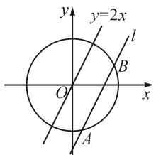
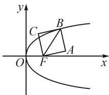
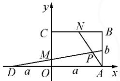
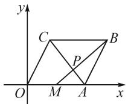

# 求动点轨迹方程最简捷的四种方法

# ●安徽省全椒县城东中学 殷宏林

摘要: 求符合某种条件的动点轨迹方程, 实际上就是利用已知的点的坐标之间的运动规律去寻找变量间的关系. 求轨迹方程的常规思路, 就是想方设法地把题目中的几何问题转化为代数方程问题来解决.

关键词: 参数法; 复数法; 交轨法; 相关点法

求动点的轨迹方程既是高中数学教学大纲要求掌握的主要内容,也是近年来高考考查的高频考点 $^{[1]}$ .这类题型由于涉及到的知识点多,综合性较强,考查的范围广,分值较高,因此学习和掌握求轨迹方程的方法与技巧,已成为考生在高考中夺取高分的必要条件.

轨迹是指点的集合,而方程是实数对的集合.二者看似毫不相干,实则它们之间是可以沟通转化的,求轨迹方程运用的就是这种转化思想.由于动点运动规律所给出的条件不同,因此求动点轨迹方程的方法也就不同 $^{[2]}$ ,但其中最简捷、最实用的有以下四种.

# 1 参数法

当所求动点满足的几何条件不易得出,也看不出明显的相关性时,如果经过仔细观察,发现这个动点的运动常常会受到某个变量(时间、角度、斜率、比值等)的制约,那么我们就可以用这个变量作参数,建立轨迹的参数方程,这就是参数法.

例 1 动直线 l 与单位圆交于不同的两点 A, B, 当 l 总保持平行于直线 y = 2x 的条件下移动时, 求弦 AB 中点轨迹的方程.

text_image

y
y=2x
l
B
O
x
A

图1

解:由 l 平行于直线 y=2x，可设 l 的方程为 $y=2x+b$ (b 为参数)，将其代入单位圆的方程$x^{2}+y^{2}=1$ 中，整理得 $5x^{2}+4bx+b^{2}-1=0$ .

如图1，因为 $l$ 与单位圆有两个交点，所以 $\Delta = 16b^{2} - 20b^{2} + 20 = 20 - 4b^{2} > 0$ ，则 $-\sqrt{5} < b < \sqrt{5}$

设弦 AB 的中点为 $P(x, y)$ ，根据韦达定理可知 $x = \frac{x_{1} + x_{2}}{2} = -\frac{2}{5} b$ ，代入 l 的方程中，得 $y = \frac{b}{5}$ .

所以中点 P 的轨迹方程为 $\left\{\begin{aligned}x&=-\frac{2}{5}b,\\ y&=\frac{b}{5},\end{aligned}\right.$ 其中 $-\sqrt{5}<b<\sqrt{5}.$

消去参数 $b$ ，得 $x + 2y = 0\left(-\frac{2\sqrt{5}}{5} < x < \frac{2\sqrt{5}}{5}\right)$ ，此即为弦 AB 中点轨迹的普通方程, 其轨迹为单位圆中的一条线段.

思路与方法:从本题的解题思路可以看出以下几点.①利用几何直观即可判断出动点轨迹为过原点且垂直于 y=2x 的含于单位圆中的线段;②当动点位置随着直线的平行移动而变化时,常选择截距作为参数较方便;③在求轨迹方程时,只要参数选择得当,常能使问题获得更简捷的解法.

# 2 复数法

有些问题可以由复数的几何意义将动点和已知点表示成复数式,然后经过复数运算转化为动点的轨迹,这就是复数法.当涉及有向线段绕定点旋转,长度伸缩变化,或可用复数模的形式给出坐标间关系等问题时,运用复数法求解最简捷.

例 2 如图 2, 以抛物线 $y^{2}=4x$ 的焦半径 FB 为对角线作正方形 FABC (顶点按逆时针方向顺序排列). 求顶点 C 的轨迹方程.

解: 因为抛物线 $y^{2}=4x$ 中焦参数 p=2，所以焦点坐标为 $F(1,0)$ .

text_image

y
C
B
O
F
A
x

图2

设动点 $C(x,y)$ ，其相关点 $B(x',y')$ .

把 x 轴看作实轴，y 轴为虚轴，则在复平面上，有 $z_{C}=x+yi, z_{B}=x'+y'i, z_{F}=1$ ，所以 $z_{\overrightarrow{FC}}=(x-1)+yi, z_{\overrightarrow{FB}}=(x'-1)+y'i.$

由 $\angle BFC = \frac{\pi}{4}, |FB| = \sqrt{2} |FC|$ ，得 $z_{\overrightarrow{FB}} = z_{\overrightarrow{FC}} \times \sqrt{2}\left[\cos \left(-\frac{\pi}{4}\right) + \mathrm{i}\sin \left(-\frac{\pi}{4}\right)\right]$ ，即 $(x' - 1) + y'\mathrm{i} = [(x - 1) + y\mathrm{i}] \cdot \sqrt{2}\left(\frac{\sqrt{2}}{2} - \frac{\sqrt{2}}{2}\mathrm{i}\right) = [(x - 1) + y] + [y - (x - 1)]\mathrm{i}$ .

所以 $\left\{\begin{aligned}x^{\prime}-1&=x-1+y,\\ y^{\prime}&=y-x+1,\end{aligned}\right.$ 即 $\left\{\begin{aligned}x^{\prime}&=x+y,\\ y^{\prime}&=y-x+1.\end{aligned}\right.$

因为点 B 在 $y^{2}=4x$ 上，所以 $(y')^{2}=4x'$ .

故 $(y-x+1)^{2}=4(x+y)$ .

整理即得动点 C 的轨迹方程为

$$
x ^ {2} + y ^ {2} - 2 x y - 6 x - 2 y = 0.
$$

思路与方法:本题通过建立复平面,利用复数加法和乘法的几何意义,求出动点对应的复数表达式,然后通过比较实部、虚部求得动点的轨迹方程.

# 3 交轨法

在求动点轨迹时,有时会遇到求两动曲线交点的轨迹问题.这类问题可以通过解方程组求出含参数的交点坐标,再消去参数得出所求轨迹的方程,这就是交轨法.

例 3 在直角坐标系中, 矩形 OABC 的边 OA = a, OC = b, 点 D 在 AO 的延长线上, $|DO| = a$ , 设 M, N 分别是 OC, BC 上的动点, 使 OM: MC = BN: NC ≠ 0, 求直线 DM 和 AN 的交点 P 的轨迹方

text_image

y
C
N
B
M
P
b
D a O a A x

图3

解:如图3,建立平面直角坐标系,则各点的坐标分别为 $A(a,0)$ , $C(0,b)$ , $D(-a,0)$ , $B(a,b)$ , 设 $P(x,y)$ .

设 $OM:MC = BN:NC = \lambda (\neq 0)$ .由定比分点公式，得 $M\left(0,\frac{\lambda b}{1 + \lambda}\right),N\left(\frac{a}{1 + \lambda},b\right).$

根据两点式,可得直线 DM, AN 的方程分别为

$$
y = \frac {\lambda b}{a (1 + \lambda)} (x + a), \tag {①}
$$

$$
y = - \frac {b (1 + \lambda)}{\lambda a} (x - a). \tag {②}
$$

①×②，得 $y^{2}=-\frac{b^{2}}{a^{2}}(x^{2}-a^{2})$ ，即 $\frac{x^{2}}{a^{2}}+\frac{y^{2}}{b^{2}}=1(0<x<a,0<y<b)$ .

故点 P 的轨迹方程为 $\frac{x^{2}}{a^{2}} + \frac{y^{2}}{b^{2}} = 1$ 其中 0 < x < a，0 < b < y.

思路与方法:本题中由于动点 P 为动直线 DM, AN 的交点,两动直线均有一定点 $(D,A)$ 一动点 $(M,N)$ , 而两动点又满足 OM:MC=BN:NC 这一比值条件, 所以设此比值为参数较为方便. 从本题的求解过程我们发现, 运用交轨法求解时, 可以不用求交点的坐标, 只要能消掉参数, 得出点 P 的坐标间的关系即可. 这也充分展示了运用交轨法求轨迹方程的便捷性与实用性.

# 4 相关点法

在求动点轨迹方程的过程中,有时动点满足的条件不方便用等式列出,但动点是随着另外相关点而运动的.如果相关点所满足的条件能够看出,或可分析出,这时就可以用动点的坐标来表示相关点的坐标,根据相关点所满足的方程就能够求得动点的轨迹方程,这就是相关点法.

例 4 已知定点 $O(0,0)$ 和 $A(6,0)$ ，M 为 OA 的中点，以 OA 为一边作菱形 OABC，MB 与 AC 交于点 P，当菱形变动时，求点 P 的轨迹方程.

  
图4

解:如图 4, 设动点 $P(x, y)$ , 其相关点 $B(x', y')$ .

由 $A(6,0)$ , 得 $M(3,0)$ . 易知 $\frac{|MP|}{|PB|} = \frac{1}{2}$ .

$$
\text {所以由} \left\{ \begin{array}{l l} x = \frac {3 + \frac {1}{2} x ^ {\prime}}{1 + \frac {1}{2}}, \\ y = \frac {0 + \frac {1}{2} y ^ {\prime}}{1 + \frac {1}{2}}, \end{array} \right. \text {得} \left\{ \begin{array}{l l} x ^ {\prime} = 3 x - 6, \\ y ^ {\prime} = 3 y. \end{array} \right.
$$

由 $|AB|=|OA|=6$ ，可得

$$
\sqrt {(x ^ {\prime} - 6) ^ {2} + (y ^ {\prime} - 0) ^ {2}} = 6.
$$

即 $\sqrt{(3x-6-6)^{2}+(3y-0)^{2}}=6.$

整理，得 $(x-4)^{2}+y^{2}=4$ .

因为点 P 不可能在 x 轴上, 所以点 P 的轨迹方程为 $(x-4)^{2}+y^{2}=4(y\neq0)$ .

思路与方法:本题分析已知点与动点间的关系时,找出相关点是关键的一步.在图4中,若连接OB,则可知P为 $\triangle ABO$ 的重心,所以选B为相关点更方便;当然也可由AC平分 $\angle OAB$ ,推知 $\frac{|BP|}{|PM|}=2$ .事实上,求已知曲线关于某定点(或定直线)的中心对称(或轴对称)的曲线方程时,通常选择相关点法较简捷 $^{[3]}$ .

# 5 结论

从上述典型实例可以看出,求动点轨迹方程的方法虽然很多,但上述四种方法最简捷,也非常实用,值得学生借鉴.当然,在求轨迹方程的过程中,要注意以上方法的灵活运用.对同一问题,若几种方法都可解决时,应择优选用;对较复杂的问题,有时需将两种或两种以上的方法结合起来使用.

# 参考文献：

[1]钟载硕.求动点轨迹方程八法[J].理科考试研究:高中版,2004(3):10-14.  
[2] 张黎青. 求动点轨迹方程的常用方法介绍 [J]. 新高考 (高二语数外), 2010(2): 33-35.  
[3]陆钧.浅谈求动点轨迹方程[J].理科考试研究:高中版,2006(11):12-13.Z