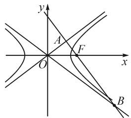
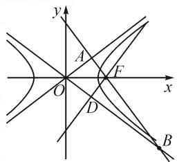
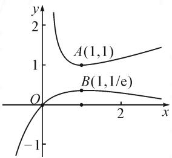

# 浅谈数学解题教学中的解法思考与教学选择

——以一道求离心率考题为例

●福建省泉州第五中学 郭智恒 黄种生

摘要:结合一道求离心率的考题,阐述高中数学教学中,对于一些有代表性的数学题,教师不仅仅要会解题,熟悉解题思路,还要对各种解题思路进行教学思考,了解它们的教育功能,并根据学生的情况,选择合适的教学内容和方式,以避免“题海战术”,进而提高教学效率.

关键词: 解法思考; 教学思考; 选择

# 1 引言

在高中数学教学中,教师要帮助学生理解和掌握数学知识,构建数学认知结构,培养数学核心素养,因此,数学教学要以学生为主体.对于不同水平的学生,相同学生的不同学习阶段,同一个知识点,同一个公式,同一个题目,教师应有不同的理解和不同的教法.对于一些有代表性的数学题,教师不仅要会解题,熟悉解题思路,还要对各种解题思路进行教学思考,了解它们的教育功能,并根据学生的情况,选择合适的教法.本文中以一道向量背景下求离心率的考题为例,探究其解题思路,分析各种解题方法的特点,阐述对各种解题方法的教学思考和教学选择,以期抛砖引玉,引发教师对教法选择作更多的思考,以找到适合自己和学生的高效教学法.

# 2 试题解法与解法思考

例 1 （2019 年山东烟台福山第一中学高二期末考题）设 F 是双曲线 $C: \frac{x^{2}}{a^{2}} - \frac{y^{2}}{b^{2}} = 1$ (a, b > 0) 的右焦点，过点 F 向 C 的一条渐近线引垂线，垂足为 A，交另一条渐近线于点B, 如图 1. 若 $2 \overrightarrow{AF} = \overrightarrow{FB}$ ，则双曲线 C 的离心率为 \_\_\_\_.

分析: 设 $A(x_{1}, y_{1})$ , $B(x_{2}, y_{2})$ ，则由 $2\overrightarrow{AF} = \overrightarrow{FB}$ , $F(c, 0)$ ，可得 $2(c - x_{1}, -y_{1}) = (x_{2} - c, y_{2})$ ，则 $\left\{\begin{aligned}&2(c - x_{1}) = x_{2} - c,\\ &-2y_{1} = y_{2}.\end{aligned}\right.$ 选择横坐标的等式，则得到下列的解法1；选择纵坐标的等式，则得到下列的解法2.

text_image

y
A
F
O
x
B

图 1

解法1:由已知得 $F(c,0)$ ,OA的方程为 $y=\frac{b}{a}x$ ,OB的方程为 $y=-\frac{b}{a}x$ ,则FA的方程为 $y=-\frac{a}{b}\cdot(x-c)$ ,联立 $y=\frac{b}{a}x$ ,可得 $x_{1}=\frac{a^{2}}{c}$ ,联立 $y=-\frac{b}{a}x$ ,可得 $x_{2}=\frac{ca^{2}}{a^{2}-b^{2}}$ .由 $2\overrightarrow{AF}=\overrightarrow{FB}$ ,可得 $2(c-x_{1})=x_{2}-c$ ,则 $2\left(c-\frac{a^{2}}{c}\right)=\frac{ca^{2}}{a^{2}-b^{2}}-c$ ,两边同乘c合并后得 $3c^{2}-2a^{2}=\frac{c^{2}a^{2}}{2a^{2}-c^{2}}$ .去分母合并后得 $3c^{4}-7c^{2}a^{2}+4a^{4}=0$ .变形得 $3e^{4}-7e^{2}+4=0$ ,解得 $e^{2}=\frac{4}{3}$ 或 $e^{2}=1$ (舍去),所以 $e=\frac{2\sqrt{3}}{3}$ .

解法思考: 解法 1 的优点是解法自然, 学生容易想到. 缺点是运算量大, 容易出错. 从核心素养的培养来看, 解法 1 能很好地培养学生“数学运算”核心素养. 从教学效果来看, 解法 1 能提高学生数学运算能力, 增强学生做好数学运算的信心, 是培养学生“数学运算”核心素养的好题目. 在解析几何学习初期, 在教学选择上, 我会选择解法 1 进行详细地讲解, 并提倡学生用解法 1 解题.

解法 2: 由已知得 $F(c,0)$ , OA 的方程为 $y=\frac{b}{a}x$ , OB 的方程为 $y=-\frac{b}{a}x$ ，则 FA 的方程为 $y=-\frac{a}{b}(x-c)$ ，联立方程 $y=\frac{b}{a}x$ ，可得 $y_{1}=\frac{ab}{c}$ ，联立 $y=-\frac{b}{a}x$ ，可得 $y_{2}=\frac{-abc}{a^{2}-b^{2}}$ 。由 $2\overrightarrow{AF}=\overrightarrow{FB}$ ，可得 $y_{2}=-2y_{1}$ ，即 $\frac{-abc}{a^{2}-b^{2}}=-2\frac{ab}{c}$ 。化简得 $a^{2}=3b^{2}$ ，所以 e=

$$
\frac {2 \sqrt {3}}{3}.
$$

解法思考: 解法 2 与解法 1 大体相同, 但选用纵坐标进行计算, 不仅运算量减少了, 且不容易出错. 它多了一种思考和选择, 而这正是“数学运算”核心素养所要求的. 数学运算素养是指在明晰运算对象的基础上, 依据运算法则解决数学问题的素养. 主要包括理解运算对象, 掌握运算法则, 探究运算思路, 选择运算方法, 设计运算程序, 求得运算结果, 等等. 解法 2 能很好地体现“探究运算思路, 选择运算方法”的优势.

解法 3: 由双曲线的性质知, 焦点 F 到渐近线的距离 $\left|AF\right|=b$ , 则 $\left|AO\right|=\sqrt{c^{2}-b^{2}}=a$ . 由 $2\overrightarrow{AF}=\overrightarrow{FB}$ , 可得 $\left|AB\right|=3b$ .

由 $\angle AOB = 2\angle AOF$ ，得 $\tan \angle AOB = \tan 2\angle AOF$ 即 $\frac{3b}{a} = \frac{\frac{2b}{a}}{1 - (\frac{b}{a})^2}$ 所以 $a^2 = 3b^2$ 故 $e = \frac{2\sqrt{3}}{3}$ .

解法思考: 解法 3 数形结合, 利用双曲线两渐近线的对称性, 焦点到渐近线的距离是 b, 以及倍角公式得到 a 和 b 的关系, 与解法 1 和解法 2 相比, 避免了复杂的坐标运算, 思路清晰, 运算简单, 能培养学生“直观想象”的数学核心素养, 是比较好的解题方法. 但它不如解法 1 具体, 对学生的数学能力有较高的要求.

解法 4: 如图 2, 过点 F 向 C 的另一条渐近线引垂线, 垂足为 D, 则 $\left|DF\right|=b, \left|BF\right|=2b$ , 于是 $\left|BF\right|=2\left|DF\right|$ , 所以 $\angle FBD=30^{\circ}, \angle AOB=60^{\circ}$ , 则 $\angle AOF=30^{\circ}$ , 从而 $\frac{b}{a}=\frac{\sqrt{3}}{3}$ , 故 $e=\frac{2\sqrt{3}}{3}$ .

text_image

y
A
O
F
x
D
B

图2

解法思考: 解法 4 通过添加辅助线, 利用双曲线的几何性质, 直接求出离心率. 与前三种解法相比, 解法 4 直观形象, 计算简单, 体现了数形结合思想, 培养了学生“直观想象”的核心素养, 是个很完美的解法. 但它对学生的数学能力要求高, 从教学实践来看, 能想到这种解法的学生不多. 采用这种方法教学, 对优秀生效果很好, 但对中等生和后进生, 教学效果不是很好.

# 3 解法总结

从例 1 的四种解法可以总结出, 向量背景下求圆锥曲线离心率的题型, 解题方法有两类. 一类是利用向量的坐标表示, 联立直线或者圆锥曲线方程, 用方程思想或者不等式思想解题, 我们把这类方法叫“坐标法".在“坐标法”中,又分为两小类:一小类用横坐标解题,即“x-型”,如解法1;另一小类是用纵坐标解题,即“y-型”,如解法2.我们可以根据题目的条件,选择便于计算的类型即可.另一类是利用圆锥曲线的几何性质、平面几何知识和解三角形的方法解题,我们把这种方法叫做“几何法”,如解法3和解法4.通过进一步学习会发现,向量背景下求圆锥曲线离心率的题型,都可以用这四种方法.比如以下几个例题.

例 2 （2018 年课标全国卷Ⅲ，11）设 $F_{1}, F_{2}$ 是双曲线 $C: \frac{x^{2}}{a^{2}} - \frac{y^{2}}{b^{2}} = 1 (a > 0, b > 0)$ 的左、右焦点，O 是坐标原点，过 $F_{2}$ 作 C 的一条渐近线的垂线，垂足为 P，若 $\left|PF_{1}\right| = \sqrt{6}\left|OP\right|$ ，则 C 的离心率为（）.

A. $\sqrt{5}$

B.2

C. $\sqrt{3}$

D. $\sqrt{2}$

例 3 （2019 年课标全国卷 I,19）已知抛物线 C: $y^{2}=3x$ 的焦点 F，斜率为 $\frac{3}{2}$ 的直线 l 和 C 的交点为 A, B，与 x 轴的交点为 P.

(1) 若 $\left|AF\right| + \left|BF\right| = 4$ ，求 l 的方程；  
(2)若 $\overrightarrow{AP} = 3\overrightarrow{PB}$ ，求 $|AB|$

例 4 （2020 天津，18）已知椭圆 $\frac{x^{2}}{a^{2}} + \frac{y^{2}}{b^{2}} = 1 (a > b > 0)$ 的一个顶点为 A (0, -3)，右焦点为 F，且 $|OA| = |OF|$ ，其中 O 为原点.

(I)求椭圆的方程；

（Ⅱ）已知点 C 满足 $3 \overrightarrow{OC} = \overrightarrow{OF}$ ，点 B 在椭圆上（B 异于椭圆的顶点），直线 AB 与以 C 为圆心的圆相切于点 P，且 P 为线段 AB 的中点，求直线 AB 的方程.

上面 3 道例题都可以用上面总结的方法求解, 可以看出, 我们的总结具有代表性, 且具有一般意义. 例 1 是具有代表性的典型例题. 这种教法能帮助学生总结学习方法, 发现学习规律, 进而培养学生分析问题和解决问题的能力, 帮助学生学会思考, 学会学习.

# 4 教学选择与思考

从解题的角度看,例题1的四种解法也许有优劣之分,但从教学的角度看,四种解法没有优劣之分,对不同水平的学生、相同学生不同的学习阶段,以及不同的教学目标,每一种解法都有其独特的教学功能,都具有不可替代性,需要教师去思考和选择.如解法1,虽然解法比较繁,运算量大,但是它思路自然,符合学生的认知水平,对于数学水平不高或初学解析几何的学生,很适合用解法1讲解;无论是培养学生“数学运算”核心素养,还是提高学生数学运算能力,解法1都有很好的教学价值.对于解法2,当学生解析几何学习到一定程度时,必须掌握这种方法,这样才能更好地掌握数学本质,提高分析问题和解决问题的能力.它是培养学生“数学运算”核心素养中“探究运算思路,选择运算方法”的很好的素材.解法3避免了复杂的坐标运算,能突出圆锥曲线的几何特征,能培养学生“直观想象”的数学核心素养.解法4直观形象,计算简单,几乎以口答的形式就可以得出答案,节省了大量的解题时间,提高了解题效率,体现了数形结合思想的应用,也培养了学生“直观想象”的核心素养,是个很完美的解法.

在具体的教学实践中,由于要讲评的题目太多,加上课时的限制,在讲例1时,没想到解法4的教师只讲解了解法3;想到解法4的教师会选择最简单的解法,一般只讲解解法4;部分教师会涉及到解法2,但不会详细讲解;很多教师觉得解法1运算繁,没看到它对数学运算的教育功能,很少去讲解解法1.就这样,由于对各种解法及其教育功能没有深入研究,导致在遇到好的教育材料时常常不能好好利用.另外,解法4虽然解法简单,但学生不容易想到,它对学生的数学能力要求高,比较适合优秀的学生.如果对基础差的同学只讲解解法4的话,教学后,发现讲过的题目这部分学生还是不会做,运算能力还是很差,教学效果不好.由此可见,如果选择的解法不适合学生,教学效果也不会好.

在处理例 1 时, 笔者重视大单元教学理念的应用, 在新课教学中, 从整体出发, 对四种解法分批次讲解. 在学习双曲线概念时, 向学生讲解解法 1, 突出用代数方法解决几何问题, 培养学生的数学运算能力; 在学习双曲线的几何性质时, 向学生讲解解法 3 和解法 4; 在复习到算法选择时, 讲解解法 2. 在后续教学中碰到类似题目时还会重复讲, 但一般只选择一种方法讲; 到高三总复习时, 有时间的话四种解法一起讲, 这种教学效果很好.

# 5 结束语

由于高中数学内容多、难度大、课时紧张，因此在高中数学教学中，我们处处面临着教学选择。无论是同一个问题的多种理解、同一道题目的多种解法，还是同一种解法的不同讲解方法，如果我们能去了解它们的具体内涵，了解它们的教育功能，就能根据自己的教学目标和学生情况，选择最合适的内容和方式进行教学，从而避免“题海战术”，实行高效教学。Z

# (上接第66页)

例 4 已知函数 $f(x)=\ln x+\frac{1}{x}, g(x)=ae^{-x}-\frac{1}{x}\cdot$ $\ln x.$ 若 $f(x)-xg(x)\geqslant\ln x$ 恒成立，求实数 a 的取值范围.

line

| Point | x | y |
|---|---|---|
| A(1,1) | 1 | 1 |
| B(1,1/e) | 1 | 0 |

图5

解:由题意得 $\ln x + \frac{1}{x} \geqslant a \cdot \frac{x}{\mathrm{e}^{x}}$ 在 $(0, +\infty)$ 上恒成立.

分别作出 $y=\ln x+\frac{1}{x}$ 和 $y=\frac{x}{e^{x}}$ 的图象，结合图 5，可知 $1\geqslant a\cdot\frac{1}{e}$ ，即 $a\leqslant e$ .

# 3 相关试题

题 1 （2022 年温州适应性测试 · 22）已知 $t \in R$ ，函数 $f(x) = \mathrm{e}^{tx} - \mathrm{ex}, g(x) = \ln x - tx + 1.$

(I) 若 $f(x) \geqslant 0$ 恒成立, 求 t 的取值范围;

（Ⅱ）若方程 $f(x) = g(x)$ 有两个正实数根 $x_{1}, x_{2} (x_{1} < x_{2})$ ，求 $t$ 的取值范围.

题 2 [2022 年浙江省模拟卷 $(9+1)\cdot22$ ] 已知函数 $f(x)=\mathrm{e}^{x}+ax^{2}-\frac{\sqrt{\mathrm{e}}}{2}x(a\in\mathbf{R})$ . 若函数 $f(x)$ 在

(0,1)上有两个极值点 $x_{1}, x_{2} (x_{1} < x_{2})$ ，求实数 $a$ 的取值范围.

题 3 （2022 年绍兴市适应性试卷 · 22）已知 $a \in R$ ，函数 $f(x) = e^{2x} + \frac{ax^{2}}{2} - \sqrt{e}x$ 有两个极值点 $x_{1}, x_{2}$ ，且 $0 < x_{1} < x_{2} < 1$ ，求实数 a 的取值范围.

题 4 （2022 年杭州临安中学高三下模拟 · 22）已知函数 $f(x)=x^{2}+ax+\ln x, a \in \mathbb{R}$ . 若函数 $f(x)$ 存在两个极值，求 a 的取值范围.

题 5 （2022 年宁波市第四中学考前模拟 · 9）已知函数 $f(x)=(x+1)\ln x-a(x-1)$ 有三个零点，则实数 a 的取值范围是（）.

A.(0,2)

B.(2,e)

C. $(e,+\infty)$

D. $(2,+\infty)$

数形结合思想是高中数学非常重要的思想之一，它能将抽象的数学语言与直观的几何图形有机地结合起来，促进抽象思维与形象思维的完美统一，从而使复杂问题简单化，抽象问题具体化。纵观多年来的高考试题，巧妙运用数形结合的思想方法解决一些抽象的数学问题，可起到事半功倍的效果，数形结合的重点是研究“以形助数”。Z