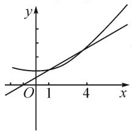

# 研透数列小题,优化数学运算

# ●江苏省靖江市教育局 陈亚琴

摘要:优化数学运算,简化解题过程是数学解题所追求的一个理想目标,特别是在解决数列小题时,研透题意内涵,抓住数列的基本题型,合理切入与转化,巧妙数学运算,可以有效优化过程,提升解题效益,引领并指导数学教学与复习备考.

关键词: 数列; 小题; 数学运算; 递推关系式; 通项

数列是高中数学的重要内容与主干知识之一,既是函数的特殊化,也是学生进一步学习高等数学的基础,在每年高考中都占有一定的比重.特别在解决数列小题(选择题或填空题)时,由于数列问题的灵活性、技巧性、创新性以及综合性较强,简化解题过程,优化数学运算就是我们解决数列小题不断追求的一个理想目标,进而提升解题效益.

# 1 涉及数列的递推关系式或通项问题

例 1 在数列 $\{a_{n}\}$ 中， $a_{1}=2, a_{n+1}=\frac{n}{n+1}a_{n}$ ，则 $a_{n}=$ \_\_\_\_.

分析:根据题目条件,构建数列中连续两项的比值关系式,通过累乘法加以合理变形与转化,进而得以确定数列的通项公式.结合数列通项公式的累乘法处理,巧妙约分,简化数学运算,提升解题效益.

解析:由于 $a_{n+1}=\frac{n}{n+1}a_{n},a_{1}=2$ ，则知 $a_{n}\neq0$ ，可得 $\frac{a_{n+1}}{a_{n}}=\frac{n}{n+1}$ ，所以 $a_{n}=\frac{a_{n}}{a_{n-1}}\cdot\frac{a_{n-1}}{a_{n-2}}\cdot\cdots\cdot\frac{a_{3}}{a_{2}}\cdot\frac{a_{2}}{a_{1}}\cdot a_{1}=\frac{n-1}{n}\cdot\frac{n-2}{n-1}\cdot\cdots\cdot\frac{2}{3}\cdot\frac{1}{2}\cdot2=\frac{2}{n}$ .

故填答案: $\frac{2}{n}$ .

点评:此类涉及由递推关系式求数列通项公式常用的方法——(1)通过递推关系式写出相应数列的前若干项,进而借助归纳,猜想出数列的一个通项公式,再加以验证;(2)利用递推关系式的化归与变形,结合基本特征,借助累加法(适用于 $a_{n+1}=a_{n}+f(n)$ 型)、累乘法(适用于 $a_{n+1}=a_{n}\cdot f(n)$ 型)、待定系数法(适用于 $a_{n+1}=pa_{n}+q$ 型)等常见技巧与方法来求解数列的通项公式.

# 2 涉及等差(等比)数列的基本量问题

例 2 （2021 年安徽省合肥市高考数学第一次教学质量检测）若数列 $\{a_{n}\}$ 的前 n 项和 $S_{n}$ 满足 $3S_{n}=2a_{n}-1$ ，则 $a_{5}=(\quad)$ .

A.32 B. $\frac{1}{32}$ C. $-\frac{1}{16}$ D.-16

分析:根据题目条件,结合数列的前 n 项和 $S_{n}$ 与通项 $a_{n}$ 之间的关系,确定数列的类型是关键.可以从 $a_{n}$ 的视角或从 $S_{n}$ 的视角来切入,进而结合题意确定特殊数列的基本量,为进一步求解提供条件.

解法1:由 $3S_{n}=2a_{n}-1$ ，可得当 $n\geqslant2$ 时， $3S_{n-1}=2a_{n-1}-1$ ，两式作差得 $3a_{n}=2a_{n}-2a_{n-1}(n\geqslant2)$ ，即 $a_{n}=-2a_{n-1}(n\geqslant2)$ .

又当 n=1 时， $3S_{1}=2a_{1}-1$ ，所以 $a_{1}=-1$ 。

所以，数列 $\{a_{n}\}$ 是以-1为首项，-2为公比的等比数列，则 $a_{n}=-1\times(-2)^{n-1}$ ，从而 $a_{5}=-16$ 。

故选择答案:D.

解法 2: 由 $3S_{n}=2a_{n}-1$ ，可得当 $n\geqslant2$ 时， $3S_{n}=2(S_{n}-S_{n-1})-1$ ，整理得 $S_{n}=-2S_{n-1}-1$ ，即 $S_{n}+\frac{1}{3}=-2\left(S_{n-1}+\frac{1}{3}\right)(n\geqslant2)$ .

又当 n=1 时， $3S_{1}=2a_{1}-1$ ，所以 $S_{1}=-1$ 。

故数列 $\left\{S_n + \frac{1}{3}\right\}$ 是以 $-\frac{2}{3}$ 为首项，-2为公比的等比数列.

于是 $S_{n} + \frac{1}{3} = -\frac{2}{3}\times (-2)^{n - 1}$ ，即 $S_{n} = -\frac{2}{3}\times$ $(-2)^{n - 1} - \frac{1}{3}$

所以 $a_5 = S_5 - S_4 = -\frac{2}{3} \times [16 - (-8)] = -16.$

故选择答案:D.

点评:此类涉及等差数列、等比数列的基本量问题有如下求解策略。(1)结合一些熟悉数列的结构特征,如前n项和为 $S_{n}=an^{2}+bn(a,b$ 是常数)形式的数列为等差数列,通项公式为 $a_{n}=p\cdot q^{n-1}(p,q\neq0)$ 形式的数列为等比数列,首先确定数列类型;(2)抓住确定类型数列的基本量,首项 $a_{1}$ 、公差d或公比q;(3)根据条件借助数列的通项公式、求和公式以及基本性质等构建关系式来分析与处理.

# 3 涉及等差(等比)数列的性质问题

例 3 （2021 年江苏省常州市高考数学一模试卷）（多选题）函数 $f(x)=\frac{1}{2}x+\cos x(x>0)$ 的所有极值点从小到大排列成数列 $\{a_{n}\}$ ，设 $S_{n}$ 是 $\{a_{n}\}$ 的前 n 项和，则下列结论中正确的是（）.

A.数列 $\{a_{n}\}$ 为等差数列 B. $a_4 = \frac{17\pi}{6}$

C. $\sin S_{2021} = \frac{1}{2}$ D. $\tan (a_3 + a_7) = \frac{\sqrt{3}}{3}$

分析:根据题目条件,先对函数进行求导运算,结合导数确定函数的极值点,然后结合三角函数的性质,利用数列的定义、性质以及求和等加以综合分析与求解,进而得以正确判断.

解析: 求导可得 $f'(x)=\frac{1}{2}-\sin x$ . 令 $f'(x)=0$ ,
可得 $x=\frac{\pi}{6}+2k\pi$ 或 $x=\frac{5\pi}{6}+2k\pi, k \in N.$

易得 $f(x)$ 的极值点为 $x=\frac{\pi}{6}+2k\pi$ 或 $x=\frac{5\pi}{6}+2k\pi, k\in N$ ，从小到大依次为 $\frac{\pi}{6}, \frac{5\pi}{6}, \frac{13\pi}{6}, \cdots$ ，不是等差数列，故选项 A 错误；

由 $a_4 = \frac{5\pi}{6} + 2\pi = \frac{17\pi}{6}$ , 可知选项 B 正确;

$$
\text {又} S _ {2 0 2 1} = a _ {1} + a _ {2} + \dots \dots + a _ {2 0 2 1} = (a _ {1} + a _ {3} + \dots \dots +
$$

$$
a _ {2 0 2 1}) + (a _ {2} + a _ {4} + \dots + a _ {2 0 2 0}) = \frac {\frac {\pi}{6} + 2 \pi \times 1 0 1 0 + \frac {\pi}{6}}{2} \times
$$

$$
\begin{array}{l} {1 0 1 1 + \frac {\frac {5 \pi}{6} + 2 \pi \times 1 0 0 9 + \frac {5 \pi}{6}}{2} \times 1 0 1 0 = 2 0 2 1 \times} \\ {1 0 1 0 \pi + \frac {\pi}{6}, \text {则} \sin S _ {2 0 2 1} = \sin \frac {\pi}{6} = \frac {1}{2}, \text {故选项C正确；}} \end{array}
$$

$$
\tan \left(a _ {3} + a _ {7}\right) = \tan \left(\frac {1 3 \pi}{6} + \frac {\pi}{6} + 6 \pi\right) = \tan \frac {\pi}{3} = \sqrt {3},
$$

故选项 D 错误；

综上分析,故选择答案:BC.

点评:在解决此类涉及特殊数列性质的问题时,要充分挖掘题目条件中的隐含信息,利用数列的基本性质减少运算量,提高解题速度.在利用数列的基本性质时,特别要高度重视对应性质成立的前提条件,如 $n\geqslant2$ 等,同时还要注意数列中关系式的恒等变形与转化,以及“设而不求”思想的巧妙应用等.

# 4 涉及数列的综合应用问题

例4 已知在等差数列 $\{a_{n}\}$ 中， $a_{1} > 0, d > 0$ ，前 $n$ 项和为 $S_{n}$ ，等比数列 $\{b_{n}\}$ 满足 $b_{1}=a_{1}, b_{4}=a_{4}$ ，前 n 项和为 $T_{n}$ ，则（）.

A. $S_{4} > T_{4}$ B. $S_{4} <   T_{4}$

C. $S_{4} = T_{4}$ D. $S_{4}\leqslant T_{4}$

分析:根据题目条件,涉及此类数列的综合应用问题,思维视角多样.可以作差比较,利用数列通项与性质加以分析与比较;也可以选取特殊数列,由特殊再回归一般来分析与处理;还可以借助数列的函数性,数形结合来分析与处理.无论采用哪种思维方法,都能有效快速解决数列的综合应用问题.

解法 1: 设等比数列 $\{b_{n}\}$ 的公比为 q，则由题意可得 q > 1，数列 $\{b_{n}\}$ 单调递增.

又 $S_{4} - T_{4} = a_{2} + a_{3} - (b_{2} + b_{3}) = a_{1} + a_{4} - a_{1}q - \frac{a_{4}}{q} = a_{1}(1 - q) + a_{4}\left(1 - \frac{1}{q}\right) = \frac{q - 1}{q} (a_{4} - a_{1}q) = \frac{q - 1}{q} (b_{4} - b_{2}) > 0$ ，所以 $S_{4} > T_{4}$

故选择答案:A.

解法 2: 不妨取 $a_{n}=7n-4$ ，则等比数列 $\{b_{n}\}$ 的公比 $q=\sqrt[3]{\frac{a_{4}}{a_{1}}}=2$ .

所以 $S_{4} = 54, T_{4} = \frac{b_{1}(1 - q^{4})}{1 - q} = 45$ ，显然 $S_{4} > T_{4}$ .

故选择答案:A.

解法 3: 由于等差数列 $\{a_{n}\}$ 中, $a_{1}>0, d>0$ , 则知点 $(n, a_{n})$ 在一条单调递增的直线上.

又由于等比数列 $\{b_n\}$ 满足 $b_{1} = a_{1}, b_{4} = a_{4}$ ，则知点 $(n, b_{n})$ 在一条单调递增的指数函数型曲线上.

text_image

Mathematical graph showing three curves in a Cartesian coordinate system with x and y axes labeled.

图1

如图 1 所示, 由图象可知 $a_{2} > b_{2}, a_{3} > b_{3}$ , 则有 $S_{4} > T_{4}$ .

故选择答案:A.

点评:对于等差、等比数列的综合问题,往往回归数列的本质——函数与方程,借助函数与方程思想,结合相应数列的通项公式、求和公式等将题设条件转化为相关参数的方程(组),利用方程(组)的求解来确定数列中首项、公差或公比等基本量,进而进一步加以分析与应用.

在解答数列小题(选择题或填空题)时,必须合理研透数列题目内涵,从数列的递推关系式或通项、等差(等比)数列的基本量、等差(等比)数列的性质等视角切入,研究技巧与策略,以求做到选择捷径、避繁就简、合理解题,真正做到优化运算、简化过程、提升效益.Z