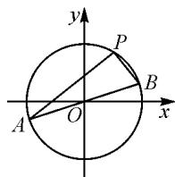
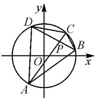
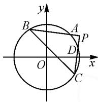

# 科学“类比” 合理“整合”

——对培养学生直觉思维能力的思考

# ●江苏省常熟外国语学校 陈丽君

摘要: 直觉思维是一种自觉行为,根据自己的感知迅速地对问题作出判断、猜想,其在创造活动中发挥了积极的作用.在实际教学中,教师要为学生提供一个自由的学习平台,让学生在分析、类比、整合的过程中提升自身的直觉思维能力,落实数学素养.

关键词: 直觉思维; 感知; 数学素养

直觉思维具有简约性、灵活性、自发性、随机性等特点，它不受某种固定逻辑规则的约束，是本能反应的一种思维形式，其有利于培养学生的创新意识和创造能力，为学生创造性地解决问题提供了前提[1].在解决问题的过程中，需要先从直觉感知中获得灵感或顿悟，然后再进行逻辑证明，可见直觉思维为问题的解决奠定了基础.直觉思维可谓是数学核心素养的魂，是提高学生关键能力的核心.不过，在日常教学中，为了追求速度，教师很少预留时间让学生去猜想、假设，大多是通过“强灌”的方式直接讲授给学生，将教学的重心放在学生逻辑思维能力的培养上.而忽视学生直觉思维能力的培养容易固化学生的思维，影响学生的长远发展.因此，在实际教学中，教师要为学生提供一个更为广阔的空间，鼓励学生去猜想、去假设、去探索，以此激发学生潜能，培养创造力.

# 1 利用元认知,培养直觉思维

学生思维发展水平是智力因素和非智力因素共同作用的结果.若想提升学生的思维水平,在教学中要重视提升学生的元认知,即让学生根据自身的认知特点自觉地调控自己的思维过程、认知策略,能够利用已有知识和经验灵活地解决问题,让每个学生都能有所收获,有所发展.

例 1 如图 1, 已知圆 $O: x^{2} + y^{2} = 4$ , 点 $P(1, \sqrt{3})$ 为圆上一点, 过点 P 作两条互相垂直的直线 PA, PB, 分别交圆 O 于 A, B 两点, 求 $\triangle PAB$ 面积的最大值.

text_image

y
P
B
A
O
x

图1

给出题目后,教师预留时间让学生独立思考,学生很快就找到了解题方法.

生1: 设 $\left|PA\right|=a,\left|PB\right|=b$ , 在 Rt△PAB 中， $\left|AB\right|=4$ ，所以有 $a^{2}+b^{2}=16$ 。故 $S_{\triangle PAB}=\frac{1}{2}ab\leqslant$

$\frac{a^{2}+b^{2}}{4}=4$ , 当且仅当 $a=b=2\sqrt{2}$ 时, 等号成立. 因此 $\triangle PAB$ 面积的最大值为 4.

师:很好,灵活应用基本不等式解决了问题.

师:现在把题目变一变,看看例 2 该如何求解呢?
(教师 PPT 给出例 2)

例 2 如图 2, 已知圆 $O: x^{2} + y^{2} = 4$ , 点 $P(1,1)$ 为圆内一点, 过点 P 作 $AC \perp BD$ , 垂足为 P, 交圆 O 于 A, B, C, D 四点, 求四边形 ABCD 面积的最大值.

text_image

y
D
C
P
B
O
x
A

图 2

问题改编后,难度略有提升,教图2
师鼓励学生进行合作交流,结合已有认知探寻最优解决路径.

生2: 过点 O 作 $OM \perp AC, ON \perp BD$ ，垂足分别为 M, N. 设 $|OM| = m, |ON| = n$ ，则有 $m^{2} + n^{2} = 2$ . 又 $|AC| = 2 |MC| = 2 \sqrt{4 - m^{2}}, |BD| = 2 |NB| = 2 \sqrt{4 - n^{2}}$ ，所以 $S_{四边形ABCD} = \frac{1}{2} |AC| \cdot |BD| = \frac{1}{2} \times 2 \sqrt{4 - m^{2}} \times 2 \sqrt{4 - n^{2}} \leqslant 2 \times \frac{8 - (m^{2} + n^{2})}{2} = 6.$

在解题教学中,教师要放手让学生去探索、交流,充分调动学生原有知识和经验去分析和解决问题,以此在问题解题的过程中丰富已有认知,让学生更好地感知问题,形成有效的解决方案.

# 2 借助适时反思,发展直觉思维

日常教学中，在学生已经掌握一定解决问题策略的前提下，教师要启发和引导学生通过比较、联想等学习方法对思维过程进行反思和归纳，久而久之，学生会自觉地按照思维认知规律去思维，从而建构个体完善的认知结构 $^{[2]}$ .这样在“学”中进行自我反思和自我调控，能够有效地培养学生的直觉思维，让学生学会用数学的眼光去思考和解决问题.

师:类比例 1 和例 2,你能自己设计一个问题并证明它吗? (生积极思考)

生 3: 例 1 中点 P 在圆上, 例 2 中点 P 在圆内, 接下来设计的问题可以让点 P 在圆外.

师:与我的想法一致,现在我们来看例 3.(教师继续给出问题)

例 3 如图 3, 已知圆 $O: x^{2} + y^{2} = 4$ , 点 $P(2,1)$ 为圆外一点, 过点 P 作 $AB \perp CD$ , 垂足为 P, 交圆 O 于 A, B, C, D 四点, 求四边形 ABCD 面积的最大值.

text_image

y
B
A
P
D
O
x
C

图3

同样,变式问题给出后,教师鼓励学生去合作、交流,探寻不同的解决思路.

生 4: 根据切割线定理, 可知 $\left|PA\right|\cdot\left|PB\right|=\left|PC\right|\cdot\left|PD\right|=1^{2}$ , $S_{四边形ABCD}=S_{\triangle PBC}-S_{\triangle PAD}=\frac{1}{2}\left(\left|PB\right|\cdot\left|PC\right|-\frac{1}{\left|PB\right|\cdot\left|PC\right|}\right)$ . 又 $y=\frac{1}{2}\left(x-\frac{1}{x}\right)$ 在 $(0,+\infty)$ 上单调递增, 故可将问题转化为求 $\left|PB\right|\cdot\left|PC\right|$ 的最大值, 而 $\left|PB\right|\cdot\left|PC\right|\leqslant\frac{PB^{2}+PC^{2}}{2}=\frac{BC^{2}}{2}$ . 又 $\left|BC\right|$ 最大值为 4, 所以四边形 ABCD 面积的最大值为 $\frac{63}{16}$ .

师:谁来点评一下?

生 5: 利用化归和消元的思想方法将求四边形 ABCD 面积的最大值转化为求 $\left|PB\right|\cdot\left|PC\right|$ 的最大值, 思路清晰, 值得学习. 不过在 $\left|PB\right|\cdot\left|PC\right|$ 取最大值的同时, 还要确保 $\left|BC\right|$ 取最大值, 这个恐怕难以实现, 所以我认为这个最终的结果应该是错误的.

师:说得很有道理! 那么具体应该如何求 $\left|PB\right| \cdot \left|PC\right|$ 的最大值呢?

生6:作 $BE \parallel CD, CE \parallel AB$ ，交于点 E，故四边形 PBEC 为矩形。又 $OE^{2} + OP^{2} = OB^{2} + OC^{2}$ ，得 $|OE| = \sqrt{3}$ ，由已知得 $|OP| = \sqrt{5}$ 。故 $|PB| \cdot |PC| \leqslant \frac{PB^{2} + PC^{2}}{2} = \frac{PE^{2}}{2} \leqslant \frac{(|OE| + |OP|)^{2}}{2} = \frac{(\sqrt{3} + \sqrt{5})^{2}}{2}$ ，当且仅当 $|PB| = |PC|$ ，且 P, O, E 三点共线时，两次取等号可以同时满足。故四边形 ABCD 面积的最大值为 $\sqrt{15}$ 。

师:谁来点评一下生6的方法?

生 7: 这个办法非常妙！通过构造四边形把研究 $\left|PB\right| \cdot \left|PC\right|$ 的最值问题转化为研究 $\frac{PE^{2}}{2}$ 的最值问题，将两个动点的问题巧妙地转化为一个动点的问题，实现了化繁为简的转化.

师:对于例 3,是否可以应用例 2 的处理方法来解决?（学生继续尝试利用例 2 的处理方法解决问题.）

生 8: 最初在研究例 3 的时候我也尝试了用该方法求解, 不过得到 $S_{四边形ABCD}=n\sqrt{4-n^{2}}+m\sqrt{4-m^{2}}$ 后, 就不知该如何处理, 所以放弃了.

师:简单陈述一下你的求解过程.

生8: 过点 O 作 $OM \perp AB, ON \perp CD$ ，垂足分别为 M, N. 设 $|OM| = m, |ON| = n$ ，则有 $m^{2} + n^{2} = 5$ . 又 $|PB| = |PM| + |MB| = n + \sqrt{4 - m^{2}}, |PA| = |PM| - |AM| = n - \sqrt{4 - m^{2}}$ . 同理 $|PC| = m + \sqrt{4 - n^{2}}, |PD| = m - \sqrt{4 - n^{2}}$ ，将其代入面积公式并化简，得 $S_{四边形ABCD} = n \sqrt{4 - n^{2}} + m \sqrt{4 - m^{2}}$ . 接下来该如何计算还没有想好.

生 9: 可以利用 $m^{2} + n^{2} = 5$ 这一条件消元, 进而将问题转化为函数问题, 通过研究函数的单调性解决问题. 不过我感觉这个方法比较复杂, 于是调整策略, 尝试运用基本不等式解决问题.

$$
\begin{array}{l} S _ {\text {四边形} A B C D} = \sqrt {4 n ^ {2} - n ^ {4}} + \sqrt {4 m ^ {2} - m ^ {4}} \\ \leqslant 2 \sqrt {\frac {2 0 - (n ^ {4} + m ^ {4})}{2}} \\ \leqslant 2 \sqrt {\frac {2 \left(\frac {5}{2}\right) ^ {2} - 5}{2}} = \sqrt {1 5}, \\ \end{array}
$$

以上两个不等式的等号可以同时取得,故四边形 AB-CD 面积的最大值为 $\sqrt{15}$ .

师:很好！还有其他的方法吗？

生 10: 观察 $n \sqrt{4-n^{2}} + m \sqrt{4-m^{2}}$ ，我想到了两角和差的正余弦公式。令 $n = \sqrt{5} \cos \alpha, m = \sqrt{5} \sin \alpha, \sqrt{4-n^{2}} = \sqrt{3} \cos \beta, \sqrt{4-m^{2}} = \sqrt{3} \sin \beta$ ，则四边形 ABCD 的面积 $S = \sqrt{15} (\cos \alpha \cos \beta + \sin \alpha \sin \beta) = \sqrt{15} \cos (\alpha - \beta) \leqslant \sqrt{15}$ ，当 $\cos (\alpha - \beta) = 1$ 时，等号成立。故四边形 ABCD 面积的最大值为 $\sqrt{15}$ 。(生 10 的答案给出后，教室里响起了热烈的掌声。)

在以上探究过程中,教师选择放手让学生独立完成,以此为培养学生的直觉思维提供广阔的空间.不同的学生其知识水平、思维习惯会有所不同,对于同一问题,他们往往有着不同的解决方案,在教学中教师要给学生提供一个自主学习、自我发展的学习空间,鼓励学生自己去思考,去创造,充分发挥直觉思维的优势,调动学生的元认知,从而高效地解决问题.当然,在此过程中教师要给予适时的引导和点拨,让学生体验成功的乐趣,激发学生的数学学习信心.

# 3 运用类比整合,提升直觉思维

数学知识间是相互关联的,为了帮助学生更好地理解知识、应用知识,在教学中教师有必要通过合理的设计让学生将相近知识体系、相同解决策略和解题

(下转第46页)

# 4.3 注重数形结合,把握思想方法

数形结合是数学学习的一种重要思想方法,如果能够结合三角函数的图象进行思考、分析,那么可以更高效地解答题目,因此在解答时能准确地描绘三角函数的图象是最基本的要求,同时也应该对图象变换的技巧有一定的把握.在三角函数的复习过程中,考生要深刻体会数形结合思想方法,做到“以形助数,以数思形”.应注重感悟和理解题目中蕴含的数学思想,把握解题的核心,迁移思想方法 $^{[5]}$ .

# 4.4 重视三角应用,增强迁移能力

三角作为高中数学重要的工具性知识,常常与向量、不等式、解析几何、立体几何等内容综合考查.这类题目属于综合应用题,考查的形式多样,一般需要学生会用三角的眼光去抽象、分析并解决实际情景或非三角的数学问题,特别是利用正弦定理、余弦定理以及三角形面积公式去解决求角、求距离等问题,这些公式的变式也是复习的重点.有意识地与其他内容联系起来复习有利于学生建构知识的内在联系.

三角函数在函数知识内容中占比较大,高考数学全国卷的选择题具有概念性强、数形兼备以及解法多

样等特点,注重对学生双基的考查;解答题侧重考查学生的逻辑思维能力、分析问题和解决问题的能力,考生应细致分析、冷静思考,避免“会而不对、对而不全”的情况.在整个高考备考过程中,考生要夯实基础知识,牢固掌握概念公式;准确记忆公式,灵活应用变换;注重数形结合,感悟思想方法;能将三角函数知识与其他知识联系,综合解决问题.

# 参考文献：

[1]中华人民共和国教育部.普通高中数学课程标准(2017年版2020年修订)[S].北京:人民教育出版社,2020.  
[2]陈昂,任子朝,赵轩.高考中三角函数内容考查研究[J].数学通报,2018,57(10):44-47.  
[3]夏春南.高三三角函数复习策略实验研究[J].数学通报,2017,56(3):27-31,36.  
[4]邱婉珠,周仕荣.从“三角与三角函数”考点看高考中的“数学运算”核心素养——以2016-2019四年高考理科全国卷I卷为例[J].数学通报,2020,59(2):49-54.  
[5]樊红玉,李红霞,赵思林.2020年高考三角函数试题评析与备考建议[J].中学数学,2021(5):21-23,97.Z

# (上接第29页)

技巧进行合理地整合,从而形成一个完善的认知体系,便于学生灵活“存取”,提高学生解决问题的能力 $^{[3]}$ .当然,除了教师的启发和引导外,学生也要自觉地通过观察、类比、联想等方式去总结归纳知识间的区别和联系,以此深化对知识理解,优化已有认知.在教学中要强化学生的目标意识,让学生在自己思维的监控中有计划、有组织地开展各项探究活动,以此通过分析、类比、整合来提升他们的直觉思维.

师:以上三个例题都是以圆为背景,若将圆这一背景换一换,你想继续探究什么问题呢?

生齐声答:椭圆.

师:很好！现在请大家一起看看例 4 该如何处理？（教师通过 PPT 给出问题）

例 4 已知椭圆方程为 $\frac{x^{2}}{4} + \frac{y^{2}}{3} = 1$ ，过该椭圆的右焦点 F 作两条互相垂直的直线，分别与椭圆相交于 A 与 C, B 与 D 四点。求四边形 ABCD 面积的取值范围。

由此，将“圆”转化为“椭圆”，开启了新一轮的探究。在探究中发现，若想解决该问题需要分两种情况进行讨论：①一条弦的斜率为0，另一条斜率不存在；②两条弦的斜率均存在，且不为0。对于第①种情况，根据其特殊性易得四边形ABCD面积为6；第②种情况为探究的重点，学生积极思考并交流，最终求得四边形ABCD的面积最小值为 $\frac{288}{49}$ 。综上可得，四边形AB-

CD 面积的取值范围为 $\left[\frac{288}{49},6\right]$ . 当然, 在探究第②种情况时, 不同的学生给出了更多不同方案, 其中换元等思想方法的应用彰显了学生解决实际问题的能力.

在教学中,教师要从学生已有认知出发,循序渐进地引导学生逐渐发现题目中蕴含的规律,找到最优的解决方案,培养学生良好的思维品质和学习能力.

数学是思维的科学,因此教师应重视学生数学思维能力的培养.在教学中,教师要引导学生学会用数学的眼光看待问题,用数学的思维思考问题,用数学的方法解决问题,拓宽学生视野,发散学生思维,促进学生深远的发展.

总之，在教学中，教师要学会放手，注重学生直觉思维能力的培养，引导学生通过多元探究去追溯问题的来龙去脉，感悟数学思想方法，理解数学的本质，以此提升学生的学习品质，助力学生全面提升。

# 参考文献：

[1] 施冬芳. 当议高中数学课堂学生直觉思维的培养策略 [J]. 中学数学, 2018(1): 30-31.  
[2]马俊.类比整合促提升 激发学生求知欲[J].数学通讯, 2020(6):26-29.  
[3] 李景安. 优化高中数学教学 培养学生直觉思维 [J]. 中学教学参考, 2021(8): 30-31. Z