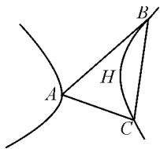
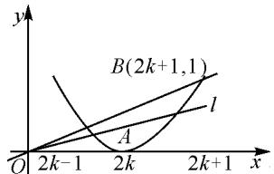

# 避免分类讨论“八法”

# ●威海市文登区教育教学研究培训中心 张秀妮

摘要: 分类讨论是逻辑划分思想在解数学题中的具体运用, 分类讨论法是解决比较复杂或者带有不确定性问题的一种有效方法; 但是这种方法的弊端也很明显. 所以, 我们要在重视分类讨论思想应用的基础上, 防止见参数就讨论的盲目做法, 能整体解决的问题尽量避免分类讨论.

关键词: 消参法; 整体换元法; 变换主元法; 间接法; 设而不求法;

# 1 避免分类讨论的策略分析

分类讨论法既是一种重要的数学思想方法,也是一种重要的解题策略,它具有“化整体为局部,化复杂为单一,归类整理,便于各个击破”等优点;但是,它也有“叙述繁琐,过程冗长,易以偏概全,易偏颇失误”等明显弊端;所以在熟悉和掌握分类思想的同时,要注意克服思维定式,处理好“分”与“合”、“局部”与“整体”之间的辩证统一关系,充分挖掘问题中潜在的特殊性与简单性,尽可能地避免分类讨论 $^{[1]}$ .

避免分类讨论的策略有:①直接回避法.例如,运用反证法、分离参数法等方法避开繁琐的讨论.②换元法.例如,采用整体换元、参数置换、变换主元等方法避开讨论.③合理运算法.例如,利用函数的奇偶性、变量的对称变换以及在消参过程中合理选用公式等方法避开讨论 $^{[2]}$ .④数形结合法.利用函数图象、几何图形的直观性和对称性等特点,有时也可简化或避开讨论.

在具体的解题过程中,可以尝试以下八种方法.

# 2 避免分类讨论的具体方法

# 2.1 消参法

参数法的关键是选择好适当的参数后,要能够顺利地消去参数.在消参的过程中,经常需要选用一些重要的公式,这就需要结合题目的具体情况来确定消参策略.

例1设 $0 < x < 1, a > 0$ ，且 $a \neq 1$ ，试比较 $\left|\log_a(1 - x)\right|$ 与 $\left|\log_a(1 + x)\right|$ 的大小.

解: 因为 0 < x < 1, 所以 0 < 1 - x < 1.

又因为 $1 - x^{2} < 1$ ，所以 $1 < 1 + x < \frac{1}{1 - x}$

于是，有 $\frac{\left|\log_a(1 - x)\right|}{\left|\log_a(1 + x)\right|} = \left|\log_{(1 + x)}(1 - x)\right| =$

$$
- \log_ {(1 + x)} (1 - x) = \log_ {(1 + x)} \frac {1}{1 - x} > \log_ {(1 + x)} (1 + x) = 1.
$$

所以 $\left|\log_{a}(1-x)\right|>\left|\log_{a}(1+x)\right|$ .

策略与方法:本题如果按照常规方法考虑去绝对值符号,就要分0<a<1与a>1两种情况进行分类讨论;为了避免讨论,可以根据两对数同底的特点,采用作商比较法,用换底公式消去参数a.

# 2.2 整体换元法

整体换元的实质是以“元”换“式”，就是把一个单项式或多项式看成一个整体，并分别用其他未知数（变量）代替，从而使问题简化。运用整体换元法，可以避免分类讨论，即使要分类讨论，也能使问题变得简单明了，便于处理。

例 2 解关于 x 的不等式: $\sqrt{a(a-x)}>a-2x$ (a<0).

解: 令 $\sqrt{a(a-x)}=t(t\geqslant0)$ ，则 $x=\frac{a^{2}-t^{2}}{a}(a<0)$ .

原不等式可转化为 $2t^{2} - at - a^{2} > 0$

解之得 t<a，或 $t>-\frac{1}{2}a$ .

由 $a < 0, t \geqslant 0$ ，可知 $t > -\frac{1}{2} a$ ，则 $a(a - x) > \frac{1}{4} a^2$ ，解得 $x > \frac{3}{4} a$ .

故原不等式的解集为 $\{x\mid x>\frac{3}{4}a,a<0\}$ .

策略与方法:如果按照常规解题方法,本题要分 $a-2x\geqslant0$ 与a-2x<0两种情况来分类讨论.为了避开繁琐的讨论,可用整体换元法将 $\sqrt{a(a-x)}$ 替换为另一未知数t,将原不等式变为含有t的一个一元二次不等式,最后通过解该不等式消去参数t.

# 2.3 变换主元法

在解方程的过程中,许多学生习惯把未知数 x 当作主元,把另一个变量 a 看成参数,往往会出现需要对参数 a 进行分类讨论等繁琐的运算过程.这时,不妨把变量 a 看作主元,把未知数 x 看成参数,则可避开讨论,简化运算步骤与过程.

例 3 已知方程 $ax^{2}-2(a-3)x+a-2=0$ 中的 a 为负整数，试求使方程至少有一个整数解时 a 的值.

解: 把方程中的参数 a 看作主元, 原方程变形为 $(x^{2}-2x+1)a+6x-2=0$ , 即 $(x-1)^{2}a=2-6x$ .

显然 $x \neq 1$ ，解得

$$
a = \frac {2 - 6 x}{(x - 1) ^ {2}}. \tag {①}
$$

因为 a 为负整数, 所以 $a \leqslant -1$ .

由 $\frac{2 - 6x}{(x - 1)^2} \leqslant -1$ ，即 $x^2 - 8x + 3 \leqslant 0$ ，得

$$
4 - \sqrt {1 3} \leqslant x \leqslant 4 + \sqrt {1 3}.
$$

因此 x 的整数值只能为 2, 3, 4, 5, 6, 7.

将它们逐个代入①中可知，当 $x = 2$ 时， $a = -10$ ；当 $x = 3$ 时， $a = -4$ 。

故当 a 为 -4 和 -10 时, 方程至少有一个整数解.

策略与方法:本题如果把 x 视为主元,运用公式法解这个一元二次方程,在得出 $x = \frac{(a-3) \pm \sqrt{9-4a}}{a}$ 后,要对 a 进行分类讨论,会很麻烦;如果换个角度,把方程中的参数 a 看作主元,将其转化为含有未知数 a 的方程,解得 a 值后再转化为含有 x 的一元二次不等式,这样不但避开了讨论,而且大大简化了求解过程.

# 2.4 间接法

当遇到含有“至多”“至少”型的排列、组合类问题时,为了避免分类讨论,可以采用间接法.这种方法适用于反面情况明朗化且容易计算的题型.

例 4 从 5 名男医生、4 名女医生中选 3 名医生组成一个医疗小组，要求其中男、女医生都有，请问不同的组队方案共有多少种？

解:根据题意,要从9人中选3人,一共有 $C_{9}^{3}=84$ 种选法;当选择的3人均为男医生或均为女医生时,共有 $C_{5}^{3}+C_{4}^{3}=14$ 种选法.因此,男、女医生都有的选法有 $C_{9}^{3}-(C_{5}^{3}+C_{4}^{3})=84-14=70$ 种.

策略与方法:本题中要求选出的医生男、女都有,为了避免分类讨论,可以用间接法求解,即从9人中选3人的选法种数中,减去3人均为男医生或均为女医生的选法种数.

# 2.5 补集分析法

补集分析法是一种逆向思维法,就是先从全集中去掉那些不符合题设的解集,然后再求出此集合在确定的全集中的补集,这也是一种“正难则反”的解题策略.

例 5 如果二次函数 $y=mx^{2}+(m-3)x+1$ 的图象与 x 轴的交点至少有一个在原点的右侧，求实数 m 的取值范围.

解:先考虑二次函数图象与 x 轴的两个交点都在原点左侧的情况,即一元二次方程 $mx^{2}+(m-3)x+$

1=0 有两个负根，则 $\left\{\begin{aligned}\Delta=(m-3)^{2}-4m&\geqslant0,\\ -\frac{m-3}{m}<0,\\ \frac{1}{m}&>0.\end{aligned}\right.$

解得 $\left\{\begin{aligned}m&\leqslant1,或 m\geqslant9,\\ m&<0,或 m>3,即 m\geqslant9.\\ m&>0,\end{aligned}\right.$

所以当 $m \geqslant 9$ 时, 两个交点都在原点的左侧.

上述解集的补集为 $\{m \mid m < 9\}$ ，但 $\Delta \geqslant 0$ 与 $m \neq 0$ 是必要条件，故二次函数的图象与 $x$ 轴的交点至少有一个在原点右侧的条件为 $m \leqslant 1$ 且 $m \neq 0$ 。

故实数 m 的取值范围为 $\{m \mid m \leqslant 1, \text{且 } m \neq 0\}$ .

策略与方法:本题就是属于从正面入手较复杂,需要分情况讨论,而从反面求解较容易的题型.先从图象与x轴的交点均在左侧入手,将其转化为一元二次方程,然后紧扣“ $\Delta\geqslant0$ ”与“ $m\neq0$ ”这两个前提条件逆向排除求解.

# 2.6 设而不求法

在求解某个量的过程中,有时可能要借助其他的量,对于这些辅助量,只需要表示出而不必求出,所以叫“设而不求法”,通过这种方法也可以避开可能出现的讨论.

例 6 若 A, B, C 是曲线 xy = 1 上的三点, 证明: $\triangle ABC$ 的垂心 H 必在此双曲线上.

证明:如图1,设A,B,C三点的坐标顺次为 $\left(x_{1},\frac{1}{x_{1}}\right),\left(x_{2},\frac{1}{x_{2}}\right)$ , $\left(x_{3}, \frac{1}{x_{3}}\right)$ ，则 $k_{BC} = \frac{\frac{1}{x_3} - \frac{1}{x_2}}{x_3 - x_2} =$

text_image

A
H
B
C

图1

$$
- \frac {1}{x _ {2} x _ {3}}, k _ {A H} = - \frac {1}{k _ {B C}} = x _ {2} x _ {3}.
$$

于是，AH 的方程为 $y - \frac{1}{x_{1}} = x_{2}x_{3}(x - x_{1})$ .

同理，BH 的方程为 $y-\frac{1}{x_{2}}=x_{3}x_{1}(x-x_{2})$ .

所以点 H 的坐标 $(x_{H}, y_{H})$ 同时满足上面两个方程，即

$$
y _ {H} - \frac {1}{x _ {1}} = x _ {2} x _ {3} (x _ {H} - x _ {1}), \tag {②}
$$

$$
y _ {H} - \frac {1}{x _ {2}} = x _ {3} x _ {1} (x _ {H} - x _ {2}). \tag {③}
$$

由②与③两边交叉相乘,得

$$
\left(y _ {H} - \frac {1}{x _ {1}}\right) x _ {3} x _ {1} \left(x _ {H} - x _ {2}\right) = \left(y _ {H} - \frac {1}{x _ {2}}\right) x _ {2} x _ {3} \left(x _ {H} - x _ {1}\right).
$$

化简，得 $x_{H}y_{H}(x_{1} - x_{2}) = x_{1} - x_{2}$

因为 $x_{1} \neq x_{2}$ ，所以 $x_{H}y_{H} = 1$ 。

故 $\triangle ABC$ 的垂心H必在双曲线xy=1上.

策略与方法:本题虽然涉及的量较多,但通过巧用代换和转化,紧扣最终目标,避免了不必要的讨论和冗长的计算.其中,根据点A,B,C在xy=1上,只设横坐标 $x_{i}$ ,而将纵坐标表示为 $\frac{1}{x_{i}}(i=1,2,3)$ ,这是一种出奇制胜的策略和方法.

# 2.7 数形结合法

数形结合法具有“以形助数，以数助形”的优点，特别是在解决与数量有关的问题时，可以根据数量的结构特征构造出相应的几何图形，从而用几何方法简捷地解决代数问题.

例 7 已知关于 x 的方程 $(x-2k)^{2}=ax$ 在区间 $(2k-1,2k+1](k\in\mathbf{N})$ 上有两个不相等实根，求 a 的取值范围.

解: 在同一直角坐标系中, 作出抛物线弧 $y = (x - 2k)^{2}$ , $x \in (2k - 1, 2k + 1]$ , 以及直线 l: y = ax.

原方程在 $(2k-1,2k+1]$ 上有两个不相等实根的充要条件是直线y=ax与抛物线弧有两个不同的交点，如图2所示.当直线l介于射线Ox与OB(含 OB) 之间时, 有两个交点, 易求斜率 $k_{OB} = \frac{1}{2k + 1}$ ,
于是 $0 < a \leqslant \frac{1}{2k + 1}$ .

text_image

y
B(2k+1,1)
l
A
O 2k-1 2k 2k+1 x

图2

策略与方法:本题如果用判别式或求根公式,则要讨论参数 k; 如果采用数形结合法, 利用 y=ax, 借助图形, 将 a 赋予直线斜率的几何意义, 就可避免分类讨论.

# 2.8 列表法

在解高次不等式时,经常要将其转化为熟悉的一元二次不等式或不等式组来求解,也需要对解集进行讨论.为了简化繁琐的讨论,可以采用列表法.

例 8 解不等式: $(x+2)(x^{2}-x-12)>0.$

解: 将原不等式化为 $(x+2)(x+3)(x-4)>0$ .

令 $(x+2)(x+3)(x-4)=0$ ，得x=-2或-3或4.各因式的符号如表1所示.

表 1

<table><tr><td>x</td><td>x&lt;-3</td><td>-3-x&lt;-2</td><td>-2-x&lt;4</td><td>x&gt;4</td></tr><tr><td>x+3</td><td>-</td><td>+</td><td>+</td><td>+</td></tr><tr><td>x+2</td><td>-</td><td>-</td><td>+</td><td>+</td></tr><tr><td>x-4</td><td>-</td><td>-</td><td>-</td><td>+</td></tr><tr><td>(x+2)(x+3)·(x-4)</td><td>-</td><td>+</td><td>-</td><td>+</td></tr></table>

由表 1 可知, 原不等式的解集为

$$
\{x \mid x > 4, \text {或} - 3 <   x <   - 2 \}.
$$

策略与方法:本题展示了用列表法解不等式的优点.列表法能清晰地表示变量间的数量关系,不必通过计算和分类讨论就知道当自变量取某些值时函数的对应值.

# 3 结论

综上所述,对分类讨论题型,不要急于直接进行分类讨论.首先要认真审查题目的特点,考虑是否可以拟用合适的公式、法则,能否进行某种变形,可否改变常规的思维方式和解题策略,即能否尝试运用上述八种方法避免或避开分类讨论.若能,则尽可能地避免繁杂的分类讨论;若不能,可否先作某些等价变形或简化,然后再遵循分类讨论的原则去攻克它.

# 参考文献：

[1] 刘永春. 避免分类讨论的解题方法 [J]. 中学语数外: 高中版, 2003(01): 25-26.  
[2]姜丽辉.浅谈几种避免分类讨论的方法[J].中学生数学,2016(5):17.Z