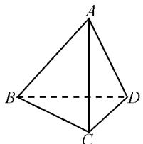
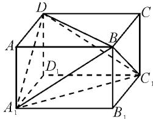
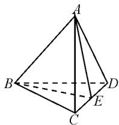

# 阅读理解题的基本类型与破解策略\*

# ●福建省宁化第一中学 福建教育学院数学教育研究室 赖国强

阅读理解题是新高考中借助创新情境给出的一类创新应用问题.借助一个新概念,或一个新运算,或一个新的问题情境,或一种新的材料创设等,巧妙将数学、生活生产中的新旧知识等加以联系,透过现象看问题本质,有效实现新信息从已知的基本知识、方法等方面进行合理的迁移,从而达到创新与应用的目的.此类题型可以巧妙融合数学基本知识、思想方法和能力,很好地考查学生的阅读理解能力、应用问题与数学语言的转换能力、探究能力、创新意识与创新能力等.

# 1 新概念问题

新概念类阅读理解题是指在现有的知识基础上定义一种新的概念或运算或规则或性质等，在此情境下设置的新问题。此类试题是典型的信息迁移题，解决该类问题的关键是提升学生的阅读理解能力、获取信息能力、处理信息能力，以及挖掘新规则内涵、准确找出新特点的能力。

例 1 [2021 年普通高等学校招生全国统一考试模拟演练(八省联考)数学·20]北京大兴国际机场(如图 1)的显著特点之一是各种弯曲空间的运用.其中借助创新概念——曲率来刻画空间的弯曲性,规定:多面体顶点的曲率等于 $2\pi$ 与多面体在该点的面角(多面体的面的内角叫做多面体的面角,角度用弧度制)之和的差,多面体面上非顶点的曲率均为零,多面体的总曲率等于该多面体各顶点的曲率之和.例如:正四面体有 4 个顶点,4 个面,每个面都是正三角形(或在每个顶点有 3 个面角,每个面角是 $\frac{\pi}{3}$ ),所以正四面体的总曲率为 $4 \times 2\pi - 4 \times \pi = 4\pi$ .

natural_image

Aerial black-and-white view of a large, symmetrical architectural complex with central waterways and surrounding greenery (no visible text or symbols)

图 1

(1)试求四棱锥的总曲率；  
(2)若多面体满足顶点数-棱数+面数=2,证明:这类多面体的总曲率是常数.

分析:结合新概念“空间弯曲性”——曲率,借助阅读理解,能够正确读懂“曲率”的概念,以及合理应用几何学中的欧拉公式 $V-E+F=2$ ,这是解决问题的关键所在.题目难度中等,涉及面广,对阅读理解能力、逻辑推理能力以及空间想象能力等有比较高的要求.

解析:(1)根据四棱锥的空间几何特征,可知其共有5个顶点和5个面(其中4个侧面为三角形,1个底面为平面四边形),所以所求的四棱锥的总曲率为 $5\times2\pi-(4\times\pi+1\times2\pi)=4\pi$ .  
(2)假设对应的多面体的顶点数为 $V$ ，棱数为 $E$ 面数为 $F$ ，则结合题目条件可得 $V - E + F = 2$ ，而对应多面体的所有面的内角之和等于 $2E\times \pi -F\times 2\pi$ 所以所求的多面体的总曲率为 $V\times 2\pi -(2E\times \pi -F\times$ $2\pi) = (V - E + F)\times 2\pi = 4\pi .$ 因此，这类多面体的总曲率恒是常数 $4\pi .$

# 2 新情境问题

新情境类阅读理解题多以现代科学技术、现实生活、学科间的交汇、社会热点等为背景创设，旨在突出新时代教育总方针——立德树人。正确解答这类问题的关键是认真阅读、理解题意，快速准确地获取信息，理性思维，排除题目背景中的干扰因素，抓住关键信息，实现数学思想、方法、能力的迁移运用。

例 2 （2021 年陕西省宝鸡市眉县高考数学模拟试卷）在 5G 技术方面，中国已经走在世界前列，其中一个重要的数学原理就是著名的香农公式： $C = W \cdot \log_{2}\left(1 + \frac{S}{N}\right)$ . 该公式阐述了在受噪声干扰的信道中，最大信息传递速度 C 取决于信道带宽 W，而 $\frac{S}{N}$ 叫做信噪比，其中 S 表示信道内信号的平均功率，N 表示信道内部的高斯噪声功率的大小. 特别地，当信噪比较大时,香农公式的真数中的1可以加以忽略不计.按照香农公式,若不改变信道带宽W,而将信噪比 $\frac{S}{N}$ 从1000提升至8000,那么最大信息传递速度C大约增加了().(参数数据: $\lg2\approx0.3010$ )

A.10%

B.30%

C.60%

D.90%

分析:根据题目中的新情境问题加以阅读理解,利用香农公式分别计算出信噪比为1 000和8 000时C的值,再利用对数的运算性质求出C的比值即可得到结果.

解析: 当 $\frac{S}{N}=1\ 000$ 时，

$$
C _ {1} = W \log_ {2} (1 + \frac {S}{N}) \approx W \log_ {2} 1 0 0 0.
$$

当 $\frac{S}{N} = 8000$ 时，

$$
C _ {2} = W \log_ {2} (1 + \frac {S}{N}) \approx W \log_ {2} 8 0 0 0.
$$

所以 $\frac{C_2}{C_1} = \frac{W\log_28000}{W\log_21000} = \frac{\log_28000}{\log_21000} = \frac{\lg 8000}{\lg 1000} =$ $\frac{3 + 3\lg 2}{3}\approx 1.3$ ，则 $C$ 大约增加了 $30\%$

# 3 新材料问题

新材料类阅读理解题求解策略是根据题目条件中给出的新材料情境,借助维度、深度、广度等方面,通过比较熟悉的数学知识、思想方法等,结合归纳、类比等推理方法,有效发现题目中的数量、关系式、图形等的性质、联系等,构建相应的数学命题与结论之间的合理联系,或是一些数学基本命题、定理等的推理,进而加以合理论证表述、合理应用.

例3 [2021年贵州省贵阳市高一(下)期末数学试题]阅读下面材料：

我们知道，在 $\triangle ABC$ 中，记角 $A,B,C$ 的对边分别为 $a,b,c$ ，边与角的关系满足正弦定理 $\frac{a}{\sin A}=\frac{b}{\sin B}=\frac{c}{\sin C}$ 。下面是正弦定理在空间中的一种推广：

在对棱分别相等的三棱锥中,侧棱和其所对二面角的正弦值之比相等.

如: 如图 2, 在三棱锥 A-BCD 中, 若 AB=CD=a, AD=BC=b, AC=BD=c, 记 AB 所对的二面角 B-CD-A 的大小为 $\alpha$ , AD 所对的二面角 A-BC-D 的大小为 $\beta$ , AC 所对的二面角 A-BD-C 的大小为 $\gamma$ . 满足: $\frac{a}{\sin\alpha}=\frac{b}{\sin\beta}=\frac{c}{\sin\gamma}.$

text_image

A
B
C
D

图2

根据以上阅读材料,解答以下两个问题:

(1)如图2,正四面体A-BCD中,已知棱长AB=2,二面角A-CD-B的大小为 $\alpha$ ,求 $\frac{AB}{\sin\alpha}$ 的值;  
(2)如图3，已知长方体 $ABCD - A_{1}B_{1}C_{1}D_{1}$ 中， $AB = BC = 2, AA_{1} = \sqrt{2}$ ，容易得出平面 $A_{1}BD \perp$ 平面 $C_{1}BD$ ，求二面角 $B - A_{1}D - C_{1}$ 的大小.

分析:(1)取 CD 中点 E, 连接 AE, BE, 说明 $\angle AEB$ 为二面角 A-CD-B 的平面角, 通过求解三角形推出结果即可; (2)设二面角 $B-A_{1}D-C_{1}$ 的大小为 $\beta$ , 利用正弦定理转化求解即可.

text_image

Geometric diagram of a cube with labeled vertices and internal diagonals, used for spatial geometry problems.

图3

解析:(1)如图4,取CD中点E,连接AE,BE,在正四面体A-BCD中, $\triangle ACD$ 为等边三角形,所以 $AE\perp CD$ .

同理, $BE\perp CD$ ,且平面 $ACD\cap$ 平面 BCD=CD,故 $\angle AEB$ 为二面角 A-CD-B 的平面角.

text_image

Geometric diagram of a tetrahedron with labeled vertices A, B, C, D and internal points E, showing solid and dashed edges.

图4

由 $AE=BE=\sqrt{3}$ ，结合余弦定理，得

$$
\cos \angle A E B = \frac {A E ^ {2} + B E ^ {2} - A B ^ {2}}{2 A E \cdot B E} = \frac {1}{3}.
$$

由 $\angle AEB\in \left(0,\frac{\pi}{2}\right)$ ，可得 $\sin \angle AEB = \frac{2\sqrt{2}}{3}.$

所以 $\frac{AB}{\sin\alpha} = \frac{AB}{\sin\angle AEB} = \frac{3\sqrt{2}}{2}.$

(2)设二面角 $B-A_{1}D-C_{1}$ 的大小为 $\beta$ .

由题意可知，在长方体 $ABCD-A_{1}B_{1}C_{1}D_{1}$ 中， $BD=A_{1}C_{1}, A_{1}D=BC_{1}, A_{1}B=DC_{1}$ .

易得 $BC_{1} = \sqrt{2^{2} + (\sqrt{2})^{2}} = \sqrt{6}$

$$
A _ {1} C _ {1} = \sqrt {2 ^ {2} + 2 ^ {2}} = 2 \sqrt {2}.
$$

由上述正弦定理在空间的推广, 可知 $\frac{BC_{1}}{\sin\beta} = \frac{A_{1}C_{1}}{\sin\frac{\pi}{2}}$ , 则 $\sin\beta = \frac{BC_{1}}{A_{1}C_{1}} = \frac{\sqrt{3}}{2}$ .

由图可知,二面角 $B-A_{1}D-C_{1}$ 为锐角,故二面角 $B-A_{1}D-C_{1}$ 的大小为 $\frac{\pi}{3}$ .

新高考数学试题中,经常通过巧妙创设问题,借助新概念、新情境、新材料等的阅读与理解,合理融入数学基本知识、思想方法和能力技能等,全面考查学生各方面的能力,注重数学本质,选拔优秀人才;根据数学核心素养的要求,全面合理推进中学数学教学改革与创新应用.Z