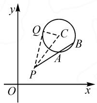

# “动”“静”结合，“形”“数”转化

——对一道解析几何题的探究

# ● 江苏省海门中学 蒯龙

平面解析几何中的取值范围问题,是高考数学试卷中一个熟悉的“面孔”,难度中等.此类问题可以综合点、直线、圆、圆锥曲线等相关元素,合理交汇其他相关知识,形式新颖,背景生动,“动”“静”结合,融合度高,可以出现在选择题或填空题中,也可以出现在解答题中,变化多端,形式各样,能很好考查学生的数学知识、数学思想方法与数学能力,充分体现试题的选拔性与区分度,备受各级各类考试命题者的青睐.

# 1 问题呈现

问题 已知点 $P(2,2)$ ，若圆 $C:(x-5)^{2}+(y-6)^{2}=r^{2}(r>0)$ 上存在两点 A, B，使得 $\overrightarrow{PA}=2\overrightarrow{AB}$ ，则 r 的取值范围是（）.

A. $(0,5)$ B. $\left(\frac{5}{2},5\right)$ C.[1,5) D. $\left[\sqrt{5},\frac{5}{2}\right)$

此题以平面解析几何为问题背景,通过点的坐标、圆的方程的确定,结合平面向量的线性关系式来巧妙设置,合理融合了平面几何、平面解析几何、平面向量、不等式等相关知识,创新综合与巧妙应用.

结合选择题的特性以及问题的背景,可以考虑从平面几何思维、解析几何思维以及特殊思维等不同角度切入,合理构建,巧妙转化,“动”中取“静”,“形”与“数”转化,实现问题的分析、处理与破解.

# 2 问题破解

思维视角一:平面几何思维.

方法 1: 分类讨论法.

解析:由题可知,圆 C 的圆心坐标为 $C(5,6)$ , 半径为 r>0. 如图 1, 连接 PC, 则有 $|PC|=5$ . 当点 P 在圆 C 内或圆 C 上时, $r\geqslant5$ , 此时显然圆 C 上不存在两

点 A, B, 使得 $\overrightarrow{PA}=2\overrightarrow{AB}$ . 当点 P 在圆 C 外时, r<5. 过点 P 作圆 C 的切线, 切点为 Q, 连接 CQ, 则 $CQ \perp PQ$ .

设 $\left|AB\right|=t>0$ ，结合圆的几何性质有 $t\leqslant2r$ ，结合 $\overrightarrow{PA}=2\overrightarrow{AB}$ ，可得 $\left|PA\right|=2t,\left|PB\right|=3t.$

text_image

y
Q
C
B
A
P
O
x

图1

在 Rt△PQC 中, 根据勾股定理, 可得

$$
\mid P Q \mid^ {2} = 5 ^ {2} - r ^ {2} = 2 5 - r ^ {2}.
$$

由切割线定理,可得

$$
\mid P Q \mid^ {2} = \mid P A \mid \mid P B \mid = 2 t \times 3 t = 6 t ^ {2}.
$$

所以 $|PQ|^{2}=25-r^{2}=6t^{2}$ .

结合 $t \leqslant 2r$ ，可得 $25 - r^{2} = 6t^{2} \leqslant 6 \times 4r^{2}$ ，解得 $r \geqslant 1$ ，所以 $1 \leqslant r < 5$ 。

综上分析, 可知 r 的取值范围是 $[1,5)$ . 故选: C.

点评:通过平面几何图形的直观性,分类讨论点P的位置,将问题转化为“过圆C外一点P作一直线与圆C相交于不同的两点A,B(点A在线段PB上),且满足 $|PA|=2|AB|$ ”,结合圆的切割线定理构建关系式,借助圆的弦长性质建立不等式,从而得以确定圆的半径的取值范围.借助平面几何图形的直观,以及平面几何的相关知识来综合与应用;借助平面几何图形的直观,利用“动点”的变化情况与解析几何中的“数”“形”互化,实现利用“静态”思维确定参数的取值.

方法 2: 割线定理法.

解析:由题可知,圆 C 的圆心坐标为 $C(5,6)$ , 半径为 r>0, 可得 $|PC|=5$ . 设 $|PB|=m>0$ , 则有 $5-r\leqslant m\leqslant5+r$ . 结合 $\overrightarrow{PA}=2\overrightarrow{AB}$ , 可得 $|\overrightarrow{PA}|=\frac{2}{3}m$ . 由切割线定理, 得 $\frac{2}{3}m\cdot m=(5-r)(5+r)=25-r^{2}=\frac{2}{3}m^{2}$ , 则知 $\frac{2}{3}(5-r)^{2}\leqslant\frac{2}{3}m^{2}\leqslant\frac{2}{3}(5+r)^{2}$ , 即 $\frac{2}{3}(5-r)^{2}\leqslant25-r^{2}\leqslant\frac{2}{3}(5+r)^{2}$ , 解得 $1\leqslant r\leqslant5$ . 而当点 P 在圆 C 内或圆 C 上时, $r\geqslant5$ , 显然圆 C 上不存在两点 A, B, 使得 $\overrightarrow{PA}=2\overrightarrow{AB}$ , 则有 r<5.

所以 r 的取值范围是 $[1,5)$ . 故选: C.

点评:根据题目条件设出 $|PB|$ ，通过几何图形直接确定其对应的取值范围，借助平面向量的线性关系确定 $|\overrightarrow{PA}|$ ，从两个不同的视角结合割线定理建立关系式，结合不等式的性质加以等量代换，通过求解二次不等式达到确定圆的半径的取值范围的目的。直接利用圆的几何性质，通过切割线定理来建立关系式，综合不等式来分析与处理.从另一个层面,结合平面几何图形“形”的直观与“数”的转化来动静结合处理.

思维视角二:解析几何思维.

方法 3: 解析几何法.

解析:由题可知, $|PC|=5$ .设 $A(x_{0},y_{0})$ ,则有 $\overrightarrow{PA}=(x_{0}-2,y_{0}-2)$ ,由 $\overrightarrow{PA}=2\overrightarrow{AB}$ ,得 $B\left(\frac{3}{2}x_{0}-1,\frac{3}{2}y_{0}-1\right)$ ,则 $\left(\frac{3}{2}x_{0}-1-5\right)^{2}+\left(\frac{3}{2}y_{0}-1-6\right)^{2}=r^{2}$ ,整理可得 $(x_{0}-4)^{2}+\left(y_{0}-\frac{14}{3}\right)^{2}=\left(\frac{2}{3}r\right)^{2}$ .又 $(x_{0}-5)^{2}+(y_{0}-6)^{2}=r^{2}$ ,所以只需两圆 $(x-4)^{2}+\left(y-\frac{14}{3}\right)^{2}=\left(\frac{2}{3}r\right)^{2}$ , $(x-5)^{2}+(y-6)^{2}=r^{2}(r>0)$ 有交点即可.

结合两圆的位置关系, 可以得到 $r - \frac{2}{3}r \leqslant \sqrt{(5-4)^{2} + \left(6 - \frac{14}{3}\right)^{2}} \leqslant r + \frac{2}{3}r$ , 解得 $1 \leqslant r \leqslant 5$ .

而当点 P 在圆 C 内或圆 C 上时， $r \geqslant 5$ ，显然圆 C 上不存在两点 A, B，使得 $\overrightarrow{PA} = 2\overrightarrow{AB}$ ，则有 r < 5。

所以 r 的取值范围是 $[1,5)$ . 故选: C.

点评:根据平面解析几何背景,设出点A的坐标,结合平面向量的坐标表示与运算确定点B的坐标,利用两点A,B均在圆C上构建满足条件的方程,结合恒等变形,将问题转化为“相关两圆有交点”的问题,利用两圆相交(此时包括内切与外切)的位置关系构建不等式,进而确定圆的半径的取值范围.借助平面解析几何的坐标运算,以数学运算代替推理,进而结合相关知识加以分析与应用.抓住平面解析几何中“数”的特征来处理“形”的特征,合理动静结合与巧妙转化.

思维视角三: 特殊思维.

方法 4: 排除法.

解析:由题可知,圆 C 的圆心坐标为 $C(5,6)$ , 半径为 r>0, $|PC|=5$ . 当点 P 在圆 C 内或圆 C 上时, $r\geqslant5$ , 显然圆 C 上不存在两点 A, B, 使得 $\overrightarrow{PA}=2\overrightarrow{AB}$ , 则 r<5. 当弦 AB 恰为圆 C 的直径时, $|\overrightarrow{PA}|=5-r$ , $|\overrightarrow{AB}|=2r$ , 结合 $\overrightarrow{PA}=2\overrightarrow{AB}$ , 可得 5-r=4r, 解得 r=1, 由此可以排除选项 B, D.

而当 $r \to 0$ 时，显然 $\overrightarrow{PA} = 2\overrightarrow{AB}$ 不成立，由此可以排除选项 A.

故选：C.

点评:抓住条件确定点 P 在圆 C 外,结合弦 AB 恰为圆 C 的直径时确定对应的半径 r 的值,结合选项加以合理排除,再利用 $r \rightarrow 0$ 时所对应的平面向量的线性关系式是否成立进一步加以排除,从而确定正确答案.排除法在破解选择题时有一定的优势,可以结合一些特殊情况加以合理排除,只是难以正确求解满足条件的具体值.

# 3 变式拓展

探究 1: 保留题目中平面解析几何的创新情境, 改变原来问题中平面向量线性关系式的形式, 由原来的 “ $\overrightarrow{PA}=2\overrightarrow{AB}$ ” 改变为 “ $\overrightarrow{PA}=2\overrightarrow{PB}$ ”, 其中只差一个字母, 从而得到对应的变式问题.

变式 1 已知点 $P(2,2)$ ，若圆 $C:(x-5)^{2}+(y-6)^{2}=r^{2}(r>0)$ 上存在两点 A, B，使得 $\overrightarrow{PA}=2\overrightarrow{PB}$ ，则 r 的取值范围是（）.(C)

A.(0,5)

B. $\left(\frac{5}{2},5\right)$

C. $\left[\frac{5}{3},5\right)$

D. $\left[\sqrt{5},\frac{5}{2}\right)$

探究 2: 保留题目中平面解析几何的创新情境, 进一步改变平面向量线性关系式的形式, 由原来的“点 P 在圆外”变为“点 P 在圆内”, 从另一角度来考查相关的知识点, 得到以下对应的变式问题.

变式 2 已知点 $P(2,2)$ ，若圆 $C:(x-5)^{2}+(y-6)^{2}=r^{2}(r>0)$ 存在两点 A, B，使得 $\overrightarrow{AP}=2\overrightarrow{PB}$ ，则 r 的取值范围是（）.(C)

A.(0,15)

B.(10,15)

C.(5,15]

D. $(\sqrt{10},15]$

# 4 教学启示

# 4.1 借助“平几”直观,实现“解几”运算

在解决一些含有平面几何图形或性质的解析几何问题时,要充分挖掘平面几何图形的直观性与几何性质,借助平面几何图形的性质,融合直观性,进而多一些几何直观,少一些代数运算,有效实现“形”与“数”有机结合,合理迅速地获得解题切入点,减少解析几何问题中的运算量,有效拓展解题思路,简化思维步骤,优化解题过程.

# 4.2 “动”“静”结合，“形”“数”转化

破解平面解析几何中的定值、最值或取值范围等相关问题时，合理通过点、直线、圆等元素的变化运动，“动”中取“静”，确定相关定值、最值或取值范围等的位置点，结合“形”与“数”的转化，从相关几何元素中抽象出数量关系，结合关系式或不等式的建立有效处理与破解，从而实现问题的解决与应用. Z