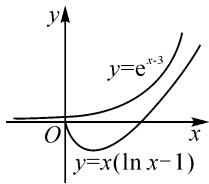

# 巧用分段放缩法证明函数不等式\*

# 广东省广州市华南师范大学附属中学 周建锋

摘要: 放缩法是证明函数不等式的一种常见方法, 如寻找中间常量、切线放缩、割线放缩、利用泰勒展开式放缩等, 但放缩的尺度不易掌握. 分段放缩法将函数不等式成立的区间划分为若干个子区间, 有利于在每个子区间上缩小放缩的幅度, 避免“放过头”的问题, 从而证明函数不等式在整个区间内成立. 本文中通过几个实例, 剖析了分段放缩证明函数不等式的方法, 以及如何调整区间的划分, 对函数不等式的证明是一个很好的补充.

关键词: 函数不等式; 分段放缩

# 1 问题的提出

函数不等式的证明一直是中学数学中的一个热点,证明函数不等式,可以将其转化为求函数最值的问题,通过求导,划分单调区间,找出最值.但新的高考改革越来越关注学生的数学核心素养,对学生分析问题、解决问题的能力提出了更高的要求,因此建立在通性通法基础上的应变能力尤为重要.

放缩法作为一种重要的证明不等式的方法被广泛应用，包括寻找中间常量、切线放缩、割线放缩、利用泰勒展开式放缩等。放缩法最大的难点在于放缩的尺度，因为放缩法的理论基础是不等式的传递性，如 $a > b, b > c \Rightarrow a > c$ 。这是一条“单行道”，一旦尺度过大“放过头”，如 $a > b, b < c$ ，则无法推出 $a > c$ 。此时在放缩法证明中结合分段放缩，将会起到很好的效果。目前分段放缩法证明函数不等式的研究较少，文[1]用分段放缩证明了一个三角形不等式，文[2]用分段放缩证明了一个数列不等式，文[3]用分段放缩证明了一个含绝对值的函数不等式。笔者经过研究，通过分段放缩法与切线放缩、割线放缩等的结合，可将分段放缩法更广泛地应用于多种类型的函数不等式的证明之中。

# 2 分段放缩法的原理

将分段放缩的策略运用到函数不等式的证明中，在区间 $(a,b)$ 上证明形如 $f(x)\geqslant g(x)$ 的不等式，有时可以通过恒等变形，构造出等价的函数不等式$F(x) \geqslant G(x)$ ，且 $F(x) \geqslant m(x)$ (m(x) 也可以是常数)， $M(x) \geqslant G(x)$ (M(x) 也可以是常数)，若有 $m(x) \geqslant M(x)$ ，则 $F(x) \geqslant G(x)$ ，故 $f(x) \geqslant g(x)$ 成立。但在区间 $(a, b)$ 上不一定能满足 $m(x) \geqslant M(x)$ ，此时将 $(a, b)$ 划分为若干个子区间 $(a_{1}, a_{2}] \cup (a_{2}, a_{3}] \cup \cdots \cup (a_{n}, a_{n+1})$ （其中 $a_{1} = a, a_{n+1} = b$ ），在每一个子区间 $(a_{k}, a_{k+1}]$ (k = 1, 2, ……, n, k = n 时区间为开区间）上有 $F(x) \geqslant m_{k}(x) \geqslant M_{k}(x) \geqslant G(x)$ ，则在 $(a, b)$ 上必有 $F(x) \geqslant G(x)$ ，即 $f(x) \geqslant g(x)$ 。

分段放缩的优点在于通过缩小区间,把放缩的尺度缩小,可以很好地避免“放过头”的问题.在实施过程中,寻找子区间的分界点是关键.

# 3 分段放缩法的应用

# 3.1 在寻找中间常量中采用分段放缩

例 1 设函数 $f(x)=m\mathrm{e}^{x-1}, g(x)=\ln x+n, m,$ n 为实数， $F(x)=\frac{g(x)}{x}$ 有最大值为 $\frac{1}{e^{2}}$ .

(1) 求 $n$ 的值；  
(2)若 $\frac{f(x)}{\mathrm{e}^2} >xg(x)$ ，求实数 $m$ 的最小整数值.

分析:(1)过程略,答案为 n = -1.

(2) $\frac{m\mathrm{e}^{x-1}}{\mathrm{e}^{2}}>x(\ln x-1)$ ，即 $m\mathrm{e}^{x-3}>x(\ln x-1)$ ,

若采用分离参数法,先变形得到 $m > \frac{x(\ln x - 1)}{\mathrm{e}^{x - 3}}$ , 然后令 $H(x) = \frac{x(\ln x - 1)}{\mathrm{e}^{x - 3}}$ , 则通过求函数 $H(x)$ 的最

大值来求实数 m 的最小整数值. 函数 $H(x)$ 求最大值非常繁琐, 且因为隐零点的问题, 很难求出最大值, 只能进行估计, 难度很大.

考虑先找出必要条件,再验证充分性.当 x=3 时, $m>3(\ln 3-1)$ ,由于 $m\in Z$ ,因此 $m\geqslant1$ .只需证当 m=1 时, $e^{x-3}>x(\ln x-1)$ 恒成立即可,将问题转化为证明函数不等式.考虑寻找中间常量.结合第(1)问可利用函数 $F(x)=\frac{g(x)}{x}$ 的最大值,只需证 $\frac{e^{x-3}}{x^{2}}>\frac{\ln x-1}{x}$ .

设 $h(x)=\frac{\mathrm{e}^{x-3}}{x^{2}}$ ，则 $h'(x)=\frac{(x-2)\mathrm{e}^{x-3}}{x^{3}}$ .

当 0<x<2 时， $h'(x)<0$ ， $h(x)$ 单调递减；当 x>2 时， $h'(x)>0$ ， $h(x)$ 单调递增.

因此 $h(x)_{\min}=h(2)=\frac{1}{4e}$ . 然而 $\frac{1}{4e}<\frac{1}{e^{2}}$ , 证明失败!

这条路径是否无法证明呢？重新反思，能否把区间 $(0, +\infty)$ 进行分段，从而解决放缩过度的问题呢？

(1)首先注意到 $h(x) > 0$ ，所以当 $0 < x \leqslant \mathrm{e}$ 时， $F(x) \leqslant 0$ ，不等式显然成立.

(2) $x > \mathrm{e}$ 时， $h(x)$ 单调递增， $h(x) > h(\mathrm{e}) = \frac{\mathrm{e}^{\mathrm{e} - 3}}{\mathrm{e}^2}$ ，而 $\mathrm{e}^{\mathrm{e} - 3} < 1$ ，仍有 $h(\mathrm{e}) < \frac{1}{\mathrm{e}^2}$ ，还需要进一步分段放缩，需要在 $(\mathrm{e}, \mathrm{e}^2)$ 内找一点进行分段，尝试区间 $(\mathrm{e}, \mathrm{e}^{\frac{3}{2}})$ .

当 $e<x\leqslant e^{\frac{3}{2}}$ 时， $h(x)>h(e)=e^{e-5}$ ，而此时 $F(x)$ 单调递增，则 $F(x)\leqslant F(e^{\frac{3}{2}})=\frac{1}{2e^{\frac{3}{2}}}$ ，因此只需证 $e^{e-5}>\frac{1}{2e^{\frac{3}{2}}}$ ，即证 $e^{3.5-e}<2$ ，即证 $3.5-e<\ln2$ ，但是 $3.5-e>\ln2$ ，所以不成立。再次调整，尝试区间 $(e,e^{1.4})$ 。

①当 $e<x\leqslant e^{1.4}$ 时， $F(x)\leqslant F(e^{1.4})=\frac{0.4}{e^{1.4}}$ ，因此只需证 $e^{e-5}>\frac{0.4}{e^{1.4}}$ ，即证 $3.6-e<\ln\frac{5}{2}=\ln5-\ln2$ ，成立.

②当 $x > e^{1.4}$ 时， $h(x) > h(e^{1.4}) = e^{e^{1.4} - 5.8}$ ， $F(x) \leqslant \frac{1}{e^{2}}$ ，因此只需证 $e^{e^{1.4} - 5.8} > \frac{1}{e^{2}}$ ，即证 $e^{1.4} - 3.8 > 0$ ，即证 $1.4 > \ln 3.8$ ，而 $1.4 > \ln 4 > \ln 3.8$ ，成立.

反思:看似无法证明的一条路径,利用分段放缩法不断调整子区间,圆满解决了问题!当然也可以转

化为证 $\frac{e^{x-3}}{x^{3}}>\frac{\ln x-1}{x^{2}}$ ，可直接找到中间常量（请读者自行证明）。相比之下，采用证 $\frac{e^{x-3}}{x^{2}}>\frac{\ln x-1}{x}$ 可直接利用第(1)问的结论，只需求不等式的左端相应函数的最小值，这是比较自然的思考策略。至于在整个区间 $(0,+\infty)$ 上不能直接证明，只需要分段放缩，略作调整即可。

# 3.2 在切线放缩证明中采用分段放缩

仍以例 1 为例, 证明 $e^{x-3}>x\left(\ln x-1\right)$ .

分析: 如图 1, 由图象可以预判, $y = e^{x-3}$ 图象上任一点的切线均不可能全在 $y = x (\ln x - 1)$ 的图象上方, 所以不可能在 $(0, +\infty)$ 上对 $y = e^{x-3}$ 运用切线放缩.

text_image

y
y=e^{x-3}
O
x
y=x(ln x-1)

图1

考虑分段放缩，对 $y=e^{x-3}$ 在 $\left(1,\frac{1}{e^{2}}\right)$ 处作切线，即 $y=\frac{1}{e^{2}}x$ ，易证 $e^{x-3}\geqslant\frac{1}{e^{2}}x$ ，再考察满足 $\frac{1}{e^{2}}x>x(\ln x-1)$ 的区间，即 $\ln x<1+\frac{1}{e^{2}}$ ，易得当 0<x<3 时， $\ln x<\ln 3<1+\frac{1}{e^{2}}$ 。因此只需证 $x\geqslant3$ 时， $e^{x-3}>x(\ln x-1)$ 。

由泰勒展开式, 易证 $\mathrm{e}^{x-3} \geqslant 1 + (x - 3) + \frac{1}{2}(x - 3)^{2}$ , 因此只需证 $1 + (x - 3) + \frac{1}{2}(x - 3)^{2} > x (\ln x - 1)$ , 即证 $\frac{x}{2} + \frac{5}{2x} - \ln x - 1 > 0$ .

设 $h(x) = \frac{x}{2} +\frac{5}{2x} -\ln x - 1$ ，则

$$
h ^ {\prime} (x) = \frac {1}{2} - \frac {5}{2 x ^ {2}} - \frac {1}{x} = \frac {x ^ {2} - 2 x - 5}{2 x ^ {2}}.
$$

当 $0 < x < \sqrt{6} + 1$ 时， $h'(x) < 0, h(x)$ 单调递减；当 $x > \sqrt{6} + 1$ 时， $h'(x) > 0, h(x)$ 单调递增.

所以 $h(x)\geqslant h(\sqrt{6}+1)=\sqrt{6}-1-\ln(\sqrt{6}+1)>2.4-1-\ln3.5=1.4+\ln2-\ln7>2-\ln7>0.$

综上可知， $\mathrm{e}^{x-3}>x(\ln x-1)$ .

反思:与第一种证法不同,这种证法利用切线或泰勒展开式,对指数函数进行适当放缩,但仍会遇到在整个区间 $(0,+\infty)$ 上不能直接证明的情况.利用分段放缩,在不同子区间上选用不同的放缩方法,提高了证明的灵活度.

# 3.3 在割线放缩证明中采用分段放缩

例2 求证: $f(x) = \frac{\mathrm{e}^x}{x} - \cos x + x$ 在 $\left(-\frac{\pi}{2}, 0\right)$ 上无极值点.

分析:首先要观察 $f'(x)=\frac{(x-1)\mathrm{e}^{x}}{x^{2}}+\sin x+1$ 在 $\left(-\frac{\pi}{2},0\right)$ 上的零点.只需证明 $f'(x)$ 在 $\left(-\frac{\pi}{2},0\right)$ 上无零点,注意到 $x\to0^{-}$ 时, $f'(x)\to-\infty$ ,考虑证明 $f'(x)<0$ ,将问题转化为证明函数不等式,但直接求导难度较大,故考虑用放缩法证明.

当 $-\frac{\pi}{2}<x<0$ 时，由于 $y=\sin x$ 是凹函数，采用割线放缩，则容易证明 $\sin x<\frac{2}{\pi}x$ ，所以 $f'(x)<\frac{(x-1)\mathrm{e}^{x}}{x^{2}}+\frac{2}{\pi}x+1=\frac{1}{x^{2}}[(x-1)\mathrm{e}^{x}+\frac{2}{\pi}x^{3}+x^{2}]$ 。容易发现，当在 $\left(-\frac{\pi}{2},0\right)$ 上讨论时，会陷入隐零点的困扰中，故考虑分段放缩。

(1) 若 $-\frac{\pi}{3}<x<0$ ，设 $g(x)=(x-1)\mathrm{e}^{x}+\frac{2}{\pi}x^{3}+x^{2}$ ，则有 $g'(x)=x\mathrm{e}^{x}+\frac{6}{\pi}x^{2}+2x=x\left(\mathrm{e}^{x}+\frac{6}{\pi}x+2\right)$ .

易证 $\mathrm{e}^x +\frac{6}{\pi} x + 2 > \mathrm{e}^{-\frac{\pi}{3}} > 0$ ，则 $g^{\prime}(x) <   0$ ，故 $g(x) <   g\left(-\frac{\pi}{3}\right) = -\left(\frac{\pi}{3} +1\right)\mathrm{e}^{-\frac{\pi}{3}} + \frac{\pi^2}{27} < - \left(\frac{\pi}{3} +\frac{\pi}{4}\right)\mathrm{e}^{-\frac{\pi}{3}} +$ $\frac{\pi^2}{27} = \frac{\pi}{3}\Big(-\frac{7}{4}\mathrm{e}^{-\frac{\pi}{3}} + \frac{\pi}{9}\Big).$

因此，只需证 $-\frac{7}{4}\mathrm{e}^{-\frac{\pi}{3}} + \frac{\pi}{9} < 0$ ，即证 $\mathrm{e}^{\frac{\pi}{3}} < \frac{63}{4\pi}$ 只需证 $\mathrm{e}^{\frac{\pi}{3}} < \frac{9}{2}$ 即证 $\frac{\pi}{3} < 2\ln 3 - \ln 2$ ，而此不等式显然成立.所以 $g(x) < 0$ ，因而 $f^{\prime}(x) < 0$

(2) 若 $-\frac{\pi}{2}<x\leqslant-\frac{\pi}{3}$ ，利用割线放缩，易证明 $\sin x<\frac{0.8}{\pi}x-0.5$ ，则

$$
\begin{array}{l} f ^ {\prime} (x) <   \frac {(x - 1) \mathrm{e} ^ {x}}{x ^ {2}} + \frac {0 . 8}{\pi} x + 0. 5 \\ = \frac {1}{x ^ {2}} \left[ (x - 1) \mathrm{e} ^ {x} + \frac {0 . 8}{\pi} x ^ {3} + 0. 5 x ^ {2} \right]. \\ \end{array}
$$

设 $h(x) = (x - 1)\mathrm{e}^{x} + \frac{0.8}{\pi} x^{3} + 0.5x^{2}$ ，则

$$
h ^ {\prime} (x) = x \left(\mathrm{e} ^ {x} + \frac {2 . 4}{\pi} x + 1\right).
$$

易知 $e^{x}+\frac{2.4}{\pi}x+1>e^{-\frac{\pi}{2}}-\frac{1}{5}>0$ ，则 $h'(x)<0$ ，
所以 $h(x)$ 在 $\left(-\frac{\pi}{2}, -\frac{\pi}{3}\right)$ 上单调递减，则

$$
\begin{array}{c} h (x) <   h \left(- \frac {\pi}{2}\right) = - \left(\frac {\pi}{2} + 1\right) \mathrm{e} ^ {- \frac {\pi}{2}} + 0. 0 2 5 \pi^ {2} <  \\ - \frac {1}{5} \left(\frac {\pi}{2} + 1\right) + 0. 1 \pi = - \frac {1}{5} <   0. \end{array}
$$

所以 $f'(x)<0.$

综上可知，在 $\left(-\frac{\pi}{2},0\right)$ 上恒有 $f'(x)<0$ ，所以函数 $f(x)$ 无极值点.

反思:要证 $f'(x)=\frac{(x-1)\mathrm{e}^{x}}{x^{2}}+\sin x+1<0$ ，只需在区间 $\left(-\frac{\pi}{2},0\right)$ 上证 $g(x)<0$ ，但有困难。分段放缩时，先从 $g'(x)$ 中的 $e^{x}+\frac{6}{\pi}x+2$ 入手。由于 $e^{x}>0$ ，由 $\frac{6}{\pi}x+2>0$ ，得 $x>-\frac{\pi}{3}$ ，此时 $g'(x)<0$ ，由单调性易证成立；同理， $-\frac{\pi}{2}<x\leqslant-\frac{\pi}{3}$ 时，也有 $h'(x)<0$ ，由单调性易证成立。分段放缩时，可以根据需要选择子区间，灵活度较高，这也是分段放缩法的优势。

# 4 结束语

数学的乐趣在于不断探索,推陈出新.在证明某些函数不等式(如指数函数、对数函数与三角函数中至少两类混杂在一起的函数不等式)时,直接用求导的方法证明往往比较困难,通常考虑利用放缩法证明.而分段放缩法可以更精确地解决放缩尺度的问题,在需要运用放缩法的时候不妨结合分段放缩法,这样易于攻破难点,体会数学的美妙,在数学的世界里快乐地翱翔!

# 参考文献：

[1] 王振寰, 吉玉环, 关冬月, 等. 用分段放缩法证明不等式 [J]. 内蒙古农业大学学报 (自然科学版), 2001(1): 105-110.

[2] 李新卫. 巧用分组或分段等比放缩方法证明不等式 [J]. 数理化学习 (高三版), 2015(6): 19-20.

[3]杨飞.分段解决掌握好切线放缩显灵妙——一道含绝对值函数题的解析[J].考试与招生,2022(2):5-6.Z