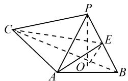
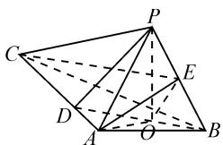
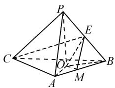
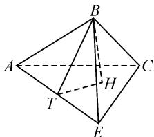
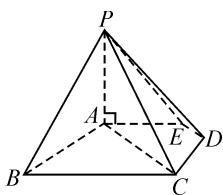
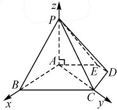

# 开阔思路,寻求多解

——2022年全国新高考Ⅱ卷第20题的探究与变式演练

# ● 海南省文昌中学 杨昌平 林云

摘要:立体几何的综合题经常涉及到多面体的几何特征与动态问题,能够全面有效地考查考生对所学内容灵活应用的能力,因此一直是高考的热点,也是分值较高、难度较大的压轴题型之一.本文中通过对高考真题的解析探究、变式演练和方法总结,探索这类题型的多种解题思路与方法.

关键词: 真题再现; 解法探究; 思路分析; 变式演练; 方法总结

立体几何的综合题主要分为两类:一类是空间线面关系的判定和推理论证.高考中对该部分内容的考查主要是证明平行(线线平行、线面平行、面面平行)和垂直(线线垂直、线面垂直、面面垂直),求解这类问题的思路是,依据线面关系的判定定理和性质定理进行推理论证.另一类是空间几何量(角、距离)的计算.求解这类问题的思路有两种:一是依据公理和定理以及性质等经过推理论证,作出所求几何量,并求之;二是建立空间直角坐标系,借助点的坐标求出平面的法向量和直线的方向向量,利用向量的方法结合相关公式求解 $^{[1]}$ .

# 1 真题再现

(2022年新高考Ⅱ卷第20题)如图1所示,PO是三棱锥P-ABC的高,PA=PB,AB⊥AC,E是PB的中点.

text_image

Geometric diagram of a triangular pyramid with labeled vertices and internal points, used for spatial geometry problems.

图 1

(1)求证: $OE \parallel$ 平面 PAC;  
(2) 若 $\angle ABO = \angle CBO = 30^{\circ}, PO = 3, PA = 5$ ，求二面角 $C - AE - B$ 的正弦值.

# 2 解法探究

思路:第(1)问考查线面平行问题的证明,可用“线线平行→线面平行”或“面面平行→线面平行”多种思路,用定义法、判定定理法、向量法来证明.第(2)问考查空间几何量(二面角)的计算问题,可尝试用几何法、坐标法、射影面积法等多种方法来解决.例如解法1,通过建立空间直角坐标系,利用空间向量法求出二面角的余弦值,再根据同角三角函数的基本关系求正弦值;解法 2 采用了“几何法”,将求二面角正弦值的问题转化为解三角形问题.

(1) 证法 1: 如图 2, 连接 BO 并延长交 AC 于点 D, 连接 OA, PD.

$\because PO \perp$ 平面 ABC,

$AO, BO \subset$ 平面 $ABC$ ,

$$
\therefore P O \perp A O, P O \perp B O.
$$

又 PA = PB，

$$
\therefore \mathrm{Rt} \triangle P O A \cong \mathrm{Rt} \triangle \triangle P O B.
$$

$$
\therefore O A = O B.
$$

$$
\therefore \angle O A B = \angle O B A.
$$

$$
\because A B \perp A C,
$$

$$
\therefore \angle O A B + \angle O A D = 9 0 ^ {\circ}.
$$

$$
\text { 又 } \angle O B A + \angle O D A = 9 0 ^ {\circ},
$$

$$
\therefore \angle O D A = \angle O A D.
$$

$$
\therefore A O = D O.
$$

$$
\therefore A O = D O = O B.
$$

∴O 为 BD 的中点.

又 E 为 PB 的中点，

$$
\therefore O E \parallel P D.
$$

又 $OE \not\subset$ 平面 PAC, $PD \subset$ 平面 PAC,

∴OE∥平面PAC.

证法 2: 如图 3, 取 AB 的中点 M, 连接 OA, OB, OM, EM. 由 PA = PB, PO ⊥ 平面 ABC, 得 OA = OB. 又 M 是 AB 的中点, 所以 OM ⊥ AB. 又 AC ⊥ AB, 所以 OM // AC.

text_image

Geometric diagram of a pyramid with labeled vertices and internal points, used in spatial geometry problems.

图2

text_image

Geometric diagram of a pyramid with labeled vertices and internal points, used for spatial geometry problems.

图3

$\because OM\not\subset$ 平面 PAC, AC⊂平面 PAC,

∴OM∥平面 PAC.

又 $M, E$ 分别是 $AB, PB$ 的中点，

$\therefore EM \parallel PA.$

同理可得 $EM \parallel$ 平面 PAC.

∵ EM⊂平面 EMO, OM⊂平面 EMO,

$$
E M \cap O M = M,
$$

∴平面 EMO∥平面 PAC.

$\because OE \subset$ 平面 EMO,

∴OE∥平面PAC.

(2) 解法 1: 以过点 A 与 OP 平行的直线为 z 轴, A 为坐标原点, 建立如图 4 的空间直角坐标系.

因为 PO=3, AP=5,
所以可知 OA=4. 又因为$\angle OBA = \angle OBC = 30^{\circ}$ ，所以 $BD = 2OA = 8$ ，则 $AD = 4$ $AB = 4\sqrt{3},AC = 12.$ 于是 $A(0,0,0),O(2\sqrt{3},2,0)$ $B(4\sqrt{3},0,0),P(2\sqrt{3},2,3),C(0,12,0)$ ，所以 $E\left(3\sqrt{3},1,\frac{3}{2}\right)$ ，则 $\overrightarrow{AE} = \left(3\sqrt{3},1,\frac{3}{2}\right),\overrightarrow{AB} = (4\sqrt{3},0,0)$ $\overrightarrow{AC} = (0,12,0).$

设平面 AEB 的法向量为 $\boldsymbol{n}=(x,y,z)$ ，则有 $\left\{\begin{aligned}\boldsymbol{n}\cdot\overrightarrow{AE}&=3\sqrt{3}x+y+\frac{3}{2}z=0,\\ \boldsymbol{n}\cdot\overrightarrow{AB}&=4\sqrt{3}x=0.\end{aligned}\right.$ 令 z=2，则 y=-3，
x=0，所以 $\boldsymbol{n}=(0,-3,2)$ .

设平面 AEC 的法向量为 $\boldsymbol{m}=(a,b,c)$ ，则有 $\left\{\begin{aligned}&\boldsymbol{m}\cdot\overrightarrow{AE}=3\sqrt{3}a+b+\frac{3}{2}c=0,\\ &\boldsymbol{m}\cdot\overrightarrow{AC}=12b=0.\end{aligned}\right.$ 令 $a=\sqrt{3}$ ，则 c=-6，
b=0，所以 $m=(\sqrt{3},0,-6)$ .

所以 $\cos \langle n, m \rangle = \frac{n \cdot m}{|n||m|} = \frac{-12}{\sqrt{13} \times \sqrt{39}} = -\frac{4\sqrt{3}}{13}$ .

设二面角 C-AE-B 的大小为 $\theta$ ，由图 4 可知二面角 C-AE-B 为钝二面角，所以 $\cos\theta=-\frac{4\sqrt{3}}{13}$ ，则 $\sin\theta=\sqrt{1-\cos^{2}\theta}=\frac{11}{13}$ .

故二面角 C-AE-B 的正弦值为 $\frac{11}{13}$ .

解法 2: 因为点 P 到平面 ABC 的距离 PO = 3, 所以 E 到平面 ABC 的距离为 $\frac{3}{2}$ . 如图 5, 设点 B 到平面 ACE 的距离 BH = h, 在 $\triangle EAB$ 中, AE 边上的高为 $BT = h_{1}$ , 设二面角 C-AE-B 的大小为 $\theta$ , 则 $a \sin \theta = \frac{h}{h_{1}}$ . 在

text_image

A
B
C
T
H
E

图5

$\triangle PAB$ 中可求得 $AE = \frac{11}{2}$ , 在 $\triangle PCB$ 中可得 $CE = \frac{\sqrt{601}}{2}$ . 在 $\triangle EAC$ 中, 由余弦定理可得 $\cos \angle EAC = \frac{2}{11}$ , 所以 $\sin A = \frac{\sqrt{117}}{11}$ . 由 $V_{B-ACE} = V_{E-ABC}$ , 可以得到 $\frac{1}{3} S_{\triangle ACE} \times h = \frac{1}{3} S_{\triangle ACB} \times \frac{3}{2}$ , 即 $\frac{1}{3} \times \frac{1}{2} \times \frac{11}{2} \times 12 \times \frac{\sqrt{117}}{11} \times h = \frac{1}{3} \times \frac{1}{2} \times 4\sqrt{3} \times 12 \times \frac{3}{2}$ , 则 $h = \frac{12\sqrt{3}}{\sqrt{117}} = \frac{12}{\sqrt{39}}$ .

因为在 $\triangle EAB$ 中， $\cos \angle EAB = \frac{\frac{121}{4} + 48 - \frac{25}{4}}{2 \times \frac{11}{2} \times 4\sqrt{3}} = \frac{6\sqrt{3}}{11}$ ，所以 $\sin \angle EAB = \frac{\sqrt{13}}{11}$ ，故 $h_1 = AB \cdot \sin \angle EAB = \frac{4\sqrt{39}}{11}$ .

所以 $\sin \theta = \frac{h}{h_1} = \frac{12}{\sqrt{39}} \times \frac{11}{4\sqrt{39}} = \frac{11}{13}$ .

故二面角 C-AE-B 的正弦值为 $\frac{11}{13}$ .

方法总结:第(1)问的证法1采用了由“线线平→线面平行”的思路,以作“中位线”为突破口;证法2采用了由“面面平行→线面平行”的思路,从“取AB的中点M”入手.第(2)问的解法1采用了“坐标法”,通过建立空间直角坐标系,利用向量的方法来求解,避免了繁琐的推理论证,显得非常简捷;解法2采用了“几何法”,从求三棱锥的高入手,转化为求三角形一边的高,最后由高之比求出二面角的正弦值.

# 3 变式演练:与棱锥有关的综合题拓展

例题 如图 6, 在五棱锥 $P-ABCDE$ 中, $PA \perp$ 平面 $ABCDE$ , $AB \parallel CD$ , $AC \parallel ED$ , $AE \parallel BC$ , $\angle ABC = 45^{\circ}$ , $AB = 2\sqrt{2}$ , $BC = 2AE = 4$ , 三角形 $PAB$ 是等腰三角形.

text_image

Geometric diagram of a pyramid with labeled vertices and internal points, including dashed lines indicating hidden edges.

图6

(1) 求证: 平面 $PCD \perp$ 平面 PAC;

(2)求直线 PB 与平面 PCD 所成角的大小;  
(3)求四棱锥 P-ACDE 的体积.

分析:(1)从 $\triangle ABC$ 入手,根据余弦定理先推证出“线线垂直”,最后证得“面面垂直”;(2)通过添加辅助线将其转化为三角形问题,也可通过建立空间直角坐标系,利用向量法求解;(3)先求出底面四边形的面积,然后运用棱锥体积公式求解.

(1) 证明: 在 $\triangle ABC$ 中, 由余弦定理得 $AC = 2\sqrt{2}$ , 则 $AB^{2} + AC^{2} = BC^{2}$ , 所以 $AB \perp AC$ .

∵ PA ⊥ 平面 ABCDE, AB ⊂ 平面 ABCDE,

$$
\therefore P A \perp A B.
$$

$$
\because P A \cap A C = A,
$$

∴AB⊥平面PAC.

$$
\because A B \parallel C D,
$$

$\therefore CD \perp$ 平面 PAC.

又 $CD \subset$ 平面 $PCD$ ,

∴平面 $PCD \perp$ 平面 PAC.

(2) 解法 1: 由(1)知, 平面 $PCD \perp$ 平面 $PAC$ , 因此在平面 $PAC$ 内过点 $A$ 作 $AH \perp PC$ 于点 $H$ , 则 $AH \perp$ 平面 $PCD$ . 又因为 $AB \parallel CD$ , $AB \not\subset$ 平面 $PCD$ , $CD \subset$ 平面 $PCD$ , 所以 $AB \parallel$ 平面 $PCD$ .

所以点 A 到平面 PCD 的距离等于点 B 到平面 PCD 的距离. 在 Rt△PAC 中, $PA = 2\sqrt{2}$ , $AC = 2\sqrt{2}$ , 则 PC = 4, 所以 $AH = \frac{PA \cdot AC}{PC} = \frac{2\sqrt{2} \times 2\sqrt{2}}{4} = 2$ .

过点 B 作 $BO \perp$ 平面 PCD 于点 O，则 $\angle BPO$ 即为直线 PB 与平面 PCD 所成的角，且 BO = AH = 2。又 PB = 4，所以 $\sin \angle BPO = \frac{1}{2}$ ，即 $\angle BPO = 30^{\circ}$ 。

因此直线 $PB$ 与平面 $PCD$ 所成角的大小为 $30^{\circ}$ .

解法 2: 由(1)知 $AB \perp AC$ ，又 $PA \perp$ 平面 ABC，因此以 A 为原点，AB, AC, AP 所在直线分别为 x 轴、y 轴、z 轴建立空间直角坐标系（如图 7），则 $B(2\sqrt{2}, 0, 0)$ ， $C(0, 2\sqrt{2}, 0)$ ， $P(0, 0, 2\sqrt{2})$ .

text_image

z
P
A
E
D
B
C
x
y

图 7

由 $AC \parallel ED, CD \perp AC$ ，可知四边形 $ACDE$ 是直角梯形，且 $\angle EAC = 45^\circ$ ，可得 $CD = \sqrt{2}$ ，所以可得 $D(-\sqrt{2}, 2\sqrt{2}, 0)$ ，则有 $\overrightarrow{CD} = (-\sqrt{2}, 0, 0), \overrightarrow{PC} = (0, 2\sqrt{2}, -2\sqrt{2})$ 。

设平面 PCD 的法向量为 $\boldsymbol{n}=(x,y,z)$ ，则有 $\left\{\begin{aligned}\boldsymbol{n}\cdot\overrightarrow{CD}&=0,\\ \boldsymbol{n}\cdot\overrightarrow{PC}&=0,\end{aligned}\right.$ 所以 $\left\{\begin{aligned}x&=0,\\ y&-z=0.\end{aligned}\right.$ 令 y=1，得 $\boldsymbol{n}=(0,1,1)$ .

又因为 $\overrightarrow{PB} = (2\sqrt{2}, 0, -2\sqrt{2})$ ，所以 $\cos \langle \overrightarrow{PB}, n \rangle = \frac{-2\sqrt{2}}{\sqrt{2} \times 4} = -\frac{1}{2}$ ，可知直线 $PB$ 与平面 $PCD$ 所成角的正弦值为 $\frac{1}{2}$ ，所以直线 $PB$ 与平面 $PCD$ 所成角的大小为 $30^\circ$ 。

(3)解析:由(1)知,平面 $CD \perp$ 平面 PAC,所以 $CD \perp AC$ . 因为 $AC \parallel ED$ , 所以四边形 ACDE 是直角梯形. 易求得 $DE = \sqrt{2}$ , 所以四边形 ACDE 的面积为 $\frac{1}{2} (\sqrt{2} + 2\sqrt{2}) \times \sqrt{2} = 3$ . 故四棱锥 P-ACDE 的体积为 $\frac{1}{3} \times 3 \times 2\sqrt{2} = 2\sqrt{2}$ .

方法总结:(1)证明平面与平面垂直的方法有多种,本题采用了两个平面互相垂直的判定定理进行证明;(2)求斜线和平面所成角的大小主要是过斜线上一点作平面的垂线,则斜线和其射影所成的角就是直线和平面所成的角,由于此种求解方法涉及点到平面的距离,因此本题在求距离时灵活运用了等积法的转化思想 $^{[2]}$ ;(3)通过本题的演练,可以总结出利用向量法求直线和平面所成角的具体方法,即设直线l和平面 $\alpha$ 所成的角是 $\theta$ ,则 $\theta$ 是直线l的方向向量m与平面 $\alpha$ 的法向量n的夹角 $\beta$ 的余角,即 $\theta=\beta-90^{\circ}$ ,故 $\sin\theta=|\cos\beta|=\left|\frac{m\cdot n}{|m||n|}\right|$ .

纵观近年来湖北省的高考数学试题(新高考Ⅱ卷)，关于立体几何的综合类问题已成为每年的必考题型，例如，2020年第20题，2021年第19题，2022年第20题。这些高考真题与我们平时接触到的课本习题（或复习资料）“形似”或“神似”，大都具有千丝万缕的联系。因此，只要认真研究高考真题，在平时的备考中加强变式、拓展类训练，积极探索，不断开阔解题思路，寻求一题多解的实用方法技巧，就一定能够在考场上轻松应对立体几何类解答题。

# 参考文献：

[1]关广严.高中数学立体几何的解题技巧[J].数理化解题研究,2022(16):18-21.  
[2]王佩其.立体几何中的转化思想[J].中学生数理化(高一使用),2022(6):6.Z