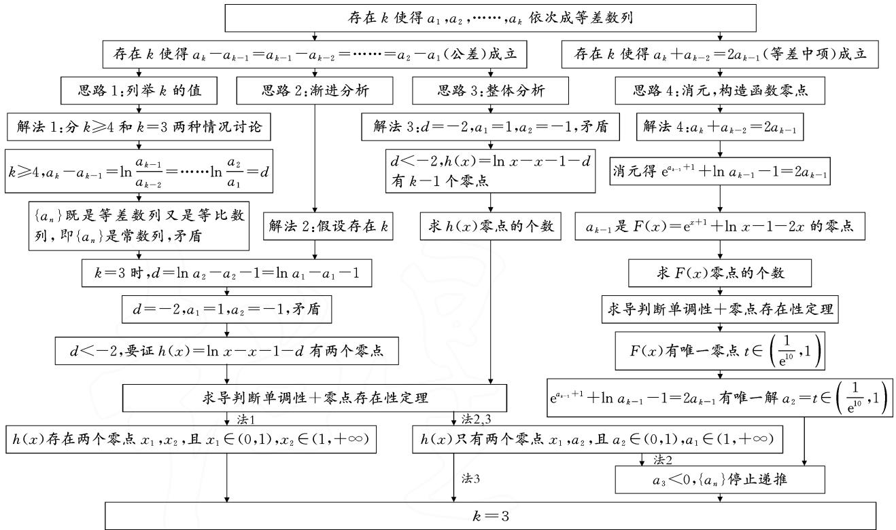
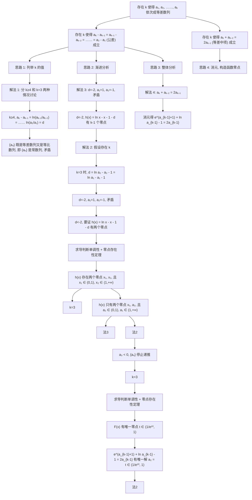

2023年讲题比赛获奖论文之七：

# 揭示 2023 年上海卷第 21 题本质

# 山东省胶州市第三中学 胡晓洁

# 1 题目:2023 年上海卷第 21 题

已知 $f(x)=\ln x$ ，取点 $(a_{1},f(a_{1}))$ 过其作曲线 $y=f(x)$ 的切线交 y 轴于点 $(0,a_{2})$ ，取点 $(a_{2},f(a_{2}))$ 过其作曲线 $y=f(x)$ 的切线交 y 轴于点 $(0,a_{3})$ ，若 $a_{n}\leqslant0$ 则停止，以此类推，得到数列 $\{a_{n}\}$ .

(1)若正整数 $m \geqslant 2$ ，证明： $a_{m} = \ln a_{m-1} - 1$ ;  
(2)若正整数 $m \geqslant 2$ ，试比较 $a_{m}$ 与 $a_{m-1}-2$ 的大小；  
(3) 若正整数 $k \geqslant 3$ ，是否存在 k 使得 $a_{1}, a_{2}, \cdots, a_{k}$ 依次成等差数列？若存在，求出 k 的所有取值；若不存在，试说明理由.

# 2 分析与思维导图

# 2.1 思维分析

本题从导数与数列的综合运用出发,考查学生求切线方程、构造函数证明不等式、等差数列性质的应用以及方程有解问题的解决能力,体现了数学抽象、逻辑推理、数学运算等核心素养.本题的题干是由函数图象的切线与y轴相交,交点的纵坐标经过递推得到一个数列.递推的过程和利用牛顿法求方程的解类似.数列

在题目中更多是起到背景和提示作用,本质上还是解决函数与导数的问题.本题作为上海卷的压轴题,有较大的思维量,突出考查了数学抽象和逻辑推理核心素养.

第(1)问证明数列的递推关系,本质上考查求函数的切线方程,要求学生理解题目中的递推关系.本题对学生在给定情境下分析数学问题的能力有较高的要求.  
第(2)问比较大小,常用办法是将要比较的对象化成同一变量后作差.结合第(1)问的结论,可以发现本质上是考查常用不等式 $\ln x \leqslant x - 1 (\mathrm{e}^{x} \geqslant x + 1)$ 的证明.本题要求学生能够结合已知结论解决问题,熟练掌握构造法证明不等式.  
第(3)问分析 k 的取值是难点,结合等差数列的性质,可以将分析 k 的取值转化为方程有解的问题.不同的性质可以转化出不同的方程,此问主要利用公差和等差中项来解决.本题要求学生能深刻地理解方程有解和函数有零点的等价关系.

# 2.2 思维导图

第(3)问的思维导图如图1所示.

flowchart

图 1

# 2.3 解答

# (Ⅰ)第(1)问的解答：

解: 由 $f(x)=\ln x$ ，定义域为 $(0,+\infty)$ ，得 $f'(x)=\frac{1}{x}$ 。当正整数 $m\geqslant2$ 时， $a_{m-1}>0$ ，切线方程为 $y-\ln a_{m-1}=\frac{1}{a_{m-1}}(x-a_{m-1})$ 。当 x=0 时， $a_{m}=\ln a_{m-1}-1$ 。

# (Ⅱ)第(2)问的解答：

解: 当 $m \geqslant 2$ 时, $a_{m} = \ln a_{m-1} - 1, a_{m-1} > 0.$

所以 $a_{m}-(a_{m-1}-2)=\ln a_{m-1}-1-(a_{m-1}-2)$ ，令 $x=a_{m-1}>0$ ，记 $G(x)=\ln x-x+1, x>0$ ，则 $G'(x)=\frac{1}{x}-1=\frac{1-x}{x}$ .

所以，当 0 < x < 1 时， $G'(x) > 0$ ， $G(x)$ 在 $(0,1)$ 上单调递增；当 x > 1 时， $G'(x) < 0$ ， $G(x)$ 在 $(1,+\infty)$ 上单调递减.

所以， $G(x)\leqslant g(1) = 0$ ，即 $a_{m} - (a_{m - 1} - 2)\leqslant 0.$

故 $a_{m} \leqslant a_{m-1} - 2$ .

# (Ⅲ)第(3)问的解答：

解法 1: 列举式解题.

假设存在 k 符合题意, 即 $a_{1}, a_{2}, \cdots, a_{k}$ 依次成等差数列, 设公差为 d.

当 $k \geqslant 4$ 时，因为 $a_{m} \leqslant a_{m-1} - 2$ ，所以 $d = a_{m} - a_{m-1} \leqslant -2$ .

所以 $d=a_{k}-a_{k-1}=a_{3}-a_{2}=a_{2}-a_{1}\leqslant-2$ ，所以 $\ln\frac{a_{k-1}}{a_{k-2}}=\cdots\cdots=\ln\frac{a_{2}}{a_{1}}=\ln a_{1}-1-a_{1}.$

所以 $\{a_{k}\}$ 既是等差数列也是等比数列，即 $\{a_{k}\}$ 为常数列，显然与 $a_{m} \leqslant a_{m-1}-2$ 矛盾.

当 k=3 时， $a_{1},a_{2},a_{3}$ 为等差数列，设公差为 d，所以 $d=a_{3}-a_{2}=a_{2}-a_{1}\leqslant-2$ .

所以 $\ln a_{2}-a_{2}-1=\ln a_{1}-a_{1}-1=d.$ 记 $g(x)=\ln x-x-1$ ，则 $g(a_{2})=g(a_{1})=d.$

显然，当 $d = -2$ 时，因为 $-2 = a_{2} - a_{1} = \ln a_{1} - a_{1} - 1$ ，所以 $a_1 = 1, a_2 = -1$ ，则不存在 $a_3$ ，所以 $d < -2$ .

下面只需证明: 函数 $h(x)=g(x)-d=\ln x-x-1-d$ 对任意 d<-2 都存在两个零点.

易知: $g(x)$ 在 $(0,1)$ 上单调递增, 在 $(1,+\infty)$ 上单调递减.

所以 $h(x)$ 在 $(0,1)$ 上单调递增，在 $(1,+\infty)$ 上单调递减，则且 $h(x)\leqslant h(1)=-2-d$ .

所以 $h(1)=-2-d>0, h(e^{d})=-1-e^{d}<0.$

又 $h(-2d) = \ln (-2d) + d - 1$ ，记 $\varphi (t) = \ln t - \frac{t}{2} -1,t = -2d > 4$ ，则 $\varphi '(t) = \frac{1}{t} -\frac{1}{2} < 0.$

所以 $\varphi(t)<\varphi(4)=\ln4-3<0$ , 则 $h(-2d)<0$

所以， $h(x) = g(x) - d = \ln x - x - 1 - d$ 对任意 $d <   - 2$ 都存在两个零点 $x_{1},x_{2}$ ，且 $x_{1}\in (0,1),x_{2}\in$

$(1,+\infty)$ . 故 k=3.

# 解法 2: 渐进分析式解题.

假设存在 k 符合题意，即 $a_{1}, a_{2}, \cdots, a_{k}$ 依次成等差数列，设公差为 d.

当 k=3 时， $a_{1},a_{2},a_{3}$ 为等差数列，设公差为 d，所以 $d=a_{3}-a_{2}=a_{2}-a_{1}\leqslant-2$ .

所以 $\ln a_{2}-a_{2}-1=\ln a_{1}-a_{1}-1=d$ , 即 $g(a_{2})=g(a_{1})=d$ .

显然，当 $d = -2$ 时，因为 $-2 = a_{2} - a_{1} = \ln a_{1} - a_{1} - 1$ ，可知 $a_1 = 1, a_2 = -1$ ，则不存在 $a_3$ ，所以 $d < -2$ .

易知, $g(x)$ 在 $(0,1)$ 上单调递增,在 $(1,+\infty)$ 上单调递减.

所以 $h(x)$ 在 $(0,1)$ 上单调递增，在 $(1,+\infty)$ 上单调递减，则 $h(x)\leqslant h(1)=-2-d$ .

所以 $h(1)=-2-d>0, h(e^{d})=-1-e^{d}<0.$

又 $h(-2d) = \ln (-2d) + d - 1$ ，记 $\varphi (t) = \ln t - \frac{t}{2} -1,t = -2d > 4$ ，则 $\varphi '(t) = \frac{1}{t} -\frac{1}{2} < 0.$

所以 $\varphi(t)<\varphi(4)=\ln4-3<0$ , 则 $h(-2d)<0$

所以， $h(x)=g(x)-d=\ln x-x-1-d$ 对任意 d<-2 都存在两个零点 $a_{1}, a_{2}$ ，且 $a_{2}\in(0,1), a_{1}\in(1,+\infty)$ .

因此 $a_{3}<0$ ，停止递推。所以 k 的取值只能为 3。

# 解法 3: 整体分析式解题.

假设存在 k 符合题意, 即 $a_{1}, a_{2}, \cdots, a_{k}$ 依次成等差数列, 设公差为 d.

显然，当 $d = -2$ 时，因为 $-2 = a_{2} - a_{1} = \ln a_{1} - a_{1} - 1$ ，可知 $a_1 = 1, a_2 = -1$ ，则不存在 $a_{3}$ ，所以 $d < -2$ .

因为 $d=a_{k}-a_{k-1}=\ln a_{k-1}-a_{k-1}-1$ ，则 $a_{1},a_{2}$ ，……， $a_{k-1}$ 为方程 $\ln x-x-1-d=0$ 解.

所以函数 $h(x)=g(x)-d=\ln x-x-1-d$ 有 k-1 个零点.

下同法1.

# 解法 4: 消元, 构造函数零点.

假设存在 k 符合题意, 即 $a_{1}, a_{2}, \cdots, a_{k}$ 依次成等差数列, 所以 $a_{k} + a_{k-2} = 2a_{k-1}$ .

因为 $a_{k} = \ln a_{k - 1} - 1, a_{k - 1} = \ln a_{k - 2} - 1$ ，所以 $\mathrm{e}^{a_{k - 1} + 1} + \ln a_{k - 1} - 1 = 2a_{k - 1}$ .

因此 $a_{k-1}$ 为方程 $e^{x+1} + \ln x - 1 = 2x$ 的解，也即函数 $F(x) = e^{x+1} + \ln x - 1 - 2x$ 的零点.

因为 $F'(x)=\mathrm{e}^{x+1}+\frac{1}{x}-2$ 在 $(0,+\infty)$ 上大于零，所以 $F(x)$ 在单调递增.

又因为 $F\left(\frac{1}{\mathrm{e}^{10}}\right)<\mathrm{e}^{2}-11<0,F(1)=\mathrm{e}^{2}-3>0$ ，所以 $F(x)$ 在 $\left(\frac{1}{\mathrm{e}^{10}},1\right)$ 上存在唯一零点 t，且在 $(0,+\infty)$ 上存在唯一零点。（下转第 6 页）

差异;利用平面几何结论可获得简捷解法.

课后作业:(限于篇幅题目略去.)

# 3 教学反思

这节课以教师为主导、学生为主体、问题为主轴、练习为主线，以“一题一课”的形式，让学生自主探究例题的解法，其中渗透了数形结合、化归转化、分类讨论等数学思想，提升了学生解答圆锥曲线问题的能力。在专题复习中，实现了知识结构化、方法系统化、思想实质化 $^{[2]}$ 。

在教学活动中,先让学生独立思考,再自主探究,体会方法,相互分享,给予学生充分的时间去探究、思考、表达,使学生经历和体验解决问题的全过程,感悟通法与妙法.通过一题多解、多题一解,实现“做一题,得一法,会一类,通一片”,实现从“解题”到“解决问题”.

但本节课仍然留有遗憾,为了让学生更直观地感受随着点 P 的运动,结论依然没有发生变化,我们都是用几何法证得结论,并用几何画板演示结论,没有充足的时间让学生感受利用通法——坐标法来证明，后续还需通过坐标法提高学生的数学运算能力.

小结只强调了知识方面,对育人方面做得不到位,课后总结一首打油诗:

一题多解思维阔,学生主体来开拓,

一题多变问题活,定能扩展有收获.

解析几何形态多,开动脑筋去探索,

想要数学学得好,自我学习不能少!

如果能在课堂上这样小结,文化氛围更浓,教学效果和育人效果会更好,以后会不断改进,自觉做到教书育人.

# 参考文献：

[1]林国红.巧用平面几何性质 妙解圆锥曲线问题[J].数理化解题研究,2022(16):14-17.

[2] 张文海.“一题一课”: 让高三数学复习走向素养落实 [J]. 数学通报, 2020(7): 30-34. Z

# (上接第2页)

所以 $a_{2}=t$ 时， $a_{1},a_{2},a_{3}$ 依次成等差数列；但 $a_{3}<0$ ，递推停止。故 k=3。

# 3 溯源与高考链接

2023年上海卷第21题是导数与数列的综合问题,命题背景来自人教A版教材选择性必修第82页的“牛顿法”.由函数的切线通过递推得到数列,要求解的是数列问题.但通过分析题意,寻找解题的切入点会发现本题三问实际考查的都是导数问题.下面两道高考试题供大家欣赏:

(2010年江苏高考第8题)函数 $y=x^{2}(x>0)$ 的图象在点 $(a_{k},a_{k}^{2})$ 处的切线与 x 轴交点的横坐标为 $a_{k+1}$ ，k 为正整数， $a_{1}=16$ ，则 $a_{1}+a_{3}+a_{5}=$ \_\_\_\_.

分析:由题意写出切线方程,找到 $a_{k}$ 和 $a_{k+1}$ 的关系.

函数 $y=x^{2}(x>0)$ 在点 $(a_{k},a_{k}^{2})$ 处的切线方程为 $y-a_{k}^{2}=2a_{k}(x-a_{k})$ ，当 y=0 时，解得 $x=\frac{a_{k}}{2}$ ，所以 $a_{k+1}=\frac{a_{k}}{2}$ ，可知 $a_{1}+a_{3}+a_{5}=16+4+1=21$ 。故答案为 21。

(2015年江苏卷第20题)设 $a_{1},a_{2},a_{3},a_{4}$ 是各项为正数且公差为 $d(d\neq0)$ 的等差数列.

(1) 证明: $2^{a_1}, 2^{a_2}, 2^{a_3}, 2^{a_4}$ 依次成等比数列;

(2) 是否存在 $a_{1}, d$ ，使得 $a_{1}, a_{2}^{2}, a_{3}^{3}, a_{4}^{4}$ 依次成等比数列，并说明理由；

(3) 是否存在 $a_{1}, d$ 及正整数 n, k，使得 $a_{1}^{n}, a_{2}^{n+1}, a_{3}^{n+2}, a_{4}^{n+3}$ 依次成等比数列，并说明理由.

分析:(2)利用等差数列的性质,用 a,d 表示 $a_{1}$ , $a_{2}$ , $a_{3}$ , $a_{4}$ 后根据等比数列的性质列出等式.等式的化简变形较难,首先令 $t=\frac{d}{a_{1}}>0$ , 将二元方程转化为一

元方程,再分别求解两个高次方程,利用消去最高次的方法得到方程 $7t^{2}+4t+3=0$ , t 无解,所以不存在.

(3) 同(2)，先令 $t=\frac{d}{a_{1}}>0$ ，将二元问题转化为一元问题。将高次方程降次，所以两边取对数，消去 n, k 得到关于 t 的一元方程 $4\ln(1+3t)\ln(1+t)-\ln(1+3t)\cdot\ln(1+2t)-3\ln(1+2t)\ln(1+t)=0$ 。从而将方程是否有解的问题转化为研究函数 $g(t)=4\ln(1+3t)\cdot\ln(1+t)-\ln(1+3t)\ln(1+2t)-3\ln(1+2t)\ln(1+t)$ 是否有零点的问题。这个函数需要利用二次求导才可确定其在 $(0,+\infty)$ 上无零点，所以不存在。

# 4 练习

（原创命题）已知函数 $f(x) = a\mathrm{e}^{x} - \ln x - \sin \left(\frac{\pi x}{2}\right), a \geqslant 0. f'(x)$ 是 $f(x)$ 的导函数， $f''(x)$ 是 $f'(x)$ 的导函数。规定：曲线 $y = f(x)$ 在任一点 $(x, f(x))$ 处的“曲率” $K = \frac{|f''(x)|}{[1 + (f'(x))^2]^{\frac{3}{2}}}$ 。

①当 a=0 时, 求曲线 $y=f(x)$ 在点 $(1,f(1))$ 处的“曲率”;

②若函数 $f(x)$ 存在零点, 求 a 的取值范围;

③设等比数列 $\{a_{n}\}$ 的公比为q，

且 $\mathrm{e}^{a_{1}+a_{2}+a_{3}+a_{4}}=\ln(a_{1}+a_{2}+a_{3})+\sin\left[\left(\frac{a_{1}+a_{2}+a_{3}}{2}\right)\pi\right]$ ，若 $a_{1}>\mathrm{e}^{2}$ ，求公比 q 的取值范围.

(扫码看练习参考答案.) Z

