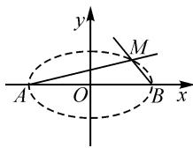

# 高中生数学运算素养的培养情况及提升策略

——以“椭圆”为例

# ● 吉林省长春市长春师范大学 董航岐 苗凤华

摘要: 数学运算素养是高中数学学科六大核心素养之一, 是学生认识、理解、解决数学问题的重要工具, 提升高中生数学运算素养具有重要意义. 文章基于对高中生数学运算素养的培养情况分析, 得出高中生在数学运算素养方面存在的问题, 以“椭圆”知识为例, 结合高中数学教学实际, 提出高中生数学运算素养的提升策略.

关键词: 核心素养; 高中数学; 数学运算素养

# 1 引言

在《普通高中数学课程标准(2017年版2020年修订)》中,数学核心素养是指学生通过数学学习,在认知、情感、意志及实践等方面达到的综合能力,不仅包括数学知识技能,更涵盖数学观念、数学思维方式、数学习惯以及利用数学进行实践活动的能力[1].在新课程改革和新高考背景下,如何提升高中生的数学运算素养,逐渐成为当前教育改革的紧迫课题.“椭圆”涉及的数学知识和技能体系丰富,涵盖解析几何、代数、微积分等领域,具有代表性.因此,教学中应结合“椭圆”的内容,着重于探索高中生数学核心素养与运算素养的融合与升华,寻求更加科学、有效的提升策略,为高中数学教育注入新的活力.

# 2 核心素养背景下培养高中生数学运算素养的重要性

在核心素养背景下,高中数学教学已经从单一的知识技能传授转向对学生综合素养的培养,注重学生批判性思维、问题解决能力和创新意识的培养.核心素养突显了数学思维方式、数学观念、数学习惯的重要性,因此高中生的数学运算素养的提升显得尤为重要 $^{[2]}$ .

在高中数学知识体系中,无论是函数还是解析几何,都强调了对抽象思维和严密逻辑的要求.运算素养的培养,使得学生在面对抽象概念和定理时,能够运用恰当的数学语言和方法进行准确描述和推理,而不是仅仅停留在表面的认识.例如,对于椭圆、双曲线等解析几何的知识点,强大的运算素养使学生能够轻松掌握其几何性质及参数方程和标准方程之间的关系,进而在实际问题中熟练、灵活地应用知识求解.

# 3 高中生数学运算素养的培养情况分析

# 3.1 运算对象的确定存在困难

明确运算对象是进行运算、解决数学问题的基础步骤.在高中数学实际教学中,部分学生在运算时,经常出现因无法准确把握题目中的关键信息而导致无法明确运算对象的问题 $^{[3]}$ .如,在探讨椭圆与直线的位置关系时,部分学生存在难以识别焦点、长短轴等椭圆的核心要素,从而影响判断直线与椭圆的交点个数,导致运算错误、解题失败.

# 3.2 运算法则的运用容易混淆

运算法则是解题和运算的依据,在具体解题过程中,学生能否找到并运用与运算对象相关的运算法则,是学生顺利解决问题的关键.结合实际教学发现,部分学生在解题过程中,容易出现混用、乱用运算法则的现象.例如,在解三角函数题时,部分学生会将正弦定理与余弦定理混淆;在探索椭圆焦距性质时,部分学生会将其与双曲线的焦点性质混淆等.这些现象主要源于学生对法则背后的数学原理理解不深,仅仅停留在表面的应用层次,缺乏对各种运算法则本质的深入理解 $^{[4]}$ .

# 3.3 运算和解题思路不明确

高中数学问题往往需要综合应用多个知识点,学生在面对复杂题目时,常常迷失方向,主要是数学基础知识掌握不牢固、解题技巧不成熟.同时,也反映出在日常教学中,存在重“做题”而轻“解题方法”和“思考过程”的普遍现象,学生往往过于追求结果,而忽视了思考解题的整体逻辑和路径 $^{[5]}$ .例如,在椭圆的应用题中,特别是涉及几何关系或最值问题的题目,学生常表现出运算和解题思路不清晰,如在计算椭圆上两点间的最短距离时,部分学生可能会选择复杂的代数方法,而忽视基于几何性质的直观方法.产生此种现象的原因在于部分学生未能根据问题特征,形成合适的运算思路,从而导致解题失败.

# 3.4 运算结果缺乏验证意识

在数学运算过程中,验证不仅仅是对运算结果的检验,更应当成为推理过程的有机部分.但许多学生在得出结论后往往忽视验证步骤,究其原因在于学生未养成良好的运算和验证习惯.例如,学生在求解与椭圆相关的几何问题,如利用切线斜率、正切的性质等后,很少采用图形、焦点或其他几何性质来验证其结果的准确性和合理性.

# 4 高中生数学运算素养提升策略

# 4.1 确定研究对象, 明确运算对象

在核心素养背景下,高中数学的研究对象不仅仅是具体的数学知识和技能,更是涉及到学生的数学思维习惯、问题解决能力和创新意识 $^{[6]}$ .而高中数学知识具有抽象性和复杂性,常常存在研究对象与运算对象不一致的现象.因此,提升学生运算素养的基础在于指导学生从研究对象中挖掘出运算对象,培养学生在面对数学问题时,不被繁复的计算和公式所困扰,而是学会先确定研究目标,然后选择合适的方法求解,这对于高中生的数学运算素养培养至关重要.

以“椭圆”知识为例,教师在探索如何提升学生数学运算素养的过程中,首先需要确保学生明确椭圆的标准方程、基本性质以及与其他二次曲线的关系,在此基础上,引导学生深入探索椭圆的几何性质和解析性质,做到不仅能够熟练运用,而且能够进行深入研究.

例 1 给定椭圆方程 $\frac{x^{2}}{4} + \frac{y^{2}}{3} = 1$ ，求该椭圆与直线 y = x 的交点.

多数学生在解此题时,会选择直接运算.教师在教学过程中,需要引导学生确定本题的研究对象是什么,从而使学生明确运算对象.本题主要涉及椭圆的方程和给定的直线方程,在确定研究对象和运算对象后,可以组织学生运用代入法解题,强化问题解决过程中的目标意识和针对性.解题过程如下:

解: 将直线方程 y = x 代入椭圆方程 $\frac{x^{2}}{4} + \frac{y^{2}}{3} = 1$ ，得到 $x^{2} = \frac{12}{7}$ ，进而得出 $x = \frac{2\sqrt{21}}{7}$ ，或 $x = -\frac{2\sqrt{21}}{7}$ ，所以 $y = \frac{2\sqrt{21}}{7}$ 或 $y = -\frac{2\sqrt{21}}{7}$ .

故交点为 $\left(\frac{2\sqrt{21}}{7},\frac{2\sqrt{21}}{7}\right),\left(-\frac{2\sqrt{21}}{7},-\frac{2\sqrt{21}}{7}\right)$ .

# 4.2 推导运算法则,强化概念与性质的运用

传统数学教学往往因过于注重结果,而忽视了过程.在核心素养背景下,教师应该注重培养学生的数学思维能力,引导学生从实际问题出发,自主探索、发现和总结椭圆的运算规律,从而更好地掌握与运用,切实提高数学运算素养.

例 2 给定椭圆方程 $\frac{x^{2}}{4} + \frac{y^{2}}{3} = 1$ ，求此椭圆的焦点坐标，并计算椭圆上任意一点与椭圆两焦点的距离之和.

在解决此问题时,教师需要引导学生推导椭圆的相关结论,想要找椭圆的焦点,需要知道,对于椭圆的一般方程 $\frac{x^{2}}{a^{2}}+\frac{y^{2}}{b^{2}}=1(a>b>0)$ ,由 $c^{2}=a^{2}-b^{2}$ ,便可求出椭圆 $\frac{x^{2}}{4}+\frac{y^{2}}{3}=1$ 的焦点为 $(1,0)$ , $(-1,0)$ ,根据椭圆的定义,椭圆上任意一点到焦点的距离之和是常数,等于椭圆的长轴长2a.

通过推导、运用与椭圆相关的结论,学生不仅巩固和强化了椭圆的基本性质,而且学会了如何从定义出发,推导和运用与椭圆相关的结论,这也是高中数学运算素养培养的关键部分.

# 4.3 梳理解题思路, 明确运算路径

高中数学问题往往复杂多变,而解决问题的关键在于明确并合理地选择运算路径,要求学生在解题时,不仅需要具备解题技巧,还应形成系统的解题思路,这有助于学生清晰地认识到问题的核心,并有针对性地求解.

以“椭圆”知识为例,当学生面对椭圆的相关问题时,应首先进行分析,明确题目要求,梳理解题思路,选择合适的数学工具,然后再求解.在此过程中,教师应注重培养学生的数学直觉,鼓励学生灵活运用数学知识,创新解题方法,提高解决问题的能力.

例 3 给定椭圆 $\frac{x^{2}}{9} + \frac{y^{2}}{4} = 1$ 和直线 y = 2x - 3，求椭圆与直线的交点.

在解题过程中,教师需要引导学生梳理解题思路:本题要求椭圆与直线的交点,即需求出椭圆与直线方程的公共解,为解决此问题,应将直线方程代入椭圆方程,然后消元简化,求出x的值,再将其代入直线方程,得到y的值.基于此,确定解题思路.(1)代入:将直线方程代入椭圆方程.(2)求解:得到关于的二次方程,并求解.(3)回代:利用求得的值回代入直线方程,得到结果.通过梳理解题思路,明确运算路径,确保学生对整个解题过程条理清晰、逻辑明确,不会在解题时迷失方向,既有助于帮助学生养成良好的数学运算素养,也可以培养学生系统思考和解决问题的能力.

# 4.4 培养结果验证意识,促进运算思考

验证运算结果是帮助学生养成良好运算习惯、提高运算正确率的重要环节.但是,在解答数学问题后,学生往往容易忽视结果的验证,从而导致答案的错误.在核心素养背景下,教师应引导学生养成每次求解完问题后都进行结果验证的习惯,如通过代入法、图象法等,确保答案的正确性.

例 4 如图 1 所示, A, B 两点坐标分别为 $(-5,0)$ , $(5,0)$ , 直线 AM, BM 相交于点 M, 且二者斜率之积为 $-\frac{4}{9}$ , 求点 M 的轨迹方程. (下转第 75 页)

  
图 1

# 4 考题链接

(2022年苏锡常镇一模数学试卷)已知椭圆 $C: \frac{x^{2}}{a^{2}} + \frac{y^{2}}{b^{2}} = 1 (a > b > 0)$ 的离心率为 $\frac{\sqrt{2}}{2}$ ，且椭圆 C 的右焦点 F 到右准线的距离为 $\sqrt{3}$ . A 是第一象限内的定点，M, N 是椭圆 C 上两个不同的动点（均异于点 A），且直线 AM, AN 的倾斜角互补.

(1)求椭圆 C 的标准方程；  
(2)若直线 MN 的斜率 k=1, 求点 A 的坐标.  
本题解析过程从略.

# 5 多题归一

由上述例题笔者认为,有关定点、定值的问题基本上可以从两个方向入手.

# (1)从已知条件出发,直接求解

在联立方程组利用韦达定理求解的时候会遇到如下两种情况：

（i）“对称的韦达定理”型，即 $x_{1}, x_{2}$ 的系数相同， $x_{1}, x_{2}$ 交换之后结构不变的对称结构。如利用韦达定理处理 $\left|x_{1} - x_{2}\right|, x_{1}^{2} + x_{2}^{2}, \frac{1}{x_{1}} + \frac{1}{x_{2}}$ 之类的对称结构。

（ii）“非对称韦达定理”型，即 $x_{1}, x_{2}$ 的系数不对等， $x_{1}$ 与 $x_{2}$ 交换后结构发生改变的非对称结构。比如 $\frac{x_{1}x_{2} - x_{1} - 2x_{2} + 2}{x_{1}x_{2} - 2x_{1} - x_{2} + 2}, \frac{my_{1}y_{2} + y_{1}}{my_{1}y_{2} + y_{2}}$ 之类的式子，解决此类问题先要进行消元转化。

无论是上述哪种情况,都可以借助韦达定理来解决.

# (2)先猜后证

通过寻找特殊位置或者特殊点先把定点或者定值确定之后,再用常规方法解决,这种方法通常计算简洁,运算步骤较少.

一题多解,是从不同角度求解同一个问题;多题归一,是不同题目采用的做法类似.一题多解能培养学生的发散思维,而多题归一能培养学生的总结与归纳能力.在平时的解析几何复习中,除了要培养学生的运算能力,还要培养学生的思维能力.因为只有多思考才能在解题中少走“弯路”,才能让解析几何的运算“如虎添翼”.

# 参考文献：

[1]中华人民共和国教育部.普通高中数学课程标准(2017年版2020年修订)[S].北京:人民教育出版社,2020.Z

# (上接第51页)

学生在解题过程中,通过运算会得到椭圆的标准方程,此时,教师需要引导学生思考“椭圆的标准方程是否是点 M 的轨迹方程?”通过分析,结合二者斜率之积为 $-\frac{4}{9}$ 可知,点 M 不可能和点 A,B 重合,否则此时直线斜率不存在.在解题过程中着重培养学生结果验证意识,鼓励学生养成自我检查的习惯,使学生有意识地检验运算结果,这样数学运算素养才会逐步提高,不仅有助于提高学生运算的准确率,还有助于培养学生的独立思考和批判性思维能力,促进学生全面发展.

# 5 结语

综上所述,核心素养背景下的高中数学教育,不仅仅是数学知识和技能的传授,更是一种对学生全面、深入的数学素养的培养.数学运算素养作为高中数学核心素养的关键构成,提升高中生数学运算素养不仅关乎学生对数学学科知识的掌握,甚至会影响学生未来的发展.因此,教师应当充分认识到数学运算素养在学生全面发展中的重要作用,结合学生数学运算素养现状,从确定研究对象、推导运算法则、梳理解题思路、培养结果验证意识等方面出发，为学生提供更加系统、科学、有趣的数学学习环境，真正做到以学生为本，培养学生的数学核心素养.

# 参考文献：

[1] 金国成, 张加林. 指向“数学运算”素养提升的初中方程教学寻绎——以“一元二次方程根与系数的关系”为例 [J]. 中学数学杂志, 2023(4): 35-38.  
[2] 王彦棋, 石玲瑜. 基于数学学科核心素养的普通高中数学教科书与课程标准比较分析——以人教 A 版中的“函数”习题为例 [J]. 辽宁师专学报 (自然科学版), 2021, 23(3): 1-7.  
[3] 李保臻, 米鹏莉, 王亚妮. 高考试题中数学学科核心素养测评的比较研究——以 2020 年全国Ⅱ卷、浙江卷及海南卷为例 [J]. 教育测量与评价, 2021(6): 38-49.  
[4]潘丙理.立足核心素养 培养运算素养——高中生数学运算素养现状及培养对策研究[J].数学学习与研究,2023(12):95-97.  
[5]陈玉娟.例谈高中数学核心素养的培养——从课堂教学中数学运算的维度[J].数学通报,2016,55(8):34-36,54.  
[6]方泽英.试探高中数学深度教学的实现——以“椭圆及其标准方程”教学为例[J].教育导刊,2021(10):58-62.Z