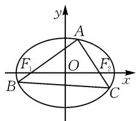

# 一类椭圆双弦过定点问题的推广研究

# ● 浙江省宁波市姜山中学 蒋自佳

摘要:通过对2025届湖南省长沙一中月考第19题有关椭圆双弦问题进行模型提炼、延伸推广,得出一类椭圆双弦的4个优美结论.最后,给出了2025年广州市高三调研题作为类题演练.

关键词: 椭圆; 定点; 定值; 面积最值

# 1 试题及解析

(2025 届湖南省长沙一中月考第 19 题) 如图 1, 已知椭圆的标准方程为 $\frac{x^{2}}{2} + y^{2} = 1, F_{1}, F_{2}$ 分别为椭圆的左、右焦点, 点 A 为椭圆上一动点, 且在 x 轴上方，延长 $AF_{1}, AF_{2}$ 分别交椭圆于点 B, C.

text_image

y
A
F₁ O F₂
B C x

图1

(1)证明: $\triangle ABC$ 的周长大于 $4\sqrt{2}$ ;  
(2) 若 $\left|AF_{1}\right|=3\left|AF_{2}\right|$ ，求直线 BC 的方程；  
(3)求 $\triangle ABC$ 面积的最大值.

解析:(1) 因为 $\left|F_{2}C\right|+\left|BC\right|>\left|BF_{2}\right|$ ，所以 $\left|AB\right|+\left|AC\right|+\left|BC\right|>\left|AB\right|+\left|AF_{2}\right|+\left|BF_{2}\right|=4\sqrt{2}$ .

(2) 设 $A(x_{0}, y_{0})$ ，则直线 $AF_{1}$ 方程为 $x = \frac{x_{0} + 1}{y_{0}} y - 1$ ，联立 $\left\{\begin{aligned} x &= \frac{x_{0} + 1}{y_{0}} y - 1, \\ \frac{x^{2}}{2} + y^{2} &= 1, \end{aligned}\right.$ 消去 x，得 $\left[\left(\frac{x_{0} + 1}{y_{0}}\right)^{2} + 2\right] y^{2} - \frac{2(x_{0} + 1)}{y_{0}} y - 1 = 0$ ，根据韦达定理可知 $y_{0} \cdot y_{B} = -\frac{1}{\left(\frac{x_{0} + 1}{y_{0}}\right)^{2} + 2} = -\frac{y_{0}^{2}}{2x_{0} + 3}$ ，所以 $y_{B} = -\frac{y_{0}}{2x_{0} + 3}$ ，从而 $x_{B} = -\frac{x_{0} + 1}{2x_{0} + 3} - 1$ 。同理可得 $y_{C} = -\frac{y_{0}}{-2x_{0} + 3}$ ， $x_{C} = -\frac{x_{0} - 1}{-2x_{0} + 3} + 1$ 。

因为 $|AF_{1}|+|AF_{2}|=2\sqrt{2},|AF_{1}|=3|AF_{2}|$ ，所以 $|AF_{1}|=\sqrt{(x_{0}+1)^{2}+y_{0}^{2}}=\frac{3\sqrt{2}}{2}$ .又因为 $\frac{x_{0}^{2}}{2}+y_{0}^{2}=1$ ，可解得 $x_{0}=1,y_{0}=\frac{\sqrt{2}}{2}$ ，所以 $B\left(-\frac{7}{5},-\frac{\sqrt{2}}{10}\right)$

$C\left(1, - \frac{\sqrt{2}}{2}\right)$ ，求得直线 $BC$ 的方程为 $y = -\frac{\sqrt{2}}{6} x - \frac{\sqrt{2}}{3}$

(3) 因为 $\frac{S_{\triangle ABC}}{S_{\triangle AF_{1}F_{2}}} = \frac{\frac{1}{2}|AB||AC|\sin\angle BAC}{\frac{1}{2}|AF_{1}||AF_{2}|\sin\angle F_{1}AF_{2}} = \left|\frac{y_{0}-y_{B}}{y_{0}}\cdot\frac{y_{0}-y_{C}}{y_{0}}\right|$ ，由(2)可知 $y_{B} = -\frac{y_{0}}{2x_{0} + 3}, y_{C} = -\frac{y_{0}}{-2x_{0} + 3}$ ，代入上式可得 $\frac{S_{\triangle ABC}}{S_{\triangle AF_{1}F_{2}}} = \frac{16 - 4x_{0}^{2}}{9 - 4x_{0}^{2}}$ ，所以 $S_{\triangle ABC} = \frac{16 - 4x_{0}^{2}}{9 - 4x_{0}^{2}} \cdot y_{0}$ 。又 $\frac{x_{0}^{2}}{2} + y_{0}^{2} = 1$ ，所以 $S_{\triangle ABC} = \frac{8y_{0}^{3} + 8y_{0}}{8y_{0}^{2} + 1}$ 。

设 $f(t)=\frac{8t^{3}+8t}{8t^{2}+1}, t\in(0,1]$ ，因为 $f'(t)=\frac{8(8t^{4}-5t^{2}+1)}{(8t^{2}+1)^{2}}>0$ ，所以 $f(t)$ 在 $(0,1]$ 上单调递增，故 $\triangle ABC$ 面积的最大值为 $\frac{16}{9}$ .

# 2 试题延伸推广

由试题第(2)题解答过程可知 $-\frac{y_{O}}{y_{B}}-\frac{y_{O}}{y_{C}}$ 为定值6,如果把试题条件一般化,可以得到结论1.

结论1 已知椭圆 $E: \frac{x^2}{a^2} + \frac{y^2}{b^2} = 1 (a > b > 0)$ 上有一动点 $A, F_1, F_2$ 分别为椭圆 $E$ 的左、右焦点， $AF_1$ 交椭圆 $E$ 于另外一点 $B, AF_2$ 交椭圆 $E$ 于另外一点 $C$ . 若 $\overrightarrow{AF_1} = \lambda \overrightarrow{F_1B}, \overrightarrow{AF_2} = \mu \overrightarrow{F_2C}$ ，则有 $\lambda + \mu = \frac{2(a^2 + c^2)}{b^2}$ .

证明: 设 $A(x_{0}, y_{0})$ , $B(x_{1}, y_{1})$ , $C(x_{2}, y_{2})$ ，直线 $AF_{1}$ 方程为 $x = \frac{x_{0} + c}{y_{0}} y - c$ ，与椭圆 E 方程联立，消 x 得 $\left[a^{2} + \frac{b^{2}(x_{0} + c)^{2}}{y_{0}^{2}}\right] y^{2} - \frac{2b^{2}c(x_{0} + c)}{y_{0}} y - b^{4} = 0$ ，由

韦达定理可知 $y_0y_1 = -\frac{b^2y_0^2}{a^2 + c^2 + 2cx_0}$ ，所以 $y_{1} =$ $-\frac{b^{2}y_{0}}{a^{2} + c^{2} + 2cx_{0}}.$ 同理可得 $y_{2} = -\frac{b^{2}y_{0}}{a^{2} + c^{2} - 2cx_{0}}.$ 不妨设 $y_0 > 0$ ，进一步可得 $\lambda +\mu = -\frac{y_0}{y_1} -\frac{y_0}{y_2} = \frac{2(a^2 + c^2)}{b^2}.$

如果把结论1中的 $F_{1}, F_{2}$ 换成 $T_{1}(-t,0)$ , $T_{2}(t,0)$ , 可以得到下列结论2.

结论2 已知椭圆 $E: \frac{x^2}{a^2} + \frac{y^2}{b^2} = 1 (a > b > 0)$ 上有一动点 $A, x$ 轴上有点 $T_1(-t, 0), T_2(t, 0)$ ，其中 $t > 0$ 且 $t \neq a, AT_1$ 交椭圆 $E$ 于另外一点 $B, AT_2$ 交椭圆 $E$ 于另外一点 $C$ . 若 $\overrightarrow{AT_1} = \lambda \overrightarrow{T_1B}, \overrightarrow{AT_2} = \mu \overrightarrow{T_2C}$ ，则 $\lambda + \mu = \frac{2(a^2 + t^2)}{a^2 - t^2}$ .

证明: 设 $A(x_{0}, y_{0})$ , $B(x_{1}, y_{1})$ , $C(x_{2}, y_{2})$ ，直线 $AT_{1}$ 方程为 $x = \frac{x_{0} + t}{y_{0}} y - t$ ，与椭圆 E 方程联立，消去 x 得 $\left[a^{2} + \frac{b^{2}(x_{0} + t)^{2}}{y_{0}^{2}}\right] y^{2} - \frac{2b^{2}t(x_{0} + t)}{y_{0}} y + b^{2}(t^{2} - a^{2}) = 0$ ，由韦达定理可知 $y_{0} y_{1} = \frac{y_{0}^{2}(t^{2} - a^{2})}{a^{2} + t^{2} + 2tx_{0}}$ ，所以 $y_{1} = \frac{y_{0}(t^{2} - a^{2})}{a^{2} + t^{2} + 2tx_{0}}$ 。同理可得 $y_{2} = \frac{y_{0}(t^{2} - a^{2})}{a^{2} + t^{2} - 2tx_{0}}$ 。

不妨设 $y_0 > 0$ ，进一步可得 $\lambda +\mu = -\frac{y_0}{y_1} -\frac{y_0}{y_2} =$ $\frac{2(a^2 + t^2)}{a^2 - t^2}.$

由结论 2 的证明过程可得点 B, C 坐标, 进一步研究发现直线 OA 和直线 BC 斜率之积为定值.

结论3 已知椭圆 $E: \frac{x^2}{a^2} + \frac{y^2}{b^2} = 1 (a > b > 0)$ 上有一动点 $A, x$ 轴上有点 $T_1(-t, 0), T_2(t, 0)$ ，其中 $t > 0$ 且 $t \neq a, AT_1$ 交椭圆 $E$ 于另外一点 $B, AT_2$ 交椭圆 $E$ 于另外一点 $C$ . 若直线 $OA$ 和直线 $BC$ 斜率都存在，则 $k_{OA} k_{BC} = \frac{b^2(t^2 - a^2)}{a^2(t^2 + a^2)}$ .

证明：设 $A(x_0,y_0),B(x_1,y_1),C(x_2,y_2)$

由结论2的证明过程，可知 $k_{BC} = \frac{y_1 - y_2}{x_1 - x_2} =$

$$
\frac {\frac {y _ {0} \left(t ^ {2} - a ^ {2}\right)}{a ^ {2} + t ^ {2} + 2 t x _ {0}} - \frac {y _ {0} \left(t ^ {2} - a ^ {2}\right)}{a ^ {2} + t ^ {2} - 2 t x _ {0}}}{\frac {x _ {0} + t}{y _ {0}} \cdot \frac {y _ {0} \left(t ^ {2} - a ^ {2}\right)}{a ^ {2} + t ^ {2} + 2 t x _ {0}} - \frac {x _ {0} - t}{y _ {0}} \cdot \frac {y _ {0} \left(t ^ {2} - a ^ {2}\right)}{a ^ {2} + t ^ {2} - 2 t x _ {0}} - 2 t} =
$$

$\frac{-4tx_{0}y_{0}(t^{2}-a^{2})}{-4a^{2}t(t^{2}+a^{2})+4a^{2}tx_{0}^{2}+4t^{3}x_{0}^{2}}$ ，于是可得到 $k_{BC}=$

$\frac{x_{0}y_{0}(t^{2}-a^{2})}{(a^{2}-x_{0}^{2})(t^{2}+a^{2})}$ ，则 $k_{OA}k_{BC}=\frac{y_{0}^{2}(t^{2}-a^{2})}{(a^{2}-x_{0}^{2})(t^{2}+a^{2})}$ . 因为点 A 在椭圆 E 上，所以 $y_{0}^{2}=b^{2}\left(1-\frac{x_{0}^{2}}{a^{2}}\right)$ ，代入上式整理可得 $k_{OA}k_{BC}=\frac{b^{2}(t^{2}-a^{2})}{a^{2}(t^{2}+a^{2})}$ .

由试题第(3)题解答过程可知,当点 A 在椭圆上、下顶点时 $\triangle ABC$ 面积最大,不难得到结论 4.

结论4 已知椭圆 $E: \frac{x^2}{a^2} + \frac{y^2}{b^2} = 1 (a > b > 0)$ 上有一动点 $A, F_1, F_2$ 分别为椭圆 $E$ 的左、右焦点， $AF_1$ 交椭圆 $E$ 于另外一点 $B, AF_2$ 交椭圆 $E$ 于另外一点 $C$ ，则 $\triangle ABC$ 面积最大值为 $\frac{4a^4bc}{4a^2c^2 + b^4}$ .

证明: 不妨设 $A(x_{0}, y_{0})$ , $B(x_{1}, y_{1})$ , $C(x_{2}, y_{2})$ , $\overrightarrow{AF_{1}} = \lambda \overrightarrow{F_{1}B}$ , $\overrightarrow{AF_{2}} = \mu \overrightarrow{F_{2}C}$ . 容易得到 $\frac{S_{\triangle ABC}}{S_{\triangle AF_{1}F_{2}}} = \frac{\frac{1}{2}|AB||AC|\sin\angle BAC}{\frac{1}{2}|AF_{1}||AF_{2}|\sin\angle F_{1}AF_{2}} = \frac{(\lambda + 1)(\mu + 1)}{\lambda\mu}$ , 不妨设 $y_{0} > 0$ , 所以 $S_{\triangle ABC} = \frac{(\lambda + 1)(\mu + 1)}{\lambda\mu} cy_{0}$ .

根据结论 1 的证明过程, 可知 $\lambda = -\frac{y_{0}}{y_{1}} = \frac{a^{2} + c^{2} + 2cx_{0}}{b^{2}}, \mu = -\frac{y_{0}}{y_{2}} = \frac{a^{2} + c^{2} - 2cx_{0}}{b^{2}}$ , 代入上式整理得 $S_{\triangle ABC} = \frac{(4a^{4} - 4c^{2}x_{0}^{2})cy_{0}}{(a^{2} + c^{2})^{2} - 4c^{2}x_{0}^{2}}$ . 又点 A 在椭圆 E 上, 则 $x_{0}^{2} = a^{2}\left(1 - \frac{y_{0}^{2}}{b^{2}}\right)$ , 所以 $S_{\triangle ABC} = \frac{4a^{2}c^{3}y_{0}^{3} + 4a^{2}b^{4}cy_{0}}{4a^{2}c^{2}y_{0}^{2} + b^{6}}$ .

特别地，当点 A 在短轴端点处时，可得 $S_{\triangle ABC} = \frac{4a^{2}b^{3}c^{3} + 4a^{2}b^{5}c}{4a^{2}b^{2}c^{2} + b^{6}} = \frac{4a^{4}bc}{4a^{2}c^{2} + b^{4}}$ .

下证 $\frac{4a^2c^3y_0^3 + 4a^2b^4cy_0}{4a^2c^2y_0^2 + b^6}\leqslant \frac{4a^4bc}{4a^2c^2 + b^4}$ 恒成立，即证 $\left[(b^4c^2 + 4a^2c^4)y_0^2 +(b^5c^2 - 4a^2b^3c^2)y_0 + a^2b^6\right]\cdot (y_0 - b)\leqslant 0.$

因为 $y_0 - b \leqslant 0$ ，所以只需证明关于 $y_0$ 的不等式 $(b^4 c^2 + 4a^2 c^4)y_0^2 + (b^5 c^2 - 4a^2 b^3 c^2)y_0 + a^2 b^6 \geqslant 0$ 成立。因为 $\Delta = (b^5 c^2 - 4a^2 b^3 c^2)^2 - 4a^2 b^6 (b^4 c^2 + 4a^2 c^4) = -3b^{10}c^4 - 4b^{12}c^2 - 8a^2 b^8c^4 < 0$ 恒成立，所以证得不等式 $\frac{4a^2 c^3 y_0^3 + 4a^2 b^4 cy_0}{4a^2 c^2 y_0^2 + b^6} \leqslant \frac{4a^4 bc}{4a^2 c^2 + b^4}$ 恒成立。

故 $\triangle ABC$ 面积最大值为 $\frac{4a^{4}bc}{4a^{2}c^{2}+b^{4}}$ .

# 3 变式拓展

# 3.1 方式变式

变式 1 已知双曲线 $\frac{x^{2}}{a^{2}} - \frac{y^{2}}{b^{2}} = 1 (a > 0, b > 0)$ 的左、右焦点分别是 $F_{1}, F_{2}, M$ 在第一象限且在双曲线的右支上， $\left|MF_{2}\right| = \left|OF_{2}\right|$ ， $F_{2}M$ 的延长线在第二象限与双曲线的渐近线交于点 P，且点 M 是线段 $PF_{2}$ 的中点，则双曲线的离心率为（）.

A.4

B. $\sqrt{3}+1$

C. $\sqrt{5}$

D.2

# 3.2 类比变式

变式 2 [2025 年 1 月浙江省强基联盟高三(语数)联考数学试题]已知双曲线 $C: \frac{x^{2}}{a^{2}} - \frac{y^{2}}{b^{2}} = 1 (a > 0, b > 0)$ 的左、右焦点分别为 $F_{1}, F_{2}$ ，过 $F_{2}$ 的直线交双曲线 C 的右支于 A, B 两点，若 $2|AF_{1}| = 5|AF_{2}|$ ，点 M 满足 $\overrightarrow{F_{1}M} = \frac{5}{2}\overrightarrow{MF_{2}}$ ，且 $AM \perp F_{1}B$ ，则双曲线 C 的离心率为 \_\_\_\_.

  
扫码查看

上述变式的答案分别为选项 A, $\frac{\sqrt{65}}{5}$ . 变式 2 的解析可扫码查看.

# 4 教学启示

在实际解决解析几何的综合应用问题时,基于相关问题的本质,回归解析几何的内涵,从平面几何视角来切入与应用,从“形”的视角来合理几何推理与直观想象;或依托平面几何的特征,从解析几何视角来切入与应用,从“数”的视角来合理数学运算与逻辑推理等.

解决具体问题时,数学思维方式的变化,或借助“形”的直观,或利用“数”的属性,或综合二者之间的交汇与融合等,都是解决平面解析几何综合应用问题的基本思维方式,也是高考命题的一个重要视角.

实际解题与综合应用中,借助平面解析几何方法来分析与处理时,平面解析几何思维方式更加依赖于相关问题的数学运算,更侧重于“数”的基本属性——代数运算;而借助平面几何方法来分析与处理时,平面几何思维方式更加注重相关图形的直观想象,更注重于“形”的几何特征——几何直观.Z

# (上接第66页)

# 3 试题链接

(2025 届广州市高三调研第 17 题) 已知椭圆 C: $\frac{x^{2}}{a^{2}} + \frac{y^{2}}{b^{2}} = 1 (a > b > 0)$ 的左、右焦点分别为 $F_{1}, F_{2}$ ，离心率为 $\frac{\sqrt{3}}{2}$ ，长轴长与短轴长之和为 6.

(1)求椭圆 C 的方程;

(2)已知 $M(-1,0)$ , $N(1,0)$ ，点 P 为椭圆 C 上一点，设直线 PM 与椭圆 C 的另一个交点为 B，直线 PN 与椭圆 C 的另一个交点为 D。设 $\overrightarrow{PM} = \lambda_{1} \overrightarrow{MB}, \overrightarrow{PN} = \lambda_{2} \cdot \overrightarrow{ND}$ 。求证：当点 P 在椭圆 C 上运动时， $\lambda_{1} + \lambda_{2}$ 为定值。

(1) 解析: 由题意得 $\frac{c}{a} = \frac{\sqrt{3}}{2}, 2a + 2b = 6, a^{2} = b^{2} + c^{2}$ ，解得 a = 2, b = 1, $c = \sqrt{3}$ ，所以椭圆 C 的方程为 $\frac{x^{2}}{4} + y^{2} = 1$ .

(2) 证明: 设 $P(x_0, y_0), B(x_1, y_1), D(x_2, y_2)$ , 直线 $PM$ 方程为 $x = \frac{x_0 + 1}{y_0} y - 1$ , 与椭圆 $C$ 方程联立, 消去 $x$ 得 $\left[4 + \frac{(x_0 + 1)^2}{y_0^2}\right] y^2 - \frac{2(x_0 + 1)}{y_0} y - 3 = 0$ , 由韦

达定理可知 $y_0y_1 = -\frac{3y_0^2}{5 + 2x_0}$ ，所以 $y_{1} = -\frac{3y_{0}}{5 + 2x_{0}}.$ 同理可得 $y_{2} = -\frac{3y_{0}}{5 - 2x_{0}}.$ 不妨设 $y_0 > 0$ ，进一步可得 $\lambda_1+$ $\lambda_2 = \frac{y_0}{y_1} -\frac{y_0}{y_2} = \frac{5 + 2x_0}{3} +\frac{5 - 2x_0}{3} = \frac{10}{3}.$

# 4 试题探源

（湘教版高中数学选择性必修第一册第149页第11题）已知过抛物线 $y^{2}=2px(p>0)$ 的焦点F的直线交抛物线于 $A(x_{1},y_{1}),B(x_{2},y_{2})$ 两点，求证：

(1) $y_{1}y_{2}=-p^{2},x_{1}x_{2}=\frac{p^{2}}{4};$   
(2)以 AB 为直径的圆与抛物线的准线相切.

数学教育家波利亚 $^{[1]}$ 曾说：“没有任何一道题目是彻底完成了的，总还会有些事情可以做。”教师在日常的解题教学中应着力引导学生深入剖析数学问题的本质，追溯其根源，进而实现对问题更深层次的理解，从而激发学生数学解题的兴趣，有效提升学生的数学素养。

# 参考文献：

[1] 波利亚. 怎样解题: 数学思维的新方法 [M]. 涂泓, 冯承天, 译. 上海: 上海科技教育出版社, 2002. Z