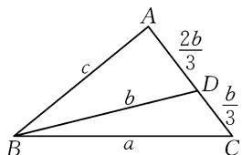
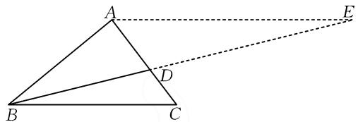

# 一道新高考卷解三角形试题的多解探究

# ● 海东市第三中学 王得山

解三角形是近几年高考数学解答题必考基本题型,故必须熟练掌握.而聚焦解三角形问题的多解探究,有利于帮助我们不断拓宽解题思路,巩固解三角形与其他相关知识在解题中的灵活、综合运用能力,进而提高直观想象能力以及运算求解能力.

# 1 好题采撷

(2021年新高考Ⅰ卷第19题)记△ABC的内角A,B,C的对边分别为a,b,c,已知 $b^{2}=ac$ ,点D在边AC上,且满足 $BD\sin\angle ABC=a\sin C$ .

(1) 证明: BD = b;   
(2) 若 AD=2DC，求 $\cos\angle ABC$ .

# 2 试题分析

本题以三角形为载体,侧重考查解三角形知识在解题中的活用,同时又考查了推理与证明知识.试题亮点体现在没有涉及具体的角度和长度,而是给出了有关线段长度之间满足的关系等式,这种设计具有一定的抽象性,对考生解题能力的要求较高.

# 3 多解探究

# 3.1 第(1)问的探究

证法 1: 在 $\triangle ABC$ 中, 由正弦定理可得 $\frac{b}{\sin\angle ABC} = \frac{c}{\sin C}$ , 所以变形可得 $b \sin C = c \sin \angle ABC$ , 从而 $ab \sin C = ac \sin \angle ABC$ . 又因为 $b^{2} = ac$ , 所以可得到 $ab \sin C = b^{2} \sin \angle ABC$ , 化简得 $a \sin C = b \sin \angle ABC$ . 于是, 结合 $BD \sin \angle ABC = a \sin C$ , 得 $BD \sin \angle ABC = b \sin \angle ABC$ . 又因为 $\sin \angle ABC > 0$ , 所以 BD = b. 故得证.

证法2:根据已知条件 $b^{2}=ac$ 和正弦定理可得 $b\sin\angle ABC=a\sin C$ ，所以再结合 $BD\sin\angle ABC=a\sin C$ ，即得 $BD\sin\angle ABC=b\sin\angle ABC$ 。又因为 $\sin\angle ABC>0$ ，所以化简得BD=b。故得证。

评注: 尽管以上两种不同的证法均利用了正弦定理, 但是对比即知从题目约束条件 $b^{2}=ac$ 出发, 将之看作是 $b \cdot b = a \cdot c$ , 再灵活运用正弦定理, 显然有利于简化证明过程.

# 3.2 第(2)问的探究

因为点 D 在边 AC 上, 所以 $AD + DC = AC = b$ . 又 AD = 2DC, 所以可知 $AD = \frac{2b}{3}$ , $DC = \frac{b}{3}$ . 为了便于分析与解决目标问题, 首先结合题意画出对应的图形,并在对应位置标记相关线段的长度(以字母形式表示),如图1所示.

text_image

A
2b/3
c
b
D
b/3
B
a
C

图1

思路 1: 考虑同角的余弦值相等, 又注意到图形中 $\angle BAD = \angle BAC$ , 而这两个角又可以看作是两个不同三角形的内角, 从而可灵活运用余弦定理探求 a, b, c 之间的倍数关系, 以便顺利求解目标问题.

解法 1: 在 $\triangle ABD$ 中, 根据余弦定理, 可以得到

$$
\cos \angle B A D = \frac {c ^ {2} + \left(\frac {2 b}{3}\right) ^ {2} - b ^ {2}}{2 c \cdot \frac {2 b}{3}} = \frac {9 c ^ {2} - 5 b ^ {2}}{1 2 b c}; \text {在} \triangle A B C
$$

中，由余弦定理，可得 $\cos\angle BAC=\frac{c^{2}+b^{2}-a^{2}}{2bc}$ . 于是，由 $\angle BAD=\angle BAC$ ，可知 $\cos\angle BAD=\cos\angle BAC$ ，即 $\frac{9c^{2}-5b^{2}}{12bc}=\frac{c^{2}+b^{2}-a^{2}}{2bc}$ ，化简得 $6a^{2}+3c^{2}-11b^{2}=0$ 。结合 $b^{2}=ac$ ，可得 $6a^{2}+3c^{2}-11ac=0$ ，分解因式可得 $(3a-c)(2a-3c)=0$ ，所以 3a=c，或 2a=3c。若 3a=c，则结合 $b^{2}=ac$ 得 $b^{2}=3a^{2}$ ，所以 $b=\sqrt{3}a$ ，从而 $a+b=(1+\sqrt{3})a<3a=c$ ，也即 $a+b<c$ ，这与三角形中任意两边之和大于第三边矛盾，故 3a=c 不适合题意。若 2a=3c，则结合 $b^{2}=ac$ 可得 $b^{2}=\frac{3}{2}c^{2}$ ，所以 $b=\frac{\sqrt{6}}{2}c$ ，从而根据 $a=\frac{3}{2}c, b=\frac{\sqrt{6}}{2}c$ 容易检验此时 $\triangle ABC$ 存在。于是，根据余弦定理可以得到 $\cos\angle ABC=\frac{a^{2}+c^{2}-b^{2}}{2ac}=\frac{\left(\frac{3c}{2}\right)^{2}+c^{2}-\frac{3}{2}c^{2}}{3c^{2}}=\frac{7}{12}$ 。综上，可知所求 $\cos\angle ABC=\frac{7}{12}$ 。

评注:该解法中 3a=c 不适合题意,也可如下分析.若 3a=c,则结合 $b^{2}=ac$ 可得 $b^{2}=3a^{2}$ ,所以 b=

$\sqrt{3} a$ ，从而由余弦定理可得 $\cos A = \frac{b^2 + c^2 - a^2}{2bc} = \frac{3a^2 + 9a^2 - a^2}{6\sqrt{3}a^2} = \frac{11\sqrt{3}}{18} > 1$ ，这与余弦函数值不超过1矛盾，故 $3a = c$ 不适合题意.此外，也可根据 $\angle BCD = \angle BCA$ ，分别在 $\triangle BCD$ 和 $\triangle ABC$ 中利用余弦定理加以分析，请读者自行完成.

思路 2: 考虑邻补角的余弦值互为相反数, 又图形中 $\angle ADB$ 与 $\angle BDC$ 互为邻补角, 故可在两个不同的三角形中活用余弦定理探求 a, b, c 之间的倍数关系, 有利于解决目标问题.

解法 2: 在 $\triangle ABD$ 中, 根据余弦定理, 可得

$$
\cos \angle A D B = \frac {b ^ {2} + \left(\frac {2 b}{3}\right) ^ {2} - c ^ {2}}{2 \times b \times \frac {2 b}{3}} = \frac {1 3 b ^ {2} - 9 c ^ {2}}{1 2 b ^ {2}}; \text {在} \triangle B C D
$$

中，由余弦定理，可得 $\cos \angle BDC = \frac{b^2 + \left(\frac{b}{3}\right)^2 - a^2}{2\times b\times\frac{b}{3}} =$ $\frac{10b^2 - 9a^2}{6b^2}$ .于是，根据∠ADB与∠BDC互为邻补角，可知 $\cos \angle ADB = -\cos \angle BDC$ ，即 $\frac{13b^2 - 9c^2}{12b^2} =$ $-\frac{10b^2 - 9a^2}{6b^2}$ ，化简得 $6a^{2} + 3c^{2} - 11b^{2} = 0.$ 以下解题过程，同解法1，略.

评注:该解法的关键是根据图形中邻补角的余弦值互为相反数,构建等量关系.据此,极易想到一种类似的解题思路,即在适当巧作辅助线的基础上,灵活运用“两角互补时,余弦值互为相反数”.如图2所示,过点A作BC的平行线,交BD的延长线于点E,则图2中 $\angle ABC$ 和 $\angle BAE$ 互补,所以可得 $\cos\angle ABC=-\cos\angle BAE$ ,然后分别在 $\triangle ABC$ 和 $\triangle ABE$ 中利用余弦定理分析即可顺利获解,请读者自行完成.

text_image

Geometric diagram showing triangle ABC with extended line to point E, and segment BD drawn

图2

思路 3: 由于本题以平面图形为载体, 且图形中涉及的 3 个三角形的面积具有倍数关系, 据此出发可以分析图形中有哪些具体的特点, 然后加以充分运用, 有助于目标问题的求解.

解法3：因为 $AD = 2DC$ ，所以结合图形可得 $S_{\triangle ABC} = 3S_{\triangle BCD}$ ，于是有 $\frac{1}{2} ac\sin \angle ABC = 3\times \frac{1}{2}\times b\times$ $\frac{b}{3}\sin\angle BDC.$ 再结合 $b^{2}=ac$ ，化简可得 $\sin\angle ABC=\sin\angle BDC.$

于是， $\angle ABC = \angle BDC$ 或 $\angle ABC + \angle BDC = \pi.$

现具体讨论,如下:

①若 $\angle ABC = \angle BDC$ ，则由 $\angle ABC = \angle ABD + \angle DBC, \angle BDC = \angle ABD + \angle A$ ，可得到 $\angle DBC = \angle A.$ 又因为 $\angle DCB = \angle ACB$ ，所以易得 $\triangle CBD \sim \triangle CAB$ ，从而 $\frac{CB}{CA} = \frac{CD}{CB}$ 即 $\frac{a}{b} = \frac{\frac{b}{3}}{a}$ 化简得 $b = \sqrt{3} a.$ 于是，结合 $b^2 = ac$ 可得 $c = 3a.$ 因此， $a + b = (1 + \sqrt{3})a < 3a = c$ ，所以有 $a + b < c$ ，这与三角形中任意两边之和大于第三边矛盾，故 $\angle ABC = \angle BDC$ 不适合题意.

② 若 $\angle ABC + \angle BDC = \pi$ ，则结合 $\angle ADB + \angle BDC = \pi$ 可得 $\angle ABC = \angle ADB$ ，又注意到 $\angle ABC = \angle ABD + \angle DBC, \angle ADB = \angle C + \angle DBC$ ，从而可得 $\angle ABD = \angle C$ . 又因为 $\angle BAD = \angle BAC$ ，所以易得 $\triangle ABD \sim \triangle ACB$ ，从而 $\frac{AB}{AC} = \frac{AD}{AB}$ ，即 $\frac{c}{b} = \frac{\frac{2b}{3}}{c}$ ，化简得 $c^2 = \frac{2b^2}{3}$ . 于是，结合 $b^2 = ac$ ，可得 $2a = 3c$ ，从而可知 $a = \frac{3}{2}c, b = \frac{\sqrt{6}}{2}c$ ，据此易检验知此时 $\triangle ABC$ 存在. 因此，根据余弦定理，可得 $\cos \angle ABC = \frac{a^2 + c^2 - b^2}{2ac} = \frac{\left(\frac{3c}{2}\right)^2 + c^2 - \frac{3}{2}c^2}{3c^2} = \frac{7}{12}$ .

综上, 可知所求 $\cos\angle ABC=\frac{7}{12}$ .

评注:该解法具有较强的综合性,涉及有关平面几何(特别是三角形相似)、解三角形以及三角函数知识的灵活运用,对推理论证能力和运算求解能力的考查比较深刻、到位.

总之，由于本题的创新设计（没有给出具体的角度和长度），从而使得解三角形问题“常考常新”。结合多解探究可知，余弦定理在解题中的运用途径较多——可根据同角的余弦值相等解题，可根据邻补角的余弦值互为相反数解题，亦可根据两角互补时余弦值互为相反数解题。此外，从数学思想方法角度看，本题侧重考查了数形结合思想、分类与整合思想在解题中的综合运用。故通过本题的具体求解，能够较好地培养直观想象、数学运算核心素养。Z