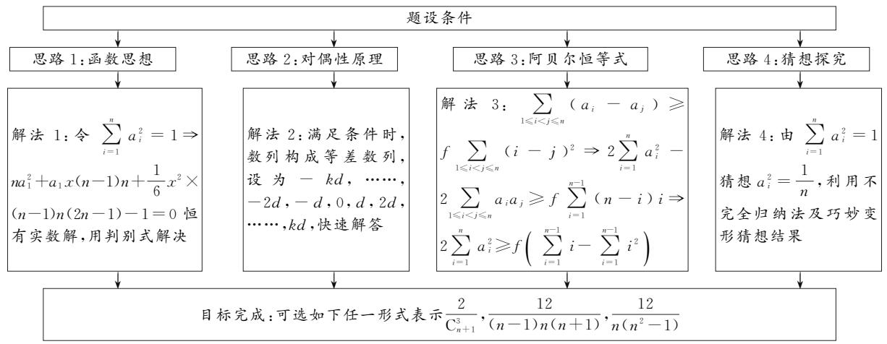
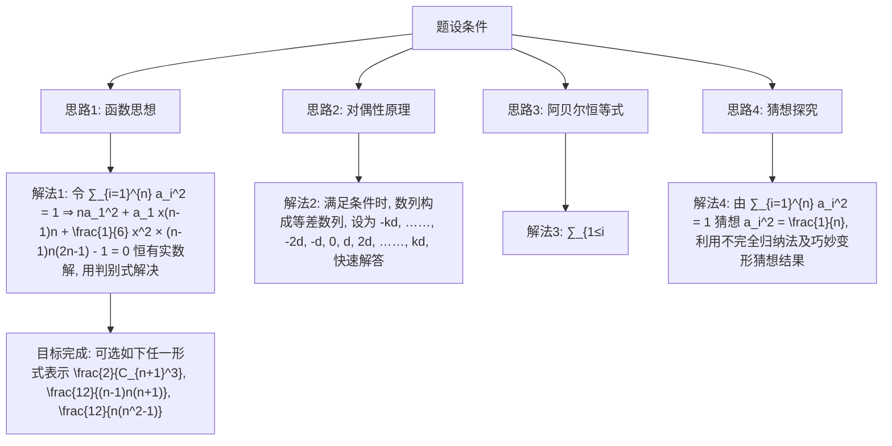
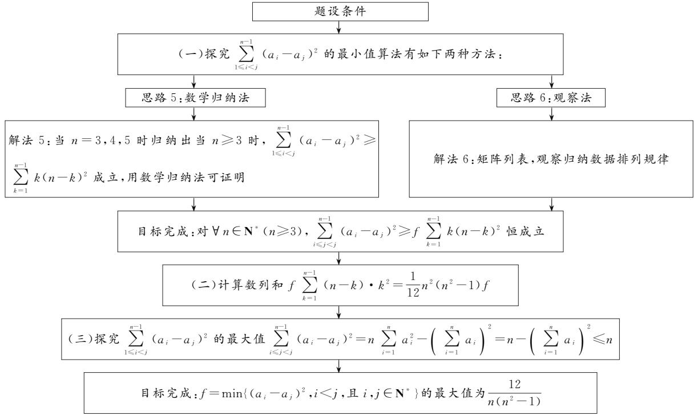
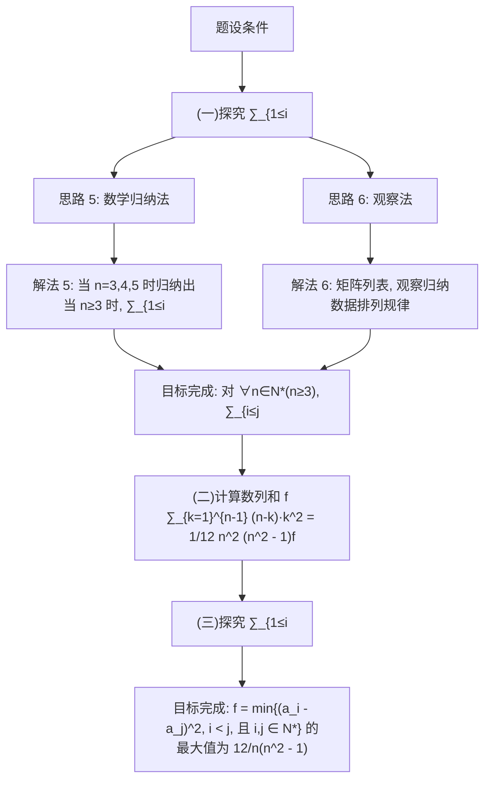

# 2025年命题比赛获奖论文

# 一道竞赛类双重最值九省联考命题的更高维推广

# ● 新疆昌吉州第一中学 王丽 艾文君

摘要:本课题研究目的,服务于高中学生,迎接新高考挑战.研究方法,锁定九省联考试题,深入探究命题意图及试题的深度与广度.研究结果表明,新高考反套路、反刷题意图坚决,提高学生数学素养,解决新问题的能力务必要加强,才能迎接未来的挑战.

关键词: 新高考; 竞赛; 最值函数; 求和; 数列; 思维导图

# 1 试题呈现

(原创题)实数 $a_{i} \in \mathbf{R}(i \in \mathbf{N}^{*})$ ，当 $n \in N^{*}$ ，且 $n \geqslant 3$ 时，满足 $\sum_{i=1}^{n} a_{i}^{2} = 1$ ，记 $f = \min\{(a_{i} - a_{j})^{2}, i < j$ ，且 i, $j \in N^{*}\}$ ，则 $\max f =$ \_\_\_\_ （用自然数 n 表示）.

我们命题小组所呈现的题目,是在深入研究九省联考试题的情况下,锁定的非常有价值的2024年九省联考第14题,不断尝试与分析,领会命题的深度与意图,小组内部提出了命题的不足与修改意见,决定重新命制高标准的试题.

考查目标 本题考查隐身于竞赛类问题的两个函数——max {}与min{}，延续了2024年九省联考第14题的命题风格，同时将两个最值函数与数列求和问题融于一体，更加深入考查了学生解决问题的能力，难度巨大，能很好地鉴别学生数学思维品质.

# 2 命题过程

# 2.1 研究九省联考、锁定命题深度与广度

2024 年九省联考,揭开了高考命题大变革的序幕,国家层面指导高考数学命题的结构发生了翻天覆地的变化,命题的综合度与深度、广度日益增强,彻底断绝套路化的刷题应试策略,引导全国学生向高素质化转型.

本小组成员认真推敲九省联考试题,统一思想,认为第14题值得深入研究.

(2024年九省联考·14)以 $\max M$ 表示数集 $M$ 中最大的数.设 $0 < a < b < c < 1$ ，已知 $b\geqslant 2a$ 或 $a + b\leqslant$ 1，则 $\max \{b - a,c - b,1 - c\}$ 的最小值为

经过我们命题小组成员的认真推敲,分析归纳出该命题所涉及的相关知识考点与不足之处,共同思考如何改进,试图命制出质量更高的压轴好题.

(1)九省联考第14题涉及的相关知识点

本试题涉及竞赛中常用的两个最大( $\max\{\}$ )最小( $\min\{\}$ )函数,研究对象是区间(0,1)内的三个实数a,b,c满足的约束条件 $b\geqslant2a$ 或 $a+b\leqslant1$ ,探究涉及三个实数任两数之差的最大值问题,即求目标函数 $\max\{b-a,c-b,1-c\}$ 的最小值.

(2)九省联考第14题存在的不足之处

九省联考试卷,涉及数列知识的仅有第3题,难度极易.然而数列是高中数学的重要内容,其中数列求和是各类实际问题或高新技术突破的关键.故本命题小组认为,在考查两个最大、最小函数的基础上,应该增加数列求和的考查力度,更有利于优秀人才的选择.

# 2.2 命题深度与广度的扩充

# (1)考查目标锁定

从几个常见幂和公式 $\sum_{i=1}^{n} i = \frac{1}{2} n (n+1) = C_{n+1}^2$ , $\sum_{i=1}^{n} i^2 = \frac{1}{6} n (n+1)(2n+1)$ , $\sum_{i=1}^{n} i^3 = \left[\frac{1}{2} n (n+1)\right]^2 = (C_{n+1}^2)^2$ . 遴选出难度适中的幂和公式 $\sum_{i=1}^{n} i^2 = \frac{1}{6} n \cdot (n+1)(2n+1)$ , 作为我们命题重点考查的对象.

# (2)由考查实数到数列的演化

从九省联考第14题的条件开始变化,0<a<b<c<1→a+b+c=1(0<a<b<c<1)→ $a^{2}+b^{2}+c^{2}=$ $1(-1<a<b<c<1)\rightarrow\sum_{i=1}^{3}a_{i}^{2}=1\rightarrow\sum_{i=1}^{n}a_{i}^{2}=1.$

# (3) 目标实数型最值函数转化为数列型最值函数

为考查幂和公式 $\sum_{i=1}^{n}i^{2}=\frac{1}{6}n(n+1)(2n+1)$ ，将九省联考第14题最值函数 $\max\left\{b-a,c-b,1-c\right\}\rightarrow\min\left\{b-a,c-b\right\}\rightarrow\min\left\{\left|b-a\right|,\left|c-b\right|\right\}\rightarrow\min\left\{(b-a)^{2},(c-b)^{2}\right\}\rightarrow\min\left\{(a_{2}-a_{1})^{2},(a_{3}-a_{2})^{2}\right\}\rightarrow\min\left\{(a_{i}-a_{j})^{2},i<j\right.$ ，且 $i,j\in N^{*}\}$ （目标函数转换为数列型完美的轮换对称式）.

# 3 解题思路分析

为了方便大家理清总体解题思路,首先给出解答思维导图,如图1和如图2所示.

flowchart

图 1

图 2 中的解法总体分三个步骤, 其中第一步有两种思路及对应的解法:  

flowchart

图 2

结合思维导图各解法说明如下：

解法1:对于单调数列,依据对偶性原理可知,当数列中任意相邻两项之差都相等,即数列为等差数列时,目标函数取得最大值.令该数列公差为x,则 $a_{n}=a_{1}+(n-1)x$ ,由 $\sum_{i=1}^{n}a_{i}^{2}=1$ .得 $na_{1}^{2}+a_{1}x(n-1)n+\frac{1}{6}x^{2}(n-1)n(2n-1)-1=0$ ,此式为关于变量 $a_{1}$ 的二次方程,恒有实数解,利用判别式解决问题.

对偶性原理是指数学及数理科学中,两个看似不同的理论、结构或命题之间存在对应关系,经特定变换后性质或真值保持不变的规律.对偶性原理是换一个角度看世界的科学方法论.在数学中,对偶性无处不在.如线性规划问题(原问题)中,都对应着一个对偶问题.原问题求最大值,对偶问题求最小值.几何对偶:在射影几何中,点和线是对偶的.任何关于点的定理,把“点”换成“线”就得到了一个新定理.举一个现实生活中的实例:某班级有一对双胞胎(假定都是女同学),这对双胞胎长相、品行、学习成绩均毫无差别.班级期末要选出三好学生,对这一对双胞胎来说只有两种结果:两人都被选为三好学生,或都落选.不存在一个被

(下转第84页)

$$
\left[ \frac {\ln 2}{1 0}, \frac {\ln 3}{1 2}\right).
$$

评注:本题若采用完全分离参数法,则由于新构造函数的单调性不易借助导数迅速分析获得,导致较难顺利求解.而采用“半分参法”将已知不等式化为 $k(x+1)<\frac{\ln x}{x}$ ,即可转化为一条定曲线与一条含参数直线的交点问题,借助直观图形,即可求出答案.对于不等式整数解个数问题,通常可转化为一条曲线与另一条曲线相交的图象问题,借助直观图形求解.

# 4 一点感悟

综上所述,我们不难发现,参数讨论法,在复杂问题下,参数讨论的标准往往不好确定,导致利用该方法较难顺利求解目标问题.完全分参法,得到的函数往往是分式函数,不易借助导数迅速进行分析,导致较难求解.而采用“半分参法”,曲线对应的函数易于作出图象,临界位置往往是直线与曲线相切,借助数形结合,能直观得出参数范围.由此可见,当采用参数讨论法、完全分参法探究参数范围遇阻时,“半分参法”是一条可行性路径,值得我们去细细品味探究 $^{[2]}$ .

# 参考文献：

[1]刘海涛.例析“半分参”法在解题中的应用[J].高中数学教与学,2021(1):10-12.

[2]严鹏,顾忠.半分参在高中数学分类讨论中的巧用[J].数学学习与研究,2016(23):62.Z

# (上接第55页)

选上三好学生，而另一个落选，因为这种情况不论在学校、班级、家庭都不能被容忍。此时，两人同时就达到了一种平衡，这就是对偶性。再如均值不等式 $\frac{a + b}{2} \geqslant \sqrt{ab}$ 等号成立的条件，当且仅当 $a = b$ ，就是一种对偶。

解法 2: 依据对偶性原理, 准确猜测出当目标函数 $f = \min\{(a_i - a_j)^2, i < j$ , 且 $i, j \in N^*$ 取得最大值时, 将 n 个实数 $a_i \in \mathbf{R} (i \in \mathbf{N}^*)$ , 重新按由小到大的次序排列, 恰好构成等差数列, 设其公差为 d, 可快速准确地解决本题.

解法3: 利用阿贝尔恒等式 $\left(\sum_{i=1}^{n}a_{i}\right)^{2}=\sum_{i=1}^{n}a_{i}^{2}+2\sum_{1\leqslant i<j\leqslant n}a_{i}a_{j}$ 及幂和公式 $\sum_{i=1}^{n}i^{2}=\frac{1}{6}n(n+1)(2n+1)$ ，巧妙放缩，快速达到目标.

解法 4: 由 $\sum_{i=1}^{n} a_{i}^{2}=1$ 猜想满足条件时 $a_{i}^{2}=\frac{1}{n}$ ，对具体的自然数 n，分类变形归纳、猜想出命题结论，体现了考查学生对数学条件的敏锐观察、辨别、猜想能力.

下面两种解法是探究数列和式 $\sum_{1\leqslant i<j}^{n-1}(a_{i}-a_{j})^{2}$ 的最小值：

解法 5: (数学归纳法)为便于问题的顺利解决, 假设 $a_{1} \leqslant a_{2} \leqslant a_{3} \leqslant \cdots \leqslant a_{n}$ (用自然数 n 表示).

从 $n = 3$ 开始，可得出 $\sum_{1\leqslant i <   j}^{3 - 1}(a_i - a_j)^2\geqslant (2\times 1^2 +$ $1\times 2^{2})f$ ，归纳出 $\sum_{1\leqslant i <   j}^{n - 1}(a_i - a_j)^2\geqslant f\sum_{i = 1}^{n - 1}i(n - i)^2.$ 之后利用幂和公式 $\sum_{i = 1}^{n}i^{2} = \frac{1}{6} n(n + 1)(2n + 1)$ ，计算证明 $\sum_{i = 1}^{n - 1}i(n - i)^2 = \frac{1}{12} n^2 (n^2 -1).$

解法 6: (矩阵列表法) 将 $C_{n}^{2}$ 个目标元素 $(a_{i}-a_{j})^{2}$ 排列成上三角形矩阵, 通过计算得 $\sum_{1\leqslant i<j}^{n-1}(a_{i}-a_{j})^{2}\geqslant f\sum_{i=1}^{n-1}i(n-i)^{2}$ . 之后利用幂和公式 $\sum_{i=1}^{n}i^{2}=\frac{1}{6}n(n+1)\cdot$

$(2n+1)$ ，计算证明 $\sum_{i=1}^{n-1} i(n-i)^{2} = \frac{1}{12} n^{2}(n^{2}-1)$ .

试题及下面试题链接的具体解析过程略,可扫码查看.

  
扫码查看

# 4 试题链接

链接 1 （2018 年山东预赛 T13 改编）单位球面上任意一点这 $P(x, y, z)$ ，试求 $f = \min\{(x - y)^{2}, (y - z)^{2}, (z - x)^{2}\}$ 的最大值.

链接 2 （2017 年山东预赛 T5）设 a, b, c 是非负实数，满足 $a + b + c = 8$ , $ab + bc + ca = 16$ ，设 $m = \min\{ab, bc, ca\}$ 的，则 m 的最大值是 \_\_\_\_.

# 5 检测后效果反馈

本原创题由于压轴目标性特别强,在目前高三学生学习任务重、时间紧张的条件下,不适宜大面积测试,因此我们仅选择本校最优秀群体——高三(1)班学生测试,全班40人参加测试,结果如下:

解答过程没有留下有研究价值信息的 17 人,有一点思考过程但运算进行不下去的 5 人,结论不正确但与正确结果沾边的 4 人,结论完全正确的 14 人(占本班 35%,占本校全年级理科 2.37%).

该原创题检测结果,基本吻合我校实际情况,与我们平时观测到的优秀学生的表现基本符合,拉开了优秀学生与普通学生之间的差距. Z