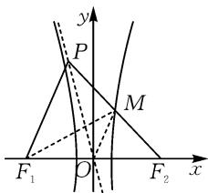

# 一题多解拓思维,多维视角提素养

——一道双曲线离心率的探究

甘肃省敦煌市敦煌中学 唐华

摘要: 平面解析几何更多侧重于代数层面, 研究“数”的基本属性, 平面几何更多侧重于几何层面, 研究“形”的几何特征, 具体解决相关问题时各有侧重点. 结合一道高考模拟题, 基于解析几何的问题场景, 借助平面几何与解析几何的相关数学知识与思想方法, 从“形”或“数”的不同视角来切入与应用, 合理归纳总结, 巧妙变式拓展, 从而得到相应的教学启示.

关键词: 双曲线; 离心率; 解析几何; 平面几何; 变式

高中阶段的解析几何模块知识与综合应用,其知识基础源自初中的平面几何知识.二者不仅存在紧密的继承与发展关系,更在内容上相互交汇融合、方法上相互补充拓展,共同构建起一套完整的知识体系.

在实际解决有关解析几何的综合应用问题时,平面几何思维与解析几何思维都有着各自的优势,前者侧重于几何层面,通过“形”的平面几何特征,利用点、直线、曲线的图形结构,通过直观想象与逻辑推理来综合与应用;后者侧重于代数层面,通过“数”的代数基本属性,化对应的点、直线、曲线及其相互之间的关系等为相关的代数表示,结合数学运算来合理推理与应用等.

# 1 问题呈现

# 1.1 问题出处

问题 （2025 届重庆市普通高中高三第三次适应性考试数学试卷·8）已知双曲线 $\frac{x^{2}}{a^{2}} - \frac{y^{2}}{b^{2}} = 1 (a > 0, b > 0)$ 的左、右焦点分别是 $F_{1}, F_{2}, P$ 在第二象限且在双曲线的渐近线上， $|PF_{2}| = |F_{1}F_{2}|$ ，线段 $PF_{2}$ 的中点在双曲线的右支上，则双曲线的离心率为（）.

A.4

B. $\sqrt{3}+1$

C. $\sqrt{5}$

D.2

# 1.2 问题剖析

此题以双曲线为问题场景,利用双曲线的方程与对应的几何特征,结合双曲线的渐近线上的点和对应的线段之间的相等关系,以及线段中点的位置来设置,进而确定双曲线离心率的值.

该问题结合解析几何的应用场景,基于解析几何的表层叙述,巧妙将平面几何、三角函数、解三角形以及平面解析几何等相关知识加以交汇与融合,全面考查学生数学基础知识的掌握与数学思维方法的应用.

在实际解决此类解析几何的综合应用问题时,可以回归平面几何的本质,从几何视角入手,借助“形”的思维切入；也可以挖掘解析几何的内涵，从代数视角入手，借助“数”的思维切入；还可以合理将“数”与“形”综合来巧妙应用.

其实,无论是从“形”视角的几何直观,还是从“数”视角的数学运算等,无论采用何种思维方式,关键在于挖掘问题的本质与内涵,简化问题场景,有效拓展解题思路,减少不必要的数学运算,优化解题过程,提升数学能力,培养核心素养.

# 2 问题破解

# 2.1 平面几何思维

解法 1: 余弦定理法 1.

设线段 $PF_{2}$ 的中点为 M，连接 $MF_{1}, MO$ ，如图 1.

由 $\left|PF_{2}\right|=\left|F_{1}F_{2}\right|=2c$ , M 为线段 $PF_{2}$ 的中点, 得 $\left|MF_{2}\right|=c$ .

根据双曲线的定义, 可得 $\left|MF_{1}\right|=c+2a.$

text_image

y
P
M
F₁ O F₂ x

图1

而在等腰三角形 $F_{2}PF_{1}$ 中，O, M 分别是腰 $F_{2}P, F_{2}F_{1}$ 的中点，所以 $|OP| = c + 2a$ .

由点 P 在第二象限且在双曲线的渐近线上, 可知 $\tan\angle POF_{2}=-\frac{b}{a}$ , 根据同角三角函数基本关系可得 $\sin\angle POF_{2}=\frac{b}{c}, \cos\angle POF_{2}=-\frac{a}{c}$ .

在 $\triangle OPF_{2}$ 中，结合余弦定理可得 $\cos \angle POF_{2} = \frac{|OP|^{2} + |OF_{2}|^{2} - |PF_{2}|^{2}}{2|OP||OF_{2}|} = \frac{(c + 2a)^{2} + c^{2} - 4c^{2}}{2c(c + 2a)} = \frac{2a^{2} + 2ac - c^{2}}{c(c + 2a)} = -\frac{a}{c}.$

整理可得 $c^{2}-3ac-4a^{2}=0$ ，即 $e^{2}-3e-4=0$ ，解得 e=4 或 e=-1（舍去）.

所以双曲线的离心率为 4. 故选择: A.

解法 2: 余弦定理法 2.

以上部分同方法1，则可得知 $\tan \angle POF_{2} = -\frac{b}{a}$ $\sin \angle POF_{2} = \frac{b}{c},\cos \angle POF_{2} = -\frac{a}{c}.$

设 $OP$ 与 $MF_{1}$ 交于点 $G$ ，则 $G$ 是 $\triangle PF_1F_2$ 的重心，于是 $|GF_1| = \frac{2}{3} (c + 2a), |OG| = \frac{1}{3} (c + 2a)$ .

在 $\triangle OGF_{1}$ 中，结合余弦定理可得 $\cos \angle GOF_{1} = \frac{|OG|^{2} + |OF_{1}|^{2} - |GF_{1}|^{2}}{2|OG||OF_{1}|} = \frac{\frac{1}{9}(c + 2a)^{2} + c^{2} - \frac{4}{9}(c + 2a)^{2}}{2c\times\frac{1}{3}(c + 2a)} =$

$$
\frac {c ^ {2} - 2 a ^ {2} - 2 a c}{c (c + 2 a)} = \frac {a}{c}.
$$

整理可得 $c^{2}-3ac-4a^{2}=0$ ，即 $e^{2}-3e-4=0$ ，解得 e=4 或 e=-1（舍去）.

所以双曲线的离心率为 4. 故选择: A.

点评:立足解析几何问题中相关平面几何的本质,根据题设条件合理作出相应的草图,借助平面几何图形的直观性,数形结合来分析.解决问题时,往往构建与之相应的平面几何图形,在图形直观的基础上,融入解析几何与平面几何的相关知识,以“形”的直观与“数”的抽象来综合应用.基于平面解析思维来处理解析几何问题时,往往离不开平面几何的基本性质,解三角形或平面向量等相关知识.

# 2.2 解析几何思维

解法 3: 代点法.

以上部分同方法1，则可得知 $\tan \angle POF_{2} = -\frac{b}{a}$ $\sin \angle POF_{2} = \frac{b}{c},\cos \angle POF_{2} = -\frac{a}{c}.$

结合 $|OP|=c+2a$ ，根据三角函数的定义可以得知 $P\left(-\frac{a}{c}(c+2a),\frac{b}{c}(c+2a)\right)$ .

而点 $F_{2}(c,0)$ ，于是可得线段 $PF_{2}$ 的中点 $M\left(\frac{c^2 - ac - 2a^2}{2c},\frac{b}{2c} (c + 2a)\right).$

由于线段 $PF_{2}$ 的中点 $M$ 在双曲线的右支上，则有 $\frac{1}{a^2}\left(\frac{c^2 - ac - 2a^2}{2c}\right)^2 -\frac{1}{b^2}\left[\frac{b}{2c} (c + 2a)\right]^2 = 1.$

变形可得 $\left(\frac{c^2 - ac - 2a^2}{2ac}\right)^2 -\left(\frac{c + 2a}{2c}\right)^2 = 1$ ，即 $\left(\frac{e^2 - e - 2}{2e}\right)^2 -\left(\frac{e + 2}{2e}\right)^2 = 1$ ，整理可得 $e^4 -3e^3 -$ $8e^{2} = 0$ ，解得 $e = 4$ 或 $e = -2$ （舍去）或 $e = 0$ （舍去）.

所以双曲线的离心率为 4. 故选择: A.

解法 4: 设点法 1.

由于 P 在第二象限且在双曲线的渐近线上, 因此可设 $P\left(x_{0}, -\frac{b}{a}x_{0}\right)$ .

而 $F_{2}(c,0)$ ，则线段 $PF_{2}$ 的中点 $M\left(\frac{x_{0}+c}{2},-\frac{b}{2a}x_{0}\right)$ .

由于 $\left|PF_{2}\right|=\left|F_{1}F_{2}\right|=2c$ ，结合两点间的距离公式有 $(x_{0}-c)^{2}+\frac{b^{2}}{a^{2}}x_{0}^{2}=4c^{2}$ ，化简并整理可得

$$
\frac {c ^ {2}}{a ^ {2}} x _ {0} ^ {2} - 2 c x _ {0} - 3 c ^ {2} = 0. \tag {①}
$$

而线段 $PF_{2}$ 的中点 M 在双曲线的右支上，则有 $\frac{1}{a^{2}}\left(\frac{x_{0}+c}{2}\right)^{2}-\frac{1}{b^{2}}\left(-\frac{b}{2a}x_{0}\right)^{2}=1$ ，化简并整理可得 $x_{0}=\frac{4a^{2}-c^{2}}{2c}$ .

将 $x_0 = \frac{4a^2 - c^2}{2c}$ 代入①式，得 $\frac{c^2}{a^2} \cdot \left(\frac{4a^2 - c^2}{2c}\right)^2 - 2c \cdot \frac{4a^2 - c^2}{2c} - 3c^2 = 0.$

变形可得到 $(4a^{2}-c^{2})^{2}=4a^{2}(4a^{2}+2c^{2})$ ，则 $(4-e^{2})^{2}=4(4+2e^{2})$ ，整理可得 $e^{4}=16e^{2}$ ，解得e=4或e=-4（舍去）或e=0（舍去）.

所以双曲线的离心率为 4. 故选择: A.

解法 5: 设点法 2.

由于 P 在第二象限且在双曲线的渐近线上, 因此可设 $P\left(x_{0}, -\frac{b}{a}x_{0}\right)$ .

而 $F_{2}(c,0)$ ，则线段 $PF_{2}$ 的中点 $M\left(\frac{x_{0}+c}{2},-\frac{b}{2a}x_{0}\right)$ .

而线段 $PF_{2}$ 的中点 M 在双曲线的右支上，则有 $\frac{1}{a^{2}}\left(\frac{x_{0}+c}{2}\right)^{2}-\frac{1}{b^{2}}\left(-\frac{b}{2a}x_{0}\right)^{2}=1$ ，化简并整理可得 $x_{0}=\frac{4a^{2}-c^{2}}{2c}$ ，则可知点 M 的横坐标为 $\frac{x_{0}+c}{2}=\frac{\frac{4a^{2}-c^{2}}{2c}+c}{2}=\frac{4a^{2}+c^{2}}{4c}$ .

根据双曲线的焦半径公式, 可知 $\left|MF_{2}\right|=e\cdot\frac{4a^{2}+c^{2}}{4c}-a=\frac{c}{a}\cdot\frac{4a^{2}+c^{2}}{4c}-a=c$ , 整理可得 $c^{2}=4ac$ , 即 c=4a, 解得 $e=\frac{c}{a}=4$ .

所以双曲线的离心率为 4. 故选择: A.

点评:立足解析几何的核心内涵,根据题设条件来分析与解决涉及点的坐标、直线的方程以及圆锥曲线的方程等问题,借助设点法、设线法、设方程法等,综合代点法、联立方程法等思维方式来综合与应用,实现问题的突破与求解.解析几何思维注重“数”的抽象,结合代数属性来转化,并结合代数思维来深入数学运算与逻辑推理,实现问题的求解与应用等.

# 3 变式拓展

# 3.1 方式变式

变式 1 已知双曲线 $\frac{x^{2}}{a^{2}} - \frac{y^{2}}{b^{2}} = 1 (a > 0, b > 0)$ 的左、右焦点分别是 $F_{1}, F_{2}, M$ 在第一象限且在双曲线的右支上， $\left|MF_{2}\right| = \left|OF_{2}\right|$ ， $F_{2}M$ 的延长线在第二象限与双曲线的渐近线交于点 P，且点 M 是线段 $PF_{2}$ 的中点，则双曲线的离心率为（）.

A.4

B. $\sqrt{3}+1$

C. $\sqrt{5}$

D.2

# 3.2 类比变式

变式 2 [2025 年 1 月浙江省强基联盟高三(语数)联考数学试题]已知双曲线 $C: \frac{x^{2}}{a^{2}} - \frac{y^{2}}{b^{2}} = 1 (a > 0, b > 0)$ 的左、右焦点分别为 $F_{1}, F_{2}$ ，过 $F_{2}$ 的直线交双曲线 C 的右支于 A, B 两点，若 $2|AF_{1}| = 5|AF_{2}|$ ，点 M 满足 $\overrightarrow{F_{1}M} = \frac{5}{2}\overrightarrow{MF_{2}}$ ，且 $AM \perp F_{1}B$ ，则双曲线 C 的离心率为 \_\_\_\_.

  
扫码查看

上述变式的答案分别为选项 A, $\frac{\sqrt{65}}{5}$ . 变式 2 的解析可扫码查看.

# 4 教学启示

在实际解决解析几何的综合应用问题时,基于相关问题的本质,回归解析几何的内涵,从平面几何视角来切入与应用,从“形”的视角来合理几何推理与直观想象;或依托平面几何的特征,从解析几何视角来切入与应用,从“数”的视角来合理数学运算与逻辑推理等.

解决具体问题时,数学思维方式的变化,或借助“形”的直观,或利用“数”的属性,或综合二者之间的交汇与融合等,都是解决平面解析几何综合应用问题的基本思维方式,也是高考命题的一个重要视角.

实际解题与综合应用中,借助平面解析几何方法来分析与处理时,平面解析几何思维方式更加依赖于相关问题的数学运算,更侧重于“数”的基本属性——代数运算;而借助平面几何方法来分析与处理时,平面几何思维方式更加注重相关图形的直观想象,更注重于“形”的几何特征——几何直观.Z

# (上接第66页)

# 3 试题链接

(2025 届广州市高三调研第 17 题) 已知椭圆 C: $\frac{x^{2}}{a^{2}} + \frac{y^{2}}{b^{2}} = 1 (a > b > 0)$ 的左、右焦点分别为 $F_{1}, F_{2}$ ，离心率为 $\frac{\sqrt{3}}{2}$ ，长轴长与短轴长之和为 6.

(1)求椭圆 C 的方程;

(2)已知 $M(-1,0)$ , $N(1,0)$ ，点 P 为椭圆 C 上一点，设直线 PM 与椭圆 C 的另一个交点为 B，直线 PN 与椭圆 C 的另一个交点为 D。设 $\overrightarrow{PM} = \lambda_{1} \overrightarrow{MB}, \overrightarrow{PN} = \lambda_{2} \cdot \overrightarrow{ND}$ 。求证：当点 P 在椭圆 C 上运动时， $\lambda_{1} + \lambda_{2}$ 为定值。

(1) 解析: 由题意得 $\frac{c}{a} = \frac{\sqrt{3}}{2}, 2a + 2b = 6, a^{2} = b^{2} + c^{2}$ ，解得 a = 2, b = 1, $c = \sqrt{3}$ ，所以椭圆 C 的方程为 $\frac{x^{2}}{4} + y^{2} = 1$ .

(2) 证明: 设 $P(x_0, y_0), B(x_1, y_1), D(x_2, y_2)$ , 直线 $PM$ 方程为 $x = \frac{x_0 + 1}{y_0} y - 1$ , 与椭圆 $C$ 方程联立, 消去 $x$ 得 $\left[4 + \frac{(x_0 + 1)^2}{y_0^2}\right] y^2 - \frac{2(x_0 + 1)}{y_0} y - 3 = 0$ , 由韦

达定理可知 $y_0y_1 = -\frac{3y_0^2}{5 + 2x_0}$ ，所以 $y_{1} = -\frac{3y_{0}}{5 + 2x_{0}}.$ 同理可得 $y_{2} = -\frac{3y_{0}}{5 - 2x_{0}}.$ 不妨设 $y_0 > 0$ ，进一步可得 $\lambda_1+$ $\lambda_2 = \frac{y_0}{y_1} -\frac{y_0}{y_2} = \frac{5 + 2x_0}{3} +\frac{5 - 2x_0}{3} = \frac{10}{3}.$

# 4 试题探源

（湘教版高中数学选择性必修第一册第149页第11题）已知过抛物线 $y^{2}=2px(p>0)$ 的焦点F的直线交抛物线于 $A(x_{1},y_{1}),B(x_{2},y_{2})$ 两点，求证：

(1) $y_{1}y_{2}=-p^{2},x_{1}x_{2}=\frac{p^{2}}{4};$

(2)以 AB 为直径的圆与抛物线的准线相切.

数学教育家波利亚 $^{[1]}$ 曾说：“没有任何一道题目是彻底完成了的，总还会有些事情可以做。”教师在日常的解题教学中应着力引导学生深入剖析数学问题的本质，追溯其根源，进而实现对问题更深层次的理解，从而激发学生数学解题的兴趣，有效提升学生的数学素养。

# 参考文献：

[1] 波利亚. 怎样解题: 数学思维的新方法 [M]. 涂泓, 冯承天, 译. 上海: 上海科技教育出版社, 2002. Z