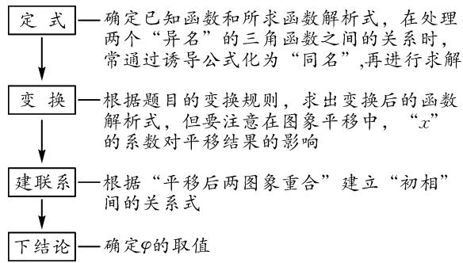
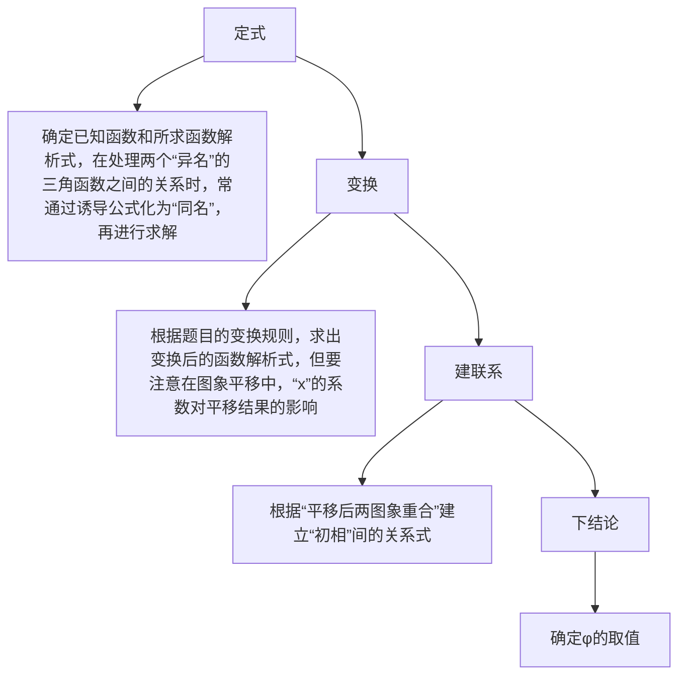
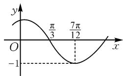

# 三角函数图象平移变换的求解探究

# ● 江苏省东海高级中学 王江苏

摘要:三角函数图象的平移变换,是三角函数图象与性质中最为重要的一个考点.文中结合三角函数的图象的平移变换基础知识,给出了解决三角函数图象平移变换问题的“三看”策略、变换方式、求解模型以及应用实例,剖析三角函数的图象的平移变换的技巧与规律.

关键词:三角函数;图象;性质;平移变换;应用

三角函数图象的平移变换是学习三角函数图象与性质部分的重点与难点之一,关键是正确把握三角函数图象的平移方向与长度,以及与平移相关的一些细节与技巧,并能加以正确应用.

# 1 三角函数图象的平移变换问题“三看”策略

(1)一看要求——图象平移变换的移动要求.确定参与平移变换的函数(主要是正弦型函数与余弦型函数).  
(2)二看方向——图象平移变换的移动方向.确定“正向左,负向右”平移变换的左右方向.  
(3)三看单位——图象平移变换的移动单位.确定平移变换的单位长度.

# 2 三角函数图象的平移变换问题变换方式

在三角函数图象的平移变换过程中,基于变换模型,往往可以从以下等价变换形式展开:

(1) 先相位变换

$$
y = \sin x \xrightarrow [ \text {平移} | \varphi | \text {个单位长度} ]{\text {向左} (\varphi > 0) \text {或向右} (\varphi <   0)} y = \sin (x + \varphi)
$$

$$
\frac {\text {横坐标变为原来的} \frac {1}{\omega} (\omega > 0) \text {倍}}{\text {纵坐标不变}} y = \sin (\omega x + \varphi)
$$

$$
\frac {\text {纵坐标变为原来的} A (A > 0) \text {倍}}{\text {横坐标不变}} \rightarrow y = A \sin (\omega x + \varphi).
$$

(2)先周期变换

$$
y = \sin x \xrightarrow [ \text {纵坐标不变} ]{\text {横坐标变为原来的} \frac {1}{\omega} (\omega > 0) \text {倍}} y = \sin \omega x
$$

$$
\frac {\text {向左(当} \varphi > 0) \text {或向右(当} \varphi <   0)}{\text {平移} \left| \frac {\varphi}{\omega} \right| \text {个单位长度}} y = \sin (\omega x + \varphi)
$$

$$
\xrightarrow [ \text {横坐标不变} ]{\text {纵坐标变为原来的} A (A > 0) \text {倍}} y = A \sin (\omega x + \varphi).
$$

在实际的三角函数图象的平移变换过程中,先相位变换与先周期变换是不一样的,二者之间不要混淆,要正确区别,分别对待.

# 3 三角函数图象的平移变换问题求解模型

解决三角函数图象平移变换问题的模型示意图如图 1:

flowchart

图1

# 4 三角函数图象的平移变换问题实例

# 4.1 平移问题

例 1 如图 2 所示, 已知函数 $f(x)=\sin(\omega x+\varphi)$ (其中 $|\varphi|<\frac{\pi}{2},\omega>0$ ) 的图象, 为了得到函数 $y=\sin\omega x$ 的图象,

line

| x | y |
|---|---|
| π/3 | π/3 |
| 7π/12 | 7π/12 |
| -1 | -1 |

图2

保持函数图象上所有点的纵坐标不变,只需将函数 $y=f(x)$ 的图象向 \_\_\_\_ 平移 \_\_\_\_ 个单位长度.

分析:先根据题目中的三角函数图象,合理确定三角函数的解析式,对比图象平移前后函数解析式,结合三角函数图象平移变换的关系来确定平移方向与单位.

解析:由函数 $y=f(x)$ 的图象, 可知 $\frac{T}{4}=\frac{7\pi}{12}-\frac{\pi}{3}$ ,
解得 $T=\pi$ .所以 $T=\pi=\frac{2\pi}{|\omega|}$ .又 $\omega>0$ ,则 $\omega=2$ .

由 $f\left(\frac{\pi}{3}\right) = 0$ ，得 $2\times \frac{\pi}{3} +\varphi = k\pi (k\in \mathbf{Z})$ ，即 $\varphi =$

$k\pi-\frac{2\pi}{3}(k\in\mathbf{Z})$ . 又 $|\varphi|<\frac{\pi}{2}$ ，则 $\varphi=\frac{\pi}{3}$ .

所以 $f(x) = \sin \left(2x + \frac{\pi}{3}\right) = \sin \left[2\left(x + \frac{\pi}{6}\right)\right]$ .

于是只需将函数 $y = f(x)$ 的图象向右平移 $\frac{\pi}{6}$ 个单位长度，即可得 $y = \sin 2x$ 的图象。故填：右； $\frac{\pi}{6}$ 。

# 4.2 参数问题

例 2 为了得到函数 $y=\sin\left(x+\frac{\pi}{3}\right)$ 的图象, 可将函数 $y=\sin x$ 的图象向左平移 m 个单位长度, 或将其图象向右平移 n 个单位长度 (其中参数 m, n 均为正数), 则代数式 $|m-n|$ 的最小值是 \_\_\_\_.

分析:根据题设条件,通过三角函数 $y=\sin x$ 的图象向左与向右平移得到对应三角函数的解析式,进而确定对应参数的表达式,再进一步通过相关参数关系式的运算确定其最值.

解析:由题意可知, $m=\frac{\pi}{3}+2k_{1}\pi,k_{1}$ 为非负整数, $n=-\frac{\pi}{3}+2k_{2}\pi,k_{2}$ 为正整数.

于是 $|m - n| = \left|\frac{2\pi}{3} + 2(k_1 - k_2)\pi\right|$ ，所以当 $k_{1} = k_{2}$ 时， $|m - n|_{\min} = \frac{2\pi}{3}$ . 故填： $\frac{2\pi}{3}$ .

# 4.3 性质问题

例 3 已知最小正周期是 $\pi$ 的函数 $f(x)=\sin(\omega x+\varphi)$ (其中 $|\varphi|<\frac{\pi}{2},\omega>0$ )，将其图象向右平移 $\frac{\pi}{3}$ 个单位长度，由此得到平移后函数的图象关于坐标原点 O 对称，则函数 $f(x)$ 的图象的对称性符合（）.

A. 关于点 $\left(\frac{\pi}{12}, 0\right)$ 对称  
B. 关于点 $\left(\frac{5\pi}{12}, 0\right)$ 对称  
C. 关于直线 $x = \frac{\pi}{12}$ 对称  
D. 关于直线 $x=\frac{5\pi}{12}$ 对称

分析:先利用三角函数的最小正周期确定参数 $\omega$ 的值,然后根据变换得到函数 $g(x)$ ,再结合其图象关于原点对称确定 $\varphi$ 的值,进而利用函数的解析式分析其图象性质.

解析:由于 $f(x)$ 的最小正周期为 $\pi$ ，则有 $\frac{2\pi}{\omega} = \pi$ ，

即 $\omega = 2$

结合题中条件的平移变换,可得到函数 $g(x)=\sin\left[2\left(x-\frac{\pi}{3}\right)+\varphi\right]=\sin\left(2x-\frac{2\pi}{3}+\varphi\right)$ .

而函数 $g(x)$ 的图象关于坐标原点 $O$ 对称，则 $-\frac{2\pi}{3} + \varphi = k\pi, k \in \mathbf{Z}$ ，即 $\varphi = \frac{2\pi}{3} + k\pi, k \in \mathbf{Z}$ .

又 $|\varphi| < \frac{\pi}{2}$ , 则有 $\left|\frac{2\pi}{3} + k\pi\right| < \frac{\pi}{2}$ , 结合 $k \in \mathbf{Z}$ 可得 $k = -1$ , 所以 $\varphi = -\frac{\pi}{3}$ , 则 $f(x) = \sin \left(2x - \frac{\pi}{3}\right)$ .

当 $x=\frac{\pi}{12}$ 时， $2x-\frac{\pi}{3}=-\frac{\pi}{6}$ ，则知选项 A, C 错误；当 $x=\frac{5\pi}{12}$ 时， $2x-\frac{\pi}{3}=\frac{\pi}{2}$ ，则知选项 B 错误，选项 D 正确。故选择：D.

# 4.4 综合问题

例 4 （2024 届安徽省蚌埠市高考数学二检试卷）（多选题）将函数 $f(x)=\cos(\omega x+\varphi)\left(\omega>0,|\varphi|<\frac{\pi}{2}\right)$ 的图象上所有点向右平移 $\frac{\pi}{3}$ 个单位长度，在保持纵坐标不变的情况下进一步将对应横坐标伸长为原来的 2 倍，由此得到函数 $y=g(x)$ 的图象。若 $y=g(x)$ 为奇函数，且函数 $y=g(x)$ 的最小正周期为 $\pi$ ，则下列说法中正确的是（）.

A. 函数 $f(x)$ 的图象关于点 $\left(\frac{\pi}{6}, 0\right)$ 中心对称  
B. 函数 $f(x)$ 在区间 $\left(0, \frac{\pi}{4}\right)$ 上单调递减  
C. 不等式 $g(x) \geqslant \frac{1}{2}$ 的解集为 $\left[k\pi - \frac{5\pi}{12}, k\pi - \frac{\pi}{12}\right]$ $(k \in \mathbf{Z})$   
D. 方程 $f\left(\frac{x}{2}\right) = g(x)$ 在 $(0, \pi)$ 上有 2 个解

分析:由三角函数图象的平移变换来确定 $y = g(x)$ 的解析式,借助该函数的最小正周期与奇函数性质确定相应的参数值,进而确定函数 $g(x)$ 与 $f(x)$ 的解析式,且结合选项加以逐一分析.

解析: 答案为 ACD. (扫码看具体解析)

三角函数图象的平移变换是学习三角函数的重点与难点之一,关键是正确把握相应三角函数及其图象的两个方面——平移方向(左与右)

  
扫码查看

以及平移长度,同时结合平移变换时的“三看”(看平移要求,看平移方向,看平移单位),清晰把握平移的相关信息,才能真正加以正确应用. Z