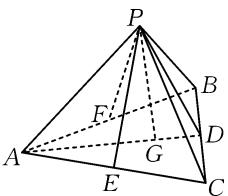
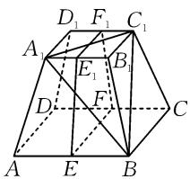
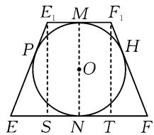
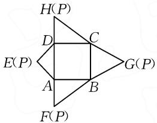
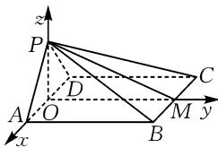

# 例讲点面距离的四种求法

# 广东省博罗县博罗中学 孙晓敏

摘要: 点面距离是高中立体几何部分的重要考点. 本文中重点讲解四种点面距离的求法, 包括定义法、等体积法、向量法以及平行转化法, 并结合习题展示这四种方法的应用, 以供参考.

关键词:高中数学;立体几何;点面距离;求法

点面距离是高中立体几何中的重要概念, 是空间中一个点到一个平面的最短距离 $^{[1]}$ . 由于相关习题创设的情境不同, 因此解题时应注重解题方法的选择. 其中定义法、等体积法、向量法以及平行转化法在解题中较为常用, 应根据已知条件合理选择, 力求快速求出正确结果.

# 1 定义法

定义法是解决空间点面距离的基本方法.由点面距离的定义易知,过点向平面作垂线,该点与垂足之间线段的长度即为所求.解题时,一方面确定过点且和平面垂直的线段,一般需要根据题意作辅助线;另一方面,运用三角函数、勾股定理、正弦定理、余弦定理等,结合已知条件求出线段的具体值.

例 1 已知在三棱锥 P-ABC 中, AB = AC = AP = 1, BC = $\sqrt{2}$ , 点 P 到 AC, AB 的距离均为 $\frac{\sqrt{3}}{2}$ , 则点 P 到平面 ABC 的距离为 \_\_\_\_.

解析: 过点 P 作 AC, AB 的垂线, 垂足分别为 E, F. 取 BC 的中点 D, 连接 PD, AD. 过点 P 作 AD 的垂线, 垂足为 G, 如图 1 所示.

text_image

Geometric diagram of a pyramid with labeled vertices and internal points, used for spatial geometry problems.

图1

$$
\begin{array}{r l} & {\text { 根   据   题   意 }, \text { 可   知 } \angle P E A =} \\ & {\angle P F A = \frac {\pi}{2}, P F = P E = \frac {\sqrt {3}}{2},} \end{array}
$$

$PA=PA$ ，则 $\triangle PAE\cong\triangle PAF(HL)$ ，可得 AE=AF。
由勾股定理，知 $AE = AF = \sqrt{1^{2} - \left(\frac{\sqrt{3}}{2}\right)^{2}} = \frac{1}{2}$ . 由 AB = AC = 1，可知点 E 和点 F 分别为 AC 和 AB 的中点，即 $EC = FB = \frac{1}{2}$ .

在 $\triangle PEC$ 和 $\triangle PFB$ 中，由勾股定理可得 $PC = PB = \sqrt{\left(\frac{1}{2}\right)^2 + \left(\frac{\sqrt{3}}{2}\right)^2} = 1$ ，则 $\triangle PBC$ 为等腰三角形.由 D 为 BC 的中点, 知 $PD \perp BC$ , 又易知 $AD \perp BC$ , $PD \cap AD = D$ , 则 $BC \perp$ 平面 PAD, 所以平面 $ABC \perp$ 平面 PAD.

又平面 $ABC \cap$ 平面 PAD = AD, $PG \subset$ 平面 PAD, $PG \perp AD$ , 则 $PG \perp$ 平面 ABC, 所以 PG 的长即为所求.

又由 $BC = \sqrt{2}$ ，易得 $\triangle BAC$ 和 $\triangle PBC$ 皆为直角三角形，则 $AD = PD = \sqrt{1^2 - \left(\frac{\sqrt{2}}{2}\right)^2} = \frac{\sqrt{2}}{2}$ ，又 $AP = 1$ ，可得 $AD^2 + PD^2 = PA^2$ ，则 $PD \perp AD$ ，显然点 $D$ 和点 $G$ 重合。因此， $PG = \frac{\sqrt{2}}{2}$ ，即点 $P$ 到平面 $ABC$ 的距离为 $\frac{\sqrt{2}}{2}$ 。

点评:该题主要考查直线与平面垂直、勾股定理、等腰三角形的性质等.解题的关键在于借助已知条件以及勾股定理,确定点D和点G重合,PG的长即为点P到平面ABC的距离.

# 2 等体积法

求空间点面距离时等体积法较为常用 $^{[2]}$ . 解题需要根据已知条件求出对应空间几何体的体积以及对应平面的面积, 借助同一空间几何体的体积相等构建方程. 其中借助已知条件理顺点、线、面之间的关系, 熟练掌握对应空间几何体的体积计算公式是解题的关键.

例 2 在正四棱台 $ABCD-A_{1}B_{1}C_{1}D_{1}$ 中，AB=4, $A_{1}B_{1}=2$ ，若存在球 O 和该四棱台的各个面均相切，则点 $A_{1}$ 到平面 $B_{1}BCC_{1}$ 的距离为（）.

A. $\frac{4\sqrt{2}}{3}$ B. $\sqrt{3}$ C. $\frac{4\sqrt{5}}{5}$ D. $\frac{8\sqrt{17}}{17}$

解析: 在正四棱台 $ABCD-A_{1}B_{1}C_{1}D_{1}$ 中, 设 AB, CD, $A_{1}B_{1}$ , $C_{1}D_{1}$ 的中点分别为 E, F, $E_{1}$ , $F_{1}$ , 连接 EF, $FF_{1}$ , $F_{1}E_{1}$ , $E_{1}E$ , 如图 2 所示.

易知四边形 $EFF_{1}E_{1}$ 的内切圆为正四棱台内切球 O 的截面大圆. 设四边形 $EFF_{1}E_{1}$ 和内切圆 O 的切点分别为 P, M, H, N, 如图 3 所示.

text_image

D₁ F₁ C₁
A₁ E₁ B₁
D F C
A E B

图2

text_image

E₁ M F₁
P H
O
E S N T F

图3

由题意易知,四边形 $EFF_{1}E_{1}$ 为等腰梯形,且 $E_{1}F_{1}=2,EF=4.$

由圆的性质可得 $EE_{1} = PE_{1} + PE = E_{1}M + EN = \frac{1}{2} (E_{1}F_{1} + EF) = 3.$ 过点 $E_{1}, F_{1}$ 分别作 $EF$ 的垂线，垂足分别为 $S, T$ ，则 $E_{1}F_{1} = ST = 2, ES = TF = 1.$ 在 $\triangle E_{1}ES$ 中，由勾股定理可得 $E_{1}S = \sqrt{E_{1}E^{2} - ES^{2}} = \sqrt{3^{2} - 1^{2}} = 2\sqrt{2}$ ，即该正四棱台的高 $h = MN = 2\sqrt{2}$ .

设点 $A_{1}$ 到平面 $B_{1}BCC_{1}$ 的距离为 d，由 $V_{A_{1}-BB_{1}C_{1}} = V_{B-A_{1}B_{1}C_{1}}$ ，可得 $\frac{1}{3}d \cdot S_{\triangle BB_{1}C_{1}} = \frac{1}{3}h \cdot S_{\triangle A_{1}B_{1}C_{1}}$ ，则 $d = \frac{h \cdot S_{\triangle A_{1}B_{1}C_{1}}}{S_{\triangle BB_{1}C_{1}}}$ .

易得 $S_{\triangle BB_1C_1} = S_{\triangle A_1B_1B} = \frac{1}{2}\times 2\times 3 = 3,S_{\triangle A_1B_1C_1} =$ $\frac{1}{2}\times 2\times 2 = 2$ ，则 $d = \frac{2\sqrt{2}\times 2}{3} = \frac{4\sqrt{2}}{3}$ 即点 $A_{1}$ 到平面 $B_{1}BCC_{1}$ 的距离为 $\frac{4\sqrt{2}}{3}$ .故选择：A.

点评:该题主要考查正四棱台、球以及勾股定理等知识.解题的关键在于要熟悉正四棱台的性质,通过立体几何图形向平面图形的转化,明确线段之间的关系,求出正四棱台的高,以三棱锥 $B-A_{1}B_{1}C_{1}$ 为载体列体积相等方程.

# 3 向量法

向量法是解决高中数学立体几何问题的重要方法,用于解答点面距离效果显著.解题的关键在于建立合适的空间直角坐标系,求出相关向量以及平面的法向量,借助向量的坐标运算计算出结果.

例 3 如图 4 为四棱锥 P-ABCD 的平面展开图, 其中四边形 ABCD 是边长为 2 的正方形, $\triangle ADE$ 是以 AD 为斜边的等腰直角三角形, 且 $\angle HDC = \angle FAB = 90^{\circ}$ , 则该四棱锥外接球的球心到平面 PBC 的距离为 \_\_\_\_.

text_image

H(P)
D
C
E(P)
A
B
G(P)
F(P)

图 4

解析: 取 AD, BC 的中点分别为 O, M, 连接 PO, OM, PM.

由四边形 ABCD 为正方形, 得 $CD \parallel AB \parallel OM$ . 由 $\angle HDC = \angle FAB = 90^{\circ}$ , 知 $CD \perp PD, AB \perp PA$ . 易得 $CD \perp PA$ , 又 $PA \cap PD = P$ , 所以 $DC \perp$ 平面 PAD, 而 $PO \subset$ 平面 PAD, 则 $DC \perp PO$ , 所以 $OM \perp PO$ .

由 $\triangle ADE$ 是以AD为斜边的等腰直角三角形,知O为AD的中点,则 $AD\perp PO$ ,于是以O为原点,建立如图5所示的空间直角坐标系.

text_image

z
P
D
A O C
M y
x
B

图 5

由 AD=2, $\triangle ADE$ 是以 AD 为斜边的等腰直角三角形，得 $AP=PD=\sqrt{2}$ ，则 PO=1，则 $P(0,0,1)$ ， $B(1,2,0)$ ， $C(-1,2,0)$ ，则 $\overrightarrow{PB}=(1,2,-1)$ ， $\overrightarrow{PC}=(-1,2,-1)$ 。设平面 PBC 的一个法向量 $m=(x,y,z)$ ，则 $\left\{\begin{aligned}\overrightarrow{PB}\cdot m=0,\\ \overrightarrow{PC}\cdot m=0,\end{aligned}\right.$ 即 $\left\{\begin{aligned}x+2y-z=0,\\ -x+2y-z=0.\end{aligned}\right.$ 令 z=2，则可得 x=0, y=1，所以 $m=(0,1,2)$ 。

设该四棱锥外接球球心 $N(0,1,a)$ ，则 $PN = NB$ ，即 $\sqrt{0 + 1^2 + (a - 1)^2} = \sqrt{1 + 1^2 + (-a)^2}$ ，解得 $a = 0$ ，则球心 $N(0,1,0)$ 。所以 $\overrightarrow{NP} = (0, -1, 1)$ ，则点 $N$ 到平面 $PBC$ 的距离 $d = \frac{|\overrightarrow{NP} \cdot m|}{|m|} = \frac{|0 - 1 + 2|}{\sqrt{0 + 1^2 + 2^2}} = \frac{\sqrt{5}}{5}$ ，即该四棱锥外接球球心到平面 $PBC$ 的距离为 $\frac{\sqrt{5}}{5}$ 。

点评:该题主要考查四棱锥的性质、球、空间向量的坐标运算等知识.解题需要注意以下几点.其一,运用已知条件确定线段之间的垂直关系,构建合理的空间直角坐标系;其二,结合已知条件中的线段长度确定对应点的坐标,求出平面PBC的一个法向量m,并设出四棱锥外接球球心N,结合球的性质构建方程,求出球心坐标;其三,运用对应的公式,通过向量之间的坐标运算求得结果.

# 4 平行转化法

高中数学中求点面距离如直接求解难度较大,可以将点转化到与平面平行直线上的其他点,而后借助已知条件、几何图形的性质,计算相关线段的长度,建立已知条件与要求线段之间的关系,求出最终结果.

例 4 已知四棱锥 P-ABCD 的底面为矩形，且各顶点均在球 O 的球面上， $PA \perp AD, PA = AB, PB = \sqrt{2} AB, BC = 2\sqrt{2}$ ，若球 O 的体积为 $\frac{32\pi}{3}$ ，则棱 PB 的中点到平面 PCD 的距离为 \_\_\_\_。（下转第 93 页）

形边长为 2，则 $B(2,2,0)$ ， $F(1,2,0)$ ， $D(0,0,0)$ .

作 $PH \perp EF$ 于点H，由(1)易得 $PH \perp$ 平面ABFD.

由(1)可得 $DE \perp PE$ ，又 DP = 2, ED = 1，所以 $PE = \sqrt{3}$ .

又 $PE = \sqrt{3}, EF = 2$ ，易知 $PE \perp PF$ ，则 $PH = \frac{\sqrt{3}}{2}, EH = \frac{3}{2}$ 故 $P\left(1, \frac{3}{2}, \frac{\sqrt{3}}{2}\right)$ .

易得 $\overrightarrow{DP}=\left(1,\frac{3}{2},\frac{\sqrt{3}}{2}\right)$ .

平面 ABFD 的法向量可取 $\boldsymbol{n}=(0,0,1)$ . 设直线 DP 与平面 ABFD 所成角为 $\theta$ , 则

$$
\sin \theta = | \cos \langle \overrightarrow {D P}, \boldsymbol {n} \rangle | = \frac {| \overrightarrow {D P} \cdot \boldsymbol {n} |}{| \overrightarrow {D P} | | \boldsymbol {n} |} = \frac {\sqrt {3}}{4}.
$$

将立体几何中的线面关系、空间角、体积等知识点整合复习，采用开放式问题和一题多解的方式，培养学生的空间想象和创造性思维素养[3].解题起点为分析折痕性质及关键点的移动规律，结合翻折过程中的不变量与题目新增条件，可推导更多隐藏线面关系，进而证明结论并完成计算.过程注重逻辑连贯与推理严密,动态翻折构想需转化为分步严谨的静态几何论证.面对翻折问题,需保持清晰思路,聚焦“确定关键点位置”与“利用不变关系”,通过静态论证转化动态问题,简化求解过程.

翻折问题是立体几何动态问题的典型类型,解题思路为“以静制动”.抓取平行、垂直、长度等不变关系,明确关键点位置,即可将复杂动态过程转化为熟悉的静态几何模型.教学中需引导学生掌握该静态化处理方法,结合典型例题剖析,提升空间想象与逻辑推理能力,以应对高考中立体几何动态问题的考查.

# 参考文献：

[1] 刘旭飞. 基于数学问题链的主题教学——以立体几何的翻折问题为例 [J]. 中学数学研究 (华南师范大学版), 2024(18): 20-22.

[2]齐淑珍.立体几何中的“动态问题”及应用[J].数学之友，2024(7):36-37.

[3]张默.基于直观想象素养的高三复习课的实践与思考——以《立体几何中的动态翻折》为例[J].数学之友，2023,37(21):28-31.Z

# (上接第86页)

解析:由 PA=AB, $PB=\sqrt{2}AB$ ，结合勾股定理的逆定理易得 $PA\perp AB$ ，又 $PA\perp AD$ ， $AB\cap AD=A$ ，则 $PA\perp$ 平面 ABCD。由 ABCD 为矩形，得 $AB\parallel CD$ ，则 $PA\perp CD$ ，易知棱 PC 为球 O 的直径。

由 $CD \perp AD, AD \cap PA = A$ ，得 $CD \perp$ 平面 PAD.

如图 6 所示, 过点 A 作 PD 的垂线, 垂足为 G, 取 PB 和 PA 的中点分别为点 E、点 F, 连接 EF, 则 $AG \perp PD, EF \parallel AB$ . 又 $AG \subset$ 平面 PAD, 则 $CD \perp AG$ , 而 $PD \cap CD = P$ , 则 $AG \perp$ 平面 PCD.

text_image

Geometric diagram of a pyramid with labeled vertices and internal points, used for spatial geometry problems.

图 6

又 $EF \not\subset$ 平面 $PCD$ , 因此要求点 $E$ 到平面 $PCD$ 的距离, 即求点 $F$ 到平面 $PCD$ 的距离, 易得该距离为 $\frac{1}{2} AG$ .

设球 O 的半径为 R，根据球 O 的体积为 $\frac{32\pi}{3}$ 可以得到 $\frac{4}{3}\pi R^{3} = \frac{32\pi}{3}$ ，进一步可解得 R = 2。易知 $R = \frac{\sqrt{AB^{2} + AD^{2} + AP^{2}}}{2} = \frac{\sqrt{(2\sqrt{2})^{2} + 2AP^{2}}}{2} = 2$ ，解得 AP = 2。在 Rt△PAD 中，结合勾股定理可得 PD =

$\sqrt{AD^{2}+PA^{2}}=\sqrt{(2\sqrt{2})^{2}+2^{2}}=2\sqrt{3}$ ，则由等面积法可得 $AG=\frac{AP\cdot AD}{PD}=\frac{2\times2\sqrt{2}}{2\sqrt{3}}=\frac{2\sqrt{6}}{3}$ ，所以棱 PB 的中点到平面 PCD 的距离为 $\frac{1}{2}AG=\frac{1}{2}\times\frac{2\sqrt{6}}{3}=\frac{\sqrt{6}}{3}$ .

点评:该题考查空间中线面关系的证明、球、勾股定理等知识.解题时应能基于对四棱锥性质的认识以及已知条件确定PC为球O的直径,尤其是能够通过直线与平面的平行,将点E到平面PCD的距离转化为点F到平面PCD的距离,而后借助等面积法、几何图形的性质计算出结果.

综上所述,高中立体几何中求点面距离的习题情境多变,其中定义法、等体积法、向量法以及平行转化法在解题中应用广泛.为更好地应用这四种方法解题,应做好这四种方法的研究,明确这四种方法的区别以及适合的习题类型,并加强应用训练,积累经验,提升应用水平.

# 参考文献：

[1]韩阳.常见空间距离的求解策略[J].中学生数理化(高考数学),2021(2):41-42.

[2]潘继军.求“点面距离”常用的几种基本方法[J].数学学习与研究,2019(9):138-139.Z