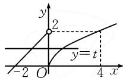
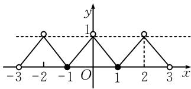
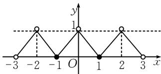
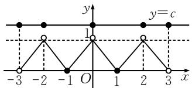
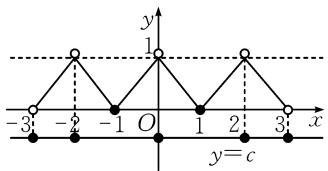
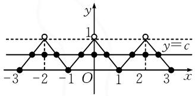

# 例说分类讨论思想在函数问题中的运用

# ●甘肃省高台县第一中学数学教研室 吕小红

分类讨论不仅是一种重要的数学思想,更是一种重要的解题策略,例如在解答分段函数中的零点问题、含参数的函数极值问题、函数与不等式结合问题等相关题型中,需要紧扣函数的性质,分类讨论参数的不同取值情况时,它充分发挥了“化整为零、化繁为简、化复杂为简单”的优势,能够帮助考生快速找到解题的突破口,达到“分散难点,各个击破,快捷准确”的目的.

# 1 分段函数中的零点问题

例 1 （2025 年上海卷第 21 题）已知函数 $y = f(x)$ 的定义域为 R. 对于正实数 a，定义集合 $M_{a} = \{x \mid f(x + a) = f(x)\}$ .

(1) 若 $f(x)=\sin x$ ，判断 $\frac{\pi}{3}$ 是否为 $M_{\pi}$ 中的元素，请说明理由；  
(2) 若 $f(x) = \begin{cases} x + 2, & x < 0 \\ \sqrt{x}, & x \geqslant 0, \end{cases} M_a \neq \emptyset$ ，求 $a$ 的取值范围；  
(3)若函数 $y = f(x)$ 是偶函数，当 $x \in (0,1]$ 时， $f(x) = 1 - x$ ，且对任意 $a \in (0,2)$ ，均有 $M_a \subseteq M_2$ ，写出 $y = f(x), x \in (1,2)$ 的解析式，并证明：对任意实数 $c$ ，函数 $y = f(x) - c$ 在 $[-3,3]$ 上至多有9个零点.

解析:(1)因为 $f\left(\frac{\pi}{3}\right)=\sin\frac{\pi}{3}=\frac{\sqrt{3}}{2},f\left(\frac{\pi}{3}+\pi\right)=-\sin\frac{\pi}{3}=-\frac{\sqrt{3}}{2}$ ，所以 $\frac{\pi}{3}$ 不是 $M_{\pi}$ 中的元素.

(2) 由 $f(x) = \begin{cases} x + 2, & x < 0, \\ \sqrt{x}, & x \geqslant 0, \end{cases}$ 知 $f(x)$ 的大致图象

如图1所示.设 $f(x+a)=f(x)=t$ ，由题意可知， $y=f(x)$ 与y=t有两个交点，所以 $0\leqslant t<2$ .因为a为正实数，所以 $x+a>x$ ，于是

$\left\{ \begin{array}{l} \sqrt{x + a} = t, \\ x + 2 = t, \end{array} \right.$ 所以 $a = (x + 2)^2 -$

$x=x^{2}+3x+4.$ 因为 $0 \leqslant t < 2$ ，所以 $0 \leqslant x + 2 < 2$ ，解得

  
图1

$-2 \leqslant x < 0.$ 易知函数 $a = x^{2} + 3x + 4$ 的对称轴为直线 $x = -\frac{3}{2}$ ，开口向上。所以当 $x = -\frac{3}{2}$ 时， $a_{\min} = \frac{9}{4} - \frac{9}{2} + 4 = 4 - \frac{9}{4} = \frac{7}{4}$ 。又 $x \to 0$ 时， $a \to 4$ ，所以实数 $a$ 的取值范围为 $\left[\frac{7}{4}, 4\right)$ 。

(3)对于任意 $x_0 \in (1,2), x_0 - 2 \in (-1,0)$ ，因为 $y = f(x)$ 是偶函数，所以 $f(x_0 - 2) = f(2 - x_0)$ ，而 $2 - x_0 - (x_0 - 2) = 4 - 2x_0 \in (0,2)$ ，所以 $x_0 - 2 \in M_{4 - 2x_0} \subseteq M_2$ ，于是 $f(x_0) = f(x_0 - 2) = f(2 - x_0)$ . 因为 $x_0 \in (1,2)$ ，所以 $2 - x_0 \in (0,1)$ ，则有 $f(x_0) = f(2 - x_0) = 1 - (2 - x_0) = x_0 - 1$ ，所以 $f(x) = x - 1$ ， $x \in (1,2)$ .

于是当 $s \in (0,1)$ 时，可得 $1 - s \in (0,1), 1 + s \in (1,2)$ ，所以 $f(1 - s) = 1 - (1 - s) = s, f(1 + s) = (1 + s) - 1 = s$ ，从而 $f(1 - s) = f(1 + s)$ . 而 $1 + s - (1 - s) = 2s, (3 - s) - (1 - s) = 2$ ，所以 $1 - s \in M_{2s} \in$

$M_{2}$ ，则 $f(1-s)=f(3-s)$ .

所以当 $x \in (2,3)$ 时， $f(x) = f(x - 2) = 1 - (x - 2) = 3 - x$ ，又 $f(x)$

为偶函数，画出函数图

line

| x | y |
|---|---|
| -3 | 0 |
| -2 | 1 |
| -1 | 0 |
| 0 | 1 |
| 1 | 0 |
| 2 | 1 |
| 3 | 0 |

图2

象(如图2)，其中 $f(-3)=f(3)$ ， $f(-2)=f(2)$ ，但是 $f(0)$ 对应的y值均未知.

首先说明 $f(-3) = n\notin (0,1)$ ，若 $f(-3) = n\in$ $(0,1)$ ，则 $-3 + n\in (-3, - 2)$ ，易知此时 $f(x) = x+$ $3,x\in (-3, - 2)$ ，则 $f(-3 + n) = n$ ，所以 $f(-3)\in$ $M_{n}\subseteq M_{2}$ ，而 $x\in [-1,0)$ 时， $f(x) = x + 1$ ，所以 $f(-3) = f(-1) = 0$ ，这与 $f(-3) = n$ 矛盾，所以 $f(-3)\notin (0,1)$ ，即 $f(-3) = f(3)\notin (0,1)$ .

令 $y=f(x)-c=0$ ，则 $y=f(x)=c$ 。

① 当 c=0 时，即使让 $f(-3)=f(3)=f(-2)=f(2)=f(0)=0$ ，此时最多有 7 个零点（如图 3）.

text_image

-3
-2
-1
O
1
2
3
x
y
1

图 3

②当 $c \geqslant 1$ 时，如果 $f(-2) = f(2) = f(0) = f(-3) = f(3) = c$ ，此时有 5 个零点，故此时最多有 5 个零点（如图 4）.  
③当 c<0 时, 如果 $f(-2)=f(2)=f(0)=f(-3)=f(3)=c$ , 此时有 5 个零点, 故此时最多有 5 个零点(如图 5).  
④ 当 0 < c < 1 时，如果 $f(-2) = f(2) = f(0) = c$ ，此时有 3 个零点，若使 $f(-3) = c \in (0, 1)$ ，则 $-3 + c \in$

$(-3, -2)$ , 易知此时 $f(x) = x + 3$ , 则 $f(-3 + c) = c$ , 所以 $f(-3) \in M_c \subseteq M_2$ , 而 $x \in [-1, 0)$ 时, $f(x) = x + 1$ , 所以 $f(-3) = f(-1) = 0$ , 这与 $f(-3) = c$ 矛盾, 所以 $f(-3) \notin (0, 1)$ , 则最多在 $(-3, -2)$ , $(-2, -1)$ , $(-1, 0)$ , $(0, 1)$ , $(1, 2)$ , $(2, 3)$ 之间取得 6 个零点, 以及在 $x = -2, 0, 2$ 处成为零点, 故不超过 9 个零点 (如图 6).

综上所述，对任意实数 $c$ ，函数 $y = f(x) - c$ 在 $[-3,3]$ 上至多有9个零点.

思路与方法:本题属于新定义类综合题,第(1)小题考查考生对新定义概念的了解,判断元素是否属于集合,根据 $M_{a}$ 的定义,只需将函数 $f(x)=\sin x$ 代入检验即可.第(2)小题考查考生对概念的深入理解,解答此问运用了数形结合与分类讨论的思想,先画出函数的图象,将其转化为直线y=t与该函数有两个交点,再将a用t表示,最后通过消元,构造函数,化为求值域的问题来解决.第(3)小题考查考生对新概念的深刻理解以及综合应用,难度增加,实质就是在 $x\in[-3,3]$ 上讨论分段函数与函数图象对最多零点进行具体说明;解题的关键是在准确理解题意的基础上,设法利用 $M_{a}\subseteq M_{2}$ ,画出图象以找到突破口.首先利用函数的奇偶性和集合新定义联立求出 $x\in(1,2)$ 时的函数解析式,再分析出 $f(-3)\notin(0,1)$ ,最后通过对c的范围进行分类讨论来完成证明.

# 2 含参数的函数极值问题

例 2 （2025 年宁夏模拟试题）已知函数 $f(x)=x^{3}+mx^{2}+nx-2$ 的图象经过点 $(-1,-6)$ ，且函数 $g(x)=f'(x)+6x$ 的图象关于 y 轴对称.

(1) 求 m, n 的值及函数 $y = f(x)$ 的单调区间；  
(2) 若 $a > 0$ , 求函数 $f(x)$ 在区间 $(a - 1, a + 1)$ 内

text_image

y
y=c
-3 -2 -1 O 1 2 3 x

图4

text_image

y
1
-3 -2 -1 O 1 2 3 x
y=c

图5

text_image

y
1
y=c
-3 -2 -1 O 1 2 3 x

图6

$)=x+3$ ，则 $f(-3+c)=0$ ，而 $x\in[-1,0)$ 时， $f(x)=1)=0$ ，这与 $f(-3)=c$ 矛），则最多在 $(-3,-2)$ ， $(1,2)$ ， $(2,3)$ 之间取得 6，2 处成为零点，故不超过 9

的极值.

解析:(1)根据函数 $f(x)$ 的图象经过点 $(-1,-6)$ ，得 m-n=-3。由 $f(x)=x^{3}+mx^{2}+nx-2$ ，可得 $f'(x)=3x^{2}+2mx+n$ ，则 $g(x)=f'(x)+6x=3x^{2}+(2m+6)x+n$ 。

因为 $g(x)$ 的图象关于 y 轴对称，所以 $-\frac{2m+6}{2\times3}=0$ ，解得 m=-3，进一步可求得 n=0，所以 $f'(x)=3x^{2}-6x=3x(x-2)$ 。由 $f'(x)>0$ ，得 x>2 或 x<0，故 $f(x)$ 的单调递增区间是 $(-∞,0)$ 和 $(2,+∞)$ ；由 $f'(x)<0$ ，得 0<x<2，故 $f(x)$ 的单调递减区间是 $(0,2)$ 。

(2) 由 (1) 得 $f(x) = x^3 - 3x^2 - 2$ ，则 $f'(x) = 3x(x - 2)$ . 由 $f'(x) = 0$ ，得 $x = 0$ 或 $x = 2$ .

当 x 变化时, $f'(x)$ , $f(x)$ 的变化情况如表 1:

表 1

<table><tr><td>x</td><td>(-∞,0)</td><td>0</td><td>(0,2)</td><td>2</td><td>(2,+∞)</td></tr><tr><td>f&#x27;(x)</td><td>+</td><td>0</td><td>-</td><td>0</td><td>+</td></tr><tr><td>f(x)</td><td>单调递增</td><td>极大值</td><td>单调递减</td><td>极小值</td><td>单调递增</td></tr></table>

分类讨论如下：

① 当 0 < a < 1 时， $f(x)$ 在 $(a - 1, a + 1)$ 内有极大值 $f(0) = -2$ ，无极小值；  
②当 a=1 时， $f(x)$ 在 $(a-1,a+1)$ 内无极值；  
③当 1<a<3 时， $f(x)$ 在 $(a-1,a+1)$ 内有极小值 $f(2)=-6$ ，无极大值；  
④当 $a \geqslant 3$ 时， $f(x)$ 在 $(a - 1, a + 1)$ 内无极值.

综上所述，当 $0 < a < 1$ 时， $f(x)$ 有极大值 $-2$ ，无极小值；当 $1 < a < 3$ 时， $f(x)$ 有极小值 $-6$ ，无极大值；当 $a = 1$ 或 $a \geqslant 3$ 时， $f(x)$ 无极值。

思路与方法:本题中引起分类讨论的原因是区间 $(a-1,a+1)$ 的位置不确定,因此需要根据该区间和函数 $y=f(x)$ 的单调区间的相对关系进行讨论,求其极值.第(1)小题由函数 $f(x)$ 经过的点可得到m与n的关系式,由 $g(x)$ 也是二次函数且其图象关于y轴对称,可得到对称轴方程,进而求得m,n的值;第(2)小题先求出 $y=f(x)$ 的单调区间,再利用单调区间与 $(a-1,a+1)$ 的相对关系讨论其极值.

# 3 函数与不等式结合问题

例 3 （2025 年甘肃省仿真试题）已知 $a > 0, a \neq 1$ ，解不等式 $\log_{a}(x^{2} - 2ax - 2a^{2}) > 2$ .

解析:根据题意,对参数 a 分类讨论如下.

① 当 0 < a < 1 时， $y = \log_{a} x$ 为减函数，则

$$
\log_ {a} \left(x ^ {2} - 2 a x - 2 a ^ {2}\right) > 2 \Leftrightarrow \left\{ \begin{array}{l} x ^ {2} - 2 a x - 2 a ^ {2} > 0, \\ x ^ {2} - 2 a x - 2 a ^ {2} <   a ^ {2} \end{array} \right. \Leftrightarrow
$$

$$
\left\{ \begin{array}{l} x > (1 + \sqrt {3}) a \text {或} x <   (1 - \sqrt {3}) a, \\ - a <   x <   3 a. \end{array} \right.
$$

故 $-a<x<(1-\sqrt{3})a$ ，或 $(1+\sqrt{3})a<x<3a$ 。

②当 a>1 时， $y=\log_{a}x$ 为增函数，则

$$
\log_ {a} \left(x ^ {2} - 2 a x - 2 a ^ {2}\right) > 2 \Leftrightarrow \left\{ \begin{array}{l} x ^ {2} - 2 a x - 2 a ^ {2} > 0, \\ x ^ {2} - 2 a x - 2 a ^ {2} > a ^ {2} \end{array} \right. \Leftrightarrow
$$

$$
\left\{ \begin{array}{l} x <   (1 - \sqrt {3}) a \text {或} x > (1 + \sqrt {3}) a, \\ x <   - a \text {或} x > 3 a. \end{array} \right.
$$

故 $x < -a$ 或 $x > 3a$ .

综上所述，当 $0 < a < 1$ 时，可得原不等式的解集为 $(-a, (1 - \sqrt{3})a) \cup ((1 + \sqrt{3})a, 3a)$ ；当 $a > 1$ 时，原不等式的解集为 $(- \infty, -a) \cup (3a, +\infty)$ .

思路与方法:对数函数与不等式的结合是高考常见的一种题型,解对数不等式必须要考虑对数函数的增减性,因此对其含有参数的底数取值范围进行分类讨论.例如本题就是将参数 a 分为 a>1 与 0<a<1 两种情况进行讨论的.

通过上述典型题型的解析,我们可以看到,要娴熟地运用分类讨论思想解决函数相关问题,除了要有分类讨论的敏锐意识、严格遵循分类原则以及学会合理分类的一般步骤与方法,还要具备较强的分析能力.所以平时要多练习、勤思考、善于总结,不断积累常用的解题方法与技巧,长此坚持下去,就一定能够不断提高数学解题能力,考试时也能够从容应对,取得理想成绩.Z

# (上接第61页)

例 4 若实数 a > 0, b > 0, $a + b = 5$ , 求 $\sqrt{a + 1} + \sqrt{b + 3}$ 的最大值.

解:依题, $9=(a+1)+(b+3)=\frac{(\sqrt{a+1})^{2}}{1}+\frac{(\sqrt{b+3})^{2}}{1}\geqslant\frac{(\sqrt{a+1}+\sqrt{b+3})^{2}}{2}$ ，于是得 $\sqrt{a+1}+\sqrt{b+3}\leqslant\sqrt{18}=3\sqrt{2}$ ，当且仅当 $a=\frac{7}{2},b=\frac{3}{2}$ 时，等号成立，故 $\sqrt{a+1}+\sqrt{b+3}$ 的最大值为 $3\sqrt{2}$ .

评析:本题中所求的式子不是分式的形式,所以化为 $\sqrt{a+1} + \sqrt{b+3} = \frac{(\sqrt{a+1})^{2}}{1} + \frac{(\sqrt{b+3})^{2}}{1}$ , 凑出权方和不等式中分式和的形式,从而可以运用权方和不等式解决问题.

# 4 应用权方和不等式解题的步骤与技巧

应用权方和不等式求解“知和求和”型最值问题，需满足两个核心条件：一是待求式子为“分式和”（或者能凑出分式和形式的式子）；二是已知条件可通过换元转化为“分母和为定值”，或者直接为“分子的和为定值”。解题步骤如下：

(1)识别结构:首先判断目标式是否为若干分式之和,且分子幂指数是否比分母幂指数大1(或可通过变形满足).同时,关注条件是否给出或能转化为分母(或分子)的线性组合为定值.  
(2)变形凑配:若直接形式不匹配,可尝试以下技巧.

换元法: 当分母含有常数项或复杂表达式时, 令新变量等于分母整体(或其部分), 将条件转化为新变量的关系.

配凑系数:如果条件给出的是分子的线性组合定值,而目标是分式和,常需要通过乘(除以)常数,或利用“1”的代换,将目标式变形,使得应用权方和时,右端分母正好是定值.

升降幂:通过乘(除以)变量,调整分子分母的幂指数差为1.

(3)应用不等式:严格按照权方和不等式的形式进行放缩,注意等号成立的条件.  
(4)验证等号:解出等号成立时的变量取值,确保满足题目所有约束条件(如正数条件),并判断最值能否取得.   
(5)综合求解:有时利用权方和不等式不能一步直接得到最值,可能需要结合其他不等式(如基本不等式)或函数方法完成最终求解.

# 5 结论

权方和不等式作为高等数学中赫尔德不等式的特例，在中学数学范围内展现出了强大的解题功能。特别是在处理“知和求和”型最值问题时，对于满足“分子幂指数比分母幂指数大1”这一特征结构的问题，提供了一条步骤清晰、思维直接的解决路径。相较于传统的常值代换、消元、复杂配凑等方法，权方和不等式往往能简化过程，降低思维难度，提高解题效率。

教学中引导学生掌握权方和不等式,不仅能丰富其不等式证明与求最值的工具库,更能培养他们观察数学结构、进行形式化变形的能力.需要注意的是,任何方法都有其适用范围,权方和不等式也不例外.教师应指导学生准确识别其适用条件,灵活运用各种变形技巧,并养成验证等号成立条件的严谨习惯.通过针对性训练,学生能够熟练运用这一有力工具,在面对相关最值问题时做到心中有数,游刃有余.

# 参考文献：

[1]陈田璋.利用权方和不等式求解一类最值问题[J].高中数学教与学,2024(3):22-23 Z